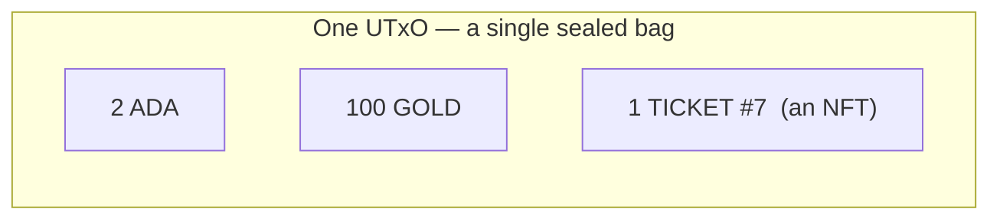

import Tabs from "@theme/Tabs";
import TabItem from "@theme/TabItem";
import CodeBlock from "@theme/CodeBlock";
import extractRegion from "@site/src/utils/extractRegion";
import MintToken from "!!raw-loader!@site/examples/onboarding/lectures/mesh/src/mint-token.ts";

# Tokens: fungible & NFTs

So far everything has been about ADA. But a UTxO (one of those sealed bags) can also hold **custom tokens** you create, and on Cardano that's simpler than on most chains.

Tokens on Cardano are **native**: the ledger tracks your custom asset right alongside ADA, and moving it around needs **no smart contract**. Every token has a **policy ID** (rules to create or destroy it) and an **asset name** (its label, like `GOLD`).

Because they ride in the same UTxOs as ADA, **one bag can hold ADA _and_ several different tokens at once**, a *bundle*:



Each custom token in the bag is pinned down by three things: its **policy ID** + **asset name** + **quantity**. (ADA is just the one token every bag already knows how to hold.)

There are two kinds, and you already know the difference from real life:

- **Fungible tokens** are **interchangeable**, like **dollar bills**, every unit is identical. You make one by minting a quantity greater than 1. Good for currencies, points, in-game gold.
- **NFTs (non-fungible tokens)** are **unique**, like a **numbered ticket** or a piece of art. An NFT is just a token with a quantity of **1**, under a policy that can never mint it again.

That's the whole distinction: **fungible = many identical units; NFT = a single unique unit.**

## What's a policy ID?

We keep mentioning the **policy ID**, so let's pin it down. Behind every token is a **minting policy**: the rule that decides who may create (or destroy) that token, and under what conditions. It's usually a **native script**, exactly the kind you met last lecture. The **policy ID** is the _hash_ of that policy, a 56-character fingerprint.

It matters for two reasons:

- **It's a unique namespace.** Your `GOLD` and someone else's `GOLD` never clash, because they sit under different policy IDs. A token's real, full identity is always **policy ID + asset name** together, not the name alone.
- **It fixes the rules forever.** The simplest policy is a one-line `sig` native script: "only the holder of this key may mint." An NFT usually uses a **time-locked** native-script policy that can **mint only one token once**, and that's exactly what makes it provably one-of-a-kind.

## Try it

- **See one:** after you mint one just below, search your address on the **[Cardano explorer for Preview](https://explorer.cardano.org/preview)**, your new token shows up next to your ADA, with its policy ID, name, and quantity.
- **Make one:** mint your own token right below, or in the **[Tutorial](/docs/developers/onboarding/tutorial/overview)**, where you mint GOLD and SILVER. Afterward, look your address up on the explorer and see your new tokens sitting next to your ADA.

## See it in code

Let's mint one. This creates **100 GOLD** under the simplest possible policy: the **native script** you met last lecture, here it says just _"only the holder of this wallet's key may mint."_ **Hashing that rule gives the policy ID.** The new tokens land back in your wallet, no collateral, just the connected wallet:

<Tabs groupId="offchain">
<TabItem value="mesh" label="Mesh" default>

<CodeBlock language="ts" title="mint-token.ts">
  {extractRegion(MintToken, "mint-token")}
</CodeBlock>

**Run it and see it on the explorer.** Same setup as the last lecture, **[Lace](https://www.lace.io/)** on **Preview** with a little test ADA. Grab the example and start it:

```bash
npx giget@latest gh:cardano-foundation/developer-portal/examples/onboarding/lectures/mesh lectures-mesh
cd lectures-mesh
npm install
npm run dev
```

Open the printed URL in the browser where Lace lives, click **Connect Lace and mint 100 GOLD**, and approve it in Lace. Follow the **explorer link**, you'll see 100 GOLD minted and sitting in your wallet next to your ADA, under a brand-new policy ID that's yours. _(Already downloaded this folder in the last lecture? Just `npm run dev` again.)_

</TabItem>
<TabItem value="evolution" label="Evolution">

An [Evolution](https://no-witness-labs.github.io/evolution-sdk/) version is coming soon. The idea is identical, only the library calls differ.

</TabItem>
</Tabs>

## Go deeper

- [What Are Native Tokens](/docs/developers/curriculum/native-tokens/overview)
- [Mint a fungible token](/docs/developers/curriculum/native-tokens/mint-fungible)
- [Mint an NFT](/docs/developers/curriculum/native-tokens/mint-nft)

Next: **[Providers & explorers](/docs/developers/onboarding/lectures/beginner/providers-and-explorers)**.
