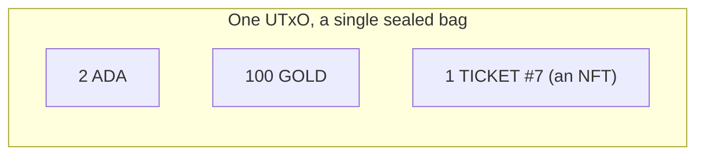

import Tabs from "@theme/Tabs";
import TabItem from "@theme/TabItem";
import CodeBlock from "@theme/CodeBlock";
import extractRegion from "@site/src/utils/extractRegion";
import MintToken from "!!raw-loader!@site/examples/onboarding/lectures/mesh/src/mint-token.ts";

# Tokens: fungible & NFTs

So far everything has been about ADA. But a UTxO (one of those sealed bags) can also hold **custom tokens** you create, and on Cardano that's simpler than on most chains.

Tokens on Cardano are **native**: the ledger tracks your custom asset right alongside ADA, and moving it around needs **no smart contract**. Every token has a **policy ID** (the fingerprint of the rules for creating or destroying it) and an **asset name** (its label, like `GOLD`).

Because they ride in the same UTxOs as ADA, **one bag can hold ADA _and_ several different tokens at once**, a *bundle*:

Each custom token in the bag is pinned down by three things: its **policy ID** + **asset name** + **quantity**. (ADA is just the one token every bag already knows how to hold.)

One catch worth knowing early: **a bag can never hold tokens alone.** Every UTxO has to carry a little ADA alongside them, an amount sized to what's in the bag (the **[min-ADA](/docs/developers/curriculum/native-tokens/overview#the-minimum-ada-requirement)** rule), so your 100 GOLD always travels with some ADA beside it. Your SDK works the amount out for you, but it's the reason you can't move tokens from a wallet with no ADA in it.

Custom tokens come in **two kinds**:

- **Fungible tokens** are **interchangeable**, like **dollar bills**, every unit is identical. You make one by minting a quantity greater than 1. Good for currencies, points, in-game gold.
- **NFTs (non-fungible tokens)** are **unique**, like a **numbered ticket** or a piece of art. An NFT is just a token with a quantity of **1**, under a policy that can never mint it again.

That's the whole distinction: **fungible = many identical units; NFT = a single unique unit.**

## What's a policy ID?

We keep mentioning the **policy ID**, so let's pin it down. Behind every token is a **minting policy**: the rule that decides who may create (or destroy) that token, and under what conditions. It's usually a **native script**, exactly the kind you met in the [last lecture](/docs/developers/onboarding/lectures/beginner/native-scripts-and-metadata). The **policy ID** is the _hash_ of that policy, a 56-character fingerprint.

It matters for two reasons:

- **It's a unique namespace.** Your `GOLD` and someone else's `GOLD` never clash, because they sit under different policy IDs. A token's real, full identity is always **policy ID + asset name** together, not the name alone.
- **It fixes the rules forever.** The simplest policy is a one-line `sig` native script: "only the holder of this key may mint." An NFT usually uses a **time-locked** one instead: minting shuts off after a deadline, so the supply is sealed for good.

The same policy governs the other direction too. **Burning** a token, destroying it, is just minting a **negative** quantity, and it has to satisfy the very same rule: under the policy above, that means your signature. On top of that, burning means **spending the bag the tokens sit in**, which needs the key to that address, so nobody can burn tokens out of your wallet, not even whoever holds the policy key.

## See it in code

Let's mint one. This creates **100 GOLD** under the simplest possible policy: the **[native script](/docs/developers/onboarding/lectures/beginner/native-scripts-and-metadata)** you met last lecture, here it says just _"only the holder of this wallet's key may mint."_ **Hashing that rule gives the policy ID.** The new tokens land back in your wallet, and the connected wallet is all you need:

<Tabs groupId="offchain">
<TabItem value="mesh" label="Mesh" default>

<CodeBlock language="ts" title="mint-token.ts">
  {extractRegion(MintToken, "mint-token")}
</CodeBlock>

</TabItem>
<TabItem value="evolution" label="Evolution">

An [Evolution](https://no-witness-labs.github.io/evolution-sdk/) version is coming soon. The idea is identical, only the library calls differ.

</TabItem>
</Tabs>

**Run it and see it on the explorer.** In the **[playground](/docs/developers/onboarding/lectures/beginner/introduction#the-playground)**, click **Connect Lace and mint 100 GOLD**, and approve it in Lace. Follow the **explorer link**, you'll see 100 GOLD minted and sitting in your wallet next to your ADA, under a brand-new policy ID that's yours.

Two details surprise people the first time, whichever SDK they use:

- **Asset names are stored as hex** on-chain, which is why the snippet encodes the name before minting it. Don't be thrown when an explorer shows your token as `474f4c44` instead of `GOLD`, it's the same name in raw form (some explorers decode it for you).
- **This policy has no deadline in it.** It says only that your key must sign, so nothing stops you minting another 100 GOLD tomorrow, under the very same policy ID. For a currency or points, that's exactly what you want.

That second point is the whole difference between this token and an **NFT**. An NFT policy adds a time condition, `before` a slot, the time-locked native script from the last lecture, and mints a quantity of **1** while the window is open. Once that slot passes, nobody can ever mint under that policy again, not even you, and _that_ is what makes the token provably one-of-a-kind.

The policy makes it unique, but it says nothing about what the NFT actually **is**. Its name, description, and image link ride along as **[metadata](/docs/developers/onboarding/lectures/beginner/native-scripts-and-metadata)** on the minting transaction, following a community standard called **CIP-25**. That's what wallets and marketplaces read when they show your NFT with a picture and a title.

## Try it

- **Find it on-chain:** open your mint on the **[Cardano explorer for Preview](https://explorer.cardano.org/preview)** and pick out the token's **policy ID** and **asset name**. That pair, not the name on its own, is its full identity. Notice the token isn't alone in that output either: there's ADA sitting with it, at least the min-ADA.
- **Watch fungibility:** mint a second time. You don't end up with two kinds of GOLD, the quantity under the same policy ID simply adds up, because every unit is interchangeable (and because this policy is happy to mint again).
- **Reuse the policy:** in the playground's `src/app.ts`, the mint button calls `mintToken(w, "GOLD", "100")`. Change the name to something of your own and mint again. You get a **different asset name under the same policy ID**, because the policy is still "only my key may mint", one policy can carry as many token names as you like.

## Go deeper

- [What Are Native Tokens](/docs/developers/curriculum/native-tokens/overview)
- [Mint a fungible token](/docs/developers/curriculum/native-tokens/mint-fungible)
- [Mint an NFT](/docs/developers/curriculum/native-tokens/mint-nft)

Next: **[Providers & explorers](/docs/developers/onboarding/lectures/beginner/providers-and-explorers)**.
