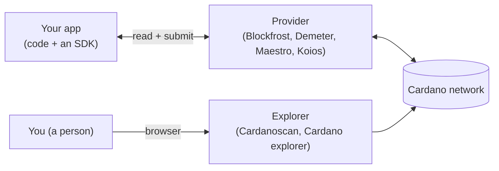
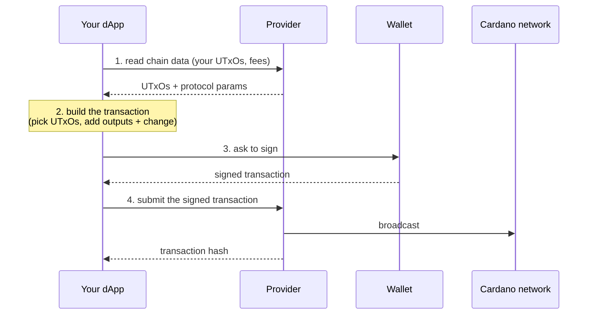

# Providers & explorers

You've been reading the chain by pasting addresses into an explorer. But how does an _app_ read the chain? Two tools you'll use constantly: a **provider** (for your code) and an **explorer** (for your eyes).

Your app can't talk to the blockchain directly. It calls a **provider**: a hosted service that runs the heavy Cardano infrastructure and answers questions over a normal web API, just like calling a **weather API** instead of launching your own satellites. **[Blockfrost](https://blockfrost.io/)** is the most common, with **Maestro** and **Koios** as alternatives.

A provider handles _reading_ the chain and submitting transactions. To _build_ those transactions in code you pair it with an **off-chain SDK** like **[Mesh](https://meshsdk.dev/)** or **[Evolution](https://no-witness-labs.github.io/evolution-sdk/)** (both TypeScript), you'll use these in the Intermediate track.

An **explorer** is the human version: a **search engine for the blockchain**. Type in an address, transaction, or token and it shows a friendly page. **[Cardanoscan](https://cardanoscan.io/)** and the **[Cardano explorer](https://explorer.cardano.org/preview)** are two. Same data as a provider, drawn for people.

So: **provider = how your app reads the chain; explorer = how you read the chain.**

Here's the whole picture, both roads lead to the same chain:



Your app talks to a provider (to read the chain _and_ submit transactions), you talk to an explorer (to read it by eye). Underneath, both reach the very same blockchain.

## A transaction, step by step

The picture above hides the interesting part: what your app actually _does_ to send a transaction. It's the same **read, build, sign, submit** rhythm from the earlier lectures, now with the provider in the loop:



1. **Read**, the app asks the provider for what it needs, your UTxOs and the current fees.
2. **Build**, the SDK assembles an unsigned transaction, choosing UTxOs and adding change, just like in [UTxOs & Transactions](/docs/developers/onboarding/lectures/beginner/utxos-and-transactions).
3. **Sign**, the wallet approves it with your key.
4. **Submit**, the app hands the signed transaction back to the provider, which broadcasts it and returns the **transaction hash**.

That hash is exactly what you paste into an explorer to watch it confirm.

## Try it

Look up the **same address two ways** and get the same answer.

**As a person:** open the **[Cardano explorer for Preview](https://explorer.cardano.org/preview)** and search your address, note the balance.

**As an app:** sign up for a free **[Blockfrost](https://blockfrost.io/)** account, create a **Preview** project, copy the key, and run (replace the key and your address):

```bash
curl -H "project_id: YOUR_PREVIEW_KEY" \
  "https://cardano-preview.blockfrost.io/api/v0/addresses/addr_test1YOUR_ADDRESS/utxos"
```

That JSON is the same UTxOs the explorer drew as a balance, the explorer made it pretty, the provider hands your code the data.

## Go deeper

- [API providers](/docs/developers/curriculum/production/api-providers/overview)
- [Blockfrost](/docs/developers/curriculum/production/api-providers/blockfrost)
- [Query the chain](/docs/developers/curriculum/start-building/query-the-chain) — providers compared, plus self-hosted Kupmios (Ogmios + Kupo) and Demeter.

## You've got the base

Wallets and keys are your identity, UTxOs and transactions move value, tokens are custom assets, metadata and native scripts add notes and simple rules, and providers and explorers are how you read it all.

Next, build something end to end in the **[Tutorial](/docs/developers/onboarding/tutorial/overview)**, or browse **[What to build](/docs/developers/onboarding/what-to-build/overview)** for ideas.
