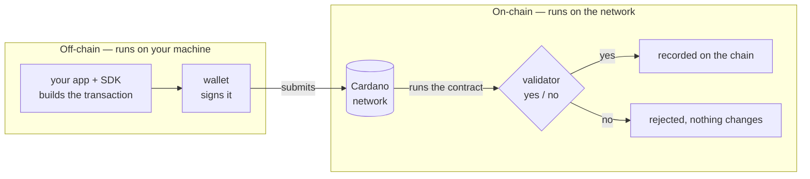

# On-chain vs off-chain

Welcome to the Intermediate track. In Beginner you moved value around. Now you will make the chain **enforce rules** about how that value moves. That is a **smart contract**.

One idea has to be clear before any code, because the rest of the track is built on it. The apps you built [in Beginner](/docs/developers/onboarding/lectures/beginner/introduction) had only one half: your code. Add a smart contract and there is a second half. The two do completely different jobs.

- **Off-chain** is the code that runs **on your computer or server** (your app, plus an off-chain SDK). It reads the chain, **builds transactions**, and asks the wallet to sign them. This is the same work you did for the [send](/docs/developers/onboarding/lectures/beginner/utxos-and-transactions) and [mint](/docs/developers/onboarding/lectures/beginner/tokens-fungible-and-nfts) transactions in Beginner. It **prepares**.
- **On-chain** is the **smart contract that lives on the blockchain**. It is a rule that runs when someone tries to spend locked funds, and it either **approves or rejects** the transaction. It **enforces**.

Think of filling in an official form. Your app is the person filling it in: it writes the plan, completes every field, and sends the form. The contract is the officer who reads the form and either approves it or rejects it. The person can ask for anything, and the officer decides what is allowed. Notice what the officer never does. They do not write the plan and they do not carry out the work. They only decide yes or no.

Read it from left to right. Everything in the left box is your side of the line. It is work your code does before anything is final. As soon as the transaction is sent, control passes to the chain, and the validator makes the final decision. Notice that no arrow comes back. The contract cannot ask your app for more information, and your app cannot change the answer.

## Who does what

Split any Cardano app along that line and it becomes much easier to understand:

| Off-chain (your code, your machine) | On-chain (the contract, the network) |
|---|---|
| Read the chain: which UTxOs exist, what's locked where | — |
| Decide what _should_ happen | Check whether it's **allowed** |
| Pick the inputs, build the outputs, balance the fee | — |
| Attach the datum and the redeemer | Read the datum and the redeemer |
| Collect the wallet's signature | See which signatures are on the transaction |
| Submit | Answer **yes** or **no** |

Almost every line is on the left. That is not an accident, and the next section explains why.

## Why the split exists

The chain has to reach the **same answer for everyone, forever**. A node checking your transaction today and a node checking that same block ten years from now must both decide the same way. If they did not, they would disagree about who owns what. So a contract may only look at things that are **written down**: the transaction itself, the outputs it spends, and the validity window it declares.

That single requirement explains most of what feels strange at first:

- **A contract cannot call an API**, read a price feed, or fetch anything. Two nodes asking the same server could get two different answers.
- **A contract cannot read a clock.** This is why time became a **slot window** that you declare in advance, back in [Time on Cardano](/docs/developers/onboarding/lectures/beginner/time-on-cardano).
- **A contract keeps no variables of its own between runs.** This does not mean nothing is saved. On Cardano, state lives **on the UTxOs** rather than inside the contract, and everything the validator needs to know must reach it through the transaction. The next two lectures show how.
- **A contract cannot start anything.** Nothing on Cardano happens because a contract decided to act. Someone has to build a transaction first.

You get something valuable in return. Because nothing is measured at the moment of checking, your app can run the contract **before sending it** and already know the answer. You learn that the spend would be rejected while the transaction is still on your machine, and nobody on the network ever sees it. On Cardano, a failing contract is usually a bug you find locally, not value you lost on-chain.

## Two things that surprise newcomers

**The contract does not run on your computer.** You write it, compile it, and read it in your editor, so it is easy to think of it as part of your app. It is not. Your app carries the compiled contract **inside the transaction**, and the **network** runs it when that transaction is checked. The answer is the same for everyone, forever.

**The contract cannot _do_ anything.** It never sends funds, never updates a balance, and never changes data on its own. Every movement of value in this track is done by a **transaction your off-chain code built**. All the contract ever adds is a yes or a no. All the action is off-chain, and all the enforcement is on-chain. Remember that sentence, because the rest of this track repeats it in different forms.

## Try it

No new code. Just look at what you already have.

1. Open the folder you downloaded during the **[playground setup](/docs/developers/onboarding/lectures/intermediate/introduction#the-playground)**. The two halves are two folders: `off-chain/` is an app that builds transactions and runs on your machine, and `on-chain/` holds the rules that end up on the chain. Every project in this track has this shape.
2. Start the playground if it is not running, and look at the page. Buttons, a wallet, a list of what is locked. All of that is off-chain. **None** of it is the contract.
3. Now open any recent transaction on the **[Cardano explorer for Preview](https://explorer.cardano.org/preview)** and look for a "call" to a contract. There is none. A Cardano transaction is inputs, outputs, signatures and a validity window. A contract is something the network **runs against** that transaction, not something the transaction calls.

Now follow the split for the vault you are about to build. Off-chain builds a transaction that sends ADA to the contract's address, which locks it. Later, off-chain builds a second transaction that tries to spend it back. On-chain, the validator runs and answers yes or no, and only a "yes" allows the spend. Every contract you write follows this shape.

## Go deeper

- [Smart Contracts (overview)](/docs/developers/curriculum/smart-contracts/overview) — the on-chain/off-chain split in full.
- [Lock and Spend](/docs/developers/curriculum/smart-contracts/lock-and-spend) — the lock-then-spend flow end to end.
- [Cardano for Ethereum developers](/docs/developers/cardano-for-ethereum-developers) — the account-model habits that don't carry over: no `msg.sender`, no contract storage, no execution order.
- [The Extended UTXO Model](/docs/developers/curriculum/fundamentals/core-concepts/eutxo) — the ledger model that makes this split possible.

