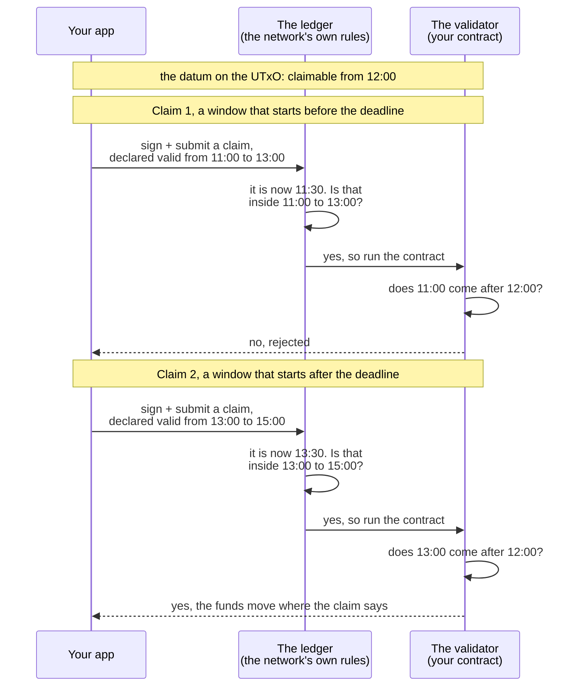
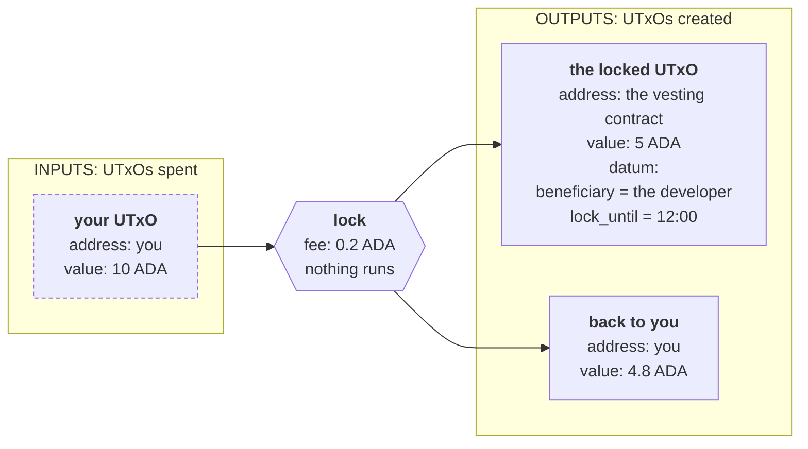
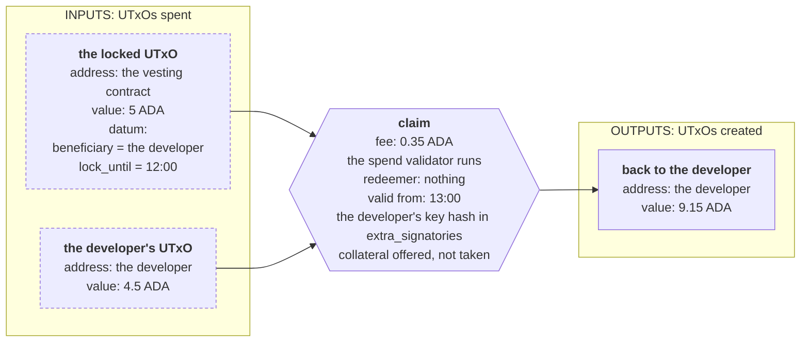

import Tabs from "@theme/Tabs";
import TabItem from "@theme/TabItem";
import CodeBlock from "@theme/CodeBlock";
import extractRegion from "@site/src/utils/extractRegion";
import VestingAiken from "!!raw-loader!@site/examples/onboarding/lectures/intermediate/vesting/on-chain/aiken/validators/vesting.ak";
import validatorHash from "@site/src/utils/validatorHash";
import VestingBlueprint from "@site/examples/onboarding/lectures/intermediate/vesting/on-chain/aiken/plutus.json";

# Handling time: vesting

Let's start approaching our work like a real-world scenario. Someone (co-founder, investor, boss) describes an idea to you. Your job is to decide what the contract must remember (state), what actions it must allow (state transitions), and what it must refuse (checks) to meet the product requirements. Those decisions will allow you to **design** your contract/protocol.

Let's see today's requirements.


## The idea

A company hires a developer and promises them tokens. The tokens belong to the developer, but they can't use them because they are locked. The company will vest them in four installments (once per year) over four years.

The same shape appears in many places:

- An investor who cannot sell for six months after a token sale.
- A seller who is paid only once the buyer's refund window has closed.
- A researcher whose grant arrives in four instalments over two years.

**Vesting** is the name for it.

## From idea to architecture

Four questions turn an idea into a contract. Ask them in this order.

**1. Write down the requirements.** Say what the contract has to guarantee before you think about code. The developer gets the funds, and nobody else can. They get them after the date, and not before. The company must not be able to change its mind on the day before the date, and an app cannot enforce that, because the company controls the app. Four instalments are four dates, so each instalment is locked in its own UTxO with its own date, and the contract only has to handle one date.

**2. What actions are possible?** These are the state transitions the requirements allow, and each one becomes a handler. The **redeemer** says which one the transaction wants, if there is more than one. Here there is only one action: claim the funds. So the contract needs a single `spend` handler, and the redeemer carries nothing.

**3. What must be true for each action?** These are the checks. The claim has two, and both must hold: the beneficiary signs the transaction, and the transaction happens after the date. Drop the signature check and anybody can take the funds on the right date. Drop the date check and the developer can take the funds on the first day.

**4. What has to be remembered to run the checks?** This becomes the **datum**. The two checks need two things: **who** may take the funds, and **when** they can take them. Nothing else. The amount does not need to be remembered, because the UTxO already holds it.

The design in one sentence: **the funds go to the person named in the datum, and only in a transaction that happens after the date in the datum.**

A contract cannot read a clock, because a clock gives a different answer every time you ask it. **[On-chain vs off-chain](/docs/developers/onboarding/lectures/intermediate/on-chain-vs-off-chain#why-the-split-exists)** explained why.

## The window, not the moment

The solution is the one you met in Beginner, in [Time on Cardano](/docs/developers/onboarding/lectures/beginner/time-on-cardano). Every transaction can carry a **validity window**, and **you** set it when you build the transaction. It is a statement the transaction makes about itself: **this transaction may only be included in a block _after_ this slot, and _before_ that slot.**

The window has two ends, and each has a name you will meet in code: the **lower bound** (`invalid_before`), and the **upper bound** (`invalid_hereafter`, also called the TTL, for time to live). The window does not say when the transaction runs, only that it runs somewhere between the two ends, and whoever builds the transaction can make it as wide as they like. So the only way to be sure a claim is after the deadline is to require that the window opens after the deadline. This contract reads the lower bound.

The ledger and the validator both read that window, and each does a different job with it. The examples use clock times, which are easier to read than slot numbers:



- The **ledger** checks that the current slot is inside the window the transaction declared. A transaction outside its own window is rejected, and no contract runs at all. When the transaction is inside its window, the ledger converts both bounds from slot numbers into **POSIX milliseconds**, the number of milliseconds since 1 January 1970, and runs the validator.
- The **validator** reads those two bounds, and it can trust that the transaction is happening inside them. Its check is that the window starts after the deadline in the datum. The ledger cannot do this one for you: a deadline is one contract's rule, written in one datum, and the ledger does not read datums.

So **the contract never checks the time. It checks a statement that the ledger has already verified.** Reading that statement is deterministic, exactly like reading the datum.

You are free to declare a window that opens later than the current time, and the validator will believe it. But you cannot get that transaction into a block early, because the ledger refuses it until the real slot arrives.

## How the date reaches the validator

Locking the funds is an ordinary payment, exactly as before. The claim has the same shape as the unlock you already know, with one extra instruction: the app has to declare the window.



Then the claim:



The deadline travels between the two transactions inside the datum. The lock writes it, and the claim is the only thing that reads it. The claim's window is not in the datum. It comes from the second transaction, so the contract has both and can compare them.

The app has a real clock, so the app turns your deadline into a **slot number** and writes that slot into the transaction.

The validator never sees that slot. It sees the bounds in POSIX milliseconds, so `lock_until` in the datum is written in POSIX milliseconds too, and the two can be compared.

Slot length is a network parameter, so a hard fork could change it. A check written in slot numbers would then refer to a different moment, and the beneficiary could potentially consume the UTxO before the desired deadline. That's why we use POSIX, so the date always means the same moment in time.

## Why the claim must declare a window

Both bounds of the window are optional. A bound you leave out is treated as **infinite**. If the transaction declares no lower bound, it says "I have been valid since the beginning of time". That statement proves nothing about a deadline, so the check refuses the transaction.

:::warning A deadline far in the future is an estimate
Converting a date to a slot meets that same network parameter, from the other side. When an SDK converts a date, it assumes that slots keep the length they have today. As [Time on Cardano](/docs/developers/onboarding/lectures/beginner/time-on-cardano) explained, the conversion is only reliable a fixed distance ahead, currently about a day and a half (36 hours).

An SDK that converts a date five years from now returns a slot number and reports no error, because it calculates with today's parameters. The node does refuse the transaction, since the slot is past the range it can vouch for, so you find out at submission rather than while building. This limit is on the bounds you put in a transaction, and not on the deadline in the datum: `lock_until` is a plain number until the claim is built, and by then the deadline is close. Our example locks funds for two minutes, which is safely inside the reliable range.
:::

## Try it

**Write the contract, then watch the real network refuse an early claim.**

### Write the contract

<Tabs groupId="onchain">
<TabItem value="aiken" label="Aiken" default>

Start a new Aiken project for this contract, next to the vault's, the same way **[Set up your tools](/docs/developers/onboarding/lectures/intermediate/tools)** did. The last line adds `aiken-lang/fuzz`, the package **[testing](/docs/developers/onboarding/lectures/intermediate/testing)** added, because this contract's tests use it too:

```bash
cd on-chain
aiken new my-name/vesting
cd vesting
rm validators/placeholder.ak
aiken add aiken-lang/fuzz --version v2.2.0
```

Create `validators/vesting.ak`.

<CodeBlock language="aiken" title="validators/vesting.ak">
  {extractRegion(VestingAiken, "vesting-imports")}
</CodeBlock>

Then the datum and the validator. The vesting contract is the vault from the earlier lectures plus one line: the datum still names who may claim, and now it also holds the date they may claim from.

<CodeBlock language="aiken" title="validators/vesting.ak">
  {extractRegion(VestingAiken, "vesting")}
</CodeBlock>

The two fields in `VestingDatum` are step 4: who may claim, and from when. The single `spend` handler is step 2. The `and { … }` block is step 3, one line per check:

- `list.has` is the signature check, the same one you wrote in **[the transaction context](/docs/developers/onboarding/lectures/intermediate/transaction-context)**: is this key among the signers?
- `valid_after` it reads the **lower bound** of the transaction's validity window and returns true only if that bound is later than the deadline in the datum. A window with no lower bound at all falls to the second branch and is refused.

Then the tests. Four unit tests cover the four cases this contract has to get right, and one property test states the rule itself:

<CodeBlock language="aiken" title="validators/vesting.ak">
  {extractRegion(VestingAiken, "vesting-tests")}
</CodeBlock>

`interval.after(deadline + 1)` is a window that starts just after the deadline. `claim_fails_without_a_deadline_bound` sets no window at all, so it inherits the one in `transaction.placeholder`, which has no lower bound.

```bash
aiken check
aiken build
```

Now open `plutus.json`. This contract has two entries, `vesting.vesting.spend` and `vesting.vesting.else`, and both carry the same hash. Compare it with ours:

<CodeBlock>{validatorHash(VestingBlueprint, "vesting.vesting.spend")}</CodeBlock>

That hash is already the address the funds sit at.

**Then break it.** Replace the whole `and { … }` block with just the signature check, so that the contract no longer looks at time at all. Run `aiken check` again. Both `claim_fails_before_the_deadline` and `claim_fails_without_a_deadline_bound` now **fail**, because a contract with no deadline releases the funds at any moment.

**Now write the time check back, without scrolling up.** The rule in words: the transaction's validity window must **start after** the deadline held in the datum. Two things you already know are enough: the window is on the transaction, and the field in the datum is called `lock_until`.

</TabItem>
<TabItem value="scalus" label="Scalus">

A [Scalus](https://scalus.org/) version is coming soon. The idea is identical, only the language differs.

</TabItem>
</Tabs>

Stuck? The finished code is in the playground. See the **[introduction](/docs/developers/onboarding/lectures/intermediate/introduction#the-playground)**.

### Then run it

The playground has a small app for this contract. From `playground/`:

<Tabs groupId="offchain">
<TabItem value="mesh" label="Mesh" default>

```bash
cd vesting/off-chain/mesh
npm install
cp ../../../vault/off-chain/mesh/.env .env   # or fill in .env.example again
npm run dev
```

</TabItem>
<TabItem value="evolution" label="Evolution">

An [Evolution](https://github.com/IntersectMBO/evolution-sdk) version is coming soon. The idea is identical, only the library calls differ.

</TabItem>
</Tabs>

Connect your wallet and set up collateral, the same first two steps as the vault's app. Then:

1. **Lock 5 ADA for 2 minutes.** The datum records you as the person who may claim, and the moment you may claim from.
2. **Refresh vested**, then try to **Claim** immediately. The claim is refused before anything is sent, because your SDK ran the contract first, and the contract said no.
3. Wait for the countdown to reach zero, refresh, and claim again. The only thing that changed is which slots the transaction may be included in.

## Go deeper

- [Transactions: validity intervals and time](/docs/developers/curriculum/fundamentals/core-concepts/transactions#validity-intervals-and-time): the bounds in detail, and slot↔time conversion.
- [Datum, Redeemer, and ScriptContext](/docs/developers/curriculum/smart-contracts/datum-redeemer-context): a fuller vesting example, with an owner who can cancel.
- [Time handling](/docs/developers/curriculum/smart-contracts/security/vulnerabilities/time-handling): the ways time checks go wrong, and how to write them safely.

Next: **[Multi validators: a gift card](/docs/developers/onboarding/lectures/intermediate/multi-validators)**.
