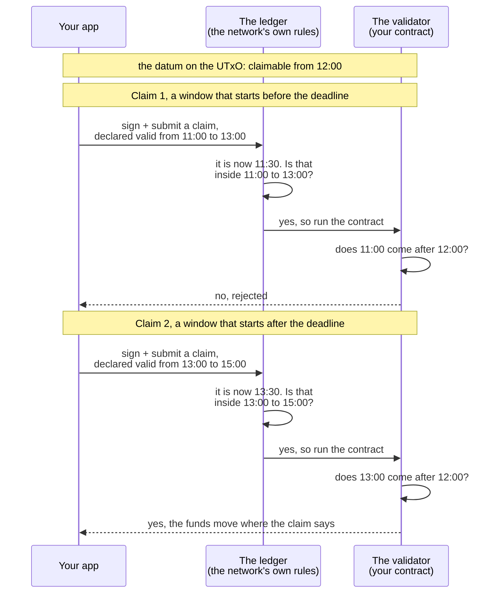

import Tabs from "@theme/Tabs";
import TabItem from "@theme/TabItem";
import CodeBlock from "@theme/CodeBlock";
import extractRegion from "@site/src/utils/extractRegion";
import VestingAiken from "!!raw-loader!@site/examples/onboarding/lectures/intermediate/vesting/on-chain/aiken/validators/vesting.ak";

# Handling time: vesting

You now have the whole machine. You can write a validator, test it, compile it, and drive it from an app.

The next three lectures are about the step that comes **before** all of that. Somebody describes an idea to you. It may be a business idea, a financial one, or a game. Your job is to decide what the contract has to remember, which actions it has to allow, and what it has to refuse. That decision is the **design**, and it is where most of the thinking happens.

Each of these three lectures takes one idea and walks the same path: the idea, then the design, then the code. This one starts with the most common rule in finance: **not before a certain date**.

## The idea

A company hires a developer and promises them tokens. The tokens belong to the developer, but not today. The developer can take them after one year.

The same shape appears in many places:

- A salary that is paid on the first day of each month.
- A refund period that ends after thirty days.
- A grant that is released in four steps over two years.

All of these are called **vesting**. Two people are involved. One person puts money aside. The other person takes it later.

The important part is the word "promise". The company must not be able to change its mind on the day before the date. An app cannot enforce that, because the company controls the app. Only the chain can enforce it. That is why vesting is a contract and not a calendar reminder.

## From idea to contract

Four questions turn an idea into a contract. Ask them in this order. The next two lectures ask the same four.

**1. What has to be remembered?** This becomes the **datum**. A vesting contract has to remember two things: **who** may take the money, and **from when**. Nothing else. The amount does not need to be remembered, because the UTxO already holds it.

**2. What actions are possible?** This becomes the set of handlers, and the **redeemer** if there is more than one action. Here there is only one action: claim the money. So the contract needs a single `spend` handler, and the redeemer carries nothing.

**3. What must be true for each action?** These are the rules. The claim has two conditions, and both must hold. The person named in the datum has to sign the transaction. And the transaction has to happen after the date in the datum.

**4. What breaks if a rule is missing?** Ask this before you write the code, not after. Drop the signature check and anybody can take the money on the right date. Drop the date check and the developer can take the money on the first day. Both rules are necessary.

The design in one sentence: **the funds go to the person named in the datum, and only in a transaction that happens after the date in the datum.**

That second half is a problem. A contract cannot read a clock. **[On-chain vs off-chain](/docs/developers/onboarding/lectures/intermediate/on-chain-vs-off-chain#why-the-split-exists)** explained why. Every node has to reach the same answer forever, and a clock gives a different answer every time you ask it.

## The window, not the moment

The solution is the one you met in Beginner, in [Time on Cardano](/docs/developers/onboarding/lectures/beginner/time-on-cardano). Every transaction can carry a **validity window**, and **you** set it when you build the transaction. It is a statement the transaction makes about itself: **this transaction may only be included in a block _after_ this slot, and _before_ that slot.**

It says nothing about what the transaction moves, or who signed it. It only says **when the transaction may run**. The window has two ends, and each has a name you will meet in code: the **lower bound** (`invalid_before`), and the **upper bound** (`invalid_hereafter`, also called the TTL, for time to live). This lecture needs the lower bound, because a deadline is a rule about being late.

Two parties then check that window, and they ask different questions. The examples use clock times rather than slot numbers, because they are easier to read:



- The **ledger** asks: is the current slot inside the window the transaction declared? A transaction outside its own window is rejected, and no contract runs at all.
- The **validator** asks: does that window start after the deadline in the datum? The ledger cannot ask this one for you. A deadline is one contract's rule, written in one datum, and the ledger does not read datums.

Claim 1 shows why both are needed. The ledger is satisfied, because 11:30 really is inside 11:00 to 13:00. The validator rejects it anyway, because the window starts before the deadline. Remove the validator's check and anybody could claim on the first day with a perfectly honest window. Remove the ledger's check and the window becomes a claim that nobody verified.

So **the contract never checks the time. It checks a statement that the ledger has already verified.** Reading that statement is deterministic, exactly like reading the datum, so every node reaches the same answer forever.

But the window is only a **bound**. Whoever builds the transaction chooses it and may make it as wide as they like, so the contract never learns the exact moment the transaction ran. That is why the rule is written on the **lower bound**: the only way to be sure the claim is late is to require that the whole window is late.

One detail is worth knowing. You are free to declare a window that opens later than the current time, and the validator will believe it. But you cannot get that transaction into a block early, because the ledger refuses it until the real slot arrives. An honest window is accepted. A dishonest window only waits until it expires.

## How the date reaches the validator

Locking the funds is an ordinary payment, exactly as before. The claim is the vault's unlock with one extra instruction: the app has to declare the window.

Notice what the app does that the contract cannot do. The app has a real clock. So the app is the part that turns your deadline into a **slot number**, and writes that slot into the transaction.

The validator never sees that slot. Once the ledger has checked the window, it converts the window into **POSIX milliseconds**, which is the number of milliseconds since 1 January 1970. Only then does it run the script. This is why `lock_until` in the datum is a plain timestamp and not a slot number.

The script is given real time instead of slots on purpose. Slot length is a network parameter, so a hard fork could change it. A rule written in slot numbers would then mean a different moment, and nothing would warn you. A date always means the same moment.

So the window is converted **twice**, by two different parties. Your app turns a date into slots when it builds the transaction. The ledger turns those slots back into milliseconds before the validator runs. You only ever do the first conversion.

Watch the unit. A deadline written in **seconds** is a thousand times too small, so it points at a date in 1970. That date is already in the past, so anybody could claim the funds immediately.

## Why the claim must declare a window

Both bounds of the window are optional, and this is the part that people often get wrong. A bound you leave out is treated as **infinite**. If the transaction declares no lower bound, it says "I have been valid since the beginning of time". That statement proves nothing about a deadline, so the check refuses the transaction.

That is why the claim has to set a lower bound at all. The lower bound is not a formal detail. It is the evidence the validator reads, and if the bound is missing, the validator has nothing to read.

<Tabs groupId="onchain">
<TabItem value="aiken" label="Aiken" default>

`vesting.ak` has a test for exactly this case, `claim_fails_without_a_deadline_bound`. The right person signs, and everything else about the claim is correct, but the transaction declares no lower bound. The contract refuses it anyway.

</TabItem>
<TabItem value="scalus" label="Scalus">

A [Scalus](https://scalus.org/) version is coming soon. The idea is identical, only the language differs.

</TabItem>
</Tabs>

:::warning A deadline far in the future is an estimate
Converting a date to a slot meets that same network parameter, from the other side. When an SDK converts a date, it assumes that slots keep the length they have today. As [Time on Cardano](/docs/developers/onboarding/lectures/beginner/time-on-cardano) explained, the conversion is only reliable a fixed distance ahead, currently about a day and a half (36 hours).

The real risk is that you get no warning. If you ask an SDK to convert a date five years from now, it returns a slot number and reports no error. It only calculates with today's parameters. The number looks exact, but it can easily be wrong. Our example locks funds for two minutes, which is safely inside the reliable range.
:::

## Try it

Three steps. Write the contract, check that you wrote ours, then watch the real network refuse an early claim.

### Write the contract

<Tabs groupId="onchain">
<TabItem value="aiken" label="Aiken" default>

Everything below runs from `on-chain/vault/`, the contract project you left at the end of lecture 8. Lecture 9 was a detour into the app, and this is the way back.

Create a new file, `validators/vesting.ak`, beside `vault.ak`. One Aiken project can hold as many validators as you want, and each one gets its own entry in the blueprint.

Start with the imports. Some belong to the contract and the rest belong to the tests below, and `aiken fmt` keeps them in this order:

<CodeBlock language="aiken" title="validators/vesting.ak">
  {extractRegion(VestingAiken, "vesting-imports")}
</CodeBlock>

Then the datum and the validator. The vesting contract is the vault from the earlier lectures plus one line: the datum still names who may claim, and now it also holds the date they may claim from.

<CodeBlock language="aiken" title="validators/vesting.ak">
  {extractRegion(VestingAiken, "vesting")}
</CodeBlock>

That is the design turned into code. The two fields in `VestingDatum` are answer 1: who may claim, and from when. The single `spend` handler is answer 2. The `and { … }` block is answer 3, one line per rule:

- `key_signed` is the vault's signature check with a clearer name. It is the same "is this key among the signers?" test that you wrote with `list.has` in **[the transaction context](/docs/developers/onboarding/lectures/intermediate/transaction-context)**.
- `valid_after` is the new part. It reads the **lower bound** of the transaction's validity window. It returns true only if that bound is later than the deadline in the datum.

Both come from `cocktail`, which you can see in the imports above. As **[validator purposes](/docs/developers/onboarding/lectures/intermediate/validator-purposes)** explained, **vodka** is the package you added in testing, and **cocktail** is its half for contracts.

Both checks must pass. So an early claim fails even with the right signature, and a late claim by the wrong person also fails.

Then the tests, so that `aiken check` has something to say. Four unit tests cover the four answers this contract can give, and one property test states the rule itself:

<CodeBlock language="aiken" title="validators/vesting.ak">
  {extractRegion(VestingAiken, "vesting-tests")}
</CodeBlock>

`invalid_before` in these tests is the **lower bound** from the top of this lecture, set on a mock transaction. `claim_ok_at_any_time_after_the_deadline` is the property test that **[testing](/docs/developers/onboarding/lectures/intermediate/testing)** promised you would meet here. Each unit test pins down one moment that you thought of. The property test states the rule and lets the runner hunt for a moment that you did not.

```bash
aiken check
aiken build
```

Five tests, five passes. Now open `plutus.json`. Next to the vault's entries there are two new ones, `vesting.vesting.spend` and `vesting.vesting.else`, and both carry the same hash. Compare it with ours:

```
550f731e0f5e582a5b681ff15ac23ad226629cc599365f5fa73d3f93
```

If it matches, you wrote the same contract we did, byte for byte. This one takes no parameter, so unlike the vault there is no blank left to fill. That hash is already the address the funds sit at.

### Then break it

Replace the whole `and { … }` block with just the signature check, so that the contract no longer looks at time at all. Run `aiken check` again. Both `claim_fails_before_the_deadline` and `claim_fails_without_a_deadline_bound` now **fail**, because a vault with no deadline releases the funds at any moment.

Now write the time check back, without scrolling up. The rule in words: the transaction's validity window must **start after** the deadline held in the datum. Two things you already know are enough: the window is on the transaction, and the field in the datum is called `lock_until`.

When both tests are green again, you wrote it.

</TabItem>
<TabItem value="scalus" label="Scalus">

A [Scalus](https://scalus.org/) version is coming soon. The idea is identical, only the language differs.

</TabItem>
</Tabs>

Stuck? The finished code is in the playground — see the **[introduction](/docs/developers/onboarding/lectures/intermediate/introduction#the-playground)**.

### Then run it

The playground has a small app for this contract, so you can watch the rule work on the real network. From `playground/`:

```bash
cd vesting/off-chain/mesh
npm install
cp ../../../vault/off-chain/mesh/.env .env   # or fill in .env.example again
npm run dev
```

Connect your wallet and set up collateral, the same first two steps as the vault's app. Then:

1. **Lock 5 ADA for 2 minutes.** The datum records you as the person who may claim, and the moment you may claim from.
2. **Refresh vested**, then try to **Claim** immediately. The claim is refused before anything is sent, because your SDK ran the contract first, and the contract said no.
3. Wait for the countdown to reach zero, refresh, and claim again. Same code, same contract, different answer. The only thing that changed is which slots the transaction may be included in.

The difference between those two attempts is a rule enforced by the chain. It is not your app choosing to behave well.

## Go deeper

- [Transactions: validity intervals and time](/docs/developers/curriculum/fundamentals/core-concepts/transactions#validity-intervals-and-time) — the bounds in detail, and slot↔time conversion.
- [Datum, Redeemer, and ScriptContext](/docs/developers/curriculum/smart-contracts/datum-redeemer-context) — a fuller vesting example, with an owner who can cancel.
- [Time handling](/docs/developers/curriculum/smart-contracts/security/vulnerabilities/time-handling) — the ways time checks go wrong, and how to write them safely.

Next: **[Multi validators: a gift card](/docs/developers/onboarding/lectures/intermediate/multi-validators)**.
