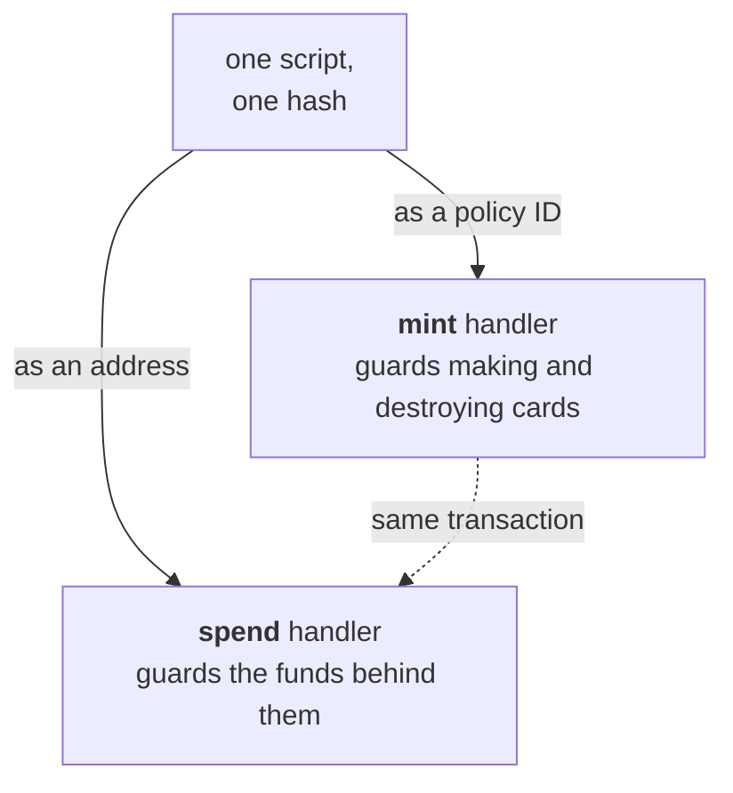

import Tabs from "@theme/Tabs";
import TabItem from "@theme/TabItem";
import CodeBlock from "@theme/CodeBlock";
import extractRegion from "@site/src/utils/extractRegion";
import GiftcardAiken from "!!raw-loader!@site/examples/onboarding/lectures/intermediate/giftcard/on-chain/aiken/validators/giftcard.ak";

# Multi validators: a gift card

The last lecture had one action and one rule. This one needs more than that, and it will show you two things you have not met yet: **state that is not in a datum**, and **one script that guards two different actions**.

Same path as before. The idea first, then the design, then the code.

## The idea

A shop sells gift cards. You pay 50 ADA today and you get a card. You give the card to a friend. Your friend walks into the shop, hands over the card, and takes 50 ADA of goods. The card is now used up. Nobody can use it a second time.

Look closely at what the card actually is. It is not a record in the shop's database. It is a **physical object** that carries a right. Whoever holds it can use it. The shop does not need to know who is holding it. When the card is handed over and destroyed, the right is gone.

That is the important part of the idea, and it is the part a contract has to reproduce:

- Anybody may hold the card, and holding it is enough.
- The funds and the card must move together. The shop must not be able to release the goods and keep the card, and the customer must not be able to keep the card and take the goods.
- Once the card is used, it stops existing.

## From idea to contract

The same four questions as the last lecture.

**1. What has to be remembered?** Nothing at all in the datum, and this is the surprise. The last lecture wrote the beneficiary into the datum, because the contract had to know **who** may claim. A gift card has no named owner. The right belongs to whoever holds the card.

So the state lives somewhere else: in the **token itself**. A token that exists means an unused card. A token that has been destroyed means a card that has been used. This is worth remembering as a design move. A token is a piece of state that anybody can hold and transfer, and it needs no datum.

**2. What actions are possible?** Three of them:

- Create a card.
- Destroy a card.
- Release the funds that sit behind a card.

The first two act on a **token**, so they belong to a `mint` handler. The third acts on a **UTxO**, so it belongs to a `spend` handler. **[Validator purposes](/docs/developers/onboarding/lectures/intermediate/validator-purposes)** already showed that one script can declare both.

**3. What must be true for each action?** The mint handler allows exactly two things: create one card, or destroy one card. Anything else under this policy is refused. The spend handler asks one question: is a card being destroyed in this same transaction? If yes, the funds may leave. If no, they stay.

**4. What breaks if a rule is missing?** Remove the check in the spend handler and the funds leave while the card survives. Your friend takes the 50 ADA and still holds a valid card, and can do it again tomorrow. The token then means nothing, because it opens the lock without being used up.

The design in one sentence: **the funds are released only if a card is destroyed in the same transaction.**

## Contracts do not call each other

Before the code, correct one common idea. On Cardano, a contract cannot **call** another contract. There is no way for one validator to run another one and get an answer back.

As **[the transaction context](/docs/developers/onboarding/lectures/intermediate/transaction-context)** showed, validators work together in a different way. Each validator judges the **same transaction** by its own rules. Each one can also require that the other one approved that transaction. They cooperate, but they never talk to each other.

This is why the design above works. The spend handler does not ask the mint handler for permission. It looks at the transaction that both of them are part of, and it checks what that transaction destroys.

The same technique works between two completely separate contracts. That case comes in the next lecture, [reference inputs](/docs/developers/onboarding/lectures/intermediate/reference-inputs-and-scripts). Here we use the simpler version: **one script guarding two different actions**.

## Two purposes, one hash

Remember from **[validator purposes](/docs/developers/onboarding/lectures/intermediate/validator-purposes)** that one script has one hash, and that this hash acts as both its **address** and its **policy ID**. That is what makes a single contract enough here:



Because the two handlers share a hash, the spend handler can look at what the transaction mints **under its own policy**. It does not need to be told which policy that is. It can work it out from the address it is guarding.

So using a card is not two steps, where one step could succeed and the other could fail. It is one transaction. That transaction either destroys the card and releases the funds, or it does neither.

:::warning This version is simplified for teaching
A real gift card also stops anybody from creating a *second* card for the same funds. It usually does this by tying the mint to one specific UTxO, and a UTxO can only ever be spent once. That UTxO is passed in as a **[parameter](/docs/developers/onboarding/lectures/intermediate/parameters)**, so it changes the script hash and becomes part of the policy's own identity. Nobody can then point the policy at a different UTxO. This is called a [one-shot policy](/docs/developers/curriculum/smart-contracts/write-a-validator#one-shot-policies).

Our version does not do this, so use it as an illustration and not as a template to copy. [Aiken's gift card example](https://aiken-lang.org/example--gift-card) shows the full version, and it is a good next thing to read once you understand this structure.
:::

## Try it

There is no app for this one. The interesting part is in the blueprint, so you write the contract, compile it, and read what comes out.

<Tabs groupId="onchain">
<TabItem value="aiken" label="Aiken" default>

Everything below runs in the same project as the last lecture.

Create `validators/giftcard.ak`. The imports first, contract and tests together:

<CodeBlock language="aiken" title="validators/giftcard.ak">
  {extractRegion(GiftcardAiken, "giftcard-imports")}
</CodeBlock>

Then the token name and the two handlers:

<CodeBlock language="aiken" title="validators/giftcard.ak">
  {extractRegion(GiftcardAiken, "giftcard")}
</CodeBlock>

There is no datum type in this file, which is answer 1: the token is the state. The two handlers are answer 2, and the body of each one is answer 3.

- The **mint** handler allows one card to be created, or one card to be destroyed. That is what the `1` and the `-1` mean. A transaction records how many tokens it changes as a plain number, so destroying a token is minting a **negative** amount. This is why a single handler covers both actions. Anything else under this policy is refused.
- The **spend** handler asks whether a card is being **destroyed** here. Notice how it finds the policy ID. It looks for the input that it is guarding, takes the address of that input, and reads the script hash out of that address. That hash **is** the policy ID. This is how a script recognizes the tokens that it created itself.

Then five tests. Three of them call the `mint` handler and two call the `spend` handler, which is the first time you have tested two doors of one script:

<CodeBlock language="aiken" title="validators/giftcard.ak">
  {extractRegion(GiftcardAiken, "giftcard-tests")}
</CodeBlock>

```bash
aiken check
aiken build
```

Now open `plutus.json` and find the three `giftcard.giftcard.*` entries. One is the mint handler, one is the spend handler, and one covers everything else. **All three share a hash.** Those three entries are the diagram at the top of this lecture, written into a file. Compare that hash with ours:

```
9dfcd92c37def0a97a0ffd1431e548f23561fa2a83628d73939aef23
```

**Then break it.** Delete the burn check from the spend handler and return `True` instead. Run the tests again. `redeem_fails_when_the_card_is_kept` now **fails**. The validator releases the funds whether or not the card is destroyed, and the one test written to catch that problem reports it. The token no longer protects anything.

**Now write the check back yourself, without scrolling up.** The rule in words: allow the spend only if exactly one card is **destroyed** under this script's own policy, in this same transaction. You have everything you need. The line above already works out the policy ID. The name of the card is the constant at the top of the file. And earlier in this lecture you learned how a transaction records the destruction of a token. When that test passes again, the card is a key once more.

</TabItem>
<TabItem value="scalus" label="Scalus">

A [Scalus](https://scalus.org/) version is coming soon. The idea is identical, only the language differs.

</TabItem>
</Tabs>

Stuck? The finished code is in the playground. See the **[introduction](/docs/developers/onboarding/lectures/intermediate/introduction#the-playground)**.

## Go deeper

- [Write a Validator](/docs/developers/curriculum/smart-contracts/write-a-validator): "one validator, many purposes, one hash," with more handlers.
- [Minting policies](/docs/developers/curriculum/native-tokens/minting-policies): the mint purpose in depth.
- [Token security](/docs/developers/curriculum/smart-contracts/security/vulnerabilities/token-security): what goes wrong when a token is used as a key.

Next: **[Modifying state: an oracle](/docs/developers/onboarding/lectures/intermediate/modifying-state)**.
