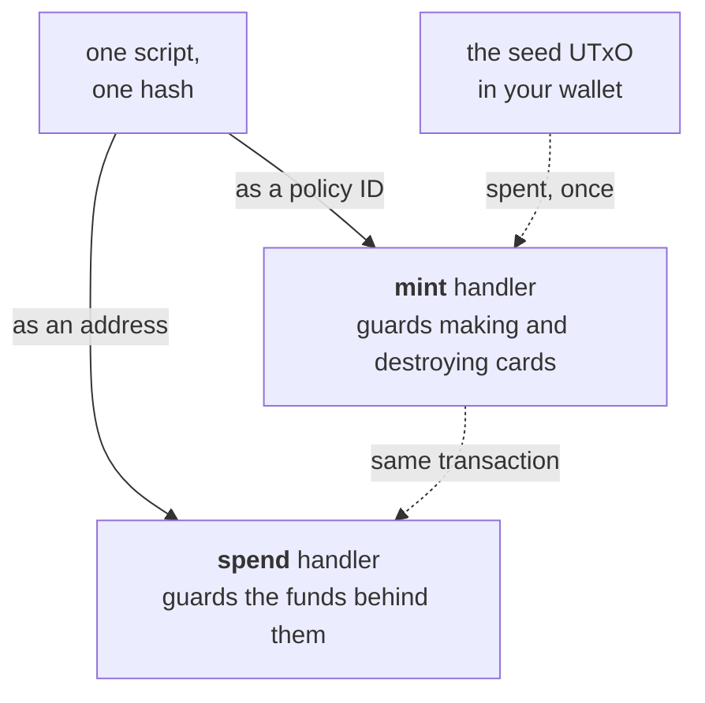
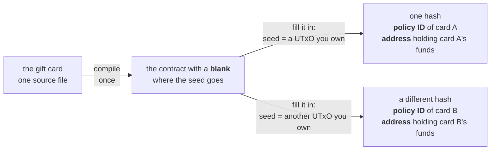

import Tabs from "@theme/Tabs";
import TabItem from "@theme/TabItem";
import CodeBlock from "@theme/CodeBlock";
import extractRegion from "@site/src/utils/extractRegion";
import GiftcardAiken from "!!raw-loader!@site/examples/onboarding/lectures/intermediate/giftcard/on-chain/aiken/validators/giftcard.ak";

# Multi validators: a gift card

The last lecture had one action and one rule. This contract needs two things you have not met yet: **state that is not in a datum**, and **one script that guards two different actions**.

## The idea

A shop sells gift cards. You pay 50 ADA today and you get a card. You give the card to a friend. Your friend walks into the shop, hands over the card, and takes 50 ADA of goods. The card is now used up. Nobody can use it a second time.

The card is a **physical object**, and the shop keeps no list of who has one. Whoever is holding the card can use it, and nobody is asked for a name. The shop destroys the card when the customer hands it over, and that ends the claim to the 50 ADA.

A contract has to reproduce three things:

- Anybody may hold the card, and holding it is enough.
- The funds and the card must move together. The shop must not be able to release the goods and keep the card, and the customer must not be able to keep the card and take the goods.
- There is one card. The shop must not be able to print a second one for the same funds.

## From idea to contract

The same four questions as the last lecture.

**1. What has to be remembered?** Nothing at all in the datum. The last lecture wrote the beneficiary into the datum, because the contract had to know **who** may claim. A gift card has no named owner. Whoever holds the card may claim the funds.

So the state lives somewhere else: in the **token itself**. A token that exists means an unused card. A token that has been destroyed means a card that has been used. A token is a piece of state that anybody can hold and transfer, and it needs no datum.

**2. What actions are possible?** Three of them:

- Create a card.
- Destroy a card.
- Release the funds that sit behind a card.

The first two act on a **token**, so they belong to a `mint` handler. The third acts on a **UTxO**, so it belongs to a `spend` handler. **[Validator purposes](/docs/developers/onboarding/lectures/intermediate/validator-purposes)** already showed that one script can declare both.

**3. What must be true for each action?** Creating a card is allowed once and never again. Destroying a card is allowed only together with taking the funds, for a reason the fourth question turns up. The spend purpose asks one question: is a card being destroyed in this same transaction? If yes, the funds may leave. If no, they stay.

**4. What breaks if a rule is missing?** Remove the check in the spend handler and the funds leave without any card being destroyed. Anybody can take the 50 ADA, with or without a card, and your friend is left holding a card that opens nothing. Remove the limit on creating and anybody can make a second card, destroy that one instead, and take the 50 ADA that belongs to the first.

The third one is easier to miss, and it is the reason destroying a card is not free. Let the card be destroyed on its own and your friend can throw it away without taking the goods. Only one card can ever exist, so nothing is left that can release the funds, and the 50 ADA stays where it is for ever. Nobody gains anything, which is what makes it easy to do by accident.

The design in one sentence: **a card can only ever be created once, and the card and the funds have to move together in both directions: the funds are released only if a card is destroyed, and a card is destroyed only if the funds are released.**

## What makes it an NFT

Beginner defined an [NFT](/docs/developers/onboarding/lectures/beginner/tokens-fungible-and-nfts) as a token with a quantity of 1, under a policy that can never mint it again. Minting a quantity of 1 is easy. The hard part is the policy: it has to be impossible to run a second time.

Beginner's NFT used a native script with a deadline in it. Once the deadline passes, nobody can mint under that policy again. Before it passes, whoever holds the key can still mint more, so the token is only certainly unique after the deadline.

A validator can read the transaction, so it can ask for something stronger: **a specific UTxO must be spent in the transaction that creates the token**. A UTxO is consumed exactly once in the whole history of the chain. After that it no longer exists, and no later transaction can use it. So a policy that asks for one can succeed at most once, and the card is unique from the block that created it.

That UTxO is called the **seed**, and a policy built this way is called a **one-shot policy**. The seed comes from your own wallet, and it is an ordinary UTxO holding ordinary ADA. Nothing about it is special until the policy names it.

## How the two handlers cooperate

The spend handler does not ask the mint handler for permission. As **[the transaction context](/docs/developers/onboarding/lectures/intermediate/transaction-context)** showed, validators never call each other: each one judges the **same transaction** by its own rules. So the spend handler looks at the transaction that both handlers are part of, and it checks what that transaction destroys.

The same technique works between two completely separate contracts, in **[reference inputs](/docs/developers/onboarding/lectures/intermediate/reference-inputs-and-scripts)**. Here it is one script guarding two different actions.

The mint handler looks the other way for the same reason. It asks whether the transaction spends a UTxO at this script's address, which is the check that stops a card being destroyed on its own. So the two handlers depend on each other: the funds need a burnt card, and a burnt card needs the funds to move. Neither can happen alone.

The spend rule asks whether a card was destroyed. It does not ask how many UTxOs that one destroyed card is releasing. Here each card guards a single locked UTxO, so the simpler question is enough. A contract that keeps several UTxOs at one address has to count them, and the Advanced track covers that problem under the name **double satisfaction**.

## Two purposes, one hash

Remember from **[validator purposes](/docs/developers/onboarding/lectures/intermediate/validator-purposes)** that one script has one hash, and that this hash acts as both its **address** and its **policy ID**:



Because the two handlers share a hash, the spend handler can look at what the transaction mints **under its own policy**. It does not need to be told which policy that is. It can read it from the address it is guarding.

Using a card is one transaction. It either destroys the card and releases the funds, or it does neither.

## One card, one contract

The seed is a **[parameter](/docs/developers/onboarding/lectures/intermediate/parameters)**, so it is built into the contract's code before the contract has an address. Picking a different seed produces a different hash.

Every card therefore has a contract of its own, and its hash is both the policy ID and the address. The funds for one card sit at an address that belongs to that card alone:



Selling a second gift card means picking a second seed, then filling the blank in again with the two lines of off-chain code from **[parameters](/docs/developers/onboarding/lectures/intermediate/parameters#what-filling-the-blank-actually-involves)**.

## Try it

**Write the contract, compile it, and read the blueprint.** There is no app for this one.

<Tabs groupId="onchain">
<TabItem value="aiken" label="Aiken" default>

Everything below runs in the same project as the last lecture.

Create `validators/giftcard.ak`. The imports first, contract and tests together:

<CodeBlock language="aiken" title="validators/giftcard.ak">
  {extractRegion(GiftcardAiken, "giftcard-imports")}
</CodeBlock>

Then the token name, the two actions, and the two handlers:

<CodeBlock language="aiken" title="validators/giftcard.ak">
  {extractRegion(GiftcardAiken, "giftcard")}
</CodeBlock>

There is no datum type in this file, which is answer 1: the token is the state. The two handlers are answer 2, and the body of each one is answer 3.

- `CardAction` is the mint redeemer, and it reaches the validator as a number: `Create` is constructor 0 and `Burn` is constructor 1. Swap the two lines and the transaction asks for the other action, without any complaint from the compiler. **[Parameters](/docs/developers/onboarding/lectures/intermediate/parameters)** pointed out the same problem for `VaultAction`.
- The **mint** handler asks a different question in each branch. `Create` asks for two things: one card is created, and `utxo_ref` is among the inputs. `list.any` compares references only, so the seed does not have to pay for anything or be sent anywhere. It only has to be spent. `Burn` asks for a card to be destroyed, which is minting a **negative** amount, and for a UTxO at this script's own address to be spent. It says nothing about the seed, because the seed was already spent when the card was created. It finds the script's address the same way the spend handler does, out of the `policy_id` it is handed, since that value is the script's hash.
- `assets.tokens` narrows the transaction's mint field to this policy, and `dict.to_pairs` turns what is left into a list. Matching that list against a single `Pair` is the same line you wrote for the vault's own policy in **[validator purposes](/docs/developers/onboarding/lectures/intermediate/validator-purposes)**, and it is what stops the policy minting a second name beside the card.
- The **spend** handler asks whether a card is being **destroyed** here. To find the policy ID, it looks for the input that it is guarding, takes the address of that input, and reads the script hash out of that address. That hash **is** the policy ID. This is how a script recognizes the tokens that it created itself.

Then seven tests. Five of them call the `mint` handler and two call the `spend` handler, which is the first time you have tested two doors of one script:

<CodeBlock language="aiken" title="validators/giftcard.ak">
  {extractRegion(GiftcardAiken, "giftcard-tests")}
</CodeBlock>

The parameter comes first in every call, from **[parameters](/docs/developers/onboarding/lectures/intermediate/parameters)**. `seed` and `own_ref` are two different references on purpose: `seed` is the UTxO the policy was built from, and `own_ref` is the locked UTxO the spend handler is guarding.

```bash
aiken check
aiken build
```

Seven tests, seven passes. The four tests that are meant to fail also name what stopped them: three print the check that returned false, and `redeem_fails_when_the_card_is_kept` prints the match that found no minted token at all.

Now open `plutus.json` and find the three `giftcard.giftcard.*` entries. One is the mint handler, one is the spend handler, and one covers everything else. **All three share a hash**, and all three carry a `parameters` field naming the blank you left. The mint entry also names `CardAction` as its redeemer, with `Create` at index 0 and `Burn` at index 1.

Compare the hash with ours:

```
312eeec0e121aee21efb39db3298de48fd1e3a02ea21980b9ce5b538
```

Your seed is still missing, so this is the script with the blank in it. Filling the blank gives a different hash, and that one is the policy ID and the address of a real card.

**Then break it.** Cut the `Create` branch down to its quantity check, dropping the `list.any` call and the `and` around it, and run the tests again. Six still pass, and `create_fails_without_the_seed` is the one that fails. The compiler also warns that `utxo_ref` is now unused. The contract still creates a card, still refuses two, and still releases the funds when a card is burned. It has simply stopped being a card that can only be created once, and one test out of seven says so.

**Now write the check back yourself, without scrolling up.** The rule in words: creating a card is allowed only when the UTxO the contract was built from is among the transaction's inputs. When that test passes again, only one card can ever exist.

[Aiken's own gift card example](https://aiken-lang.org/example--gift-card) builds the same contract together with its off-chain code, and is a good next thing to read.

</TabItem>
<TabItem value="scalus" label="Scalus">

A [Scalus](https://scalus.org/) version is coming soon. The idea is identical, only the language differs.

</TabItem>
</Tabs>

Stuck? The finished code is in the playground. See the **[introduction](/docs/developers/onboarding/lectures/intermediate/introduction#the-playground)**.

## Go deeper

- [One-shot policies](/docs/developers/curriculum/smart-contracts/write-a-validator#one-shot-policies): the same pattern on its own, without a contract around it.
- [Minting policies](/docs/developers/curriculum/native-tokens/minting-policies): the mint purpose in depth.
- [Token security](/docs/developers/curriculum/smart-contracts/security/vulnerabilities/token-security): what goes wrong when a token is used as a key.

Next: **[Modifying state: an oracle](/docs/developers/onboarding/lectures/intermediate/modifying-state)**.
