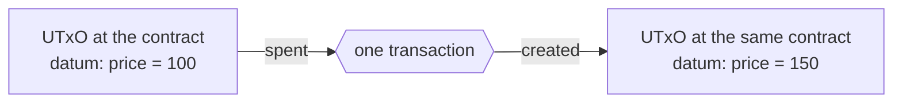

import Tabs from "@theme/Tabs";
import TabItem from "@theme/TabItem";
import CodeBlock from "@theme/CodeBlock";
import extractRegion from "@site/src/utils/extractRegion";
import OracleAiken from "!!raw-loader!@site/examples/onboarding/lectures/intermediate/oracle/on-chain/aiken/validators/oracle.ak";

# Modifying state: an oracle

Every contract so far has ended the same way. The validator says yes, and the funds **leave**. Lock, then unlock. Buy, then use.

This contract breaks that pattern. The thing you build is meant to stay on the chain and keep changing.

## The idea

A lending application needs to know the price of ADA in dollars. It cannot look the price up itself, because a contract cannot read the internet. Somebody has to publish the price on the chain, and everybody else reads it from there. That publisher is called an **oracle**.

The idea has three parts:

- One party publishes a number, and only that party may change it.
- Anybody can read the number.
- The number changes over time, and the latest value is the one that counts.

An oracle is the clearest example, but the same shape is behind almost anything with a memory. A counter. A registry of members. A configuration that an admin can update. In all of them, a value has to **stay** on the chain and be **changed**.

A UTxO cannot be edited. The only thing you can do with a UTxO is spend it.

## From idea to contract

The same four questions.

**1. What has to be remembered?** Two things: the **owner**, which is the key allowed to publish, and the **price** itself. Both go in the datum, which now holds application data and not only permissions.

**2. What actions are possible?** One: update the price. There is no "close" and no "withdraw" in this version, because the oracle is meant to keep existing.

**3. What must be true for each action?** Two conditions. The owner has to sign. And the oracle has to still exist after the transaction, with the new price in it.

That second condition is new: this contract must refuse to let the funds leave.

**4. What breaks if a rule is missing?** Drop the signature check and anybody can publish any price, which destroys the point of an oracle. Drop the second condition and the owner can spend the UTxO and keep the money, and the oracle simply disappears. What you have then is a vault, and a vault that is harder to use than the one you already wrote.

The design in one sentence: **the owner may spend the oracle's UTxO, but only in a transaction that puts a new one back.**

## Nothing is edited, everything is replaced

A UTxO is replaced rather than edited: you spend it, and you create its replacement **in the same transaction**.



Because both things happen in one transaction, there is no moment in between where the oracle is missing. To anybody reading the chain, a value changed.

The output that goes straight back to the address it came from is called a **continuing output**. It is the pattern behind almost everything on Cardano that stores changing data.

For the app that builds the transaction, this is the unlock you already know, with one addition: one extra output, sent back to the contract's own address, carrying the new datum.

:::warning A real oracle checks more than this
The oracle you are about to write checks that *an* output comes back carrying *a* readable datum. That is enough to show the pattern, but not enough to trust. A real version also checks three more things:

- **The value came back too.** Our version does not check this, so the owner could publish a new price and take the ADA in the same transaction. Never assume that the value is kept just because an output exists.
- **The fields that should not change, did not.** Our version accepts any `OracleDatum`, so the owner could change the `owner` field and give the oracle to somebody else.
- **This is the real oracle.** Anybody can create a UTxO at a script address, so a contract that reads "the oracle" needs a way to tell the real one from a fake one. The usual answer is a token that is created exactly once, and only the real oracle holds it. Learn the name for it, because you will meet it everywhere: a **beacon token**, sometimes called a state thread token. The contract is usually given that token as a [parameter](/docs/developers/onboarding/lectures/intermediate/parameters). It then checks that the token is present in the input it spends and in the output it sends back.

Each check is a line or two, and [smart contract security](/docs/developers/curriculum/smart-contracts/security) explains all three. Our version stays simple, so that the state change is the only thing you have to think about.
:::

:::note One UTxO, one updater at a time
A UTxO can only be spent once. So if two updates try to change the same oracle at the same time, one of those transactions fails and has to be built again. That is fine for something a single party publishes. It is also the reason why busy contracts store their data in many UTxOs instead of one. Keep this in mind before you put a popular counter in a single output.
:::

## Try it

**Write the contract, then watch a value change on the real network.**

### Write the contract

<Tabs groupId="onchain">
<TabItem value="aiken" label="Aiken" default>

Everything below runs in the same project as the last two lectures.

Create `validators/oracle.ak`. The imports first, contract and tests together:

<CodeBlock language="aiken" title="validators/oracle.ak">
  {extractRegion(OracleAiken, "oracle-imports")}
</CodeBlock>

Then the datum and the validator:

<CodeBlock language="aiken" title="validators/oracle.ak">
  {extractRegion(OracleAiken, "oracle")}
</CodeBlock>

`OracleDatum` is answer 1, and the single `spend` handler is answer 2. The body is answer 3. Read it in order:

1. Take the owner out of the current datum.
2. Find the input that is being spent, so the contract knows which address to require.
3. Require **exactly one** output going back to that address, and check that its datum has the same type. `outputs_at` and `output_inline_datum` do this work, both from `cocktail`.
4. Check the signature.

The contract requires *exactly* one output because two outputs at the same address would make the next update unclear: nothing would say which of them is the oracle.

Then three tests. These ones build a transaction with an **output** as well as an input, which the vault's tests never needed, because the vault never cared where the funds went:

<CodeBlock language="aiken" title="validators/oracle.ak">
  {extractRegion(OracleAiken, "oracle-tests")}
</CodeBlock>

`update_fails_when_the_utxo_does_not_return` sends the output to an ordinary key address instead of back to the script, and a correct contract refuses that transaction. Without this test, nothing would tell an oracle apart from a vault.

```bash
aiken check
aiken build
```

Open `plutus.json` and find `oracle.oracle.spend`. Compare its hash with ours:

```
e17872fdaba9b9906fa71fb30bf7773832b8b488cf6075c61d4a61a9
```

Your project now holds four contracts, each with its own hash and therefore its own address: the vault, the vesting contract, the gift card, and this oracle.

</TabItem>
<TabItem value="scalus" label="Scalus">

A [Scalus](https://scalus.org/) version is coming soon. The idea is identical, only the language differs.

</TabItem>
</Tabs>

Stuck? The finished code is in the playground. See the **[introduction](/docs/developers/onboarding/lectures/intermediate/introduction#the-playground)**.

### Then run it

The playground has an app for this contract. From `playground/`:

<Tabs groupId="offchain">
<TabItem value="mesh" label="Mesh" default>

```bash
cd oracle/off-chain/mesh
npm install
cp ../../../vault/off-chain/mesh/.env .env   # or fill in .env.example again
npm run dev
```

</TabItem>
<TabItem value="evolution" label="Evolution">

An [Evolution](https://github.com/IntersectMBO/evolution-sdk) version is coming soon. The idea is identical, only the library calls differ.

</TabItem>
</Tabs>

Connect your wallet and set up collateral, then:

1. **Publish price 100.** This is a plain payment to the contract, carrying the first value in its datum.
2. **Refresh oracles**, then **Raise by 50**. Approve it and wait.
3. Refresh again. The price now reads 150.

Now look at what actually happened, using the explorer. Follow the link from the update transaction and read its two sides. The input is the old oracle UTxO. One of the outputs is a **new UTxO at the same address**, with a different datum.

## Now close one of the weaknesses

The warning box listed three checks that a real oracle needs and ours skips. Now you write one.

Take the first: **the value has to come back too**. At the moment, the owner can publish a new price and take the ADA in the same transaction. This is possible because the contract only checks that *an* output returned with *a* readable datum.

<Tabs groupId="onchain">
<TabItem value="aiken" label="Aiken" default>

Back in the `validators/oracle.ak` you just wrote.

**Start with the test, because a weakness is easier to see than to fix.** Copy `update_ok_when_owner_signs_and_utxo_returns`. Give the copy a new name. Then lower the amount in its `tx_out(...)` line, so that the update returns less ADA than it took. Mark the test `fail`, because a correct contract should refuse this transaction.

Run `aiken check`. Your new test **fails**. You said that the contract should refuse this transaction, and the contract did not refuse it. That failure makes the weakness visible.

**Then fix the validator.** What came in is `own_input.output.value`. What goes back is `continuing.value`. Compare the two and refuse the transaction when the value gets smaller. `assets.lovelace_of` is enough for a first version, and `cardano/assets` is already imported at the top of the file.

When your test passes, you have found a real weakness, written a test that proves it, and fixed it.

</TabItem>
<TabItem value="scalus" label="Scalus">

A [Scalus](https://scalus.org/) version is coming soon. The idea is identical, only the language differs.

</TabItem>
</Tabs>

## Go deeper

- [Datum, Redeemer, and ScriptContext](/docs/developers/curriculum/smart-contracts/datum-redeemer-context): the continuing-output pattern and state machines in full.
- [Oracles](/docs/developers/curriculum/dapps/oracles/overview): how real oracles publish data, including the common design where the price is signed off-chain rather than stored in a UTxO like ours.
- [Design patterns](/docs/developers/curriculum/smart-contracts/advanced/design-patterns/overview): how contracts store state across many UTxOs when one is not enough.
- [A prediction market](/docs/developers/curriculum/dapps/oracles/prediction-market): this pattern at real size, with a real oracle behind it.

Next: **[Reference inputs & reference scripts](/docs/developers/onboarding/lectures/intermediate/reference-inputs-and-scripts)**.
