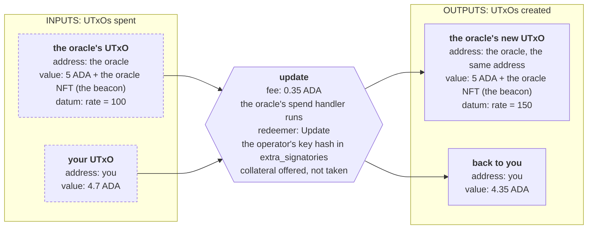
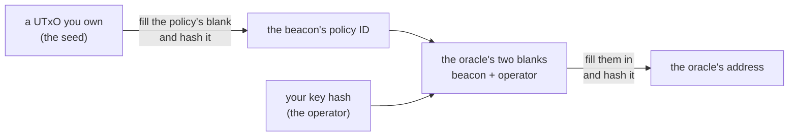
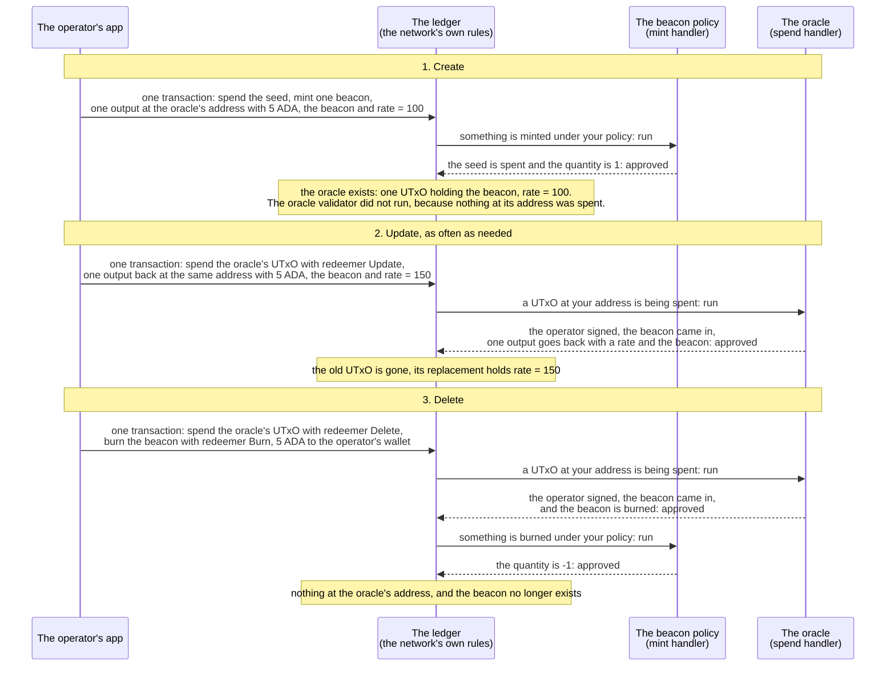
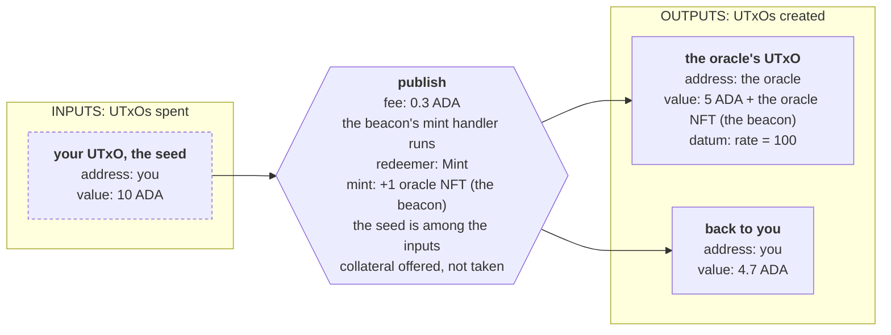
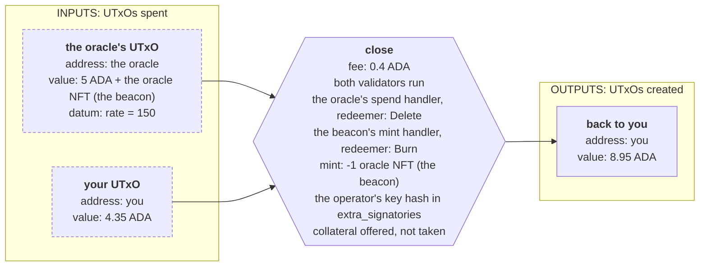

import Tabs from "@theme/Tabs";
import TabItem from "@theme/TabItem";
import CodeBlock from "@theme/CodeBlock";
import extractRegion from "@site/src/utils/extractRegion";
import BeaconAiken from "!!raw-loader!@site/examples/onboarding/lectures/intermediate/oracle/on-chain/aiken/validators/beacon.ak";
import OracleAiken from "!!raw-loader!@site/examples/onboarding/lectures/intermediate/oracle/on-chain/aiken/validators/oracle.ak";
import validatorHash from "@site/src/utils/validatorHash";
import OracleBlueprint from "@site/examples/onboarding/lectures/intermediate/oracle/on-chain/aiken/plutus.json";

# Modifying state: an oracle

Every contract so far has ended the same way. The validator says yes, and the funds **leave**. Lock, then unlock. Create a card, then redeem it. This one is meant to stay on the chain and keep changing.

## The idea

A lending application needs to know the rate: how many dollars one ADA is worth. A validator sees only the transaction context, and nothing in a transaction says what a dollar costs today. Somebody has to publish the number on the chain, and everybody else reads it from there. That publisher is called an **oracle**.

The idea has three parts:

- One party publishes a number, and only that party may change it.
- Anybody can read the number.
- The number changes over time, and the latest value is the one that counts.

:::warning This oracle is centralized
One key controls the number, so everybody reading it has to trust whoever holds that key. The contract proves that the operator signed the update. Nothing proves that the rate is true. **[Parameters](/docs/developers/onboarding/lectures/intermediate/parameters)** made the same point about an admin key.

A contract that reads the rate can lower that trust by reading several independent oracles as reference inputs and accepting the value only when most of them agree within a small difference. Real oracles usually do this between their own nodes before publishing, and the [handbook](/docs/developers/curriculum/dapps/oracles/overview) covers those designs.
:::

An oracle is the clearest example, but the same shape is behind almost anything with a memory. A counter. A registry of members. A configuration that an admin can update. In all of them, a value has to **stay** on the chain and be **changed**.

A UTxO cannot be edited. The only thing you can do with a UTxO is spend it.

## Nothing is edited, everything is replaced

A UTxO is replaced rather than edited: you spend it, and you create its replacement **in the same transaction**.



Because both things happen in one transaction, there is no moment in between where the oracle is missing. To anybody reading the chain, a value changed. The output that goes straight back to the address it came from is called a **continuing output**. It is the pattern behind almost everything on Cardano that stores changing data.

For the app that builds the transaction, this is the unlock you already know, with one addition: one extra output, sent back to the contract's own address, carrying the new datum.

:::note One UTxO, one updater at a time
A UTxO can only be spent once. So if two updates try to change the same oracle at the same time, one of those transactions fails and has to be built again. That is fine for something a single party publishes. That party does not even have to wait for a block between updates: a transaction's hash is known as soon as it is built, so the next update can spend the continuing output before the previous one confirms, which the handbook calls [transaction chaining](/docs/developers/curriculum/dapps/defi#transaction-chaining). The app in this lecture waits instead, to keep each step visible. Two parties cannot chain past each other, though, and that is why busy contracts store their data in many UTxOs instead of one.
:::

## Which UTxO is the oracle?

A script address is public, and anybody can create a UTxO at one. So anybody can put a UTxO at your oracle's address carrying any rate they like. A contract that reads "the oracle" has no way to tell that one from yours.

The answer is an **NFT**, and you built one in the last lecture. A **[one-shot policy](/docs/developers/onboarding/lectures/intermediate/multi-validators#what-makes-it-an-nft)** is compiled around a **seed** UTxO that the minting transaction has to spend, so the policy can succeed only once, and no second copy of the token can ever exist.

The gift card used its token as a key: whoever held it could take the funds. The oracle uses the same kind of token as a name. A token used this way is called a **beacon token**, sometimes a state thread token.

A token that exists once is not yet an identity. Three rules together make it one:

- The policy mints the beacon once, so there is never a second one to confuse it with.
- An update has to put the beacon on the output that goes back, so it cannot leave the oracle.
- Closing the oracle has to burn the beacon, so it cannot outlive the oracle either.

Exactly one UTxO on the chain holds that beacon, and that UTxO is the oracle. Anything that wants the rate looks for the beacon.

This track gives the beacon's policy a validator of its own, in its own file. The oracle then holds the beacon as a parameter, so it can be told which token to trust. Each of these values is the hash of a contract with the previous one filled in, so they can only be computed in this order, and the oracle's address does not exist until you have chosen a seed:



## From idea to contract

The same four questions, this time for two validators: the policy that mints the beacon, and the oracle that holds the rate.

**1. What has to be remembered?** The rate, and nothing else, so the datum is a single number. Two more values never change for the whole life of one oracle: the key allowed to publish, which this contract calls the **operator**, and the beacon that names the oracle. By the rule from **[parameters](/docs/developers/onboarding/lectures/intermediate/parameters)**, both are parameters of the oracle. The beacon policy has one parameter of its own, the seed.

**2. What actions are possible?** Four, two in each validator. The policy's are `Mint` and `Burn`, in a `mint` handler. The oracle's are `Update` and `Delete`, in a `spend` handler. Creating the oracle runs only the policy: putting the first output at the oracle's address spends nothing there. As in the **[gift card](/docs/developers/onboarding/lectures/intermediate/multi-validators#how-the-two-handlers-cooperate)**, each validator judges the same transaction on its own.

**3. What must be true for each action?**

- `Mint`: the transaction spends the seed, and it creates exactly one token.
- `Burn`: the transaction destroys exactly one token. No seed is needed, because the seed was spent when the beacon was created.
- `Update`: the operator signed, the UTxO being spent carries the beacon, and exactly one output goes back to the oracle's address, carrying a new rate and the beacon.
- `Delete`: the operator signed, the UTxO being spent carries the beacon, and the transaction burns it. The burn runs the beacon policy in the same transaction, so both validators execute and both have to approve.

**4. What breaks if a rule is missing?**

- Drop the signature check and anybody can publish any rate, which destroys the point of an oracle.
- Drop the output rule on `Update` and nothing requires the UTxO to come back. The operator spends it, takes their own ADA, and the oracle disappears. What you have then is a vault.
- Drop the beacon from that output rule and the operator can move the beacon into their wallet, leaving a UTxO at the oracle's address that no reader will trust.
- Drop the burn on `Delete` and the beacon sits loose in a wallet, ready to be locked again beside a rate nobody agreed to.
- Drop the seed and a second beacon can be minted, and a second beacon means a second UTxO claiming to be the oracle.

The design in one sentence: **the beacon is created once, and the operator may spend the oracle's UTxO only in a transaction that puts a new one back with the beacon on it, or that burns the beacon.**

## The life of an oracle

Three kinds of transaction, from the first rate to the last:



Readers are not in the diagram. A reader never spends the oracle, so neither validator runs for it. The reading transaction attaches the oracle's UTxO and reads the datum, which is what **[reference inputs](/docs/developers/onboarding/lectures/intermediate/reference-inputs-and-scripts)** covers.

The update transaction is drawn under **[Nothing is edited](#nothing-is-edited-everything-is-replaced)**. The other two, with the change from each one paying for the next:





## Try it

**Write the two contracts, then create, update and close an oracle on the real network.**

### Write the beacon policy

<Tabs groupId="onchain">
<TabItem value="aiken" label="Aiken" default>

Start a new Aiken project for the oracle, the way the last two lectures did. It holds both contracts of this lecture and the one you write in the next:

```bash
cd on-chain
aiken new my-name/oracle
cd oracle
rm validators/placeholder.ak
```

Create `validators/beacon.ak`. The imports first, contract and tests together:

<CodeBlock language="aiken" title="validators/beacon.ak">
  {extractRegion(BeaconAiken, "beacon-imports")}
</CodeBlock>

Then the token name, the two actions, and the handler:

<CodeBlock language="aiken" title="validators/beacon.ak">
  {extractRegion(BeaconAiken, "beacon")}
</CodeBlock>

This is the gift card's `mint` handler with two changes. There is no `spend` handler, and `Burn` asks only for the token to be destroyed. The gift card also demanded that a UTxO at its own address be spent alongside the burn, because burning its card on its own would have left the funds locked with nothing able to release them. Nothing is locked behind the beacon, so nothing is lost.

Then four tests:

<CodeBlock language="aiken" title="validators/beacon.ak">
  {extractRegion(BeaconAiken, "beacon-tests")}
</CodeBlock>

</TabItem>
<TabItem value="scalus" label="Scalus">

A [Scalus](https://scalus.org/) version is coming soon. The idea is identical, only the language differs.

</TabItem>
</Tabs>

### Write the oracle

<Tabs groupId="onchain">
<TabItem value="aiken" label="Aiken" default>

Create `validators/oracle.ak`. The imports first, contract and tests together:

<CodeBlock language="aiken" title="validators/oracle.ak">
  {extractRegion(OracleAiken, "oracle-imports")}
</CodeBlock>

Then the types and the validator:

<CodeBlock language="aiken" title="validators/oracle.ak">
  {extractRegion(OracleAiken, "oracle")}
</CodeBlock>

`Rate` is answer 1, and it is an alias for `Int`: the datum is a bare number with no wrapper around it. `OracleAction` is answer 2. The body is answer 3, and it reads in three parts:

1. Find the input being spent, so the contract knows which address to require and what the UTxO came in holding.
2. The two conditions both actions share sit above the branch: the operator signed, and the UTxO being spent carries the beacon. `holds_beacon` asks the second question.
3. One branch per action. `Update` requires **exactly one** output going back to that address, reads its datum, confirms the datum is a `Rate`, and requires the beacon to be on it. `Delete` requires the beacon to be burned.

`_datum` is ignored, because the old rate grants nobody anything. Compare the vault, where the datum named the owner and the contract had to read it.

Two outputs at the oracle's address would leave the next update with nothing to say which of them is the oracle. The **exactly one** in step 3 is what prevents that.

Then six tests:

<CodeBlock language="aiken" title="validators/oracle.ak">
  {extractRegion(OracleAiken, "oracle-tests")}
</CodeBlock>

`update_fails_when_the_utxo_does_not_return` sends the output to an ordinary key address, and `update_fails_when_the_beacon_does_not_return` sends it back to the right address with the token removed. Without the first, nothing tells an oracle apart from a vault. Without the second, the operator could leave a UTxO behind that no reader will ever trust.

```bash
aiken check
aiken build
```

Ten tests, ten passes. Open `plutus.json` and compare two hashes with ours. `beacon.beacon.mint`:

<CodeBlock>{validatorHash(OracleBlueprint, "beacon.beacon.mint")}</CodeBlock>

And `oracle.oracle.spend`:

<CodeBlock>{validatorHash(OracleBlueprint, "oracle.oracle.spend")}</CodeBlock>

Both carry a `parameters` field, and both are the script with the blank still in it, exactly as the gift card's was. Filling the blanks gives different hashes, and those are the policy ID and address of a real oracle.

</TabItem>
<TabItem value="scalus" label="Scalus">

A [Scalus](https://scalus.org/) version is coming soon. The idea is identical, only the language differs.

</TabItem>
</Tabs>

Stuck? The finished code is in the playground. See the **[introduction](/docs/developers/onboarding/lectures/intermediate/introduction#the-playground)**.

### Then run it

The playground has an app for this contract. From `playground/`:

<Tabs groupId="offchain">
<TabItem value="mesh" label="Mesh" default>

```bash
cd oracle/off-chain/mesh
npm install
cp ../../../vault/off-chain/mesh/.env .env   # or fill in .env.example again
npm run dev
```

</TabItem>
<TabItem value="evolution" label="Evolution">

An [Evolution](https://github.com/IntersectMBO/evolution-sdk) version is coming soon. The idea is identical, only the library calls differ.

</TabItem>
</Tabs>

Connect your wallet and set up collateral. No addresses appear yet, because all of them are derived from a beacon that does not exist until you publish one. Then send the three transactions from the diagram, and read each one on the explorer through the link the app shows after it:

1. **Publish rate 100.** One transaction mints the beacon and locks it at the oracle's address with the first rate. Your addresses appear at the top once it goes through. On the explorer, one input is the seed, the mint field shows the beacon with a quantity of 1, and one output sits at the oracle's address holding 5 ADA, the beacon and the datum.
2. **Refresh**, then **Raise by 50**. Approve it and wait. Refresh again, and the rate reads 150. On the explorer, the input is the old oracle UTxO. One of the outputs is a **new UTxO at the same address**, with a different datum and the same token on it.
3. **Close.** Approve it and wait. Refresh again, and the app finds nothing. On the explorer, the input is the oracle's last UTxO, the mint field shows the beacon with a quantity of -1, and the 5 ADA is an output at your own address.

Closing is final. The seed is spent, so this beacon can never be minted again. The next oracle you publish starts from a new seed.

## Practise the value rule

Every contract that keeps other people's funds beside its state, such as a pool or an escrow, needs a rule the four questions did not produce: the output that goes back has to carry at least what came in. Without it, whoever may update the state can take the funds in the same transaction. This oracle holds only the operator's own ADA, so it does not need the rule, but it is the simplest place to write and test it.

<Tabs groupId="onchain">
<TabItem value="aiken" label="Aiken" default>

Back in `validators/oracle.ak`.

**Start with the test.** Copy `update_ok_when_operator_signs_and_beacon_returns`, give the copy a new name, and lower the number in its `with_beacon(...)` call, so that the update returns less ADA than it took. Mark the test `fail`.

Run `aiken check`. The new test fails, because the contract accepts a transaction you said it should refuse.

**Then fix the validator.** What came in is `own_input.output.value`. What goes back is `continuing.value`. Refuse the transaction when the second is smaller. `assets.lovelace_of` is enough for a first version, and `cardano/assets` is already imported at the top of the file.

</TabItem>
<TabItem value="scalus" label="Scalus">

A [Scalus](https://scalus.org/) version is coming soon. The idea is identical, only the language differs.

</TabItem>
</Tabs>

## Go deeper

- [Datum, Redeemer, and ScriptContext](/docs/developers/curriculum/smart-contracts/datum-redeemer-context): the continuing-output pattern and state machines in full.
- [Oracles](/docs/developers/curriculum/dapps/oracles/overview): how real oracles publish data, including the common design where the rate is signed off-chain rather than stored in a UTxO like ours.
- [Missing UTxO authentication](/docs/developers/curriculum/smart-contracts/security/vulnerabilities/missing-utxo-authentication): the attack the beacon prevents, worked through on an oracle, and how a beacon can be stolen when a contract forgets to check that it goes back.
- [Token security](/docs/developers/curriculum/smart-contracts/security/vulnerabilities/token-security): what goes wrong when a token is used as a key.
- [Design patterns](/docs/developers/curriculum/smart-contracts/advanced/design-patterns/overview): how contracts store state across many UTxOs when one is not enough.
- [A prediction market](/docs/developers/curriculum/dapps/oracles/prediction-market): this pattern at real size, with a real oracle behind it.

Next: **[Reference inputs & reference scripts](/docs/developers/onboarding/lectures/intermediate/reference-inputs-and-scripts)**.
