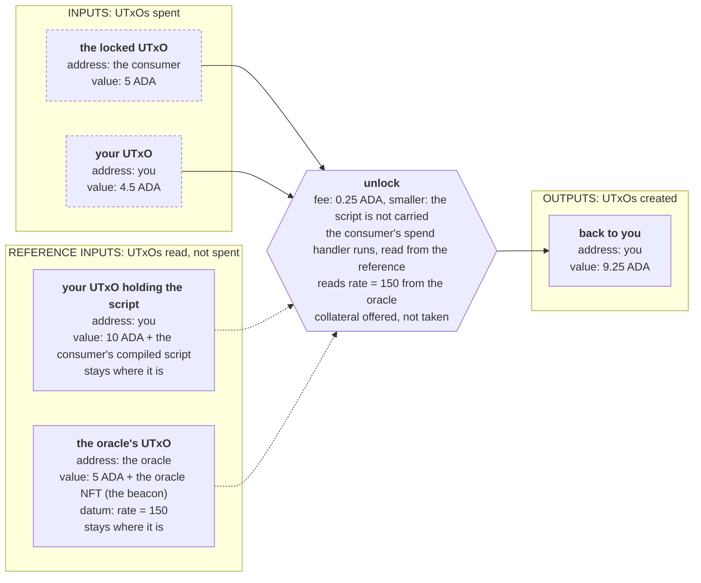
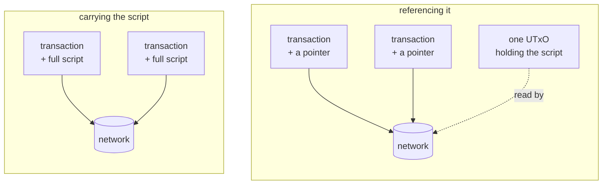
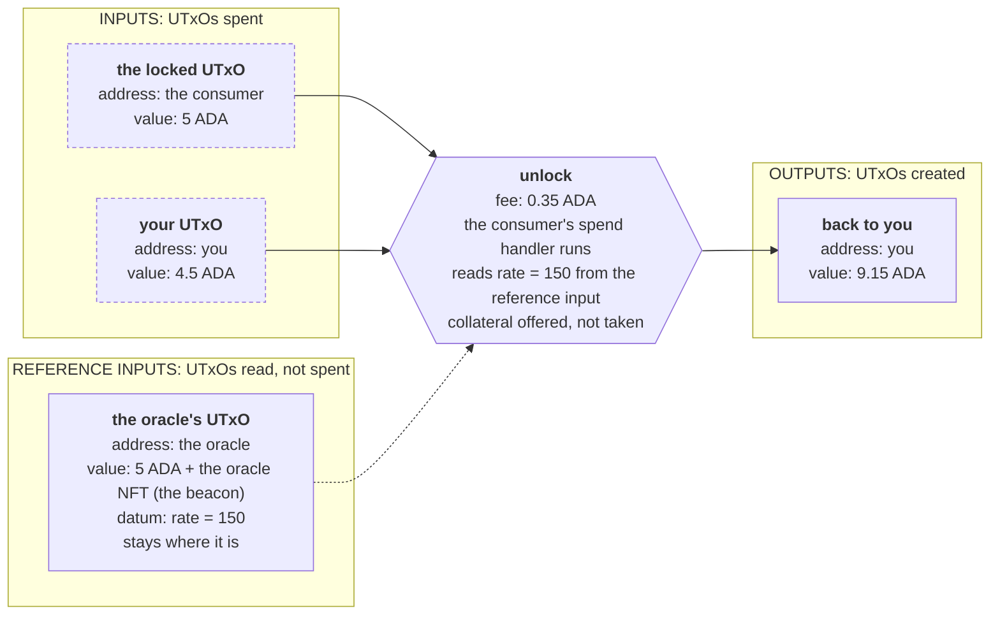

import Tabs from "@theme/Tabs";
import TabItem from "@theme/TabItem";
import CodeBlock from "@theme/CodeBlock";
import extractRegion from "@site/src/utils/extractRegion";
import ConsumerAiken from "!!raw-loader!@site/examples/onboarding/lectures/intermediate/oracle/on-chain/aiken/validators/consumer.ak";

# Reference inputs & reference scripts

Until now, a transaction could do only one thing with a UTxO: **spend** it. Take it, use it, destroy it. A transaction can also **point at a UTxO** without spending it. The UTxO stays exactly where it is. That single idea has two uses, and they have similar names:

- A **reference script** points at published **code**.
- A **reference input** points at published **data**.

You need both as soon as another contract wants to use the oracle from the last lecture.

## Reference scripts

### What it is

A reference script is a compiled contract that has been stored inside a UTxO on the chain. After you store it, a transaction can point at that UTxO instead of carrying its own copy of the contract.

The UTxO that holds the script is an ordinary one at **your own address**. The ADA inside it stays yours. Nothing about the contract changes: same code, same hash, same address, same answers.

An unlock that points at it:



### Why you need it

Every unlock you have built put the entire compiled contract **inside the transaction**, so that the network had the program to run. That works, but you pay for every byte you send. If you unlock a thousand times, you send the same contract a thousand times, and you pay for those bytes a thousand times.

A reference script sends it once.



### When to use it

Use one for any contract that will be spent more than a few times. The cost of publishing it is paid once, and every spend after that is smaller and cheaper.

Skip it for a contract you will run only once or twice. Publishing costs one transaction and locks a small amount of ADA in the UTxO that holds the script, and at very low volume the saving is smaller than that cost.

This is also the only sense in which a Cardano contract is "deployed", a point **[parameters](/docs/developers/onboarding/lectures/intermediate/parameters)** already made.

### What to watch out for

**Pointing at a script still costs something.** Each byte of the referenced script is charged, at a far lower price than carrying the script inside the transaction.

**The UTxO has to stay unspent.** It is an ordinary output that belongs to you, so nothing stops you from spending it. As soon as you do, every transaction that points at it stops working. Publish it, then leave it alone.

## Reference inputs

### What it is

A reference input is a UTxO that a transaction attaches only in order to **read** it. The UTxO stays where it is, and the validator can read its datum.

Inside the validator, referenced UTxOs arrive in their own field, `reference_inputs`, separate from the ones being spent. You met that field in **[the transaction context](/docs/developers/onboarding/lectures/intermediate/transaction-context)**.

An unlock at the consumer contract, with the oracle attached for reading:



### Why you need it

The oracle sits on the chain holding a rate, and another contract wants to know it. Spending the oracle to read it would destroy it at the moment it was read, and only one transaction per block could ever read it, because a UTxO can be spent only once.

With a reference input the oracle stays where it is, and any number of transactions can point at the same one at the same time.

### When to use it

Use one whenever many transactions have to read the same piece of data:

- A rate published by an oracle.
- A registry of members, or of approved tokens.
- A configuration UTxO that an admin updates and every other validator reads.

### What to watch out for

Pointing at a UTxO does not reserve it. Another transaction can still spend it, and an oracle update does exactly that: it spends the old UTxO and creates a new one.

So a transaction has to point at the **current** UTxO. If your app remembers an oracle UTxO from an hour ago and points at it, the transaction is rejected, because that UTxO no longer exists.

**Attaching a UTxO does not make it trustworthy either.** Whoever builds the transaction chooses what to attach, so a validator that reads the first reference input it is handed reads whatever the caller wants it to read. The oracle's beacon is the answer: the consumer searches the reference inputs for that token and reads only the UTxO that carries it.

## Side by side

|  | Reference script | Reference input |
|---|---|---|
| so that | transactions stay small | data can be read without being taken |
| it sits at | your own address | the publishing contract's address |
| the validator | runs unchanged: the ledger fetches its code from there | reads its datum, in `reference_inputs` |
| if that UTxO is spent | transactions pointing at it stop working | readers must point at the new one |

## Try it

**Write a second contract that reads the first one's data.**

### Write the consumer

<Tabs groupId="onchain">
<TabItem value="aiken" label="Aiken" default>

Everything below runs in the oracle project from the last lecture, because this contract reads `validators/oracle.ak`.

Create `validators/consumer.ak`. The imports first. The last line imports three things from your own oracle: the `AssetClass` type, the `Rate` it publishes, and `holds_beacon`, the function the oracle uses to recognize its own token. Both contracts ask the same function the same question, so both agree on which UTxO is the oracle.

<CodeBlock language="aiken" title="validators/consumer.ak">
  {extractRegion(ConsumerAiken, "consumer-imports")}
</CodeBlock>

Then the validator itself. It takes the beacon as a parameter, the way the oracle takes its own parameters, so the token it trusts is fixed in the code, and the caller cannot point it at a different one:

<CodeBlock language="aiken" title="validators/consumer.ak">
  {extractRegion(ConsumerAiken, "consumer")}
</CodeBlock>

`list.find` searches `self.reference_inputs` for the UTxO holding the beacon, so the transaction can attach as many others as it likes without changing the answer. `expect InlineDatum(published)` then reads the datum off that one, and the line after it confirms the datum is a `Rate`. Then the contract compares the rate.

Then three tests. All of them attach the oracle to `reference_inputs` rather than `inputs`, which is the whole difference between reading a UTxO and spending it:

<CodeBlock language="aiken" title="validators/consumer.ak">
  {extractRegion(ConsumerAiken, "consumer-tests")}
</CodeBlock>

```bash
aiken check
aiken build
```

`spend_fails_without_the_beacon` hands the contract a UTxO at the oracle's address, carrying a readable rate, that anybody could have created. The contract refuses to read it.

Open `plutus.json` and find `consumer.consumer.spend`. Compare its hash with ours:

```
33cb3703d1f936b0dfae5c346c549a550f5ce3e0bcffc7a38a33ee87
```

Like the oracle's, this is the script with its blank still in it.

**Then break it.** Delete the `reference_inputs` field from `tx_reading_oracle`, the helper all three tests use, and run `aiken check` again. `spend_ok_when_the_oracle_rate_is_positive` now **fails**: the validator can no longer find the oracle.

</TabItem>
<TabItem value="scalus" label="Scalus">

A [Scalus](https://scalus.org/) version is coming soon. The idea is identical, only the language differs.

</TabItem>
</Tabs>

Stuck? The finished code is in the playground. See the **[introduction](/docs/developers/onboarding/lectures/intermediate/introduction#the-playground)**.

### Then go and see the cost

Reference scripts and reference inputs both run in the oracle app from the last lecture. You closed that oracle, so publish a new one in step 3 first.

<Tabs groupId="offchain">
<TabItem value="mesh" label="Mesh" default>

Publishing the consumer's script and then unlocking through it is `oracle/off-chain/mesh/src/lib/reference-script.ts`. Reading a reference input is `oracle/off-chain/mesh/src/lib/reference-input.ts`, where `readOracle` is one call, `readOnlyTxInReference`, given a transaction hash and an output index.

Step 5 of the app publishes the script once. Step 6 locks some ADA at the consumer and offers two ways to unlock it: carrying the script, or pointing at the published one. Send one of each, while the oracle stays where it is.

</TabItem>
<TabItem value="evolution" label="Evolution">

An [Evolution](https://github.com/IntersectMBO/evolution-sdk) version is coming soon. The idea is identical, only the library calls differ.

</TabItem>
</Tabs>

Open both unlocks on the **[Cardano explorer for Preview](https://explorer.cardano.org/preview)** and compare their **size**. The one that carried the script is larger by the whole compiled consumer, and it paid for those bytes.

## You have finished the Intermediate track

You can write a validator, compile it, run it from an application, prove that it does what you say it does, and drive it from a page in a browser. You can also take an idea and turn it into a design. You do that by asking four questions: what has to be remembered, which actions are possible, what must be true for each one, and what breaks if a rule is missing.

Along the way you built a vault with an admin key and its own token, a deadline, a gift card, an oracle identified by a token that can only be created once, and a contract that reads that oracle's data without touching it.

Everything else is a larger version of these same parts. When the size grows, the mechanism does not change, but you need more care: the ways contracts get attacked, the patterns that prevent those attacks, and the cost of running them.

- The **[Tutorial](/docs/developers/onboarding/tutorial/overview)** builds an atomic swap from end to end, front end included.
- The handbook's **[security](/docs/developers/curriculum/smart-contracts/security)** page: read it before anything you write holds real funds.

## Go deeper

- [Reference inputs and reference scripts](/docs/developers/curriculum/fundamentals/core-concepts/transactions#reference-inputs-and-reference-scripts): both, inside a transaction's full structure.
- [Lock and Spend](/docs/developers/curriculum/smart-contracts/lock-and-spend#reference-scripts): deploying and consuming reference scripts in code.
- [Transaction fees](/docs/developers/curriculum/fundamentals/core-concepts/fees#reference-script-fees): what referencing a script actually costs.
- [Oracles](/docs/developers/curriculum/dapps/oracles/overview): reference inputs as the foundation of oracle design.
