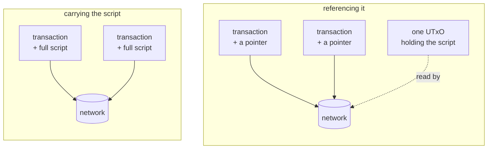

import Tabs from "@theme/Tabs";
import TabItem from "@theme/TabItem";
import CodeBlock from "@theme/CodeBlock";
import extractRegion from "@site/src/utils/extractRegion";
import ConsumerAiken from "!!raw-loader!@site/examples/onboarding/lectures/intermediate/oracle/on-chain/aiken/validators/consumer.ak";

# Reference inputs & reference scripts

Until now, a transaction could do only one thing with a UTxO: **spend** it. Take it, use it, destroy it.

A transaction can also **point at a UTxO** without spending it. The UTxO stays exactly where it is.

That single idea has two uses, and they have confusingly similar names:

- A **reference script** points at published **code**.
- A **reference input** points at published **data**.

They solve two different problems. Both problems appear as soon as you have the oracle from the last lecture and you want other contracts to use it. Take them one at a time.

## Reference scripts

### What it is

A reference script is a compiled contract that has been stored inside a UTxO on the chain. After you store it, a transaction can point at that UTxO instead of carrying its own copy of the contract.

The UTxO that holds the script is an ordinary one at **your own address**. The ADA inside it stays yours. Nothing about the contract changes: same code, same hash, same address, same answers.

### Why you need it

Look back at every unlock you have built. Each one put the entire compiled contract **inside the transaction**, so that the network had the program to run.

That works, but you pay for every byte you send. If you unlock a thousand times, you send the same contract a thousand times, and you pay for those bytes a thousand times.

A reference script sends it once.



### When to use it

Use one for any contract that will be spent more than a few times. The cost of publishing it is paid once, and every spend after that is smaller and cheaper.

Skip it for a contract you will run twice and throw away. Publishing costs one transaction, and it locks a small amount of ADA in the UTxO that holds the script. At very low volume, that is not worth the trouble.

This is also the only sense in which a Cardano contract is "deployed", a point **[parameters](/docs/developers/onboarding/lectures/intermediate/parameters)** already made.

### What to watch out for

**Pointing at a script is not free.** The bytes still cost a small amount each. The cost is far lower than putting the whole script into every transaction, but it is not zero.

**The UTxO has to stay unspent.** It is an ordinary output that belongs to you, so you are able to spend it. As soon as you spend it, every transaction that points at it stops working. Publish it, then leave it alone.

## Reference inputs

### What it is

A reference input is a UTxO that a transaction attaches only in order to **read** it. The transaction does not spend it. The UTxO stays where it is, and the validator can read its datum.

Inside the validator, referenced UTxOs arrive in their own field, `reference_inputs`, separate from the ones being spent. You met that field in **[the transaction context](/docs/developers/onboarding/lectures/intermediate/transaction-context)**.

The contract you write at the end of this lecture reads the oracle that way. It reads the datum of a UTxO that the transaction attached for it, and the oracle does not know that this second contract exists.

### Why you need it

Go back to the oracle. It sits on the chain holding a price, and another contract wants to know that price.

So far, the only way you have had to bring a UTxO into a transaction is to spend it. Spending the oracle would be a serious problem. The oracle would disappear at the moment it was read, and only one contract per block could ever read it, because a UTxO can only be spent once.

A reference input solves both. The oracle stays where it is, and any number of transactions can point at the same one at the same time.

### When to use it

Use one whenever many transactions have to read the same piece of data:

- A price published by an oracle.
- A registry of members, or of approved tokens.
- A configuration UTxO that an admin updates and every other validator reads.

If a contract needs to **know** something that lives in another UTxO, but has no business **taking** that UTxO, use a reference input.

### What to watch out for

Pointing at a UTxO does not reserve it. Another person's transaction can still spend it, and an oracle update does exactly that: it spends the old UTxO and creates a new one.

So a contract must always point at the UTxO that is **current**, and not at one that an app stored earlier. If your app remembers an oracle UTxO from an hour ago and points at it, the transaction is rejected, because that UTxO no longer exists.

## Which one do I need?

A reference script is invisible to the validator: the contract runs exactly as it always did, and only the transaction that calls it is built differently.

|  | Reference script | Reference input |
|---|---|---|
| points at | published **code** | published **data** |
| so that | transactions stay small | data can be read without being taken |
| the UTxO holds | the compiled contract | a datum |
| it sits at | your own address | the publishing contract's address |
| the validator | never sees it | reads it, in `reference_inputs` |
| if that UTxO is spent | transactions pointing at it stop working | readers must point at the new one |

## Try it

**Write a second contract that reads the first one's data.** It is the shortest in the track.

### Write the consumer

<Tabs groupId="onchain">
<TabItem value="aiken" label="Aiken" default>

Everything below runs in the same project as the last three lectures. This contract reads the oracle you wrote in the last lecture, so `validators/oracle.ak` has to be there already.

Create `validators/consumer.ak`. The imports first. The last line is the interesting one: this contract imports `OracleDatum` from your own oracle, because it has to know the shape of the datum it is about to read.

<CodeBlock language="aiken" title="validators/consumer.ak">
  {extractRegion(ConsumerAiken, "consumer-imports")}
</CodeBlock>

Then the validator itself, whose body is three lines:

<CodeBlock language="aiken" title="validators/consumer.ak">
  {extractRegion(ConsumerAiken, "consumer")}
</CodeBlock>

`input_inline_datum`, from `cocktail`, reads the datum off the UTxO the transaction attached to `self.reference_inputs`. Then the contract compares the price, with no call and no direct connection to the oracle.

Then two tests. Both attach the oracle as a reference input with `ref_tx_in`, which is the test-side twin of `tx_in`. The only difference between the two tests is the price in that datum:

<CodeBlock language="aiken" title="validators/consumer.ak">
  {extractRegion(ConsumerAiken, "consumer-tests")}
</CodeBlock>

```bash
aiken check
aiken build
```

Open `plutus.json` and find `consumer.consumer.spend`. Compare its hash with ours:

```
451d79ec8b1a4be9bd4006a0abb63afb75354667586ffdefe244355e
```

**Then break it.** Delete the `ref_tx_in(...)` line from `tx_reading_oracle`, the helper both tests use, and run `aiken check` again. `spend_ok_when_the_oracle_price_is_positive` now **fails**: the validator can no longer find the oracle. A contract that depends on referenced data refuses when that data is missing.

</TabItem>
<TabItem value="scalus" label="Scalus">

A [Scalus](https://scalus.org/) version is coming soon. The idea is identical, only the language differs.

</TabItem>
</Tabs>

Stuck? The finished code is in the playground. See the **[introduction](/docs/developers/onboarding/lectures/intermediate/introduction#the-playground)**.

### Then go and see the cost

Open the **[Cardano explorer for Preview](https://explorer.cardano.org/preview)**, find any **unlock** transaction you have sent, from your own app in lecture 9 or from the [playground](/docs/developers/onboarding/lectures/intermediate/introduction#the-playground), and look at its **size**. The compiled contract is inside that transaction, and you paid for those bytes. A reference script removes those bytes from every future spend.

The off-chain code for each feature lives with the contract it belongs to.

<Tabs groupId="offchain">
<TabItem value="mesh" label="Mesh" default>

Deploying a reference script and then spending through it is the vault's code, in `vault/off-chain/mesh/src/lib/reference-script.ts`. Reading a reference input is the oracle's code, in `oracle/off-chain/mesh/src/lib/reference-input.ts`. Both files are type-checked, and they use the same calls you wrote in **[frontend integration](/docs/developers/onboarding/lectures/intermediate/frontend-integration)**.

</TabItem>
<TabItem value="evolution" label="Evolution">

An [Evolution](https://github.com/IntersectMBO/evolution-sdk) version is coming soon. The idea is identical, only the library calls differ.

</TabItem>
</Tabs>

## You have finished the Intermediate track

You can write a validator, compile it, run it from an application, prove that it does what you say it does, and drive it from a page in a browser. You can also take an idea and turn it into a design. You do that by asking four questions: what has to be remembered, which actions are possible, what must be true for each one, and what breaks if a rule is missing.

Along the way you built a vault with an admin key and its own token, a deadline, a gift card, an oracle, and a contract that reads another contract's data.

Everything else is a larger version of these same parts. When the size grows, the mechanism does not change, but you need more care: the ways contracts get attacked, the patterns that prevent those attacks, and the cost of running them.

- The **[Tutorial](/docs/developers/onboarding/tutorial/overview)** builds an atomic swap from end to end, front end included.
- The handbook's **[security](/docs/developers/curriculum/smart-contracts/security)** page is the best thing to read next, and the most valuable one to read before anything you write holds real funds.

## Go deeper

- [Reference inputs and reference scripts](/docs/developers/curriculum/fundamentals/core-concepts/transactions#reference-inputs-and-reference-scripts): both, inside a transaction's full structure.
- [Lock and Spend](/docs/developers/curriculum/smart-contracts/lock-and-spend#reference-scripts): deploying and consuming reference scripts in code.
- [Transaction fees](/docs/developers/curriculum/fundamentals/core-concepts/fees#reference-script-fees): what referencing a script actually costs.
- [Oracles](/docs/developers/curriculum/dapps/oracles/overview): reference inputs as the foundation of oracle design.
