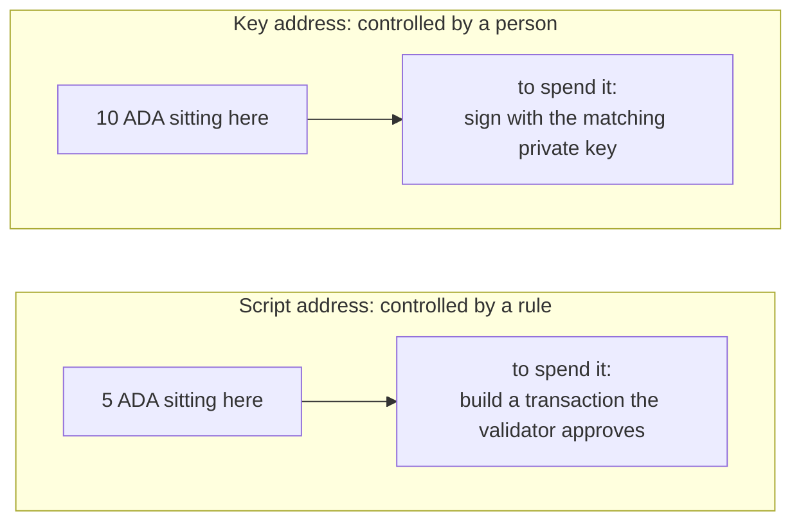
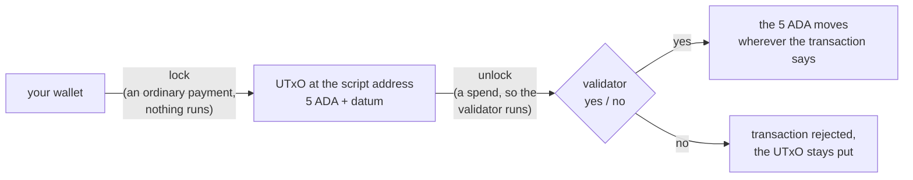

import Tabs from "@theme/Tabs";
import TabItem from "@theme/TabItem";

# What a validator is

A smart contract on Cardano is a **validator**: a small function the network runs when a transaction tries to do something that validator guards. Spending a **locked** UTxO is the most common case, and the one this lecture uses. Minting is another, and your vault gains that purpose in **[validator purposes](/docs/developers/onboarding/lectures/intermediate/validator-purposes)**. It looks at the transaction and returns exactly one thing, **yes (true)** or **no (false)**. If it says yes, the action is allowed. If it says no, the whole transaction is rejected and nothing it was trying to do takes place.

Here is the part that surprises people: **a validator never moves funds.** Think of it as a **guard at a door** rather than a program that holds money and pays it out. A guard does not carry anything in or out. They stand at one door, look at each person who arrives, and say "yes, you may pass" or "no". Everything that happens on the other side of the door is done by somebody else. It works the same way here. The value is moved by the **transaction**, which your off-chain code built, and the validator only approves it.

So a validator is defined by what it **refuses**. A guard who lets everyone through is not guarding anything. Writing a contract means choosing the cases where you say no.

## One contract, several validators

"A smart contract" does not always mean *one* validator. A real application often uses several. Each one protects its own thing, and each one judges the same transaction on its own, without ever calling the others.

What ties them together is a single rule: **every validator the transaction triggers has to say yes.** One no anywhere, and the whole transaction is rejected. That is how contracts cooperate on Cardano, by each making its own demand of the same transaction.

Our examples use a single validator for now. **[Multi validators](/docs/developers/onboarding/lectures/intermediate/multi-validators)** shows one script guarding two different actions at once, and **[reference inputs](/docs/developers/onboarding/lectures/intermediate/reference-inputs-and-scripts)** shows two separate contracts working together.

## Where the locked funds live

Remember from Beginner that a [UTxO](/docs/developers/onboarding/lectures/beginner/utxos-and-transactions) (a "sealed bag") always sits at an **[address](/docs/developers/onboarding/lectures/beginner/wallets-keys-addresses)**. Most of the addresses you have used belong to a person. These are **key addresses**, and whoever holds the matching private key can spend what is there.

You have already met the other kind. When Bob locked 5 ADA behind a native script in [Native scripts & metadata](/docs/developers/onboarding/lectures/beginner/native-scripts-and-metadata), the funds went to a **script address**, controlled by a **rule** instead of a person. A validator uses the same kind of address. The only difference is how complex the rule is allowed to be.



Both hold ordinary UTxOs, with the same ADA and tokens, on the same explorer page. The only difference is what it takes to open them. A key address asks _"is this signed by the right key?"_. A script address asks _"does the validator say yes?"_. A script address has no key, no recovery phrase, and nobody who can give permission. Even the person who wrote the contract has to satisfy the rule like everyone else.

Where does that address come from? From the validator itself, using the same hashing you saw there. You hash the compiled contract, and that fingerprint becomes the address. Change one character of the contract and you get a completely different address, guarding completely different funds. You will do exactly this, in three calls, in **[validator purposes](/docs/developers/onboarding/lectures/intermediate/validator-purposes)**.

## Locking is just a payment

Here is the part that catches almost everyone out: **the contract does not run when you lock funds.**

Sending ADA to a script address is an **ordinary payment**. Your wallet does not know or care that the recipient is a script. The network runs nothing, because there is nothing to approve. The UTxO simply arrives and sits there, with a note attached to it. That note is the **datum**, and it has [a lecture of its own](/docs/developers/onboarding/lectures/intermediate/datum-and-redeemer) next. The contract does not run at all.

It runs only when someone tries to **spend** that UTxO. At that moment the network takes the validator, gives it the transaction, and asks its one question.



So a validator only checks funds on the way **out**, never on the way in. Anyone can send funds in, even by mistake, and nothing checks them. Taking them out is the only guarded step. This matters more than it first appears, and it is the shape of every contract in this track. You lock first, and all the interesting logic happens at the spend.

## What the validator sees

A validator guarding a locked UTxO is a function of three things:

```
validator(datum, redeemer, context) -> True | False
```

- **datum** the information attached to the locked UTxO,
- **redeemer** what the spender provides when unlocking,
- **context** the whole transaction around it.

In code you will see **four** arguments rather than three, because the context arrives in two pieces: the transaction, and a pointer to the exact UTxO being spent. The idea is still these three.

It is **handed** nothing else. No network access, no clock, no storage, and nothing about the world beyond what it is given. **[On-chain vs off-chain](/docs/developers/onboarding/lectures/intermediate/on-chain-vs-off-chain)** explained why. The next two lectures cover all three in detail, and then [Parameters](/docs/developers/onboarding/lectures/intermediate/parameters) adds the one route that does not go through this list at all. For now, remember the shape: **information in, one yes or no out.**

:::warning A validator is only as good as what it refuses
Think about the two simplest validators possible, and you will see the full range you are working in:

- **Always true** returns `True` no matter what, so **anyone** can spend the funds, for any reason, at any time.
- **Always false** returns `False` no matter what, so **nobody** can ever spend them. The funds are **permanently unspendable**: not by you, not by the person who locked them, not by anyone, ever.

Real people have shipped both of these by mistake. A contract that always passes gives the funds away to whoever asks first. A contract that always fails means nobody can ever move them ([locked value](/docs/developers/curriculum/smart-contracts/security#locked-value) in the handbook). Neither mistake can be undone. Real validators sit between these two and say yes only when specific conditions are met. This is also why you test the vault in **[testing](/docs/developers/onboarding/lectures/intermediate/testing)**, and why those tests are mostly about what it refuses.
:::

## Try it

**Write both extremes and compile them.** You write one file and change one word in it, so you see the pair from the box above: the validator that always says yes, and the one that always says no.

<Tabs groupId="onchain">
<TabItem value="aiken" label="Aiken" default>

Everything below runs from `on-chain/vault/`, where lecture 2 left you.

Now the contract itself: the smallest one that compiles, and it says yes to everything. Create the file `validators/vault.ak` and put this in it. Copy it as it is: **[datum & redeemer](/docs/developers/onboarding/lectures/intermediate/datum-and-redeemer)** explains the arguments, and **[validator purposes](/docs/developers/onboarding/lectures/intermediate/validator-purposes)** explains the `else` block.

```aiken title="validators/vault.ak"
validator vault {
  spend(_datum: Option<Data>, _redeemer: Data, _own_ref, _self) {
    True
  }

  else(_) {
    fail
  }
}
```

`validator vault` names the script. `spend` is the handler that runs when someone tries to spend a locked UTxO. The underscore in front of each name means "given, but not used here", so this contract ignores everything it is handed.

Four arguments, three ideas. `_datum` and `_redeemer` are the first two from the list above. The context is the other two together: `_own_ref` points at the UTxO being spent, and `_self` is the whole transaction. What is inside it is the subject of **[the transaction context](/docs/developers/onboarding/lectures/intermediate/transaction-context)**.

The body is the entire rule: `True`, yes to everybody.

```bash
aiken check
```

It compiles. Now change `True` to `False` and run it again. The result is **identical**: no error, no warning. Both are valid contracts. One gives the funds to whoever asks first, the other locks them away from everyone forever, and the compiler has no opinion about either. Only you decide what your contract refuses.

Put `True` back, and compile it for real:

```bash
aiken build
```

**Check you wrote the same contract.** That build wrote a file called `plutus.json`, which the next section goes through. Open it and find the `hash` under the `validators` list. Compare it with ours:

```
d27ccc13fab5b782984a3d1f99353197ca1a81be069941ffc003ee75
```

If it matches, your validator compiles to exactly the same script as ours, byte for byte, which means the same address. If it does not, something in the file differs from the code above, so copy it again. Make sure `True` is back in place, because the `False` version compiles just as happily and gives a different hash.

</TabItem>
<TabItem value="scalus" label="Scalus">

A [Scalus](https://scalus.org/) version is coming soon. The idea is identical, only the language differs.

</TabItem>
</Tabs>

Stuck? The finished code is in the playground. See the **[introduction](/docs/developers/onboarding/lectures/intermediate/introduction#the-playground)**.

## What compiling produced

Compiling wrote **`plutus.json`**, next to `aiken.toml`. This is the **blueprint**: the compiled contract, described in a format every Cardano language shares. Your off-chain code reads this file and turns it into an address, which you will see done in **[frontend integration](/docs/developers/onboarding/lectures/intermediate/frontend-integration)**.

Open it. Four things are inside:

- **`preamble`:** who built it, with which compiler, and which Plutus version (`v3` here).
- **`validators[]`:** one entry per **purpose**, titled `file.validator.purpose`. Yours has two, `vault.vault.spend` and `vault.vault.else`, and they share one `hash`. That hash is the fingerprint from earlier in this lecture: the contract's identity, and the value its address is built from. Why one script has several entries under it is the subject of **[validator purposes](/docs/developers/onboarding/lectures/intermediate/validator-purposes)**.
- **`compiledCode`:** the actual program, as a hex string. This is the **only** part the network ever runs. It is a low-level language called UPLC, and every contract language compiles down to it.
- **`definitions`:** the shapes of your datum and redeemer types, which is [the next lecture](/docs/developers/onboarding/lectures/intermediate/datum-and-redeemer). Right now they are just `Data`, because your validator accepts anything.

Notice what is **not** in there: the address. It is built from the hash, and it depends on which network you are on.

## Go deeper

- [Write a Validator](/docs/developers/curriculum/smart-contracts/write-a-validator): the gatekeeper model, with real validator code.
- [Smart Contracts (overview)](/docs/developers/curriculum/smart-contracts/overview): "validators, not actors."
- [Addresses](/docs/developers/curriculum/fundamentals/core-concepts/addresses): key addresses, script addresses, and how each one is built.
- [Smart contract security](/docs/developers/curriculum/smart-contracts/security#locked-value): the "locked value" section, on what actually happens when a validator can never say yes.

Next: **[Datum & redeemer](/docs/developers/onboarding/lectures/intermediate/datum-and-redeemer)**.
