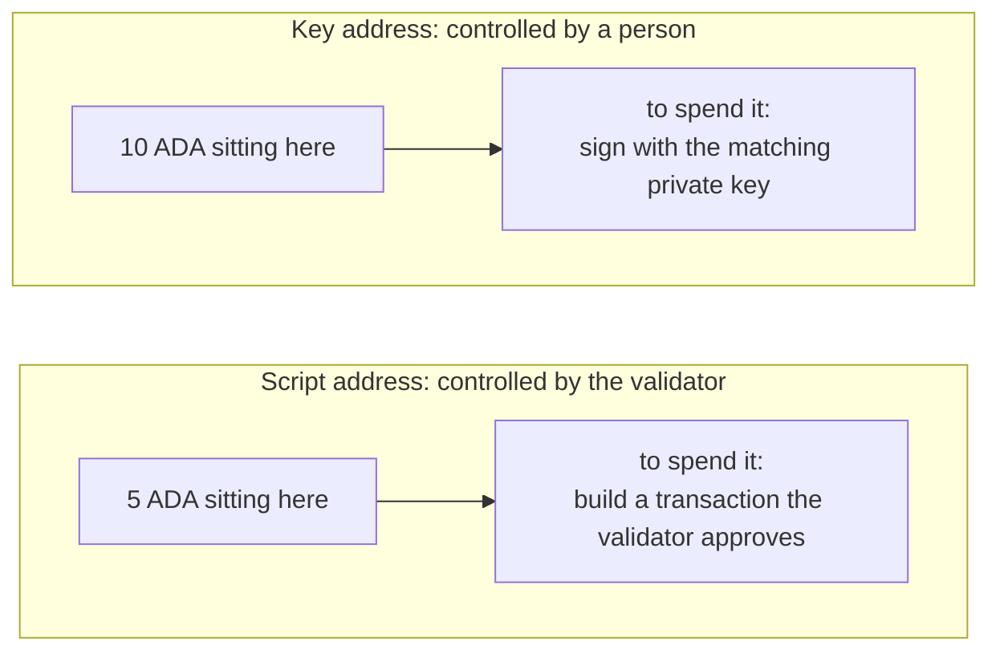
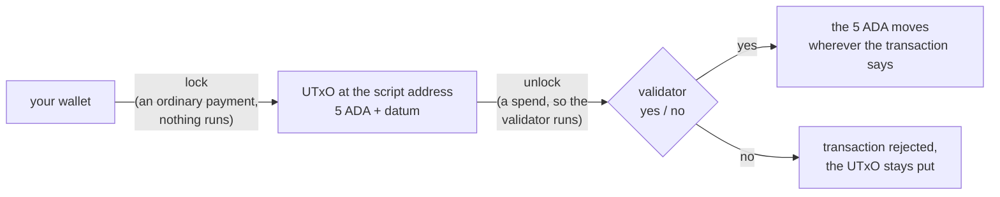

import Tabs from "@theme/Tabs";
import TabItem from "@theme/TabItem";

# What a validator is

The simplest smart contract on Cardano is a **validator**: a small function the network runs when a transaction tries to do something that validator guards. Spending a **locked** UTxO is the most common case, and the one this lecture uses. Minting is another, and your vault gains that purpose in **[validator purposes](/docs/developers/onboarding/lectures/intermediate/validator-purposes)**. It looks at the transaction and returns exactly one thing, **yes (true)** or **no (false)**. If it says yes, the action is allowed. If it says no, the whole transaction is rejected.

**A validator never moves funds.** Think of it as a **guard at a door** rather than a program that holds money and pays it out. They stand at one door, look at each person who arrives, and say "yes, you may pass" or "no". Everything that happens on the other side of the door is done by somebody else. The value is moved by the **transaction**, which your off-chain code built, and the validator only approves it.

So a validator is defined by what it **refuses**. A guard who lets everyone through is not guarding anything. Writing a contract means choosing the cases where you say no.

## One contract, several validators

"A smart contract" does not always mean *one* validator. A real application often uses several. Each one protects its own thing, and each one judges the same transaction on its own, without ever calling the others.

What ties them together is a single rule: **every validator the transaction triggers has to say yes.** If a single validator rejects it, the whole transaction is rejected. That is how contracts cooperate on Cardano, by each making its own demand of the same transaction.

Our examples use a single validator for now. **[Multi validators](/docs/developers/onboarding/lectures/intermediate/multi-validators)** shows one script guarding two different actions at once, and **[reference inputs](/docs/developers/onboarding/lectures/intermediate/reference-inputs-and-scripts)** shows two separate contracts working together.

## Where the locked funds live

Remember from Beginner that a [UTxO](/docs/developers/onboarding/lectures/beginner/utxos-and-transactions) (a "sealed bag") always sits at an **[address](/docs/developers/onboarding/lectures/beginner/wallets-keys-addresses)**. Most of the addresses you have used belong to a person. These are **key addresses**, and whoever holds the matching private key can spend what is there.

You met the other kind when Bob locked 5 ADA behind a native script in [Native scripts & metadata](/docs/developers/onboarding/lectures/beginner/native-scripts-and-metadata): the funds went to a **script address**, controlled by **a set of rules** instead of a person. A validator uses the same kind of address. The only difference is how complex the rules can be. Validators allow for arbitrarily complex logic (as long as you're within the transaction's budget).



Both hold ordinary UTxOs, with the same ADA and tokens, on the same explorer page. A script address has no key. Even the person who wrote the contract has to satisfy the rule like everyone else.

That address comes from the validator itself, using the same hashing you saw there. You hash the compiled contract, and use that fingerprint to derive the address. Change one character of the contract, and you get a completely different address that guards completely different funds. You will do exactly this in **[validator purposes](/docs/developers/onboarding/lectures/intermediate/validator-purposes)**.

## Locking is just a payment

**The validator does not run when you lock funds (create a UTxO in its address).**

Sending ADA to a script address is an **ordinary payment**. Your wallet does not know or care that the recipient is a script. The UTxO simply arrives and sits there, with a note attached to it. That note is the **datum**, and it has [a lecture of its own](/docs/developers/onboarding/lectures/intermediate/datum-and-redeemer) next.

It runs only when someone tries to **spend** that UTxO. At that moment the network takes the validator, gives it the transaction, and asks its one question.



So a validator only checks funds on the way **out**, never on the way in. That's why it's called a "spending validator" (we'll explain more in the [purposes](/docs/developers/onboarding/lectures/intermediate/validator-purposes) lecture). Anyone can send funds in, even by mistake, and nothing checks them.

## What the validator sees

A validator guarding a locked UTxO is a function of three things:

```
validator(datum, redeemer, context) -> True | False
```

- **datum** the information attached to the locked UTxO,
- **redeemer** what the spender provides when unlocking,
- **context** the whole transaction around it.

Depending on the language you choose to write your validators in, you can see more or fewer arguments.

The validator cannot access anything else. **[On-chain vs off-chain](/docs/developers/onboarding/lectures/intermediate/on-chain-vs-off-chain)** explained why. The next lectures cover all three inputs in detail, and then [Parameters](/docs/developers/onboarding/lectures/intermediate/parameters) adds a way to hardcode values directly into the validator.

:::warning A validator is only as good as what it refuses
Think about the two simplest validators possible:

- **Always true** returns `True` no matter what, so **anyone** can spend the funds, for any reason, at any time.
- **Always false** returns `False` no matter what, so **nobody** can ever spend them. The funds are **permanently unspendable**: not by you, not by the person who locked them, not by anyone, ever.

Real people have shipped both of these by mistake, and neither can be undone ([locked value](/docs/developers/curriculum/smart-contracts/security#locked-value) in the handbook). Real validators sit between these two and say yes only when specific conditions are met. This is also why you test the vault in **[testing](/docs/developers/onboarding/lectures/intermediate/testing)**, and why those tests are mostly about what it refuses.
:::

## Try it

**Write both extremes and compile them.** You write one file and change one word in it, so you see the pair from the box above.

<Tabs groupId="onchain">
<TabItem value="aiken" label="Aiken" default>

Everything below runs inside `on-chain/vault/`, where lecture 2 left you.

Now the contract itself: the smallest one that compiles, and it says yes to everything. Create the file `validators/vault.ak` and put this in it. Copy it as it is: **[datum & redeemer](/docs/developers/onboarding/lectures/intermediate/datum-and-redeemer)** explains the arguments, and **[validator purposes](/docs/developers/onboarding/lectures/intermediate/validator-purposes)** explains the `else` block.

```aiken title="validators/vault.ak"
validator vault {
  spend(_datum: Option<Data>, _redeemer: Data, _own_ref, _self) {
    True
  }

  else(_) {
    fail
  }
}
```

`validator vault` names the script. `spend` is a **handler**: a block inside the validator that runs for one kind of action. This one runs when someone tries to spend a locked UTxO. A validator can hold several, one per action it guards, and **[validator purposes](/docs/developers/onboarding/lectures/intermediate/validator-purposes)** is where you add a second. The underscore in front of each argument name means "given, but not used here", so this contract ignores everything it is handed.

`_datum` and `_redeemer` are the first two from the list above. `_own_ref` points at the UTxO being spent, and `_self` is the whole transaction context. What is inside it is the subject of **[the transaction context](/docs/developers/onboarding/lectures/intermediate/transaction-context)**.

The body is the entire rule: `True`, yes to everybody.

Run in your terminal:
```bash
aiken check
```

It type-checks. Now change `True` to `False` and run it again. The result is **identical**: no error, no warning. Both are valid contracts.

Put `True` back, and compile it for real:

```bash
aiken build
```

**Check you wrote the same contract.** That build wrote a file called `plutus.json`, which the next section goes through. Open it and find the `hash` under the `validators` list. Compare it with ours:

```
d27ccc13fab5b782984a3d1f99353197ca1a81be069941ffc003ee75
```

If it matches, your validator compiles to exactly the same script as ours, byte for byte, which means the same address. If it does not, something in the file differs from the code above, so copy it again. Make sure `True` is back in place, because the `False` version compiles just as happily and gives a different hash.

</TabItem>
<TabItem value="scalus" label="Scalus">

A [Scalus](https://scalus.org/) version is coming soon. The idea is identical, only the language differs.

</TabItem>
</Tabs>

Stuck? The finished code is in the playground. See the **[introduction](/docs/developers/onboarding/lectures/intermediate/introduction#the-playground)**.

## What compiling produced

Compiling wrote **`plutus.json`**. This is the **blueprint**: the compiled contract, described in a format all Cardano languages share. Your off-chain code reads this file and turns it into an address, which you will see done in **[frontend integration](/docs/developers/onboarding/lectures/intermediate/frontend-integration)**.

Open it. Four things are inside:

- **`preamble`:** who built it, with which compiler, and which Plutus version.
- **`validators[]`:** one entry per **purpose**, titled `file.validator.purpose`. Yours has two, `vault.vault.spend` and `vault.vault.else`, and they share one `hash`. That hash is the fingerprint from earlier in this lecture: the contract's identity, and the value its address is built from. Why one script has several entries under it is the subject of **[validator purposes](/docs/developers/onboarding/lectures/intermediate/validator-purposes)**.
- **`compiledCode`:** the actual program, as a hex string. This is the **only** part the network ever runs. It is a low-level language called UPLC, and every contract language compiles down to it.
- **`definitions`:** the shapes of your datum and redeemer types, which is [the next lecture](/docs/developers/onboarding/lectures/intermediate/datum-and-redeemer). Right now they are just `Data`, because your validator accepts anything.

Notice what is **not** in there: the address. It is built from the hash and depends on other factors, like which network (testnet or mainnet) you're using.

## Go deeper

- [Write a Validator](/docs/developers/curriculum/smart-contracts/write-a-validator): the gatekeeper model, with real validator code.
- [Smart Contracts (overview)](/docs/developers/curriculum/smart-contracts/overview): "validators, not actors."
- [Addresses](/docs/developers/curriculum/fundamentals/core-concepts/addresses): key addresses, script addresses, and how each one is built.
- [Smart contract security](/docs/developers/curriculum/smart-contracts/security#locked-value): the "locked value" section, on what actually happens when a validator can never say yes.

Next: **[Datum & redeemer](/docs/developers/onboarding/lectures/intermediate/datum-and-redeemer)**.
