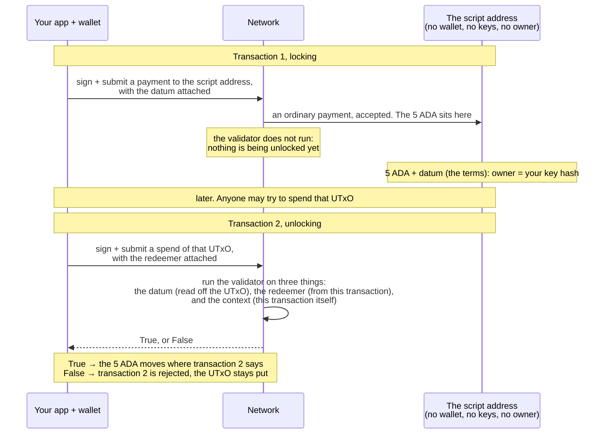

import Tabs from "@theme/Tabs";
import TabItem from "@theme/TabItem";
import CodeBlock from "@theme/CodeBlock";
import extractRegion from "@site/src/utils/extractRegion";
import VaultSimple from "!!raw-loader!@site/examples/onboarding/lectures/intermediate/vault/on-chain/aiken/validators/vault_simple.ak";

# Datum & redeemer

[Last lecture](/docs/developers/onboarding/lectures/intermediate/what-is-a-validator) said a validator is a function of **datum**, **redeemer**, and **context**. The validator you wrote ignores all three. This lecture is about the first two, which are how you give information to a contract. They are also the part newcomers most often confuse, so they are worth explaining carefully.

- The **datum** is information **attached to the locked UTxO** when you lock it. These are the _terms_. Think of it as a note that says "this is locked under these conditions". It is fixed the moment the funds are locked and never changes.
- The **redeemer** is what the **spender provides** when they try to unlock. It is their _choice_ for this attempt, and it is supplied fresh in the spending transaction.
- The **context** is the rest of the transaction: its inputs, outputs, signatures, and the validity window from [Time on Cardano](/docs/developers/onboarding/lectures/beginner/time-on-cardano). The validator can read all of it. There is enough of it to fill [the next lecture](/docs/developers/onboarding/lectures/intermediate/transaction-context) on its own, so this one is about the first two.

Imagine you leave a bag with someone for safe keeping. That bag is a **UTxO**. When you hand it over, they attach a note that says "give this back only to the person holding ticket 42". That note stays with the bag, and it is the **datum**. Later somebody arrives and says what they want: "I am here to collect the bag." That request is the **redeemer**. The note alone decides nothing, and the request alone decides nothing. The decision needs both together, plus the situation they arrive in, which is the context.

So: **datum is what was set at lock time, and redeemer is what the spender says now.** Add the context, and the validator considers all three and returns yes or no.



Two transactions, and only the second one is judged. Everything the **datum** says was settled in
transaction 1, by whoever locked the funds, and it cannot be changed now. Everything the **redeemer**
says is what the spender brings today, in transaction 2. The validator's whole job is to check the
second against the first, in the situation the context describes.

## A tiny example

Our example contract is a **vault**. It locks some funds so that only their owner can take them back. The datum names the **owner**, and the redeemer is the **action** the spender is taking. Here there is only one action, `Unlock`. Here are those two types on-chain:

<Tabs groupId="onchain">
<TabItem value="aiken" label="Aiken" default>

<CodeBlock language="aiken" title="vault.ak: the datum and redeemer types">
  {extractRegion(VaultSimple, "types")}
</CodeBlock>

Read it as two shapes being declared:

- `VaultDatum` has a single field, `owner`, of type `VerificationKeyHash`. That is a **public key hash**, the short fingerprint of a public key. Native scripts used the same thing to name a signer back in [Native scripts & metadata](/docs/developers/onboarding/lectures/beginner/native-scripts-and-metadata). It says who must sign, but it is not a key itself.
- `VaultAction` has a single choice, `Unlock`. A larger contract would list several, such as `Unlock`, `Cancel` and `Extend`, and the validator would check which one the spender chose.

</TabItem>
<TabItem value="scalus" label="Scalus">

A [Scalus](https://scalus.org/) version is coming soon. The idea is identical, only the language differs.

</TabItem>
</Tabs>

## How those shapes are stored

Those two declarations look like ordinary types, but they describe **bytes on the chain**, and it is worth knowing what those bytes are before anything has to produce them.

On-chain data is stored as a **numbered constructor plus a list of fields**. The number answers "which choice of the type is this?" and the list answers "what does it hold?". The number is assigned by position: the first choice declared is 0, the next is 1, and so on. Neither of our types offers a choice yet, since `VaultDatum` has one shape and `VaultAction` has one action, so both are constructor **0**: `VaultDatum { owner }` is constructor 0 carrying one field, and `Unlock` is constructor 0 carrying nothing.

The number only starts to matter once a type offers a real choice. Had `VaultAction` listed the three actions mentioned above, they would be numbered in the order they are declared:

```aiken
pub type VaultAction {
  Unlock    // constructor 0
  Cancel    // constructor 1
  Extend    // constructor 2
}
```

That numbering is the contract's half of an agreement. Something has to build the same bytes from the other side, and nothing checks that the two agree: send constructor 1 when you meant `Unlock` and the validator reads `Cancel`, and acts on it. Writing that other half is what **[frontend integration](/docs/developers/onboarding/lectures/intermediate/frontend-integration)** does, once the contract has stopped changing shape. You will meet a real two-choice redeemer before then, in [Parameters](/docs/developers/onboarding/lectures/intermediate/parameters), where the vault gains a second action.

:::warning A wrong datum can't be undone
The chain does not check that your datum matches what the validator expects. It stores whatever bytes you attach. If you get the shape wrong, with the wrong constructor number, the wrong number of fields, or the fields in the wrong order, the mistake is not caught at lock time, because the contract does not run when you lock. It is caught later, when the validator tries to read the datum, **fails**, and answers no. Every time, for everyone.

The funds are then permanently unspendable. There is no way to undo it and nobody who can help. This is one of the common ways people lose funds on Cardano. It is why the matching above needs care, and why the vault gets a full set of tests in **[testing](/docs/developers/onboarding/lectures/intermediate/testing)**.
:::

## Where the datum actually lives

There are two ways to attach a datum to an output, and it helps to know which one you are using:

- **Inline**: the whole datum is written into the output itself, visible on the chain. This is what our example does. The lock writes the datum into the output, and the spend only has to say that it is already there, so no copy is needed.
- **By hash**: the output stores only a **hash** of the datum. Whoever spends it must supply the matching datum in their transaction. The output is smaller, but the spender must have kept the datum somewhere, and it is not a hiding place: spending publishes the whole datum on the chain anyway. If they lose it, they cannot produce it, and the funds stay locked exactly as in the warning above.

Inline is the newer of the two and the better default. The datum travels with the output, so anyone who can see the UTxO can read its terms, and nobody has to come to you for a copy.

:::danger Everything on-chain is public
The datum and the redeemer are stored **openly** on the blockchain, and anyone can read both. So a contract can **never keep a secret**. Do not put a password, a private number, or a "guess this number" puzzle in a datum, because everyone can see it.

This is why our vault's datum holds only the owner's **public** key hash, and the real lock is a **signature**. Data can be read, but a signature cannot be faked. Contracts protect funds with things a spender cannot fake: **signatures, tokens, and time**. Never with hidden data.
:::

:::tip Datum for state, redeemer for action
A useful guide for the rest of this track: put the **facts that must be kept** (here, the owner) in the datum, and the **action the spender is taking** (here, `Unlock`) in the redeemer. The validator then checks the context. Our vault checks that the transaction is **signed by that owner**.
:::

## Try it

**Give your vault the two shapes.** Right now it accepts anything, and it does not even know what it is being handed.

<Tabs groupId="onchain">
<TabItem value="aiken" label="Aiken" default>

Everything below runs from `on-chain/vault/`, where lecture 2 left you.

Open `validators/vault.ak`, the file you wrote [last lecture](/docs/developers/onboarding/lectures/intermediate/what-is-a-validator). It has one `validator` block in it and nothing else.

The shapes you are about to write need two things from the standard library: a type for the owner's key hash, and the types the handler is handed. Add both as the **first lines of the file**:

<CodeBlock language="aiken" title="validators/vault.ak">
  {extractRegion(VaultSimple, "datum-imports")}
</CodeBlock>

Then write the datum and the redeemer themselves, **between the imports and the `validator` block**. These are the two shapes from the start of this lecture:

<CodeBlock language="aiken" title="validators/vault.ak">
  {extractRegion(VaultSimple, "types")}
</CodeBlock>

Last, **replace the whole `validator` block** with this one. The rule has not changed, it still ends in `True`, but the handler now says what it expects to be handed, and reads the owner out of it:

```aiken title="validators/vault.ak"
validator vault {
  spend(
    datum: Option<VaultDatum>,
    _redeemer: VaultAction,
    _own_ref: OutputReference,
    _self: Transaction,
  ) {
    expect Some(VaultDatum { owner }) = datum
    True
  }

  else(_) {
    fail
  }
}
```

Save it, and:

```bash
aiken check
```

Green. Two lines are worth a moment, because they are doing more than they look:

- `datum: Option<VaultDatum>` uses `Option` because an output at a script address **might have no datum at all**. Anyone can send funds there without one. The contract has to handle that case rather than assume.
- `expect Some(VaultDatum { owner }) = datum` means "there must be a datum, it must be a `VaultDatum`, and I want its `owner`". If any of that is untrue the validator fails and the spend is refused. This is the line the warning above describes: it is where a mismatched datum gets caught, long after it was attached.

The contract still returns `True`, so it still gives the funds to anybody. But it now insists on being handed a note it can read, and it knows the owner. The [next lecture](/docs/developers/onboarding/lectures/intermediate/transaction-context) is where that owner starts deciding things.

**Check you wrote the same contract.** Build it, so the compiler writes out the blueprint:

```bash
aiken build
```

Open `plutus.json` and find the `hash` under the `validators` list. Compare it with ours:

```
49f60f50cd2bdf1b06554e5b58adbbc86da3cc129bc5f80dc878591d
```

If it matches, your vault compiles to exactly the same script as ours, byte for byte, which means the same address. If it does not, something in the file differs from the code above, so go back over the imports, the two types and the handler. The hash will change again in the [next lecture](/docs/developers/onboarding/lectures/intermediate/transaction-context), because the contract does.


</TabItem>
<TabItem value="scalus" label="Scalus">

A [Scalus](https://scalus.org/) version is coming soon. The idea is identical, only the language differs.

</TabItem>
</Tabs>

**And the redeemer?** You cannot watch it decide anything yet, and that is worth saying plainly rather than inventing a contract to hide it. `VaultAction` offers one choice, so every spender sends the identical thing and it changes no outcome. A redeemer only starts doing work once there is more than one action to pick from, which is what happens in **[Parameters](/docs/developers/onboarding/lectures/intermediate/parameters)** when the vault gains a second way to be opened.

Stuck? The finished code is in the playground. See the **[introduction](/docs/developers/onboarding/lectures/intermediate/introduction#the-playground)**.

## Go deeper

- [Datum, Redeemer, and ScriptContext](/docs/developers/curriculum/smart-contracts/datum-redeemer-context): the full model, with a vesting example.
- [The Extended UTXO Model](/docs/developers/curriculum/fundamentals/core-concepts/eutxo): how a datum rides along on an output.
- [Lock and Spend](/docs/developers/curriculum/smart-contracts/lock-and-spend): datum and redeemer inside a complete lock/spend flow.
- [Query the chain](/docs/developers/curriculum/start-building/query-the-chain): reading datums back out from your app.

Next: **[The transaction context](/docs/developers/onboarding/lectures/intermediate/transaction-context)**.
