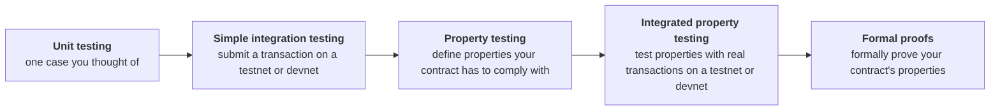

import Tabs from "@theme/Tabs";
import TabItem from "@theme/TabItem";
import CodeBlock from "@theme/CodeBlock";
import extractRegion from "@site/src/utils/extractRegion";
import VaultSimple from "!!raw-loader!@site/examples/onboarding/lectures/intermediate/vault/on-chain/aiken/validators/vault_simple.ak";

# Testing

You can't update a validator. Once funds sit behind it, a mistake means lost or given-away value, and no patch can take it back. **[What a validator is](/docs/developers/onboarding/lectures/intermediate/what-is-a-validator)** shows the two ways that goes wrong.

[In the last lecture](/docs/developers/onboarding/lectures/intermediate/transaction-context), you wrote a real validator, and every check you have run so far has only **compiled** it. The compiler proves the contract is valid code in the language you chose. It cannot tell you whether the checks you wrote are the logic you meant. Your vault would compile just as happily with its one rule replaced by an unconditional yes.

The ways to check that a contract behaves as you expect, from cheapest to most accurate:



In this lecture, we'll cover Unit and Property testing, since they only need the contract. Integration testing requires building and submitting transactions, so we'll wait for **[frontend integration](/docs/developers/onboarding/lectures/intermediate/frontend-integration)**, and Formal Methods is for when you can write protocols with your eyes closed.

## Unit tests

The cheapest test builds a **fake transaction**, hands it to the validator, and checks the answer. No test ADA, and it finishes in milliseconds.

Your vault has one real check, so it needs two tests: one for when the transaction should get through, and one for when it shouldn't.

That second one is the one that matters. Half of these check a **refusal**, and that is the habit to copy for every contract in this track. A validator that always said yes would pass every success test you could write, which is why a suite of nothing but success tests tells you almost nothing.

<Tabs groupId="onchain">
<TabItem value="aiken" label="Aiken" default>

A transaction context has a lot of fields, and your rule reads one of them. The standard library hands you `transaction.placeholder` for exactly this: an empty transaction context, with every field at whatever counts as nothing for its type. You copy it and fill in only the field the rule looks at, so a test says which fact it is testing and stays silent about the rest.

A test that calls a validator has to sit in the same file as that validator: a validator's handlers are private to the module they are in, so no other file can reach them. Tests that call nothing from a validator can live anywhere in the project. `aiken build` leaves all of them out of the compiled output.

Aiken has one more keyword. Putting **`fail`** after a test's name means "this one is supposed to be refused", so that test passes only when the validator says **no**.

</TabItem>
<TabItem value="scalus" label="Scalus">

A [Scalus](https://scalus.org/) version is coming soon. The idea is identical, only the language differs.

</TabItem>
</Tabs>

## Tracing: reading a refusal

Tracing works at any of those levels: it is how you read the answer the contract gave.

A validator only ever answers yes or no. That is all the chain needs, but it is thin when a test goes red: you learn *that* the contract refused and nothing about *which* check refused it. Your vault has one check, so there is only one suspect. A contract with a dozen leaves twelve.

A **trace** is a line of text the validator writes as it runs, which the test runner prints back to you afterwards.

<Tabs groupId="onchain">
<TabItem value="aiken" label="Aiken" default>

The smallest way in is the `?` operator, which goes after any condition. Read it as "and tell me if this one came back False". It only reports the result, and only when that result is `False`. A check that answered `True` stays silent, so what you get back is a short list of the checks that said no.

Aiken has a second way to add a trace. The `trace` keyword prints a line wherever you put it. A message on its own is enough. To print values as well, put `:` after the message, then the values, separated by commas:

<CodeBlock language="aiken" title="validators/vault.ak">
  {extractRegion(VaultSimple, "trace-example")}
</CodeBlock>

`aiken check` prints the traces under the test. Byte values come out in a shorthand called CBOR diagnostic notation: a key hash reads as `h'…'`, and a list of them as `[_ h'…', h'…']`. Printing the signers is often enough to explain a refusal, because you can see whether the owner's hash is in the list.

**Traces cost nothing on-chain.** `aiken build` strips them back out, so the compiled script is byte for byte the one you had before.

</TabItem>
<TabItem value="scalus" label="Scalus">

A [Scalus](https://scalus.org/) version is coming soon. The idea is identical, only the language differs.

</TabItem>
</Tabs>

## Property tests

Unit tests only check the cases you thought of. Your two name one owner, a key you picked. The rule is about **any** key: whoever the datum names must be the one who signed.

A **property test** states a property directly and lets the test runner find an example that breaks it. Instead of the one key you chose, it explores the space, generating cleverly crafted counterexamples hundreds or thousands of times.

If any of them fails, it **reduces ("shrinks")** the counterexample to the smallest one that still breaks the property, so you get the exact edge case rather than whichever random value happened to fail first.

Reach for a property test whenever a rule holds "for all" of something: every key, every amount, every moment after a deadline. You will meet that last one in **[handling time](/docs/developers/onboarding/lectures/intermediate/handling-time)**, where the vesting contract's deadline needs exactly this test.

## The level these two cannot reach

Both levels above test the validator **on its own**. They hand the contract a transaction you built by hand, in the shape you believe your app will produce.

Many things go wrong in the gap between those two: a datum built with the wrong constructor number, a missing required signer, a redeemer that does not match. Your vault can be perfect while your app is still unable to open it.

Closing that gap needs off-chain for integration testing, so it is the first thing **[frontend integration](/docs/developers/onboarding/lectures/intermediate/frontend-integration)** does once there is one: build the **real transaction** with your real off-chain code, then check the transaction against a real or simulated node.

## Try it

**Prove the rule you just wrote.** Everything below runs from `on-chain/vault/`, where lecture 2 left you.

<Tabs groupId="onchain">
<TabItem value="aiken" label="Aiken" default>

**Write a test that has nothing to do with the vault.** Put this at the bottom of `validators/vault.ak`:

<CodeBlock language="aiken" title="validators/vault.ak">
  {extractRegion(VaultSimple, "test-shape")}
</CodeBlock>

```bash
aiken check
```

An Aiken test is a function declared with `test` where you would write `fn`. It takes no arguments, and its body has to end in a `Bool`: the test passes when that value is `True`. There is no assertion library and nothing to import. The runner executes the body the way the chain executes a validator, which is why `aiken check` prints memory and CPU numbers beside each test name.

Ending the body on a comparison (`==`, `>=`, `!=`) buys you one more thing. When the test goes red, the runner shows you both sides of the comparison and what each one came out as, instead of the single word `False`.

That one is scaffolding. The vault's own tests replace it.

**Write the tests**, in its place, below the validator. There is nothing to install and nothing to import: `transaction.placeholder` comes from `cardano/transaction`, which the top of your file already reads `Transaction` and `OutputReference` from.

<CodeBlock language="aiken" title="validators/vault.ak">
  {extractRegion(VaultSimple, "simple-tests")}
</CodeBlock>

`..transaction.placeholder` is the empty transaction context, and `extra_signatories` is the one field written over it, because that is the only field the rule reads. A key hash is 28 bytes and an output reference is a transaction id with an index, so the constants are just byte strings of the right shape. The vault compares them and never inspects them, which is why ones counting up from 1 are enough. Run them:

```bash
aiken check
```

Two tests, two passes, in milliseconds.

**Read the rule the other way round.** Add one more test below the two:

<CodeBlock language="aiken" title="validators/vault.ak">
  {extractRegion(VaultSimple, "pipe")}
</CodeBlock>

`|>` takes the value on its left and hands it to the call on its right as its **first** argument, so `[owner, stranger] |> list.has(owner)` is the `list.has([owner, stranger], owner)` you already know. Your vault's rule would compile the same written as `self.extra_signatories |> list.has(owner)`.

A single call reads much the same either way. A chain of them reads top to bottom, in the order the steps happen, and that is what the minting policy in **[validator purposes](/docs/developers/onboarding/lectures/intermediate/validator-purposes)** uses it for.

**Make a refusal explain itself.** Put a `?` after the check in the `spend` handler, so it reads `list.has(self.extra_signatories, owner)?`, and run `aiken check` again. They all still pass: `unlock_fails_for_a_stranger` now prints the condition you marked underneath itself, with the answer it gave, while `unlock_ok_when_the_owner_signs` stays silent because its check answered `True`. Leave the `?` there while you are still writing the contract.

**Check what that cost you.** Run `aiken build` and note the `hash` in `plutus.json`. Now take the `?` out, build again, and compare. Same hash, so the same compiled script either way: the trace never reached the chain. Put the `?` back.

**Break the contract, not the test.** Replace the rule with plain `True` and run `aiken check`. `unlock_fails_for_a_stranger` fails, and it is telling you exactly the right thing: your vault gives its contents to anybody who asks. Put the rule back.

**Write the property test.** It needs a library first, the only one this track installs. Aiken understands property tests on its own, but the **generators** that produce the values are not in the standard library, and neither is the part that reduces a failure to the smallest input that still breaks. They live in a package you add:

```bash
aiken add aiken-lang/fuzz --version v2.2.0
```

That adds a `[[dependencies]]` block to `aiken.toml` for you, and the next `aiken check` downloads the package. `aiken add` acts on the project you are standing in.

It is only ever used by tests, so nothing it brings in reaches the compiled contract. Build after adding it and the hash is the one you compared in **[the transaction context](/docs/developers/onboarding/lectures/intermediate/transaction-context)**, unchanged.

Add its import above the datum types:

<CodeBlock language="aiken" title="validators/vault.ak">
  {extractRegion(VaultSimple, "simple-fuzz-import")}
</CodeBlock>

Then this at the bottom of the file:

<CodeBlock language="aiken" title="validators/vault.ak">
  {extractRegion(VaultSimple, "simple-property")}
</CodeBlock>

`via fuzz.bytearray()` is the difference. `any_owner` is a parameter, and `fuzz.bytearray()` is the generator that fills it with fresh bytes on every run. A key hash is bytes, which is why that generator fits. The body is the same shape as your two unit tests.

Run `aiken check` again: it reports the property alongside them, having tried a hundred generated keys. Three tests in total, and the rule is covered for every owner rather than the one you happened to name.

**The two unit tests pass, and they are still not enough.** You chose that key yourself, and people choose normal values. A generator does not. It will try an empty key, a very long one, and values you would never think to write down. Your vault says the right thing to all of them, so now you know it rather than hope it. This pays off more later: when a rule compares numbers, such as an amount or a deadline, the mistakes are almost always at the first or last value it accepts, and those are exactly the values a generator tries.

This lecture used a small corner of Aiken. The [language tour](https://aiken-lang.org/language-tour/primitive-types) covers the rest: primitive and custom types, control flow, modules, and a [tests page](https://aiken-lang.org/language-tour/tests) that goes further than this lecture into what the runner can do. If you would rather start from the top, the site opens at its [installation instructions](https://aiken-lang.org/installation-instructions).

</TabItem>
<TabItem value="scalus" label="Scalus">

A [Scalus](https://scalus.org/) version is coming soon. The idea is identical, only the language differs.

</TabItem>
</Tabs>

**[Parameters](/docs/developers/onboarding/lectures/intermediate/parameters)** and **[validator purposes](/docs/developers/onboarding/lectures/intermediate/validator-purposes)** both change a contract that currently works, and each one ends by running these tests again. A change that breaks the rule you just proved will not get past them quietly.

Every contract in the rest of the track gets tests in this same style.

Stuck? The finished code is in the playground. See the **[introduction](/docs/developers/onboarding/lectures/intermediate/introduction#the-playground)**.

## Go deeper

- [Testing](/docs/developers/curriculum/smart-contracts/testing): the test runner, mock transactions, and property testing in depth.
- [Local testing](/docs/developers/curriculum/start-building/local-testing): an in-memory emulator or a private devnet, so a run costs milliseconds instead of a confirmation.
- [Smart contract security](/docs/developers/curriculum/smart-contracts/security): the failure modes worth writing tests against.
- [Audits](/docs/developers/curriculum/smart-contracts/security#audits): when to bring in outside review, and how to prepare for it.

Next: **[Parameters](/docs/developers/onboarding/lectures/intermediate/parameters)**.
