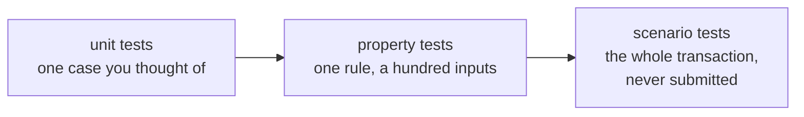

import Tabs from "@theme/Tabs";
import TabItem from "@theme/TabItem";
import CodeBlock from "@theme/CodeBlock";
import extractRegion from "@site/src/utils/extractRegion";
import VaultSimple from "!!raw-loader!@site/examples/onboarding/lectures/intermediate/vault/on-chain/aiken/validators/vault_simple.ak";

# Testing

You can't update a validator. Once funds sit behind it, a mistake means lost or given-away value, and no patch can take it back. **[What a validator is](/docs/developers/onboarding/lectures/intermediate/what-is-a-validator)** puts it plainly: a validator that always says yes gives the funds away, and one that always says no means nobody can ever move them.

So the question is not whether to test. It is how to be sure **before** anything real is at risk.

[In the last lecture](/docs/developers/onboarding/lectures/intermediate/transaction-context), you wrote a real validator, and every `aiken check` you have run so far has only **compiled** it. The compiler proves the contract is valid Aiken. It cannot tell you whether the checks you wrote are the logic you meant. Your vault would compile just as happily with `list.has` replaced by `True`. That is what we explore in this lecture.

Here's an overview of the types of verifications we could do to check if our contract behaves as we expect, ordered from simples/less accurate to more complex/more accurate:



In this lecture, we'll cover Unit and Property testing, since they only need the contract. Integration testing requires building and submitting transactions, so we'll wait for **[frontend integration](/docs/developers/onboarding/lectures/intermediate/frontend-integration)**, and Formal Methods is for when you can write protocols with your eyes closed. So, we won't cover those during the onboarding

## Unit tests

The cheapest test builds a **fake transaction**, hands it to the validator, and checks the answer. No network, no wallet, no test ADA, and it finishes in milliseconds.

Your vault has one real check, so it needs two tests: one for when the transaction should get through, and one for when it shouldn't.

That second one is the one that matters. Notice the balance: half of these check a **refusal**, and that is the habit worth copying for every contract in this track. **A validator is defined by what it rejects.** A validator that always said yes would pass every success test you could write, which is why a suite of nothing but success tests tells you almost nothing.

<Tabs groupId="onchain">
<TabItem value="aiken" label="Aiken" default>

Fake transactions are easier with a helper library. **vodka** is the one this track uses, and its `mocktail` half is the test side: it gives you a way to build a fake transaction, a fake key hash and a fake UTxO reference. You will meet its other half, `cocktail`, in **[validator purposes](/docs/developers/onboarding/lectures/intermediate/validator-purposes)**.

A test lives in the same file as the contract. That is deliberate rather than untidy: the test and the rule it checks stay side by side, and `aiken build` leaves the tests out of the compiled output entirely.

Aiken also has one keyword worth knowing before you write anything. Putting **`fail`** after a test's name means "this one is supposed to be refused", so that test passes only when the validator says **no**.

</TabItem>
<TabItem value="scalus" label="Scalus">

A [Scalus](https://scalus.org/) version is coming soon. The idea is identical, only the language differs.

</TabItem>
</Tabs>

## Tracing: reading a refusal

Tracing works at any of those levels: it is how you read the answer the contract gave.

A validator only ever answers yes or no. That is all the chain needs, but it is thin when a test goes red: you learn *that* the contract refused and nothing about *which* check refused it. Your vault has one check, so there is only one suspect. A contract with a dozen leaves twelve, and by the end of this track yours will have several.

A **trace** is a line of text the validator writes as it runs, which the test runner prints back to you afterwards.

<Tabs groupId="onchain">
<TabItem value="aiken" label="Aiken" default>

The smallest way in is the `?` operator. Put it after any condition:

```aiken
list.has(self.extra_signatories, owner)?
```

Read that `?` as "and tell me if this one came back False". It does not change what the condition does, and it does not change what the validator decides. It only reports the result, and only when that result is `False`.

That last part is what makes it useful. A check that answered `True` stays silent, so what you get back is a short list of the checks that said no, not a long report of every step that ran.

**And traces cost nothing on-chain.** That is worth checking rather than believing, because "the validator writes text now" sounds like a bigger, slower, more expensive script. It isn't: `aiken build` strips every trace back out, and the compiled script is byte for byte the one you had before. The Try it below has you prove that with your own hash rather than take it on trust.

Aiken has a second form, `trace @"your own message"`, for branches that do several things at once and need a label no single condition can give. Your vault's rule is one check, so `?` already says everything a message of your own could.

</TabItem>
<TabItem value="scalus" label="Scalus">

A [Scalus](https://scalus.org/) version is coming soon. The idea is identical, only the language differs.

</TabItem>
</Tabs>

## Property tests

Unit tests only check the cases you thought of. Your two name one owner, a key you picked. But the rule is not about that key. It is about **any** key: whoever the datum names must be the one who signed.

A **property test** states a property directly and lets the test runner find an example that breaks it. Instead of the one key you chose, it explores the space, generating cleverly crafted counterexamples hundreds or thousands of times.

If any of them fails, it does more than report it. It **reduces ("shrinks")** the counterexample to the smallest one that still breaks the property, so you get the exact edge case rather than whichever random value happened to fail first.

A property test is worth reaching for whenever a rule holds "for all" of something: every key, every amount, every moment after a deadline. You will meet that last one in **handling time**, where the vesting contract arrives with `claim_ok_at_any_time_after_the_deadline` already written.

## The level these two cannot reach

Both levels above test the validator **on its own**, and that is also their limit. They hand the contract a transaction you built by hand, in the shape you believe your app will produce.

Many things go wrong in the gap between those two: a datum built with the wrong constructor number, a missing required signer, a redeemer that does not match. None of these are contract bugs, none of them appear in a contract test, and your vault can be perfect while your app is still unable to open it.

Closing that gap needs off-chain for integration testing, so it is the first thing **[frontend integration](/docs/developers/onboarding/lectures/intermediate/frontend-integration)** does once there is one: build the **real transaction** with your real off-chain code, then check the transaction against a real or simulated node.

## Try it

**Prove the rule you just wrote.** Everything below runs from `on-chain/vault/`, where lecture 2 left you.

<Tabs groupId="onchain">
<TabItem value="aiken" label="Aiken" default>

**Add the test library.** Your project has had no dependencies but the standard library so far. **vodka** is the first:

```bash
aiken add sidan-lab/vodka --version 0.1.23
```

That writes three lines into `aiken.toml` for you, and the next `aiken check` downloads the package. `aiken add` acts on the project you are standing in, which is why lecture 2 left you inside `on-chain/vault/` rather than pointing at it from outside.

**Add the imports.** Three things come from mocktail: `mocktail_tx()` starts an empty transaction, `required_signer_hash(True, key)` puts a key in `extra_signatories`, and `complete()` finishes it. The two `virgin_` modules invent the values to fill them with. Add these to `validators/vault.ak`:

<CodeBlock language="aiken" title="validators/vault.ak">
  {extractRegion(VaultSimple, "simple-test-imports", "simple-fuzz-import")}
</CodeBlock>

**Then the tests**, at the bottom of the file, below the validator:

<CodeBlock language="aiken" title="validators/vault.ak">
  {extractRegion(VaultSimple, "simple-tests")}
</CodeBlock>

`mock_pub_key_hash(1)` and `mock_pub_key_hash(2)` are just two valid key hashes that are not each other. The vault never reads `dummy_ref`, so any output reference will do. Run them:

```bash
aiken check
```

Two tests, two passes, in milliseconds. This is the cheapest place in the whole system to find out you were wrong.

**Make a refusal explain itself.** Put a `?` after the check in the `spend` handler, so it reads `list.has(self.extra_signatories, owner)?`, and run `aiken check` again. Both still pass, and nothing needed to break for that to pay off: `unlock_fails_for_a_stranger` now prints the condition you marked underneath itself, with the answer it gave, while `unlock_ok_when_the_owner_signs` stays silent because its check answered `True`. Leave the `?` there while you are still writing the contract.

**Check what that cost you.** Run `aiken build` and note the `hash` in `plutus.json`. Now take the `?` out, build again, and compare. Same hash, so the same compiled script either way: the trace never reached the chain. Put the `?` back.

**Break the contract, not the test.** Replace the rule with plain `True` and run `aiken check`. `unlock_fails_for_a_stranger` fails, and it is telling you exactly the right thing: your vault gives its contents to anybody who asks. That one failing test is worth more than the one still passing. Put the rule back.

**Write the property test.** It needs a library first. Aiken understands property tests on its own, but the **generators** that produce the values are not in the standard library, and neither is the part that reduces a failure to the smallest input that still breaks. They live in a package you install:

```bash
aiken add aiken-lang/fuzz --version v2.2.0
```

It is only ever used by tests, so nothing it brings in reaches the compiled contract. Build after adding it and the hash is the one you compared in **[the transaction context](/docs/developers/onboarding/lectures/intermediate/transaction-context)**, unchanged.

Add its import to the ones you already have:

<CodeBlock language="aiken" title="validators/vault.ak">
  {extractRegion(VaultSimple, "simple-fuzz-import")}
</CodeBlock>

Then this at the bottom of the file:

<CodeBlock language="aiken" title="validators/vault.ak">
  {extractRegion(VaultSimple, "simple-property")}
</CodeBlock>

`via fuzz.bytearray()` is the difference. Read the signature as a blank to be filled: `any_owner` is a parameter rather than a value you supply, and `fuzz.bytearray()` is the generator that fills it with fresh bytes on every run. A key hash is bytes, which is why that generator fits. The body is the same shape as your two unit tests.

Run `aiken check` again: it reports the property alongside them, having tried a hundred generated keys. Three tests in total, and the rule is covered for every owner rather than the one you happened to name.

**Why bother, when the two unit tests already pass?** Because you chose that key yourself, and people choose normal values. A generator does not. It will try an empty key, a very long one, and values you would never think to write down. Your vault says the right thing to all of them, so now you know it rather than hope it. This pays off more later: when a rule compares numbers, such as an amount or a deadline, the mistakes are almost always at the first or last value it accepts, and those are exactly the values a generator tries.

</TabItem>
<TabItem value="scalus" label="Scalus">

A [Scalus](https://scalus.org/) version is coming soon. The idea is identical, only the language differs.

</TabItem>
</Tabs>

You now have something the next two lectures need. **[Parameters](/docs/developers/onboarding/lectures/intermediate/parameters)** and **[validator purposes](/docs/developers/onboarding/lectures/intermediate/validator-purposes)** both change a contract that currently works, and each one ends by running these tests again. A change that breaks the rule you just proved will not get past them quietly.

Every contract in the rest of the track arrives with tests already written, in the same style. Each of those lectures names its own project path, so the command keeps the shape you have been using here.

Stuck? The finished code is in the playground. See the **[introduction](/docs/developers/onboarding/lectures/intermediate/introduction#the-playground)**.

## Go deeper

- [Testing](/docs/developers/curriculum/smart-contracts/testing): the test runner, mock transactions, and property testing in depth.
- [Local testing](/docs/developers/curriculum/start-building/local-testing): an in-memory emulator or a private devnet, so a run costs milliseconds instead of a confirmation.
- [Smart contract security](/docs/developers/curriculum/smart-contracts/security): the failure modes worth writing tests against.
- [Audits](/docs/developers/curriculum/smart-contracts/security#audits): when to bring in outside review, and how to prepare for it.

Next: **[Parameters](/docs/developers/onboarding/lectures/intermediate/parameters)**.
