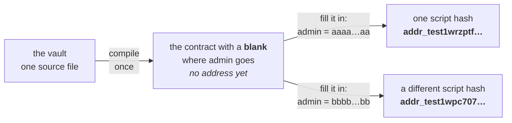

import Tabs from "@theme/Tabs";
import TabItem from "@theme/TabItem";
import CodeBlock from "@theme/CodeBlock";
import extractRegion from "@site/src/utils/extractRegion";
import VaultAiken from "!!raw-loader!@site/examples/onboarding/lectures/intermediate/vault/on-chain/aiken/validators/vault.ak";
import GuesserAiken from "!!raw-loader!@site/examples/onboarding/lectures/intermediate/vault/on-chain/aiken/validators/guesser.ak";
import VaultSimpleAiken from "!!raw-loader!@site/examples/onboarding/lectures/intermediate/vault/on-chain/aiken/validators/vault_simple.ak";

# Parameters

The last two lectures finished the list of what a validator is **given**: the **[datum and the redeemer](/docs/developers/onboarding/lectures/intermediate/datum-and-redeemer)**, then the **[context](/docs/developers/onboarding/lectures/intermediate/transaction-context)**. Nothing else is handed to a validator when it runs.

A **parameter** is not on that list. It is a value built into the contract's own code, before the contract ever reaches the chain. Compiling leaves a **blank** where the value goes, and the contract is finished by filling that blank in. A parameter is baked **into** the validator, which is why you will never find it in `validator(datum, redeemer, context)`.

Of the values **you** supply, the useful way to tell them apart is **when the value is fixed**:

| | Fixed when | Lives in | To change it |
|---|---|---|---|
| **parameter** | build time | the contract itself | fill the blank differently: a new contract, at a **new address** |
| **datum** | lock time | the locked UTxO | lock a new UTxO |
| **redeemer** | spend time | the spending transaction | just send a different one |

The context is missing from that table on purpose. It is the transaction itself, settled by whoever builds the spend, rather than a value you choose and pass.

## A small contract that uses a parameter

<Tabs groupId="onchain">
<TabItem value="aiken" label="Aiken" default>

<CodeBlock language="aiken" title="guesser.ak">
  {extractRegion(GuesserAiken, "guesser")}
</CodeBlock>

</TabItem>
<TabItem value="scalus" label="Scalus">

A [Scalus](https://scalus.org/) version is coming soon. The idea is identical, only the language differs.

</TabItem>
</Tabs>

`guess` is the parameter, in brackets after the contract's name. Whoever spends sends a number as the redeemer, and the funds move when the two numbers are equal. It is the first rule in this track that reads the redeemer at all.

The parameter is fixed for the whole contract, so it is the same number for every UTxO at that address. Once somebody guesses it, they can take every UTxO sitting there. Setting a new number means filling the blank in again, and what comes out is a different contract at a different address.

Read this one, do not build it. The vault is the contract you write, in **[Try it](#try-it)** below.

## Why the vault wants one

The vault stops being one person's contract here and becomes a service. A company runs it, and every customer who locks funds gets a UTxO at the same address. The company holds one key of its own, the **admin key**, and that key can move the funds out of any of those UTxOs. Customers use their own key for their own funds, and the admin key is there for the day a customer loses theirs, the way a bank can reach an account when you forget the PIN.

One key, for the whole service. It is chosen when the service is built, and it is the same for every customer, which is what makes it a parameter.

## Why a parameter changes the address

A parameter is part of the contract's code, so it changes the compiled bytes, which changes the **hash**. And the hash is the **address**. One piece of source, two admin keys, two separate services:



The two addresses have nothing in common, and that is the reason to use a parameter at all.

Anyone can read the admin key straight out of the contract. That is fine, because it is a public key **hash**, the same kind of value the datum holds. It names *who* the admin is, and naming somebody is not the same as being them: taking the funds still needs a **signature** from that key, and only its owner can produce one.

## Why not the datum

Every service would share one address, and each locked UTxO would carry its own copy of the admin key, hidden inside until you opened it. Nothing would stop one customer locking a UTxO that names themselves as admin, and it would look identical to every other UTxO at that address. As a parameter, the key is part of the address, so one address means one admin, and reading the address is enough to know who it is.

**[Datum & redeemer](/docs/developers/onboarding/lectures/intermediate/datum-and-redeemer)** left you a rule for choosing between the datum and the redeemer. A parameter sits above both of them, and the question it answers is different:

- **Parameter** for settings fixed when the contract is deployed, the same for every UTxO at that address: an admin key, an oracle's address, a token policy.
- **Datum** for facts that differ from one locked UTxO to the next.

Ask "is this the same for every UTxO at this address?" first. If yes, it is a parameter. Only if no do you go back to the datum or redeemer question.

There is one more thing you could do, and it is worse. You could simply **write the admin key into the code**. It would be just as fixed and just as safe. But then every new deployment needs a change to the contract itself, which means compiling it again, testing it again, and having it audited again. With a parameter you compile and test **once**, and each deployment only passes a different value in.

:::warning An admin key can spend anybody's funds
`AdminUnlock` is a real spending path, so the company holding the admin key can take any customer's funds. This is custody: the funds are only as safe as that one key and the company behind it.
:::

:::note Where else a named key gets a path of its own
A project key that alone may mint a collection's NFTs, the single key allowed to update a price feed, which is the oracle you build in **modifying state**, and a key that can pause a protocol by updating a config UTxO every other validator reads as a **reference input**.

Where that key is named follows the rule above: a parameter when it is fixed for the whole deployment, the datum when it differs from one UTxO to the next, as the oracle's does.
:::

## What "filling the blank" actually involves

The **datum** goes on the output when you lock. The **redeemer** goes in the spending transaction. The **parameter** is applied before either exists, to the compiled script itself.

Filling the blank does not compile anything and does not ask the network for anything. Your off-chain code takes the compiled script from your blueprint (`plutus.json`), with the blank still in it, supplies the missing value, and hashes what comes out. Two lines of ordinary code, and no transaction. **That is the whole of "deploying" a parameterized contract**, and you will write those two lines in **[frontend integration](/docs/developers/onboarding/lectures/intermediate/frontend-integration)**.

You will meet the word "deploy" in one other sense, though. It also describes putting the script into a UTxO, so that later transactions point at it instead of carrying a copy of it. That one really is a transaction, and it is optional: a way to make every spend smaller, not a step you must take before a contract works. **Reference inputs & scripts** does it.

## Try it

**Give your vault an admin key.** It is the contract you already have plus one parameter and one extra action.

<Tabs groupId="onchain">
<TabItem value="aiken" label="Aiken" default>

Everything below runs from `on-chain/vault/`, where lecture 2 left you.

Open `validators/vault.ak`. The redeemer changes first: `VaultAction` gains `AdminUnlock`, on the line after `Unlock`. The order matters: an action reaches the validator as a number, and that number is its position in this list, so swapping the two lines swaps which key the vault checks. You write the off-chain side of that in **[frontend integration](/docs/developers/onboarding/lectures/intermediate/frontend-integration)**. `VaultDatum` does not move at all, the owner is still the one fact each locked UTxO carries.

<CodeBlock language="aiken" title="validators/vault.ak">
  {extractRegion(VaultAiken, "types")}
</CodeBlock>

Then the validator itself. It takes the parameter in brackets after its name, `_redeemer` loses its underscore because the rule finally reads it, and the single line you wrote last lecture becomes a `when` with one branch per action. Both branches ask the same question: is this key among the signers? And differ only in which key they ask about: the datum's `owner` for `Unlock`, the parameter's `admin` for `AdminUnlock`.

Both branches ask `list.has`, so there is nothing new to import.

<CodeBlock language="aiken" title="validators/vault.ak">
  {extractRegion(VaultAiken, "vault")}
</CodeBlock>

```bash
aiken check
```

**It does not compile**, and the error is the lesson. Your two tests from **[testing](/docs/developers/onboarding/lectures/intermediate/testing)** call `vault.spend` with four arguments, and the handler now takes five. A parameter always comes **first**, before the handler's own arguments, so every call has to gain an `admin` in front:

<CodeBlock language="aiken">
  {`// was\n${extractRegion(VaultSimpleAiken, "spend-call")}\n// now\n${extractRegion(VaultAiken, "spend-call")}`}
</CodeBlock>

Add the admin key beside `owner` and `stranger`, and a test for each side of the new door:

<CodeBlock language="aiken" title="validators/vault.ak">
  {extractRegion(VaultAiken, "admin-tests")}
</CodeBlock>

Fix the three existing calls the same way, then run `aiken check` again. Five tests, five passes.

`admin_unlock_ok_when_the_admin_signs` is the obvious one of the two. **`admin_unlock_fails_when_the_owner_signs` is the one that matters**: it asks whether the two doors are genuinely separate. A vault where the owner can also take the `AdminUnlock` path compiles exactly as happily as one where they cannot, and nothing but that test tells the two apart.

Your vault now has two ways in: each customer's key for their own funds, and the company's admin key for all of them.

</TabItem>
<TabItem value="scalus" label="Scalus">

A [Scalus](https://scalus.org/) version is coming soon. The idea is identical, only the language differs.

</TabItem>
</Tabs>

**Then recompile.** The contract changed shape, so the blueprint has to be rewritten:

```bash
aiken build
```

Open `plutus.json` and look at the entry for `vault.vault.spend`. It has grown a `parameters` field naming the blank you left, and its `hash` is **not** the one from before you added the parameter. A different contract, so a different hash, so a different address. The file changed, and that was the whole event.

The blank itself is still empty. Filling it in is the first thing **[frontend integration](/docs/developers/onboarding/lectures/intermediate/frontend-integration)** does, and until something does, this contract has no address at all.

Stuck? The finished code is in the playground. See the **[introduction](/docs/developers/onboarding/lectures/intermediate/introduction#the-playground)**.

## Go deeper

- [Parameterized scripts](/docs/developers/curriculum/smart-contracts/lock-and-spend#parameterized-scripts): applying parameters from an SDK, with typed and untyped versions.
- [Addresses](/docs/developers/curriculum/fundamentals/core-concepts/addresses): how a script hash becomes an address in the first place.
- [Smart contract security](/docs/developers/curriculum/smart-contracts/security): what belongs in a parameter, and what must never go anywhere public.

Next: **[Validator purposes](/docs/developers/onboarding/lectures/intermediate/validator-purposes)**.
