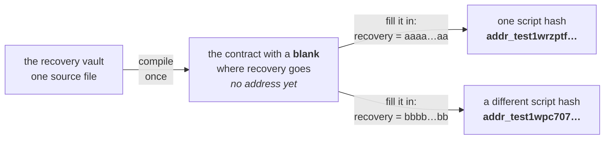

import Tabs from "@theme/Tabs";
import TabItem from "@theme/TabItem";
import CodeBlock from "@theme/CodeBlock";
import extractRegion from "@site/src/utils/extractRegion";
import VaultAiken from "!!raw-loader!@site/examples/onboarding/lectures/intermediate/vault/on-chain/aiken/validators/vault.ak";

# Parameters

The last two lectures finished the list of what a validator is **given**: the **[datum and the redeemer](/docs/developers/onboarding/lectures/intermediate/datum-and-redeemer)**, then the **[context](/docs/developers/onboarding/lectures/intermediate/transaction-context)**. That list is closed. Nothing else is handed to a validator when it runs.

A **parameter** is not on that list, and that is the whole point of this lecture. It is a value built into the contract's own code, before the contract ever reaches the chain. Compiling leaves a **blank** where the value goes, and the contract is finished by filling that blank in. A parameter is not passed **to** the validator, it is baked **into** it, which is why you will never find it in `validator(datum, redeemer, context)`.

So a parameter is one more way a fact reaches a contract, sitting on a different axis from everything above. Of the values **you** supply, the useful way to tell them apart is **when the value is fixed**:

| | Fixed when | Lives in | To change it |
|---|---|---|---|
| **parameter** | build time | the contract itself | fill the blank differently: a new contract, at a **new address** |
| **datum** | lock time | the locked UTxO | lock a new UTxO |
| **redeemer** | spend time | the spending transaction | just send a different one |

The context is missing from that table on purpose. It is the transaction itself, settled by whoever builds the spend, rather than a value you choose and pass.

Why would you want one? Think about the vault so far. It releases funds to one owner, proven by one signature. Lose that key and the funds are gone for good, with nobody to ask for help. So we add a **backup key**: a second key, chosen when the vault is made, that can also take the funds out. The owner uses their key for normal spending. The backup is kept somewhere safe and is not touched until it is needed.

Here are all three ways in, in one small contract:

<Tabs groupId="onchain">
<TabItem value="aiken" label="Aiken" default>

It is your vault with the backup key added, and the **[Try it](#try-it)** below makes exactly this change to the `vault.ak` you have been building:

<CodeBlock language="aiken" title="vault.ak: the types">
  {extractRegion(VaultAiken, "types")}
</CodeBlock>

<CodeBlock language="aiken" title="vault.ak: the rule">
  {extractRegion(VaultAiken, "vault", "mint-handler")}
</CodeBlock>

Nothing new is imported. `list.has` is the same question your vault has been asking since **[the transaction context](/docs/developers/onboarding/lectures/intermediate/transaction-context)**, only asked twice now, about a different key each time.

</TabItem>
<TabItem value="scalus" label="Scalus">

A [Scalus](https://scalus.org/) version is coming soon. The idea is identical, only the language differs.

</TabItem>
</Tabs>

Read the three facts and where each one went:

- `recovery` is the **parameter**, in brackets after the contract's name. It is chosen once, when the contract is built, and it is the same for every UTxO this vault will ever hold.
- `owner` comes from the **datum**, attached when the funds were locked. Each locked UTxO can name a different owner.
- `Unlock` or `Recover` comes from the **redeemer**, chosen by whoever is spending, in that transaction.

The rule itself should look familiar. It asks the same _is this key among the signers?_ question your vault already asks, reading the signers straight off the transaction as the [last lecture](/docs/developers/onboarding/lectures/intermediate/transaction-context) described. Only what it is compared against changes, and that is the interesting part: `Unlock` checks the signature against the **datum's** owner, `Recover` against the **parameter**.

Notice too that the redeemer finally matters. Earlier it had one choice, so it decided nothing. Here it picks which rule applies, and each choice needs a different signature.

## Why a parameter changes the address

A parameter is part of the contract's code, so it changes the compiled bytes, which changes the **hash**. And the hash is the **address**. One piece of source, two recovery keys, two separate vaults:



Those two addresses come from one file and two recovery keys, with nothing in common between them. That difference is the reason to use a parameter at all.

Anyone can read the recovery key straight out of the contract. That is fine, because it is a public key **hash**, the same kind of value the datum holds. It names *who* may recover, and naming somebody is not the same as being them: taking the funds still needs a **signature** from that key, and only its owner can produce one.

Why not put the recovery key in the **datum** instead? Because then every vault would share one address, and each locked UTxO would carry its own recovery key, hidden inside until you opened it. Two UTxOs sitting side by side could have completely different backup keys and look identical. As a parameter, the key is part of the address, so a different key means a different address, and the address alone tells you which key can recover.

**[Datum & redeemer](/docs/developers/onboarding/lectures/intermediate/datum-and-redeemer)** left you a rule for choosing between the datum and the redeemer: the facts that must be kept go in the **datum**, and the action being taken goes in the **redeemer**. A parameter sits above both of them, and the question it answers is different:

- **Parameter** for settings fixed when the contract is deployed, the same for every UTxO at that address: a recovery key, an oracle's address, a token policy.
- **Datum** for facts that differ from one locked UTxO to the next.

Ask "is this the same for every UTxO at this address?" first. If yes, it is a parameter. Only if no do you go back to the datum or redeemer question.

There is one more thing you could do, and it is worth knowing why it is worse. You could simply **write the recovery key into the code**. It would be just as fixed and just as safe. But then every new vault needs a change to the contract itself, which means compiling it again, testing it again, and having it audited again. With a parameter you compile and test **once**, and each deployment only passes a different value in. Same code, same tests, many vaults.

:::warning A recovery key can spend the vault
`Recover` is a real spending path, so whoever holds the recovery key can take the funds. That is the point of a backup, and it is also the risk. Use a key **you** control, such as a hardware wallet kept somewhere else. Never a key belonging to somebody you would not hand the funds to today.
:::

:::note The same shape is how contracts get an admin
`Recover` is one instance of a wider pattern: a named key with a path of its own, for the cases the main rule cannot cover. Contracts use it for a project key that alone may mint a collection's NFTs, for the single key allowed to update a price feed, which is the oracle you build in **[modifying state](/docs/developers/onboarding/lectures/intermediate/modifying-state)**, and for an admin who can pause a protocol by updating a config UTxO that every other validator reads as a **[reference input](/docs/developers/onboarding/lectures/intermediate/reference-inputs-and-scripts)**.

Where that key is named follows the rule above: a parameter when it is fixed for the whole deployment, the datum when it differs from one UTxO to the next, as the oracle's does.
:::

## What "filling the blank" actually involves

The three values travel by three different routes, and each is put in place by something different. The **datum** goes on the output when you lock. The **redeemer** goes in the spending transaction. The **parameter** is applied before either exists, to the compiled script itself, and that step is worth being precise about because it sounds heavier than it is.

Filling the blank does not compile anything and does not ask the network for anything. Your off-chain code takes the compiled script from your blueprint (`plutus.json`), with the blank still in it, supplies the missing value, and hashes what comes out. Two lines of ordinary code, no deployment, no transaction, no announcement. **That is the whole of "deploying" a parameterized contract**, and you will write those two lines in **[frontend integration](/docs/developers/onboarding/lectures/intermediate/frontend-integration)**.

You will meet the word "deploy" in one other sense, though. It also describes putting the script into a UTxO, so that later transactions point at it instead of carrying a copy of it. That one really is a transaction, and it is optional: a way to make every spend smaller, not a step you must take before a contract works. **[Reference inputs & scripts](/docs/developers/onboarding/lectures/intermediate/reference-inputs-and-scripts)** does it.

One consequence lands right away, though, and it lands on the redeemer. This contract's `VaultAction` finally lists two choices, so its redeemers finally use both constructor numbers from **[datum & redeemer](/docs/developers/onboarding/lectures/intermediate/datum-and-redeemer)**: `Unlock` is constructor 0 and `Recover` is constructor 1. Get those two the wrong way round later and the vault will look at the wrong key, without complaining.

## Try it

**Give your vault a backup key.** It is the contract you already have plus one parameter and one extra action, so most of it you have written already.

<Tabs groupId="onchain">
<TabItem value="aiken" label="Aiken" default>

Everything below runs from `on-chain/vault/`, where lecture 2 left you.

Open `validators/vault.ak`. The redeemer changes first: `VaultAction` gains `Recover`, on the line after `Unlock`. The order matters, because it is what makes `Recover` constructor 1 off-chain, the `mConStr1([])` from **[datum & redeemer](/docs/developers/onboarding/lectures/intermediate/datum-and-redeemer)**. `VaultDatum` does not move at all, the owner is still the one fact each locked UTxO carries.

<CodeBlock language="aiken" title="validators/vault.ak">
  {extractRegion(VaultAiken, "types")}
</CodeBlock>

Then the validator itself. It takes the parameter in brackets after its name, `_redeemer` loses its underscore because the rule finally reads it, and the single line you wrote last lecture becomes a `when` with one branch per action. Both branches ask the same question: is this key among the signers? And differ only in which key they ask about: the datum's `owner` for `Unlock`, the parameter's `recovery` for `Recover`.

Both branches ask `list.has`, so there is nothing new to import.

<CodeBlock language="aiken" title="validators/vault.ak">
  {extractRegion(VaultAiken, "vault", "mint-handler")}
</CodeBlock>

```bash
aiken check
```

**It does not compile**, and the error is the lesson. Your two tests from **[testing](/docs/developers/onboarding/lectures/intermediate/testing)** call `vault.spend` with four arguments, and the handler now takes five. A parameter always comes **first**, before the handler's own arguments, so every call has to gain a `recovery` in front:

```aiken
// was
vault.spend(Some(VaultDatum { owner }), Unlock, dummy_ref, tx)
// now
vault.spend(recovery, Some(VaultDatum { owner }), Unlock, dummy_ref, tx)
```

Add the recovery key beside `owner` and `stranger`, and a test for each side of the new door:

<CodeBlock language="aiken" title="validators/vault.ak">
  {extractRegion(VaultAiken, "recover-tests")}
</CodeBlock>

Fix the three existing calls the same way, then run `aiken check` again. Five tests, five passes.

Look at what the last two bought you. `recover_ok_when_the_recovery_key_signs` is the obvious one. **`recover_fails_when_the_owner_signs` is the one that matters**: it asks whether the two doors are genuinely separate. A vault where the owner can also take the `Recover` path compiles exactly as happily as one where they cannot, and nothing but that test tells the two apart.

Your vault now has two ways in: the owner's key for normal use, and the backup key for the day it is needed. And you know they are separate, rather than hoping.

</TabItem>
<TabItem value="scalus" label="Scalus">

A [Scalus](https://scalus.org/) version is coming soon. The idea is identical, only the language differs.

</TabItem>
</Tabs>

**Then recompile.** The contract changed shape, so the blueprint has to be rewritten:

```bash
aiken build
```

Open `plutus.json` and look at the entry for `vault.vault.spend`. It has grown a `parameters` field naming the blank you left, and its `hash` is **not** the one from before you added the parameter. That is the section above made concrete: a different contract, so a different hash, so a different address. Nothing was deployed, and nothing was announced. The file changed, and that was the whole event.

The blank itself is still empty. Filling it in is the first thing **[frontend integration](/docs/developers/onboarding/lectures/intermediate/frontend-integration)** does, and until something does, this contract has no address at all.

Stuck? The finished code is in the playground. See the **[introduction](/docs/developers/onboarding/lectures/intermediate/introduction#the-playground)**.

## Go deeper

- [Parameterized scripts](/docs/developers/curriculum/smart-contracts/lock-and-spend#parameterized-scripts): applying parameters from an SDK, with typed and untyped versions.
- [Addresses](/docs/developers/curriculum/fundamentals/core-concepts/addresses): how a script hash becomes an address in the first place.
- [Smart contract security](/docs/developers/curriculum/smart-contracts/security): what belongs in a parameter, and what must never go anywhere public.

Next: **[Validator purposes](/docs/developers/onboarding/lectures/intermediate/validator-purposes)**.
