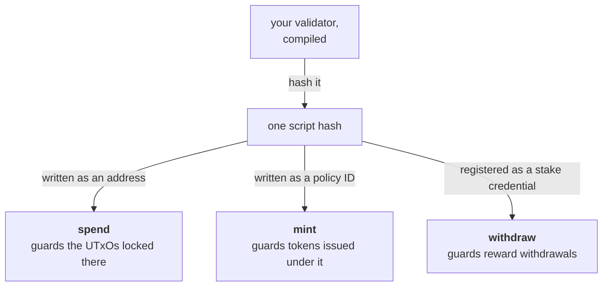
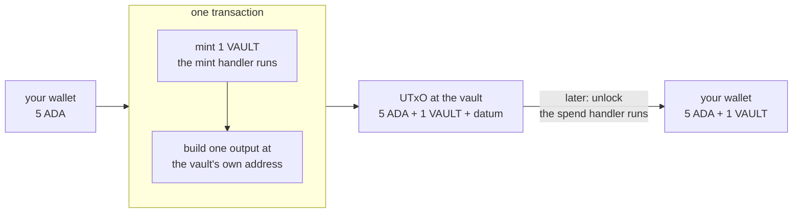

import Tabs from "@theme/Tabs";
import TabItem from "@theme/TabItem";
import CodeBlock from "@theme/CodeBlock";
import extractRegion from "@site/src/utils/extractRegion";
import VaultAiken from "!!raw-loader!@site/examples/onboarding/lectures/intermediate/vault/on-chain/aiken/validators/vault.ak";

# Validator purposes

So far "validator" has meant _guarding a locked UTxO_. That is the most common job, but it is not the only one. A validator can guard several different kinds of action, and the kind it is guarding is called its **purpose**. The idea is the same. Only what starts it changes.

These are the purposes you will meet:

| Purpose | Runs when… | The question it's asked |
|---|---|---|
| **spend** | someone spends a UTxO locked at the script address | may this locked UTxO be spent? |
| **mint** | a transaction creates or burns tokens under the script's policy | may these tokens come into existence, or stop existing? |
| **withdraw** | staking rewards are withdrawn under the script | may these rewards be taken? |
| **publish / vote / propose** | certificates or governance actions are submitted | may this certificate or vote go through? |

Every purpose works the same way. Something in a transaction touches your script, the network runs your validator, and it answers **yes or no**. Only the trigger and the thing being guarded change. You have already seen a simpler version of the mint purpose. The Beginner [minting example](/docs/developers/onboarding/lectures/beginner/tokens-fungible-and-nfts) used a **native script** as its policy. You use a validator instead when the rule needs to do more than check who signs and when.

The handler you write changes a little between purposes, because the question changes. A **spend** handler is given the **datum**, because there is a locked UTxO with a note attached to it. A **mint** handler is not, because nothing is being unlocked, so there is no locked UTxO and no note. Instead it is told which policy is being minted under. All of them receive the redeemer and the whole transaction. Your vault uses **spend** today. In this lecture it gains **mint** as well.

## One validator, many purposes, one hash

Here is the powerful part. A **single validator** can handle **several purposes at once**, and it has exactly **one hash**. That one hash is all of these at the same time:

- its **address** (for the _spend_ purpose),
- its **policy ID** (for the _mint_ purpose),
- its **stake credential** (for the _withdraw_ purpose).



That is not three scripts. It is one compiled script doing three jobs. The hash **is** the script's identity, and where you put that hash decides which question the network asks it. Put it in an address and it guards funds. Put it on a token as the policy ID and it guards who may create that token. Register it as a stake credential and it guards rewards.

The result is more useful than it first sounds. Because the script sees its own hash in more than one role, it can **connect** them. One script can create a token and also control how the UTxO holding that token is spent, all under one identity. Many real Cardano designs are built this way, using a token as a mark that says "this UTxO is the real one", which only that same script could have created.

## Your vault declares only one purpose, so far

The vault you have been building handles only **spend**. Its source says so in two places: the spend handler you wrote, and the `else` block that **[what a validator is](/docs/developers/onboarding/lectures/intermediate/what-is-a-validator)** asked you to copy without explaining:

<Tabs groupId="onchain">
<TabItem value="aiken" label="Aiken" default>

```aiken
else(_) {
  fail
}
```

</TabItem>
<TabItem value="scalus" label="Scalus">

A [Scalus](https://scalus.org/) version is coming soon. The idea is identical, only the language differs.

</TabItem>
</Tabs>

That is what it has been doing all along: covering **every other purpose**. If anything tries to use this script as a minting policy, or a stake credential, or anything else besides spending, the answer is no. A script that allowed purposes you never thought about would be approving actions you never considered. Writing only a spend handler is not the same as making spending the only thing possible. You will see this pair, one real handler plus a refusing `else`, in most small contracts.

## Minting and locking in one transaction

The handler you are about to write guards a token of the vault's own, and it allows exactly two things: one token created, or one token destroyed. Nothing else under this policy.

That is enough for something the vault could not do before. The script's hash is both the **policy id** that approves the token and the **address** the token is sent to, so one transaction can create the token and lock it in the vault at once.



The token is created and locked in the **same** transaction, so it never stops at your wallet on the way in. It reaches you when you unlock, together with the ADA it was guarding.

## Try it

**Give your vault a second purpose: let it mint its own token.** The `else` block refuses minting today, so you replace it with a real `mint` handler.

<Tabs groupId="onchain">
<TabItem value="aiken" label="Aiken" default>

Everything below runs from `on-chain/vault/`, where lecture 2 left you.

The helper this rule needs is already in the project. You added **vodka** in **[testing](/docs/developers/onboarding/lectures/intermediate/testing)** for its `mocktail` half, and this rule uses its other half.

The three names are worth sorting out, because you now use both. **vodka** is the package. **cocktail** is its half for contracts, which is where `token_minted` comes from. **mocktail** is its half for tests, for building fake transactions. One package, two module names.

The mint rule needs a type and that helper. In `validators/vault.ak`, add both at the top:

<CodeBlock language="aiken" title="validators/vault.ak">
  {`${extractRegion(VaultAiken, "import-policy-id")}\n${extractRegion(VaultAiken, "import-token-minted")}`}
</CodeBlock>

`token_minted` does the work: it answers "does this transaction mint exactly this much of this token?".

The mint rule needs a name to check against, so give the token one, above the validator:

<CodeBlock language="aiken" title="validators/vault.ak">
  {extractRegion(VaultAiken, "token-name")}
</CodeBlock>

Now the rule for the token itself: one may be created, or one destroyed, and nothing else. Add the handler **inside the validator block**, between `spend` and `else`:

<CodeBlock language="aiken" title="validators/vault.ak">
  {extractRegion(VaultAiken, "mint-handler")}
</CodeBlock>

Read the arguments, because they differ from `spend`. **No datum reaches this handler**: a datum belongs to the UTxO being unlocked, and minting unlocks nothing. The transaction can still attach a datum to an output it creates, and the one that mints a token and locks it does, but that note belongs to the new vault UTxO and the mint rule is never handed it. Instead the handler is told its own `policy_id`, which is this script's hash. The rule allows two things and nothing else: minting one token (`1`), or burning one (`-1`).

```bash
aiken check
aiken build
```

Open `plutus.json` and look at the `validators` list. It now has **three** entries, `vault.vault.spend`, `vault.vault.mint` and `vault.vault.else`, and all three carry the **same hash**. One script, three doors.

Compare that hash with ours:

```
778c493236d034d9be1ad753ff95ce7443056ad8653dab59b03841bf
```

If it matches, you wrote the same contract we did, byte for byte. Same hash means the same address **and** the same policy id.

It is worth knowing what that hash is *not*. Your vault takes a parameter, so this is the script with the blank still in it, from **[parameters](/docs/developers/onboarding/lectures/intermediate/parameters)**. Filling the blank with a real recovery key gives a different hash, and that one is the address funds actually go to.

</TabItem>
<TabItem value="scalus" label="Scalus">

A [Scalus](https://scalus.org/) version is coming soon. The idea is identical, only the language differs.

</TabItem>
</Tabs>

:::note A different hash is not a failure
The hash is made from the **compiled code**, not from what the contract does. Two vaults can follow exactly the same rule and still hash differently, because there is usually more than one way to write the same check, and each one compiles to something slightly different.

So the two things answer different questions. Your **tests** say the vault behaves correctly. The **hash** says you wrote it the same way we did. If yours passes the tests but misses the hash, nothing is wrong: it works, and it simply lives at a different address than ours. Only worry if the tests fail.
:::

**And unlocking needs no change at all.** The spend handler still checks the owner's signature, exactly as it did before the vault could mint anything, and the token comes back with the ADA.

Then match each action to the purpose the network would run:

- Unlock vested funds after a deadline → **spend**
- Create a one-of-a-kind NFT → **mint**
- Claim your staking rewards → **withdraw**

One script, three kinds of action.

**Now prove the new handler.** A `mint` handler is a new rule, so it needs its own tests, and they are written exactly like the ones you already have.

<Tabs groupId="onchain">
<TabItem value="aiken" label="Aiken" default>

Two more helpers from mocktail: `mint` builds a transaction that mints something, and `mock_script_hash` stands in for a policy id. They live in modules you already import, and Aiken takes them on their own lines, so add these rather than editing the lines you have:

<CodeBlock language="aiken" title="validators/vault.ak">
  {extractRegion(VaultAiken, "mint-test-imports")}
</CodeBlock>

Then the tests, at the bottom of the file:

<CodeBlock language="aiken" title="validators/vault.ak">
  {extractRegion(VaultAiken, "mint-tests")}
</CodeBlock>

Minting one passes, burning one passes, minting two is refused: exactly the rule you wrote. `Void` is the redeemer, because that handler ignores it, and `recovery` leads each call here too, because a parameter comes first in **every** handler, not just `spend`.

```bash
aiken check
```

Eight tests, eight passes. Five of them are the spend rule from the last two lectures, still green, which is the other thing a test suite is for: you just added a whole new purpose to this contract and you know for certain you did not disturb the old one.

**Then break the new rule.** Change the `1` in the first `or` branch to `2` and run `aiken check` again. `mint_ok_for_a_single_token` and `mint_fails_for_more_than_one` both go red together, which is worth a second look: one says the allowed case is now refused, the other says the forbidden case is now allowed. Put the `1` back.

</TabItem>
<TabItem value="scalus" label="Scalus">

A [Scalus](https://scalus.org/) version is coming soon. The idea is identical, only the language differs.

</TabItem>
</Tabs>

## Your contract is finished

That is the vault: a spend rule with two doors, a mint rule guarding its own token, one hash for all of it, and eight tests saying so.

Nothing after this changes it. **[Frontend integration](/docs/developers/onboarding/lectures/intermediate/frontend-integration)** is the other half of the track, and it is the whole off-chain side in one go: the address, the transactions that lock, unlock, recover and mint, the tests that drive them, and a page in a browser with buttons on it. It can be written straight through now, without stopping, precisely because the contract behind it has stopped moving.

Stuck? The finished code is in the playground — see the **[introduction](/docs/developers/onboarding/lectures/intermediate/introduction#the-playground)**.

## Go deeper

- [Write a Validator](/docs/developers/curriculum/smart-contracts/write-a-validator) — "one validator, many purposes, one hash," with real handlers.
- [Smart Contracts (overview)](/docs/developers/curriculum/smart-contracts/overview) — the full purpose table.
- [Minting policies](/docs/developers/curriculum/native-tokens/minting-policies) — the mint purpose in depth, native and script policies side by side.
- [Staking](/docs/developers/curriculum/staking-governance/staking) — where stake credentials and the withdraw purpose fit in.

Next: **[Off-chain and frontend integration](/docs/developers/onboarding/lectures/intermediate/frontend-integration)**.
