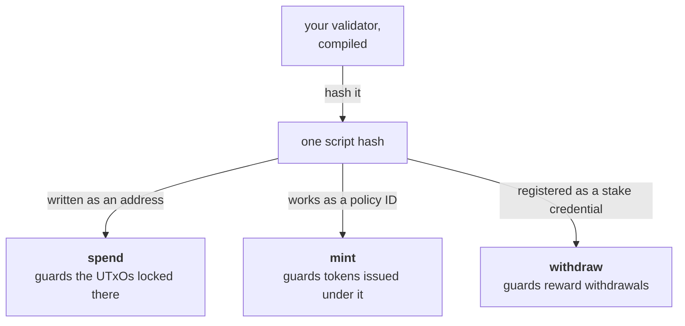
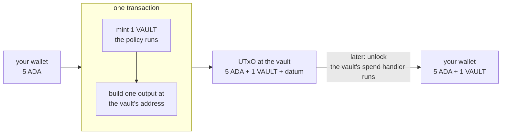

import Tabs from "@theme/Tabs";
import TabItem from "@theme/TabItem";
import CodeBlock from "@theme/CodeBlock";
import extractRegion from "@site/src/utils/extractRegion";
import VaultAiken from "!!raw-loader!@site/examples/onboarding/lectures/intermediate/vault/on-chain/aiken/validators/vault.ak";

# Validator purposes

So far "validator" has meant _guarding a locked UTxO_. A validator can guard several different kinds of action, and the kind it is guarding is called its **purpose**.

These are the purposes you will meet:

| Purpose | Runs when… | The question it's asked |
|---|---|---|
| **spend** | someone spends a UTxO locked at the script address | may this locked UTxO be spent? |
| **mint** | a transaction creates or burns tokens under the script's policy | may these tokens come into existence, or stop existing? |
| **withdraw** | staking rewards are withdrawn under the script | may these rewards be taken? |
| **publish / vote / propose** | certificates or governance actions are submitted | may this certificate or vote go through? |

Every purpose works the same way. Something in a transaction touches your script, the network runs your validator, and it answers **yes or no**. Only the trigger and the thing being guarded change. You have already seen a simpler version of the mint purpose. The Beginner [minting example](/docs/developers/onboarding/lectures/beginner/tokens-fungible-and-nfts) used a **native script** as its policy. You use a validator instead when the rule needs to do more than check who signs and when.

The handler you write changes a little between purposes, because the question changes. A **spend** handler is given the **datum**, because there is a locked UTxO with a note attached to it. A **mint** handler is not, because nothing is being unlocked. Instead it is told which policy is being minted under. All of them receive the redeemer and the whole transaction. Your vault uses **spend** today. In this lecture it gains **mint** as well.

## One validator, one hash, many purposes

A **single validator** can handle **several purposes at once**, and it has exactly **one hash**. That one hash is all of these at the same time:

- its **payment credential** (for the _spend_ purpose),
- its **policy ID** (for the _mint_ purpose),
- its **stake credential** (for the _withdraw_ purpose).



The hash **is** the script's identity, and the way you use that hash decides which question the network asks it.

Because the script sees its own hash in more than one role, it can **connect** them. One script can create a token and also control how the UTxO holding that token is spent, all under one identity. Many real Cardano designs are built this way, using a token as a mark that says "this UTxO is the real one", which only that same script could have created.

## Your vault declares only one purpose

The vault you have been building handles only **spend**. Its source says so in two places: the spend handler you wrote, and the `else` block that **[what a validator is](/docs/developers/onboarding/lectures/intermediate/what-is-a-validator)** asked you to copy without explaining:

<Tabs groupId="onchain">
<TabItem value="aiken" label="Aiken" default>

```aiken
else(_) {
  fail
}
```

</TabItem>
<TabItem value="scalus" label="Scalus">

A [Scalus](https://scalus.org/) version is coming soon. The idea is identical, only the language differs.

</TabItem>
</Tabs>

That is what it has been doing all along: covering **every other purpose**. If anything tries to use this script as a minting policy, or a stake credential, or anything else besides spending, the answer is no. Writing only a spend handler is not the same as making spending the only thing possible. You will see this pair, one real handler plus a refusing `else`, in most small contracts.

## Giving the vault a token of its own

One script *can* carry every purpose at once. Whether it *should* is a design decision, and the vault is about to make the other one.

The token gets a script to itself: a validator whose only handler is `mint`. Its hash is the token's policy id, and it has nothing to do with the vault's address.

Splitting them costs a little. The rules stay small, each one answering about the thing it guards. And the hashes stop moving together, which matters here because **[parameters](/docs/developers/onboarding/lectures/intermediate/parameters)** just put a blank in the vault.

Neither script minds. A transaction can run both, so one transaction still creates the token and locks it in the vault at once.



It reaches you when you unlock, together with the ADA it was guarding.

## Try it

**Give your vault a token of its own.** The vault's `else` block goes on refusing everything but spending, and the token gets a validator of its own beside it.

<Tabs groupId="onchain">
<TabItem value="aiken" label="Aiken" default>

Everything below runs from `on-chain/vault/`, where lecture 2 left you.

The rule needs two things from the standard library: the `PolicyId` type, and `dict`, because the helper that reads the minted tokens hands back a dictionary. In `validators/vault.ak`, add both at the top:

<CodeBlock language="aiken" title="validators/vault.ak">
  {`${extractRegion(VaultAiken, "import-dict")}\n${extractRegion(VaultAiken, "import-policy-id")}`}
</CodeBlock>

The rule also needs a name to check against, so give the token one, above the validator:

<CodeBlock language="aiken" title="validators/vault.ak">
  {extractRegion(VaultAiken, "token-name")}
</CodeBlock>

Now the rule for the token itself. Write it as a **second validator**, below the vault:

<CodeBlock language="aiken" title="validators/vault.ak">
  {extractRegion(VaultAiken, "mint-validator")}
</CodeBlock>

Read the arguments, because they differ from `spend`. **No datum reaches this handler**: a datum belongs to the UTxO being unlocked, and minting unlocks nothing. The transaction can still attach a datum to an output it creates, and the one that mints a token and locks it does, but that note belongs to the new vault UTxO and the mint rule is never handed it. Instead the handler is told its own `policy_id`, which is this script's hash.

`self.mint` holds everything the transaction creates or destroys, under every policy. `assets.tokens` gives back only the tokens minted under this one, as a dictionary of token name to amount, and `dict.to_pairs` turns that into a list. Matching the list against `[Pair(name, _)]` succeeds only if it holds exactly one entry, so the transaction cannot mint a second name under this policy. `name == vault_token` then decides which name that has to be.

**Notice which script this is.** The vault takes `recovery` as a parameter, and this policy takes none, so no need to apply parameters to this one. Change your backup key, and the vault's address changes, from **[parameters](/docs/developers/onboarding/lectures/intermediate/parameters)**. The policy ID stays exactly where it was, because there is nothing to change. Every reader of this track ends up with a different vault and the same token.

```bash
aiken check
aiken build
```

Open `plutus.json` and look at the `validators` list. It now has **four** entries under two hashes. `vault.vault.spend` and `vault.vault.else` share one, `vault.vault_policy.mint` and `vault.vault_policy.else` share the other.

Compare the policy's with ours:

```
736feeda8f96f7bb3d291839666a01c51a1de073ab25c5d7f6056b6c
```

This one you should match exactly: there is no blank to fill, so nothing about your setup can move it.

The vault's is the other kind:

```
5e30f431981846c811b38f89280d99963f23c8df9b71bd1266695ed4
```

If that matches, you wrote the same spend rule we did, byte for byte. Your vault takes a parameter, so this is the script with the blank still in it, from **[parameters](/docs/developers/onboarding/lectures/intermediate/parameters)**. Filling the blank with a real recovery key gives a different hash, and that one is the address funds actually go to.

</TabItem>
<TabItem value="scalus" label="Scalus">

A [Scalus](https://scalus.org/) version is coming soon. The idea is identical, only the language differs.

</TabItem>
</Tabs>

:::note A different hash is not a failure
The hash is made from the **compiled code**, not from what the contract does. Two vaults can follow exactly the same rule and still hash differently, because there is usually more than one way to write the same check, and each one compiles to something slightly different.

So the two things answer different questions. Your **tests** say the vault behaves correctly. The **hash** says you wrote it the same way we did. If yours passes the tests but misses the hash, nothing is wrong: it works, and it simply lives at a different address than ours. Only worry if the tests fail.
:::

**And unlocking needs no change at all.** The vault's spend handler still checks the owner's signature, exactly as it did before there was a token.

The purpose the network runs follows from what the transaction does:

- Unlock vested funds after a deadline: **spend**
- Create a one-of-a-kind NFT: **mint**
- Claim your staking rewards: **withdraw**

Any one script can be asked all three questions. Yours answers two of them across two scripts, which is the more common shape once a contract grows.

**Now prove the new validator.** A `mint` handler is a new rule, so it needs its own tests, and they are written exactly like the ones you already have.

<Tabs groupId="onchain">
<TabItem value="aiken" label="Aiken" default>

These need nothing new imported. `assets` came in with the rule, and `transaction.placeholder` is the same empty transaction context your spend tests start from. Add them at the bottom of the file:

<CodeBlock language="aiken" title="validators/vault.ak">
  {extractRegion(VaultAiken, "mint-tests")}
</CodeBlock>

Minting the vault's token passes, burning it passes, minting anything else is refused: exactly the rule you wrote. `assets.from_asset` fills the mint field the way the network would, and `Void` is the redeemer, because that handler ignores it. Nothing leads these calls, unlike the ones into `vault`: a parameter comes first in every handler of a parameterised validator.

```bash
aiken check
```

Eight tests, eight passes. Five of them are the spend rule from the last two lectures, still green, which is the other thing a test suite is for: you just added a whole new script beside the vault and you know for certain you did not disturb it.

**Then break the new rule.** Change `"VAULT"` in the constant to `"IMPOSTOR"` and run `aiken check` again. `mint_ok_for_a_correctly_named_token` and `mint_fails_for_a_wrongly_named_token` both go red together: one says the allowed case is now refused, the other says the forbidden case is now allowed. Put the name back.

</TabItem>
<TabItem value="scalus" label="Scalus">

A [Scalus](https://scalus.org/) version is coming soon. The idea is identical, only the language differs.

</TabItem>
</Tabs>

## Your contract is finished

That is the vault: a spend rule with two doors, a mint policy guarding its own token, and eight tests saying so.

Nothing after this changes it. **[Frontend integration](/docs/developers/onboarding/lectures/intermediate/frontend-integration)** is the whole off-chain side in one go: the address, the transactions that lock, unlock, recover and mint, the tests that drive them, and a page in a browser with buttons on it.

Stuck? The finished code is in the playground. See the **[introduction](/docs/developers/onboarding/lectures/intermediate/introduction#the-playground)**.

## Go deeper

- [Write a Validator](/docs/developers/curriculum/smart-contracts/write-a-validator): "one validator, many purposes, one hash," with real handlers.
- [Smart Contracts (overview)](/docs/developers/curriculum/smart-contracts/overview): the full purpose table.
- [Minting policies](/docs/developers/curriculum/native-tokens/minting-policies): the mint purpose in depth, native and script policies side by side.
- [Staking](/docs/developers/curriculum/staking-governance/staking): where stake credentials and the withdraw purpose fit in.

Next: **[Off-chain and frontend integration](/docs/developers/onboarding/lectures/intermediate/frontend-integration)**.
