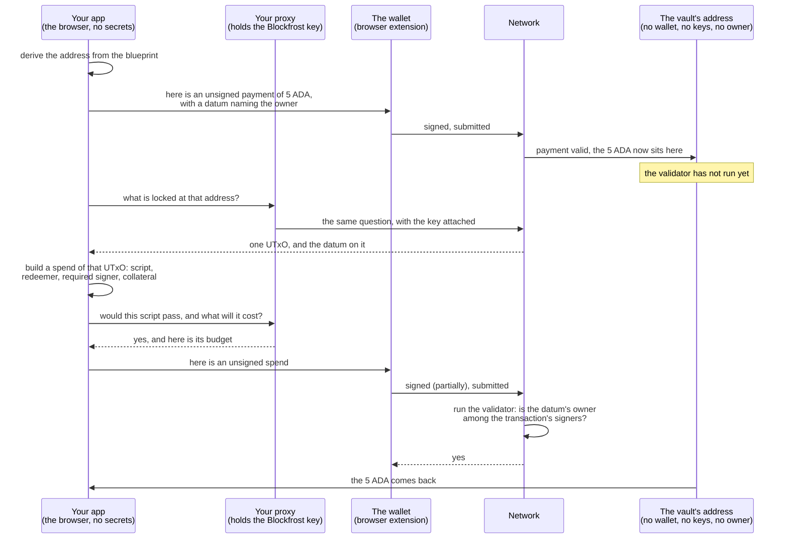

import Tabs from "@theme/Tabs";
import TabItem from "@theme/TabItem";
import CodeBlock from "@theme/CodeBlock";
import extractRegion from "@site/src/utils/extractRegion";
import Blueprint from "!!raw-loader!@site/examples/onboarding/lectures/intermediate/vault/off-chain/mesh/src/lib/blueprint.ts";
import Datum from "!!raw-loader!@site/examples/onboarding/lectures/intermediate/vault/off-chain/mesh/src/lib/datum.ts";
import LockLib from "!!raw-loader!@site/examples/onboarding/lectures/intermediate/vault/off-chain/mesh/src/lib/lock.ts";
import UnlockLib from "!!raw-loader!@site/examples/onboarding/lectures/intermediate/vault/off-chain/mesh/src/lib/unlock.ts";
import FetchLib from "!!raw-loader!@site/examples/onboarding/lectures/intermediate/vault/off-chain/mesh/src/lib/fetch.ts";
import MintLib from "!!raw-loader!@site/examples/onboarding/lectures/intermediate/vault/off-chain/mesh/src/lib/mint.ts";
import OfflineTests from "!!raw-loader!@site/examples/onboarding/lectures/intermediate/vault/off-chain/mesh/src/vault.test.ts";
import Minimal from "!!raw-loader!@site/examples/onboarding/lectures/intermediate/vault/off-chain/mesh/src/app.tsx";

# Off-chain and frontend integration

Your contract is finished. It compiles, its eight tests pass, and it has a hash. And it can do nothing at all, because **a contract cannot act**. It only answers yes or no when something asks it to.

That something is your app, and this lecture is the whole of it. **[On-chain vs off-chain](/docs/developers/onboarding/lectures/intermediate/on-chain-vs-off-chain)** drew the line at the start of this track and left `off-chain/` folder empty, everything on that side of the line arrives here, in one go. By the end you will have a page in a browser with a **Connect wallet** button, a **Lock** button and an **Unlock** button, driving the vault you wrote.

It arrives all at once for a reason. The contract is where the thinking is, and it changed with every lecture: a datum, a rule, a parameter, a second purpose. The off-chain half barely changes at all. It is the same few builders every time: derive the address, attach the datum, spend the UTxO. Writing them against a contract that has stopped moving is far easier than rewriting them six times as the contract grows.

**You write all of it, and there is less than you think.** Six files carry a Cardano idea: the address, the datum, and the four transactions your page sends. The rest is the page, its config, and the tests that prove the whole thing before a wallet is ever connected. Nothing is downloaded, and every file is short enough to read.

## The bridge: from blueprint to address

The off-chain side starts from `plutus.json`, the file your compiler wrote. It holds the compiled validator. Filling in its parameter finishes the script, and hashing the finished script gives the **address**. **[Parameters](/docs/developers/onboarding/lectures/intermediate/parameters#why-a-parameter-changes-the-address)** drew that chain and promised you the two lines of code at the end of it. You write them below, in the first file you create.

Deriving the address is not a deployment. The address exists because the contract exists, so you could work it out on a computer that has never been online, and anyone with the same contract and the same parameter arrives at the same address.

## Lock, then unlock

Locking is an ordinary payment that happens to be addressed to a script, with the datum attached to the output, exactly as **[what a validator is](/docs/developers/onboarding/lectures/intermediate/what-is-a-validator#locking-is-just-a-payment)** described. **Unlocking is where the contract runs.** That transaction still carries everything a plain payment does, its inputs, outputs, fee, signatures and validity window, and it carries four things a plain payment never needs:

- the **script** itself, because the network cannot run a program it has not been given.
- the **redeemer**, because the validator has to be told which action you are taking.
- a **required signer** entry, because the rule reads the signer list and this is what puts you on it.
- **collateral**, a deposit the network keeps if the script fails after passing its checks.

The third of those is the one people most often forget. Your wallet signing a transaction is not the same as your key hash appearing in the transaction's required-signers field. That field is `extra_signatories`, the one your vault reads in **[the transaction context](/docs/developers/onboarding/lectures/intermediate/transaction-context)**, and asking for it is a separate step from signing. Forget it and the signature is there but the validator cannot see it, so a correct contract refuses a legitimate spend.

Minting adds nothing conceptually, because the same hash is both the address and the policy id, the identifier saying which script may create a token. That is **[validator purposes](/docs/developers/onboarding/lectures/intermediate/validator-purposes)** in practice. Minting does add collateral, because it runs a script, and a plain lock does not.

## Collateral, and what a script costs

Collateral is a deposit the network takes only when a script fails after passing structural checks. The rules are in **[fees](/docs/developers/curriculum/fundamentals/core-concepts/fees#collateral)** and the two-phase model behind them is in **[transaction failures](/docs/developers/curriculum/start-building/transaction-failures#the-two-phase-model)**. Three things about it are specific to what you are building:

- It must hold **only ADA**, and it must sit at a **plain key address** with no script guarding it. Otherwise the network would need to run a second script just to collect the deposit.
- **In normal use it is never taken**, because the validator runs before you send anything. In the tests below that happens on your own machine. In the page, the job goes to the **provider**, the service that reads the chain for you, which is Blockfrost here: the builder is handed that same provider a second time, in the role of **evaluator**.
- This is the first project whose **code** reads the chain, which is why it needs a Blockfrost key when the Beginner track never did. The builder resolves inputs and fee settings through the provider, and the check before you send asks it to run your script as well.

:::tip Set collateral once and forget it
In **[Lace](https://www.lace.io/)** this is a one-time setup that sets a few ADA aside. See the [Lace FAQ](https://www.lace.io/faq). The ADA is still yours and still counted in your balance, only reserved. Without it, every script spend you build fails before it leaves your machine, with a "no collateral" error.
:::

Unlocking also costs more than locking, because it runs a program and that is priced separately in **[execution units](/docs/developers/curriculum/fundamentals/core-concepts/fees#script-execution-fees)**. Our vault is about as small as a contract can be, so here the difference is a fraction of a test ADA. The mechanism is the same at any size.

## The browser half

Every builder below ends the same way: it returns an **unsigned transaction**. Your app builds, the **wallet** signs and submits, and your code never sees a key. That division is [CIP-30](/docs/developers/curriculum/dapps/connect-a-wallet#what-cip-30-gives-you), the interface every Cardano wallet exposes to a page, which is why an app written for one wallet works with the rest.

One detail about signing an unlock is worth knowing before you see it in code. The wallet signs **partially**: it signs the inputs it owns and leaves the rest alone. One of those inputs is the locked UTxO, and it sits at a script address, where no key can sign for anything. Whether it may be spent is the validator's decision, made when the network runs it. Ask the wallet for a complete signature instead and it refuses, because you are asking it to sign for something it has no key for.

## The browser cannot keep a secret

For the first half of this lecture your Blockfrost key sits in `.env`, and that is safe, because everything reading it runs on your own machine. A browser app is the opposite. Everything it needs in order to run has to be **sent to the person using it**, and anything sent can be read. There is no private part of a page, so a key written into that JavaScript is not hidden. It is published.

Vite, the build tool that serves and bundles your page, draws that line for you: **your page can only read variables whose names start with `VITE_`, and whatever it reads is written into the files it ships.** Everything else in `.env` stays on your machine, where the backend can still read it, and never reaches the browser at all. That is why your key is never given the prefix, and why the network id is.

So the key has to live somewhere the browser never reaches: your **page** builds transactions and holds no secrets, and a small **proxy**, running on a machine you control, holds the key and is the only thing that talks to Blockfrost. The full version of that split, where transaction building moves server-side too, is **[frontend signs, backend builds and submits](/docs/developers/curriculum/dapps/connect-a-wallet#frontend-signs-backend-builds-and-submits)**. Here only the provider calls move, which is enough to protect the key.

## The whole flow, both halves together



## Try it

**Fill the other half of your workspace.** You have been inside `on-chain/vault/` since **[set up your tools](/docs/developers/onboarding/lectures/intermediate/tools)**. From there, go up two levels to the workspace root, because everything below is about the other half:

```bash
cd ../..    # from cardano-vault/on-chain/vault/ back to cardano-vault/
```

That is the last folder change in the track. Every command from here runs from `cardano-vault/`.

<Tabs groupId="offchain">
<TabItem value="mesh" label="Mesh" default>

### 1. The app project

You need **[Node.js](https://nodejs.org/) 22.18 or newer**, because from that version it runs TypeScript files directly, with no build step.

```bash
npm init -y
npm pkg set type=module
npm install @meshsdk/core@^1.9.1 @meshsdk/core-csl@^1.9.1 @meshsdk/wallet@^1.9.1
mkdir off-chain/src off-chain/src/lib
```

The SDK project is just a `package.json`. `npm pkg set type=module` switches it to modern `import` syntax, which the SDK uses. Of the three packages, `@meshsdk/core` is Mesh itself, `@meshsdk/core-csl` is the **evaluator** that runs a compiled validator on your own machine, and `@meshsdk/wallet` is a wallet that signs without a browser.

Note where that `package.json` landed: the **workspace root**, not inside `off-chain/`. `npm` acts on the folder holding `package.json`, and `node` looks there for the packages it installed, so putting it at the root means every command in this track still runs from `cardano-vault/`.

### 2. From blueprint to address

The first file you write, and the bridge the top of this lecture describes. Create `off-chain/src/lib/blueprint.ts`:

<CodeBlock language="ts" title="off-chain/src/lib/blueprint.ts">
  {extractRegion(Blueprint, "file")}
</CodeBlock>

Four things in it are worth reading slowly:

- **The import path** reaches across into the other half of your workspace: from `off-chain/src/lib/` that is `"../../../on-chain/vault/plutus.json"`. This is the only place the two halves touch, and it is a file, not a network call.
- **The title** `vault.vault.spend` is `<file>.<validator>.<purpose>`, so it names your `vault.ak`, its `vault` validator, and its spend handler.
- **`applyParamsToScript`** fills the blank from **[parameters](/docs/developers/onboarding/lectures/intermediate/parameters)**. These are the two lines that lecture promised you.
- **`RECOVERY`** is that parameter, and it decides the address. Any 56-character hex string works, which is 28 bytes written out, but whatever you choose has to stay the same forever.

:::caution Changing RECOVERY moves the vault
It is part of the script, so it is part of the hash, so it is part of the address. Lock funds with one value, change a single character, and your app will look for them somewhere else entirely and find nothing. The funds are not lost, they are at the old address, but you would have to put the old value back to reach them.
:::

### 3. The datum and the redeemers

The shapes from **[datum & redeemer](/docs/developers/onboarding/lectures/intermediate/datum-and-redeemer)**, now built from the other side. Create `off-chain/src/lib/datum.ts`:

<CodeBlock language="ts" title="off-chain/src/lib/datum.ts">
  {extractRegion(Datum, "file")}
</CodeBlock>

`mConStr0` is the numbered-constructor encoding that lecture described. `mConStr0([ownerPubKeyHash])` is constructor 0 carrying one field, which is the `VaultDatum { owner }` your validator expects. `mConStr0([])` is constructor 0 carrying nothing, which is `Unlock`. And `mConStr1([])` is constructor 1, which is `Recover`, because it is declared second in `VaultAction`. Get those last two the wrong way round and nothing announces it: the vault reads the other branch and checks the other key.

### 4. The four transactions

These are the whole off-chain half: lock funds, find them again, unlock them, and mint the vault's own token. First `off-chain/src/lib/lock.ts`:

<CodeBlock language="ts" title="off-chain/src/lib/lock.ts">
  {extractRegion(LockLib, "file")}
</CodeBlock>

An ordinary payment, with two additions. `deserializeAddress(...).pubKeyHash` pulls your key hash out of your address, which is what goes in the datum, and `.txOutInlineDatumValue(...)` attaches that datum to the output. No script, no collateral, no redeemer: the contract does not run when you lock.

Notice the wallet argument. It is typed as `IWallet`, the interface Mesh defines, and nothing here names a particular wallet. That is why the same file works with the seed-phrase wallet your tests use in step 5 and with the browser extension your page uses in step 7.

Then `off-chain/src/lib/unlock.ts`, which is where the contract does run:

<CodeBlock language="ts" title="off-chain/src/lib/unlock.ts">
  {extractRegion(UnlockLib, "file")}
</CodeBlock>

Every extra line here is one item in that list. `.txInScript` carries the compiled contract, `.txInRedeemerValue` says which action you are taking, `.txInCollateral` offers the deposit, and `.requiredSignerHash(owner)` is the one people forget: it puts your key hash in `extra_signatories`, which is the list your validator actually reads.

One argument is worth stopping on, because the next step is built on it. Passing an **evaluator** makes the builder run your **real compiled validator** before it returns anything. A spend the contract would refuse fails here, immediately, instead of on the chain where it would cost you the collateral.

Next `off-chain/src/lib/fetch.ts`, because you cannot unlock what you cannot find. A script address is an ordinary address, so this is the same [UTxO query](/docs/developers/curriculum/start-building/query-the-chain#datums) you have made since Beginner:

<CodeBlock language="ts" title="off-chain/src/lib/fetch.ts">
  {extractRegion(FetchLib, "file")}
</CodeBlock>

Read the filter, because it is the point. **The vault's address is not yours.** It belongs to nobody, and anyone who compiled the same contract with the same parameter arrives at the same address, so what sits there is everyone's UTxOs mixed together. The only thing that says which are yours is the `owner` in each datum, which is exactly what your validator will check later.

Last `off-chain/src/lib/mint.ts`, which is `lock.ts` plus the mint from **[validator purposes](/docs/developers/onboarding/lectures/intermediate/validator-purposes)**, in one transaction:

<CodeBlock language="ts" title="off-chain/src/lib/mint.ts">
  {extractRegion(MintLib, "file")}
</CodeBlock>

`vaultPolicyId()` hashes the same compiled script that gives you the address. One value, two roles, the whole point of that lecture, now in code. `.mint("1", ...)` creates exactly one token, which is precisely what your handler allows.

### 5. Prove it offline

Nothing has run yet. **[Testing](/docs/developers/onboarding/lectures/intermediate/testing)** named a third level of testing it could not reach, because there was no app to test. There is now, and it needs no wallet, no test ADA and no network.

Create `off-chain/src/vault.test.ts`. The imports first:

<CodeBlock language="ts" title="off-chain/src/vault.test.ts">
  {extractRegion(OfflineTests, "offline-imports")}
</CodeBlock>

Then a pretend chain and a wallet to go with it. `OfflineFetcher` is an in-memory chain you fill in yourself, and `MeshWallet` is a wallet built from a seed phrase rather than an extension:

<CodeBlock language="ts" title="off-chain/src/vault.test.ts">
  {extractRegion(OfflineTests, "offline-setup")}
</CodeBlock>

Then a few helpers for putting UTxOs on that chain. A real chain hands you a transaction hash; here you invent one, because nothing was ever submitted:

<CodeBlock language="ts" title="off-chain/src/vault.test.ts">
  {extractRegion(OfflineTests, "offline-helpers")}
</CodeBlock>

Now the first test. Locking runs no contract, so this one only has to build:

<CodeBlock language="ts" title="off-chain/src/vault.test.ts">
  {extractRegion(OfflineTests, "offline-lock")}
</CodeBlock>

And the second, which is the one that matters. It calls the very same `buildUnlockTx` your page will call, then evaluates it, which runs your **real compiled validator**. Getting an execution budget back means the contract said yes:

<CodeBlock language="ts" title="off-chain/src/vault.test.ts">
  {extractRegion(OfflineTests, "offline-unlock")}
</CodeBlock>

Run it:

```bash
node --test off-chain/src/vault.test.ts
```

Two tests, two passes, in a few milliseconds. Node runs the TypeScript directly, which is why step 1 asked for 22.18 or newer.

Expect some extra output above that result, including a warning that cost models fell back to defaults. That is the offline chain saying it has no real protocol parameters, the network's current fee and size settings, to hand out. Read the `pass` and `fail` counts at the bottom, not the messages above them.

**Now break the off-chain side, and watch which layer notices.** In `off-chain/src/lib/unlock.ts`, delete the `.requiredSignerHash(owner)` line and save.

Run `aiken check on-chain/vault` first, passing the project folder now that you are one level above it. All eight contract tests still pass, because the contract is still correct. Nothing is wrong with the rule.

Then run the test file again. It fails, in the same few milliseconds, and the evaluator reports which script did the refusing:

```
"tag":"spend","errorMessage":"the validator crashed / exited prematurely"
```

That `"tag":"spend"` says the refusal came from the spend validator, not from a transaction that failed to build. The gap between a correct contract and an app that builds the wrong transaction is invisible to a contract test, and this is exactly what catches it. Finding it took milliseconds and no test ADA. Finding it on the network would have meant locking real funds first and waiting for two confirmations.

Put the line back and run it once more to be sure.

### 6. The key, and where it lives

Everything so far ran on your machine and nowhere else. A page is different: everything it needs is sent to whoever opens it. So the key gets its own file, which the page never reads.

First a `.env` file at the top of `cardano-vault/`, beside `package.json`, so no key is ever written into your code:

```bash title=".env"
BLOCKFROST_API_KEY=previewYourKeyHere
VITE_NETWORK_ID=0
```

- `BLOCKFROST_API_KEY` your Preview **project id**, from your project's page on [blockfrost.io](https://blockfrost.io/). It starts with `preview`.
- `VITE_NETWORK_ID` `0` for a test network, which is Preview here, and `1` for mainnet. This is the one that carries the `VITE_` prefix, for the reason the section above gives: the page needs it, and it is not a secret.

Nothing in this track puts `cardano-vault/` into version control, but the day you do, add `.env` to a `.gitignore` **before** the first commit. A key in a commit is a key you have given away, even if you delete it in the next one.

Nothing reads that key in the browser. What reads it is a **proxy**: a rule that catches every call your page makes to `/api/blockfrost/…`, adds the key, and passes the call on to Blockfrost. Your page therefore only ever talks to its own origin. You write that rule in the next step, because it lives in the same file that configures the page.

### 7. The page, and run it

The last piece: a browser, a wallet and a user.

```bash
npm install react react-dom
npm install -D vite @vitejs/plugin-react typescript vite-plugin-node-polyfills @types/react @types/react-dom
npm pkg set scripts.dev=vite
npm pkg set scripts.build="vite build"
```

`vite` is the dev server, and the `build` script is there for the last exercise in this lecture. `typescript` and the `@types/` packages are for your editor rather than for any command here. `vite-plugin-node-polyfills` is the surprising one: Mesh reaches for Node built-ins like `Buffer` and `crypto`, which a browser does not have, so they have to be supplied.

Two small files Vite needs, and they are the only ones whose paths depend on where things sit in your workspace. `index.html` goes at the top of `cardano-vault/`, beside `package.json`, because Vite serves the folder you run it from:

```html title="index.html"
<!doctype html>
<html lang="en">
  <head>
    <meta charset="UTF-8" />
    <title>My vault</title>
  </head>
  <body>
    <div id="root"></div>
    <script type="module" src="/off-chain/src/app.tsx"></script>
  </body>
</html>
```

And `vite.config.ts` beside it, which carries the proxy rule from the step before:

```ts title="vite.config.ts"
import { defineConfig, loadEnv } from "vite";
import react from "@vitejs/plugin-react";
import { nodePolyfills } from "vite-plugin-node-polyfills";

export default defineConfig(({ mode }) => {
  // Read `.env` here, in Node. Nothing in this file reaches the browser.
  const env = loadEnv(mode, process.cwd(), "");
  const key = env.BLOCKFROST_API_KEY ?? "";

  const proxy = {
    "/api/blockfrost": {
      target: `https://cardano-${key.slice(0, 7)}.blockfrost.io/api/v0`,
      changeOrigin: true,
      rewrite: (path: string) => path.replace(/^\/api\/blockfrost/, ""),
      headers: { project_id: key },
    },
  };

  return {
    plugins: [
      react(),
      nodePolyfills({ globals: { Buffer: true, global: true, process: true } }),
    ],
    server: { proxy },
    preview: { proxy },
  };
});
```

Four lines do the work. `target` is where the calls really go, `rewrite` strips the `/api/blockfrost` prefix your page uses, `headers` attaches the key, and `changeOrigin` makes the request look like it came from Blockfrost's own host. The network comes from the key itself: a Blockfrost key names its own network in its first seven characters, which is why one variable configures both halves.

:::note This proxy runs with the dev server, not on the internet
`server.proxy` applies to `npm run dev` and `preview.proxy` to `npm run preview`, which is everything this lecture needs. A deployed site has no Vite, so hosting this page for real means giving your host the same rule: a redirect on Netlify or Vercel, a `location` block in nginx, or a small server of your own. What must stay true is the shape: the browser calls your origin, and something you control adds the key.
:::

**And none of `off-chain/src/lib/` changes here.** Until now a `MeshWallet` built from a seed phrase satisfied the `IWallet` argument your builders take. A browser wallet satisfies exactly the same one. That is the whole swap, and it is why those builders were typed against the interface Mesh defines rather than against a particular wallet.

So the last file you write is the page. Create `off-chain/src/app.tsx`:

<CodeBlock language="tsx" title="off-chain/src/app.tsx">
  {extractRegion(Minimal, "file")}
</CodeBlock>

Look at the provider line first, because it is the entire client-side cost of keeping the key out of the browser:

```ts
const provider = new BlockfrostProvider("/api/blockfrost");
```

No key, and no change anywhere else. Mesh supports this directly: hand `BlockfrostProvider` a path instead of a project id and it treats it as a privately hosted Blockfrost, which is exactly what yours now is. Nothing in `off-chain/src/lib/` had to move for that, which is why those builders take a `provider` instead of creating one of their own.

Three more things in it are the browser half from above, in code:

- `BrowserWallet.enable("lace")` is the permission handshake. Swapping `"lace"` for another wallet id is the only change another wallet needs.
- `wallet.signTx(unsignedTx, true)` is the **partial** signature. Drop that `true` on the unlock and the wallet refuses, because you are asking it to sign a script input it holds no key for.
- `buildUnlockTx(wallet, provider, utxo, provider)` passes `provider` twice on purpose. The first is the **fetcher**, for looking things up; the second is the **evaluator**, which runs your contract before you send it.

Start it:

```bash
npm run dev
```

Open the printed URL **in the browser where Lace is installed**, with Lace set to Preview and collateral already set. Then, in order:

1. **Connect wallet.** The extension asks for permission once.
2. **Lock 5 ADA.** Approve it. This is the plain payment: no contract runs.
3. **Refresh locked** after a few seconds, and your UTxO appears. That is your ADA sitting at an address nobody owns.
4. **Unlock.** This one runs your validator. The funds come back.
5. **Mint & lock 5 ADA.** The same lock, plus a VAULT token created under the contract's own policy, in one transaction. **Refresh locked** and unlock it the same way: the token comes back with the ADA.

If the page loads but **Lock** fails, look at `.env` before anything else. A Preview key starts with `preview`, and a mainnet or mistyped key shows up as a 401 on `/api/blockfrost/…` in the browser's **Network** tab.

**Then prove the key is gone.** Open the developer tools, go to the **Network** tab, and press **Refresh locked**. Every request goes to `/api/blockfrost/…` on your own origin, and none to `blockfrost.io`. The browser is not talking to the provider at all. It cannot, because it has nothing to authenticate with.

Now check the code that goes to the browser, which is the part that would have been public:

```bash
npm run build
```

Then search `dist/` for your key. It is not there. Without the proxy it would have been, sitting in `dist/assets/index-*.js`, where anyone who opened your page could have read it. Search for the bare word `preview` instead and you will get hits, but those are Mesh's own network names, not your key.

**And notice which rules applied where.** Your proxy reads the key straight out of `.env` and that is correct: it runs on your machine, for you. The page goes to anyone who opens it, so it gets none of it. Same key, same file, trusted in one place and not in the other, and the only thing that decides which rules apply is **where the code runs**.

**Then break it on purpose, one last time.** You already watched the offline tests catch a missing `.requiredSignerHash(owner)`. Delete that line again and press **Unlock** here. Nothing reaches the chain: the check before sending, where your proxy asks Blockfrost to run the script, already said no. The owner's key was never in `extra_signatories`, so `list.has` was false. Same refusal, same rule, now with a wallet connected and real test ADA at stake. Put the line back.

</TabItem>
<TabItem value="evolution" label="Evolution">

An [Evolution](https://github.com/IntersectMBO/evolution-sdk) version is coming soon. The idea is identical, only the library calls differ.

</TabItem>
</Tabs>

Stuck? The finished code is in the playground — see the **[introduction](/docs/developers/onboarding/lectures/intermediate/introduction#the-playground)**.

## That is the vault, finished

You started with an empty folder. You now have a contract you wrote and tested, with two purposes under one hash, and an app that locks, mints and unlocks real test ADA through it.

Look back at what each half cost. The contract took six lectures, because every one of them changed what the rule was. The app took one, because there was only ever one shape to it: derive the address, attach the datum, spend the UTxO, hand it to a wallet. That difference is not an accident of this example. It is the normal shape of Cardano work, and it is why the rest of this track goes straight back to contracts.

Each of the remaining lectures is the same shape with a different rule in the middle. The contracts arrive finished, and each lecture has you break one and write the missing rule back:

- **Handling time** — funds that cannot move before a date.
- **Multi validators** — a token that acts as a key, where burning it is what opens the lock.
- **Modifying state** — data that is updated instead of released.
- **Reference inputs & scripts** — one contract reading another's data.

## Go deeper

- [Lock and Spend](/docs/developers/curriculum/smart-contracts/lock-and-spend) — the same two transactions, using more of what the SDK offers.
- [Query the chain](/docs/developers/curriculum/start-building/query-the-chain) — providers, and reading datums back out.
- [Use a provider](/docs/developers/curriculum/production/use-a-provider) — keys, quotas and what to do when one goes down.
- [Offline testing](/docs/developers/curriculum/start-building/offline-testing) — mocking the chain and evaluating budgets without a node.
- [Connect a wallet](/docs/developers/curriculum/dapps/connect-a-wallet) — CIP-30 in full, and the backend-builds pattern this lecture starts.
- [Going to production](/docs/developers/curriculum/production/going-to-production) — the rest of the checklist this is one line of.
- [Optimization](/docs/developers/curriculum/smart-contracts/advanced/optimization) — keeping execution units, and therefore fees, down.

Next: **Handling time: vesting**.
