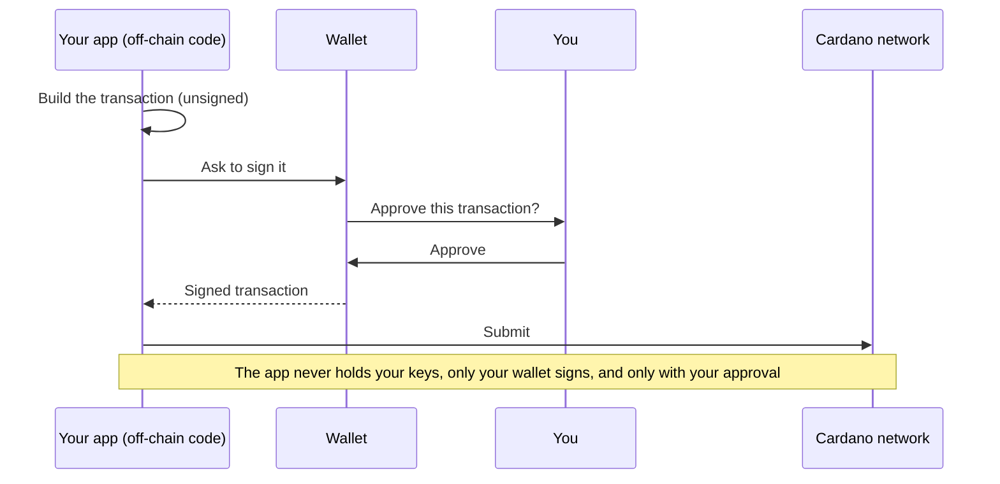

import Tabs from "@theme/Tabs";
import TabItem from "@theme/TabItem";
import CodeBlock from "@theme/CodeBlock";
import extractRegion from "@site/src/utils/extractRegion";
import Blueprint from "!!raw-loader!@site/examples/onboarding/atomic-swap/off-chain/mesh/src/lib/blueprint.ts";
import Datum from "!!raw-loader!@site/examples/onboarding/atomic-swap/off-chain/mesh/src/lib/datum.ts";
import Mint from "!!raw-loader!@site/examples/onboarding/atomic-swap/off-chain/mesh/src/lib/mint.ts";
import Lock from "!!raw-loader!@site/examples/onboarding/atomic-swap/off-chain/mesh/src/lib/lock.ts";
import Fetch from "!!raw-loader!@site/examples/onboarding/atomic-swap/off-chain/mesh/src/lib/fetch-offers.ts";
import Swap from "!!raw-loader!@site/examples/onboarding/atomic-swap/off-chain/mesh/src/lib/swap.ts";
import Cancel from "!!raw-loader!@site/examples/onboarding/atomic-swap/off-chain/mesh/src/lib/cancel.ts";

# Off-chain: build the transactions

The contract from the last page only ever answers one question: _is this transaction allowed?_ It doesn't build transactions. That's this part's job.

"Off-chain" means the code that runs **on your computer** or a **regular server** (not on the blockchain). It's the program that assembles each transaction, creating tokens, making an offer, accepting one, and hands it to the wallet to sign and send. It can be written in many languages that have a Cardano SDK (pick one in the tabs below).

Each function below takes a **wallet** and a **provider** (your connection to the chain), so the exact same code works both in the browser and in the automated tests.

## The app prepares, your wallet signs

Notice what each function below returns: an **unsigned** transaction. The off-chain code only _prepares_ the transaction, it lays out the inputs, outputs, and rules, but it can't authorize it, and it never sees your private keys. Only your **wallet** can sign, and it does so only after you review and approve the request. The signed transaction is then submitted to the network. So even though the app builds the transaction, nothing moves without your explicit approval:

<Tabs groupId="offchain">
<TabItem value="mesh" label="Mesh" default>

## Find the contract

First we load the compiled `plutus.json` from the previous page. It tells us the contract's **address** (where offers get locked) and each person's token id.

<CodeBlock language="ts" title="blueprint.ts">
  {extractRegion(Blueprint, "blueprint")}
</CodeBlock>

## Write the offer note

This builds the **datum** the offer note in the exact shape the contract expects: who to pay (the seller's full wallet address, payment key **and** stake key), and what they want back.

Notice how the price is built to **match the on-chain type field for field**. The contract's `PricedAsset { policy_id, asset_name, quantity }` becomes `mConStr0([policyId, assetName, quantity])` here, the same three fields, in the same order (`mConStr0` just means "constructor 0," the shape the contract reads back). The redeemers line up the same way: the on-chain `SwapAction { Swap, Cancel }` becomes `mConStr0([])` and `mConStr1([])`.

<CodeBlock language="ts" title="datum.ts">
  {extractRegion(Datum, "datum")}
</CodeBlock>

## Create a token

This builds a transaction that mints one token (Bob runs it for GOLD, Alice for SILVER).

<CodeBlock language="ts" title="mint.ts">
  {extractRegion(Mint, "mint")}
</CodeBlock>

:::tip What just happened
Running this transaction creates a brand-new token and drops it into the wallet that made it. After it confirms, the GOLD (or SILVER) shows up in that wallet's balance.
:::

## Make an offer

This builds the transaction that moves Bob's GOLD **into the contract**, with the offer note attached.

<CodeBlock language="ts" title="lock.ts">
  {extractRegion(Lock, "lock")}
</CodeBlock>

:::tip What just happened
Bob's GOLD is no longer in his wallet, it now sits at the contract's address, tagged with "I want 5 SILVER." It stays there, visible to everyone, until someone accepts or Bob cancels. Note this transaction only _moves_ the token into the contract, the swap rule doesn't run here. It runs later, when someone spends this locked GOLD (the accept, or a cancel).
:::

## List the open offers

To show offers in the app, we read the contract's address and decode each locked token's note back into a readable offer.

<CodeBlock language="ts" title="fetch-offers.ts">
  {extractRegion(Fetch, "fetch")}
</CodeBlock>

## Accept an offer (the swap)

This is the heart of it. It builds the single transaction that pays the owner the price they asked for **and** takes the locked token, tagging the payment to this exact offer, exactly as the contract requires. Because this transaction spends a token sitting at the contract's address, it also **attaches the contract's code** (`txInScript`) so the network can run it and check the swap.

<CodeBlock language="ts" title="swap.ts">
  {extractRegion(Swap, "swap")}
</CodeBlock>

:::tip What just happened
In one transaction, Bob received his 5 SILVER and Alice walked away with the GOLD. Because both moves were in the same transaction, there was never a moment where one person had both, the trade was all-or-nothing.
:::

## Cancel an offer

If no one accepts, the owner can take their token back. This spends the locked UTxO with the `Cancel` action instead of `Swap`, and the contract allows it only when the owner signs, so we add them as a required signer. No one is paid, the token just returns to the owner.

<CodeBlock language="ts" title="cancel.ts">
  {extractRegion(Cancel, "cancel")}
</CodeBlock>

</TabItem>
<TabItem value="evolution" label="Evolution">

An [Evolution](https://github.com/IntersectMBO/evolution-sdk) version of the same steps is coming soon. The contract is identical — only the library calls differ.

</TabItem>
</Tabs>

**Go deeper:** the [Your first transaction](/docs/developers/curriculum/start-building/your-first-transaction) and [Transaction building](/docs/developers/curriculum/start-building/transaction-building) curriculum pages explain how Cardano transactions work in full.

Next: [put a web page on it](/docs/developers/onboarding/tutorial/frontend).
