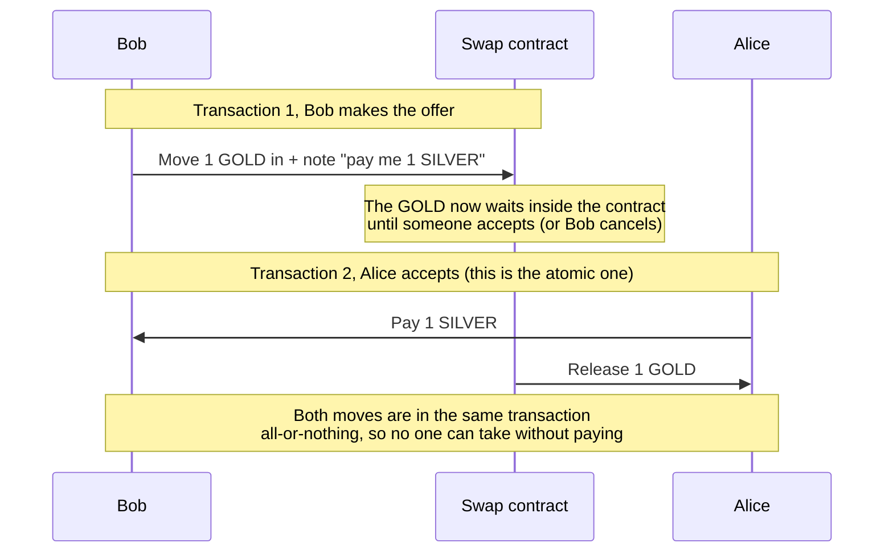

# Build an Atomic Swap, end to end

Welcome! In this tutorial you'll set up and run one small, complete app on Cardano, and see how all the pieces fit together. You'll do everything on a **Testnet**(free practice network), so nothing here costs real money.

That app is an **atomic swap**, a way for two people to trade tokens directly, without a middleman and without either one having to trust the other.

:::info New to Cardano? Start here
A few words you'll see throughout in plain terms:

- **Token** a digital item you can own and transfer. Here we'll create two, called GOLD and SILVER. **Wallet**, an app that holds your tokens and money and lets you approve actions. It's your account and your identity. In a real swap two people would use two wallets, but in this hands-on demo you'll use a single wallet and play both sides, to keep it simple.
- **Transaction** a single instruction that changes the blockchain (for example, "move this token from here to there"). Every transaction costs a tiny fee, paid in Cardano's coin, **ADA**.
- **UTxO** short for "unspent transaction output". On Cardano your balance isn't a single number, it's made up of separate chunks of value, like the individual bills and coins in a wallet. Each chunk is one UTxO. Paying works just like using cash: you hand over whole chunks and get new ones back as change.
- **Smart contract** a small program stored on the blockchain that can hold tokens and enforce rules. Once it's deployed, nobody can bypass its rules, not even the person who wrote it.
- **dApp** a "decentralized app": a normal app whose important logic runs on the blockchain (in a smart contract) instead of on a company's server.

Don't worry about memorizing these, we'll explain each one again as you use it.
:::

## The problem we're solving

Two people, **Alice** and **Bob**, each created a token and want to trade:

- **Bob** has **GOLD** and wants **SILVER**.
- **Alice** has **SILVER** and wants **GOLD**.

The catch: neither wants to send their token first, because the other person could just take it and never send anything back. Normally you'd need a trusted middleman to hold both items. The atomic swap replaces that middleman with a **smart contract** that no one can cheat.

This happens in **two separate transactions**, at two different moments:

Transaction 1 just parks the GOLD in the contract, nothing is traded yet. The trade only happens in Transaction 2, and because its two moves (pay Bob, release the GOLD to Alice) share one transaction, they succeed or fail together.

Here's the whole flow, step by step:

1. **Bob makes an offer** He sends a transaction that moves his GOLD out of his wallet and into the contract, attaching a note: *"I want 1 SILVER in return, pay me at my address."* The GOLD now sits in the contract, out of Bob's hands, until someone accepts or he takes it back. This first transaction just *moves* the GOLD; the contract's rules aren't run yet.
2. **Alice accepts** She sees Bob's offer and sends **one transaction** that does two things at once: it pays 1 SILVER to Bob **and** takes the GOLD out of the contract for herself. This is the moment the contract's rules actually run (they also run if Bob cancels), and they only let this transaction through if Bob really gets paid what he asked for.
3. **Or Bob cancels** If no one accepts, Bob can send a transaction to take his GOLD back.

Because Alice's payment and her pickup happen inside the **same** transaction, the trade is **atomic**, it either fully happens or not at all. Alice can never grab the GOLD without paying, and Bob can never keep both the GOLD and the SILVER. No trust required.

## What you'll do

You won't type this app out by hand. You'll **get the example project and run it**, and these pages walk you through the parts that matter, so you finish understanding how it works. The app has three pieces:

- **On-chain** the smart contract that enforces the swap, plus a small rule for creating the GOLD and SILVER tokens. You'll compile it once.
- **Off-chain** the code that builds the transactions (create tokens, make an offer, accept one). It comes with tests you can run.
- **A simple frontend** a small web page to connect a wallet, mint tokens, list an offer, and swap.

By the end, you'll have run a real, trustless token swap on a Cardano test network, and understood every step.

:::note The code here is real
Every code snippet in these pages is pulled straight from a working, tested project in the repo
([`examples/onboarding/atomic-swap`](https://github.com/cardano-foundation/developer-portal/tree/staging/examples/onboarding/atomic-swap)).
The code you read is the code that runs.
:::

Ready? Start by setting up your [Environment](/docs/developers/onboarding/tutorial/environment).
