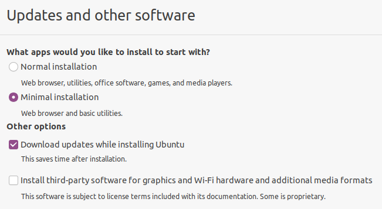
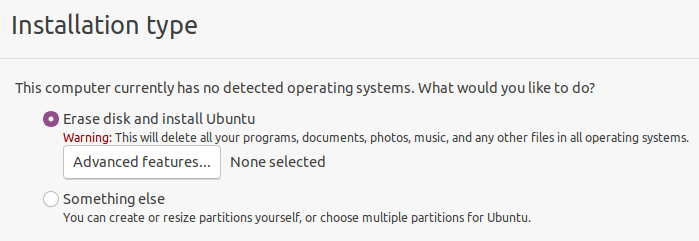
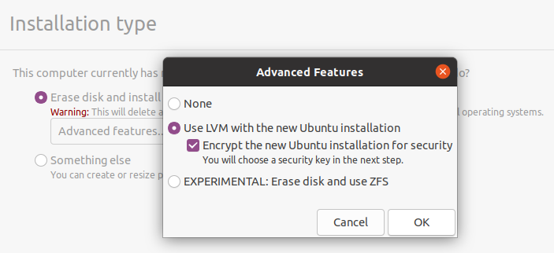
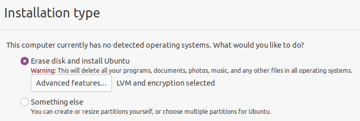

"Air gap" originally meant a computer or subnetwork was surrounded by "air" — as defined by no data cable connections in or out — so it would be isolated from other computers & networks. These days it also means there are no radio-based network connections either (WiFi, Bluetooth, etc.).

Developers & Cardano stake pool operators generally need an air gap environment in which to work with payment keys, stake pool keys and other cryptocurrency resources that offer high-value targets for hackers.

Some specialised hardware (e.g. hardware wallets) may also perform this function. If you believe you have such a device, please be certain that it offers isolation features for your stake pool or development *and* that you feel secure entrusting your assets to those who have implemented these features.

Otherwise, generally **you need a second computer** to create this air-gapped environment, and the rest of this guide is to help you do that.

:::tip Linux veterans only

If you don't have an extra computer, or want to try building a standalone Linux environment on a USB drive, [skip to the final section](#option-2-install-your-air-gap-environment-on-a-persistent-usb-drive).

:::

## Option 1: Install your air gap environment on a standalone computer

### Choose the right computer

You will get better results from an Intel PC than a Mac:

  - Mac booting has peculiarities that are too complicated to generally address here: therefore the rest of this document assumes you'll be using a PC and not a Mac.

You will need this computer's whole disc:

  - Any second drive should be removed if you don't know how to completely disable it in the Linux installation process.
  - The modern minimum drive size of 80GB will be enough for the Linux installation *and* all your Cardano support files, even if you are building them from scratch.

You can use an older machine, even a *very* old one:

  - Linux, although well supported on most new machines, is less likely to have missing device drivers on older machines: so you might do better with an older machine than a newer one.
  - This suits many developers & SPOs since an old or retired extra machine, or one with damaged software which will be replaced in the installation process, will be a good candidate to devote to the single purpose of an air gap environment.

### Confirm Ubuntu as installation OS, or choose differently

We choose Ubuntu here because:

  - It's a common choice on servers, so if you're building a stake pool you'll have the option of copying your `cardano-cli` binary from a stake pool server to the air gap machine instead of compiling it again.
  - The Ubuntu desktop environment & commands are arguably better documented on the Internet than any other Linux distribution. Getting help needs to be as easy as possible since you won't be able to search the Internet for help on the air gap machine itself.

The rest of these instructions will assume the choice of **Ubuntu** for your air gap environment OS. If installing a different variant of Linux, please remember:

  - When you read the term Ubuntu or show screenshots of its installer, look for equivalents on your own chosen Linux variant.
  - There may be better choices than Ubuntu now or in the future: please feel free to share your results with others in the Cardano community, perhaps [contributing](../portal-contribute) your findings & procedures here on the Developer Portal.

### Prepare to follow Ubuntu installation instructions

Read through the standard Ubuntu installation steps here (external link): [Ubuntu Tutorials > Install Ubuntu desktop](https://ubuntu.com/tutorials/install-ubuntu-desktop)

#### Decide in advance whether to encrypt your air gap machine's files.

When setting up the Ubuntu filesystems, you'll be given the option of creating a Volume Group so it can encrypt your entire partition contents with a variant of the AES algorithm.

:::caution

Your boot and UEFI partitions might not be encrypted, depending on the type of computer you have & version of the GRUB software with your OS installer.

Therefore, as a precaution, never attach a USB drive to your air gap machine unless you've either formatted the drive or built it as installation media.

:::

The main advantage to encrypting your air gap system:

  - Someone gaining physical access to your machine, or stealing it, will be prevented from violating your address (e.g. stealing your stake pool pledge\!) or stake pool (e.g. cloning your stake pool) security. 😎

The main disadvantage to encrypting it:

  - If you lose your disk encryption password, or set it incorrectly to something you can't reproduce, you will effectively lose all the data on the air gap machine's disk... including any account information or keys stored there. 😖

#### (optional, if encrypting your partition) Choose encryption password

Suggested password requirements:

  - has never been transmitted over, or stored in, cleartext on the Internet, or stored in cleartext on your computer itself (just in case your air gap is accidentally broken)
  - has length & complexity enough to hash to about 2^128 possible values: this means at least 20 apparently random characters.

### Begin standard Ubuntu installation (with some modifications)

As you follow the standard procedure (also linked above), stop at the points in the headings below to ensure you're installing your air gap environment correctly.

Before starting, there is no need to physically disconnect your chosen air gap machine from the Internet, or do anything to your home router to disable WiFi.

:::note

The Internet will be unconfigured and disconnected after the OS is installed & patched and a small number of initial packages are installed (including the Cardano CLI).

:::

### Follow instructions: [Ubuntu Tutorials > Install Ubuntu desktop](https://ubuntu.com/tutorials/install-ubuntu-desktop)

... paying particular attention to these steps:

#### Wireless (if asked)

If your computer doesn't have a cabled connection, it is acceptable under our security model to add it to the WiFi network during OS installation.

  - Whatever wireless key you enter *will* be retained on the installed system, *but* you will be reminded to disconnect the Internet before the end of our own procedure.

#### Updates and other software



Select **Minimal installation**, since this is the least likely to leave you with security intrusive applications and services.

  - The "Normal" installation has cloud based services and games which tend to initiate Internet connections.
  - LibreOffice software is not included in the "minimal" packages but is recommended to add later (since it helps encrypt password & mnemonic backups).

**Do not select** (as you normally would) the option for **third-party software for graphics and WiFi** because of the potential for institutional spyware.

  - Your graphics will be stable & high enough resolution without the performance enhancements of proprietary graphics drivers (otherwise you wouldn't see this installation screen).
  - WiFi performance enhancements are likewise unnecessary because you generally won't be using WiFi, and if you need a network cable you'll be disconnecting it soon & won't be using it again.

#### Installation type



Tick **Erase disk and install Ubuntu**.... you've already confirmed there's nothing else that needs to be kept on this computer, and that it won't have any other operating systems or working disks.

:::caution

The air gap installation should not be a part of any conventional dual-booting environment because of the inevitable security risks that would create.

:::

Before you hit **Continue**, if you've chosen to encrypt your files:

##### (optional) Set up the hard drive for encryption



Hit the button below the *Erase disk* option: **Advanced Features** which will at first say *None selected*.

  - Tick the feature **Use LVM with the new Ubuntu installation**.
  - Tick the option below it: **Encrypt the new Ubuntu installation for security**.

Don’t hit the **Continue** button unless you can verify it now says ***LVM and encryption selected*** under Advanced options:



Enter the password you have prepared earlier as a **volume decryption key.**

  - At this point you might want to check a few times that you can type this password properly: either with consistency from written notes, or from memory.
  - To double check in this installation environment: move over to the left (the "dock") where you'll see a text editor icon, in which you can practice typing the password without leaving a record.
    - At this point the disk is only emulated in RAM: but just to be safe, don't save this file anywhere!

#### Finish & reboot

Confirm the installation drive, click **Install now** and **Continue**.

  - The rest of the options (user name & information, login method, etc.) can be set according to your inclination.

Ubuntu will finish installing and then you'll be prompted to remove the installation media & reboot. When rebooting, you will see two things you may never have seen before:

  - If you followed these recommendations to only install one single OS on one single disk, the boot menu you see (from [GRUB](https://help.ubuntu.com/community/Grub2)) will have only one choice: **Ubuntu**, with the software you just installed, which will be selected by default after a few seconds whenever the system starts.

  - If you selected the encryption option for your Ubuntu system, you will need to enter the encryption password every time you start the system.

### Configure Ubuntu according to security recommendations

At the screen "Welcome to Ubuntu" (which new users are currently *forced* to interact with), _refuse **everything**_ it offers you:

  - no online accounts
  - no Canonical Livepatch
  - no sending any system information, ever!
  - no Location Services

#### Basic security tightening at command line

##### Remove packages requiring routine network access:

``` bash
sudo apt remove cups
sudo apt remove unattended-upgrades
```

##### (optional) Remove Snap software subsystem.

[Snap](https://snapcraft.io) is questionable for security reasons because (like [AppImage](https://appimage.org) and [Flatpak](https://flatpak.org)) it links application components with libraries that don't have to be compiled from source or security-vetted like the libraries that come with your OS itself.

Removing Snap is optional because default snaps on the Ubuntu installation media have the same security provenance as the default packages on that same release... yet snaps will also be upgraded in the next part of this procedure, and these upgraded snaps may not be subjected to the same security vetting.

To proceed with removing Snap, follow these instructions (the exact procedure changes often & these instructions may be the best maintained to date):

  - **[How do I turn off snap in Ubuntu?](https://linuxhint.com/turn-off-snap-ubuntu/)**

#### Update system software & all packages to current time

This will upgrade everything on your system from what you received on installation media:

``` bash
sudo apt update
sudo apt upgrade
```

#### Install minimal set of packages for encrypting files/folders & text documents

##### (optional) Install LibreOffice

This is recommended because it will give you a means of taking password-encrypted notes that can move between your air gap and computer host environments *in both directions*, so you can:

  - record transaction details from your home computer environment & Internet connected machines, for use in the air gap (as per [Secure Workflow](./secure-workflow)):
      - your Cardano account balances, UTxO addresses & payment addresses
      - notes from personal files & web sites about the work you will be doing within the air gap (since you won't have Internet access there);
  - take notes in the air gap environment (problems, error messages) to copy back to your computer, since you can't upload them through the air gap.

LibreOffice documents saved with a password are entirely AES-encrypted with a key deriving from that password, which produces arguably the best commercially available security for files & data.

To install:

``` bash
sudo apt install libreoffice
```

#### Install encrypting archiver

Whether a developer or a stake pool operator, at some point you will also need to encrypt files & folders so they can be extracted on your stake pool or application server, where LibreOffice will generally not run but you can use the installable command `p7zip` instead:

``` bash
apt install p7zip-full p7zip-rar
```

Adding the extra package `p7zip-rar` should make saving files with encryption & compression an option in your file manager (`nautilus`).

#### Install secure deletion tools

You might need to erase any trace of an unencrypted file that could lead to loss of your funds or Cardano enterprises if it were reconstructed (since ordinary file deletions don't delete data blocks). Therefore you should [install the `secure-delete` tools](https://www.unixmen.com/securely-delete-hard-drive-data-with-secure-delete/) to allow you to zero-write files & their metadata or drive contents & empty disk space:

``` bash
apt install secure-delete
```

### Reboot again

This confirms that your system will start properly after having updated your system software.

### Install `cardano-cli`

Use the standard instructions here at the Developer Portal:

  - **[Installing cardano-node and cardano-cli from source](../get-started/cardano-node/installing-cardano-node)**

Note this will build `cardano-node` as well as `cardano-cli`, but don't worry: you won't be running a node inside the air gap. 😜

### Unplug from Internet FOREVER

We will leave the definition of "forever" up to your understanding of Internet threats and whether these can come from OS package repositories, etc., with this in mind:

  - Software updates at 6-month intervals (e.g. after the Ubuntu "point releases") will patch security problems identified during that period: as well as install new software which may introduce *new* security problems.
  - Any spyware or backdoor deliberately placed in the package upgrades on Ubuntu or any other version of Linux could generally just as easily have been placed on the packages used to build your installation media.

### Precautions to avoid accidental connection to the Internet

#### BIOS settings: disable WiFi and Ethernet connection

See your computer instructions to review how to get into the BIOS, if you're interested in disabling the network adapters at a very low level so they can't accidentally (or due to a hack) be turned on in software.

  - If there's no BIOS setting, WiFi can usually be disabled almost as easily on laptops by opening them up to remove, or disconnect the leads to, the WiFi card.

#### Put Ubuntu in [Airplane mode](https://help.ubuntu.com/stable/ubuntu-help/net-wireless-airplane.html)

This will disable any Bluetooth services as well as WiFi, and shows as an Airplane on Ubuntu & other GNOME desktops as an airplane icon in the upper right corner of the screen.

With Airplane Mode always engaged, you would need the obvious Internet cable plugged in to have any network access (unlike WiFi which can often be connected by accident).

#### Add your computer's WiFi MAC address to the blacklist on your Internet router

Some routers maintain a list of MAC addresses which will not be given an IP address by DHCP, which isolates them from the Internet unless that network interface is configured manually.

Therefore, you can [find your WiFi MAC address](https://help.ubuntu.com/stable/ubuntu-help/net-macaddress.html.en) and add it to your router's blacklist: usually in its DNS, DHCP, or LAN settings.

### Congratulations, your air gap environment is complete!

You now have a safe place you can use for your [Secure Transaction Workflow](./secure-workflow).

## Option 2: Install your air gap environment on a persistent USB drive

:::caution

Linux veterans only\! (otherwise please [follow option 1](#option-1-install-your-air-gap-environment-on-a-standalone-computer))

:::

This option may suit more demanding users, especially those:

  - who travel a lot and need to maintain their Cardano operations "on the road";
  - who need the convenience of booting in an air gap environment which has direct access to all their files on the host computer (as you would when booting off from an installer USB drive);
  - who, instead of using a USB drive to transfer unencrypted files in & out of the air gap, would rather use that same USB drive to store these files with encryption while also providing the Cardano CLI for use on any machine supporting the same boot method;
  - who want to make encrypted backups or their keys, passwords and other records from their air gap environment directly to the host computer.

If this appeals to you, and you don't mind following a more complicated and error-prone installation procedure, you might want to install the air gap environment on a bootable USB drive instead. You can then boot a computer from this drive to have access to your secure resources and `cardano-cli` while isolating that computer from the Internet as well as any malicious software that might be installed on that computer.

This loosely documented configuration has been called the **Frankenwallet**, with separate instructions at these links which mostly follow the procedure above:

  - **[The Frankenwallet](https://cosd.com/frankenwallet)** - detailed external web site, including semantics for using your bootable USB environment in secure & blockchain workflow
  - [Get Started with the Frankenwallet](/docs/operate-a-stake-pool/frankenwallet) - one-page summary here on the Developer Portal

:::warning

These instructions may be difficult or unsafe to follow unless you have experience with "dual boot" Linux installations and other custom OS & booting configurations.

:::
