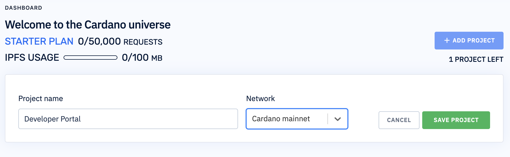
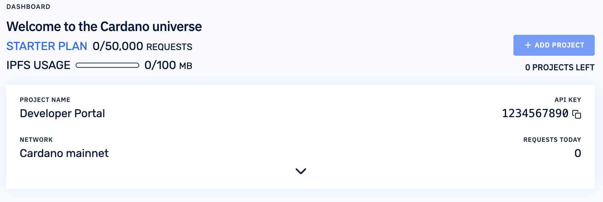

Blockfrost provides API to access and process information stored on the Cardano blockchain. The basic tier is free and allows 50,000 requests per day.

## Sign in

[Sign in on Blockfrost](https://blockfrost.io/auth/signin) with your GitHub account. No registration required. Enter a project name and select Cardano mainnet or Cardano testnet, depending on your needs.



## Get your API key

After clicking on `Save Project` you will immediately get your `API KEY`. Save it. You will need this key for every request.



## Query the latest epoch

Send your first request to get data about the latest epoch. Don't forget to replace `1234567890`with your `API KEY`.

import Tabs from '@theme/Tabs';
import TabItem from '@theme/TabItem';

<Tabs
defaultValue="curl"
values={[
{label: 'curl', value: 'curl'},
{label: 'wget', value: 'wget'},
{label: 'PHP', value: 'php'},
]}>
<TabItem value="curl">

```sh
curl -H 'project_id: 1234567890' https://cardano-mainnet.blockfrost.io/api/v0/epochs/latest
```

  </TabItem>
  <TabItem value="wget">

```sh
wget --header='project_id: 1234567890' -qO- https://cardano-mainnet.blockfrost.io/api/v0/epochs/latest
```

  </TabItem>
  <TabItem value="php">

```php
$headers = array('http'=> array(
					 'method' => 'GET',
					 'header' => 'project_id: 1234567890'
					)
   			    );
$context = stream_context_create($headers);
$json = file_get_contents('https://cardano-mainnet.blockfrost.io/api/v0/epochs/latest', false, $context);
$parsedJson = json_decode($json);
```

  </TabItem>
</Tabs>

If you have done everything correctly you will get a response in JSON format, similar to this:

```json
{
  "epoch": 225,
  "start_time": 1603403091,
  "end_time": 1603835086,
  "first_block_time": 1603403092,
  "last_block_time": 1603835084,
  "block_count": 21298,
  "tx_count": 17856,
  "output": "7849943934049314",
  "fees": "4203312194",
  "active_stake": "784953934049314"
}
```

## Query data of a specific stake pool

Let's look into another example and query data of a specific stake pool. You need to provide a Bech32 or hexadecimal `pool_id`.

<Tabs
defaultValue="curl"
values={[
{label: 'curl', value: 'curl'},
{label: 'wget', value: 'wget'},
{label: 'PHP', value: 'php'},
]}>
<TabItem value="curl">

```sh
curl -H 'project_id: 1234567890' https://cardano-mainnet.blockfrost.io/api/v0/pools/c1cadab46b74defa9f79b59b617fe2a50bdbce6b367e472b6109a7bc

```

  </TabItem>
<TabItem value="wget">

```sh
wget --header='project_id: 1234567890' -qO- https://cardano-mainnet.blockfrost.io/api/v0/pools/c1cadab46b74defa9f79b59b617fe2a50bdbce6b367e472b6109a7bc

```

  </TabItem>
  <TabItem value="php">

```php
$headers = array('http'=> array(
					 'method' => 'GET',
					 'header' => 'project_id: 1234567890'
					)
   			    );
$context = stream_context_create($headers);
$json = file_get_contents('https://cardano-mainnet.blockfrost.io/api/v0/pools/c1cadab46b74defa9f79b59b617fe2a50bdbce6b367e472b6109a7bc', false, $context);
$parsedJson = json_decode($json);
```

  </TabItem>
</Tabs>

You will get a response in JSON format, similar to this:

```json
{
  "vrf_key": "57c4d222e0f2f8083d7b63c8f7886f16fb7046621442bbd857f404b6f433c5e6",
  "blocks_minted": 1675,
  "live_stake": "33978569808898",
  "live_size": 0.0014709194212545152,
  "live_saturation": 0.5169025966078663,
  "live_delegators": 395,
  "active_stake": "37990508551252",
  "active_size": 0.0016498675360681707,
  "declared_pledge": "250010000000",
  "live_pledge": "765352096766",
  "margin_cost": 0.015,
  "fixed_cost": "340000000",
  "reward_account": "stake1u97pa0j0wtj5r3l6462z0xmlf5tg0dxpmss3y20almfnj5gc4tmrw",
  "owners": [
    "stake1uywma333mgeccv3aa2gvrkhz4qtz0cq9sszrnws8pv78gqqq6a65g",
    "stake1u9dqkqmdtdcav5qd933xwvwxgamrsdkr0zsn63ca0v4lz5cm7tvq0",
    "stake1u97pa0j0wtj5r3l6462z0xmlf5tg0dxpmss3y20almfnj5gc4tmrw"
  ],
  "registration": [
    "f6865b914988ed40998d2ff5453bd8af16976688065c9756d32c7a872064aaf8",
    "0e08711da89ebbaefaf897f5633c7b7bc6c1c9037451431745fbaefbf1227ec7",
    "9b85adfebc25f2cc7737039fb376043207e1ec7147b2800436138e7df58c70d4",
    "1243db764e42a3ec89d815d96bcf7242bfd2837d54f3047f2b5abacd7e52345d"
  ],
  "retirement": []
}
```

## Query information of a specific asset

Let's look at this last example and query information of a specific native token on Cardano. You need to provide the string concatenation of the `policy_id` and hex-encoded `asset_name`.

<Tabs
defaultValue="curl"
values={[
{label: 'curl', value: 'curl'},
{label: 'wget', value: 'wget'},
{label: 'PHP', value: 'php'},
]}>
<TabItem value="curl">

```sh
curl -H 'project_id: 1234567890' https://cardano-mainnet.blockfrost.io/api/v0/assets/d894897411707efa755a76deb66d26dfd50593f2e70863e1661e98a07370616365636f696e73

```

  </TabItem>
  <TabItem value="wget">

```sh
wget --header='project_id: 1234567890' -qO- https://cardano-mainnet.blockfrost.io/api/v0/assets/d894897411707efa755a76deb66d26dfd50593f2e70863e1661e98a07370616365636f696e73

```

  </TabItem>
  <TabItem value="php">

```php
$headers = array('http'=> array(
					 'method' => 'GET',
					 'header' => 'project_id: 1234567890'
					)
   			    );
$context = stream_context_create($headers);
$json = file_get_contents('https://cardano-mainnet.blockfrost.io/api/v0/assets/d894897411707efa755a76deb66d26dfd50593f2e70863e1661e98a07370616365636f696e73', false, $context);
$parsedJson = json_decode($json);
```

  </TabItem>
</Tabs>

You will get this JSON response:

```json
{
  "policy_id": "d894897411707efa755a76deb66d26dfd50593f2e70863e1661e98a0",
  "asset_name": "7370616365636f696e73",
  "fingerprint": "asset1pmmzqf2akudknt05ealtvcvsy7n6wnc9dd03mf",
  "quantity": "50000000",
  "initial_mint_tx_hash": "3cce12c77b9d11d70575320c4f2834b26debb065308fbe43954018fbeb90010d",
  "onchain_metadata": null,
  "metadata": null
}
```

## Blockfrost documentation

Blockfrost has a powerful API with which you can do a lot of things. Visit [docs.blockfrost.io](https://docs.blockfrost.io) to see the complete API documentation.
