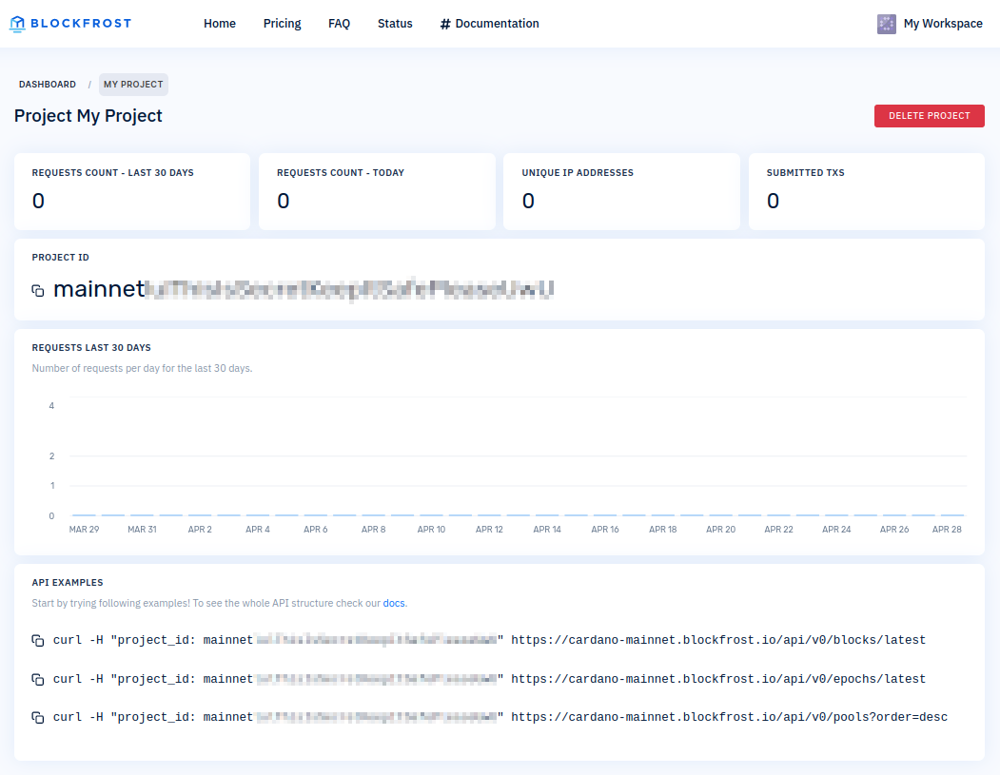

In order to use the [hosted version of Blockfrost API](https://blockfrost.io/), you need to [create an account first](https://blockfrost.io/auth/signin).

# Log in / Sign up

When [creating a Blockfrost.io account](https://blockfrost.io/auth/signin) you can use your email or Single Sing-On through Google, GitHub and GitLab. Armed with an account, you can start building your apps!

:::info
Blockfrost.io uses password-less login. No need to worry about losing or storing any passwords!
:::

# Creating your project

After setting up your account, you can now create your first project. Select **+ ADD PROJECT**, choose a suitable name, and ensure you pick the correct network.

Upon clicking **SAVE PROJECT**, you will be redirected to the project subpage where a unique secret API key, known as `project_id`, will be generated.

:::warning
Protect your secrets! Since `project_id` is a secret, ensure it is not committed to a public repository or embedded in your code. When possible, use environment variables to prevent exposing `project_id`. Ideally, set up your own application backend to store your `project_id` securely, avoiding potential leaks. Otherwise, unauthorized individuals could exploit your token.
:::

In [Blockfrost](https://blockfrost.io/), a project provides API access to a particular [network](https://blockfrost.dev/docs/start-building#available-networks). Each project is linked to a secret token known as `project_id`, which must be used to access the API.

# SDKs

An SDK, or Software Development Kit, is a collection of tools, libraries, and resources that developers use to create, build, and streamline applications for specific platforms. With support for [over 15 distinct programming languages](https://blockfrost.dev/docs/sdks), Blockfrost stands out as the most adaptable toolkit for accessing data within the Cardano blockchain.

Here's a list of some of them:

* [blockfrost-js](https://github.com/blockfrost/blockfrost-js)
* [blockfrost-haskell](https://github.com/blockfrost/blockfrost-haskell)
* [blockfrost-python](https://github.com/blockfrost/blockfrost-python)
* [blockfrost-rust](https://github.com/blockfrost/blockfrost-rust)
* [blockfrost-go](https://github.com/blockfrost/blockfrost-go)
* [blockfrost-ruby](https://github.com/blockfrost/blockfrost-ruby)
* [blockfrost-java](https://github.com/blockfrost/blockfrost-java)
* [blockfrost-scala](https://github.com/blockfrost/blockfrost-scala)
* [blockfrost-swift](https://github.com/blockfrost/blockfrost-swift)
* [blockfrost-kotlin](https://github.com/blockfrost/blockfrost-kotlin)
* [blockfrost-elixir](https://github.com/blockfrost/blockfrost-elixir)
* [blockfrost-dotnet](https://github.com/blockfrost/blockfrost-dotnet)
* [blockfrost-arduino](https://github.com/blockfrost/blockfrost-arduino)
* [blockfrost-php](https://github.com/blockfrost/blockfrost-php)
* [blockfrost-crystal](https://github.com/blockfrost/blockfrost-crystal)
