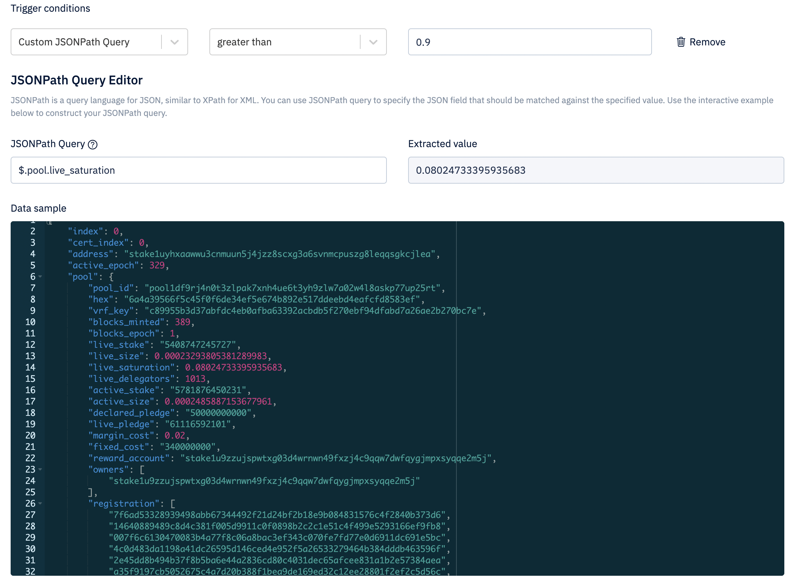

Instead of repeatedly retrieving and processing potentially irrelevant blockchain data (polling), Blockfrost Secure Webhooks can be set up to streamline the process. Secure Webhooks notify your application only when relevant events occur, enhancing efficiency and reducing effort on your part.

Webhooks empower Blockfrost to deliver real-time notifications to your application. Utilizing HTTP POST requests, Blockfrost Secure Webhooks transmit events to your application endpoint in JSON format. These events can subsequently be used to trigger actions within your backend systems.

Optionally, you can create up to 5 trigger conditions for a webhook. Only events that meet all of the conditions will be sent to your endpoint. A condition rule consist of a field, a value, and an operator. You can choose from predefined condition fields or create a custom JSONPath query extracting the field you want to match.

Webhooks are both powerful and complex. To learn more, have a look at the [official Blockfrost documentation](https://blockfrost.dev/docs/start-building/webhooks/)
