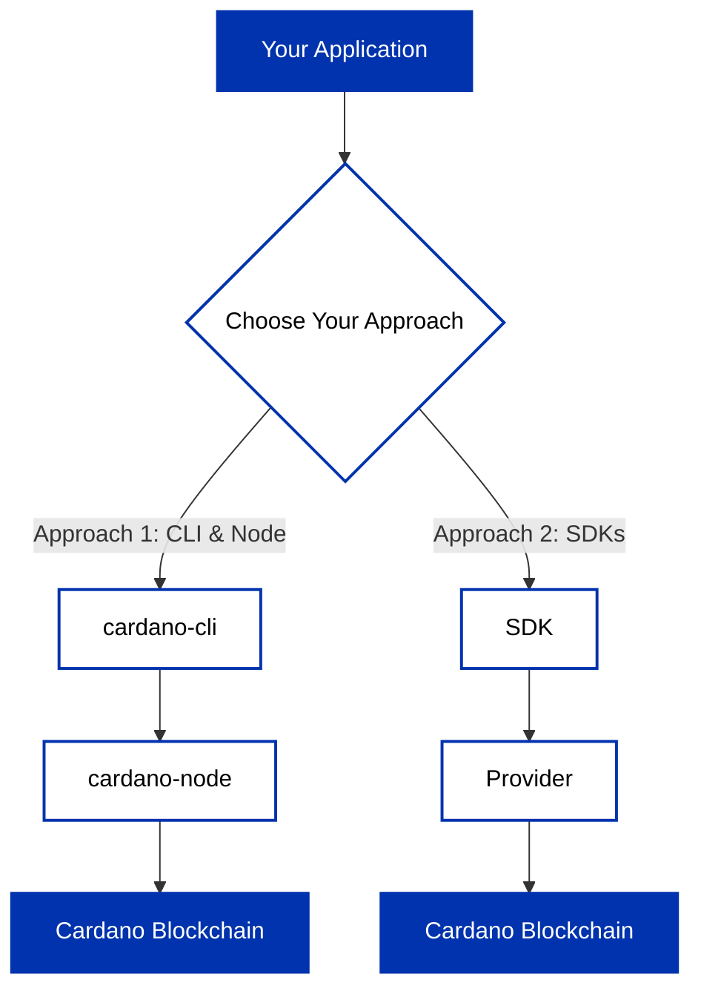

## Two Paths to Building on Cardano

There are **two main approaches** to building on Cardano, each with different trade-offs:

import Tabs from '@theme/Tabs';
import TabItem from '@theme/TabItem';

<Tabs>
<TabItem value="cli" label="Approach 1: CLI & Node" default>

**Components:** [cardano-cli](/docs/get-started/cardano-cli/basic-operations/get-started) + [cardano-node](/docs/operate-a-stake-pool/node-operations/cardano-components)

- Direct, low-level interaction with the blockchain
- Full control over your infrastructure
- Requires running and maintaining your own node
- Manual transaction construction using CLI commands
- No dependency on third-party services
- Gain deep understanding of Cardano's inner workings

</TabItem>
<TabItem value="sdks" label="Approach 2: SDKs">

**Components:** [SDKs](/docs/get-started/high-level-sdks-overview) + [Providers](/docs/get-started/providers-overview)

- Developer-friendly libraries that abstract blockchain complexity
- Connect via providers (managed services like Blockfrost/Koios or self-hosted like Ogmios)
- Focus on application logic rather than infrastructure
- Lower operational overhead
- Modern developer experience with familiar programming patterns

</TabItem>
</Tabs>

:::tip Choosing Your Path
Most developers start with Approach 2 for rapid development and faster time to market, then explore Approach 1 later to understand the underlying mechanisms or to roll their own infrastructure.
:::
