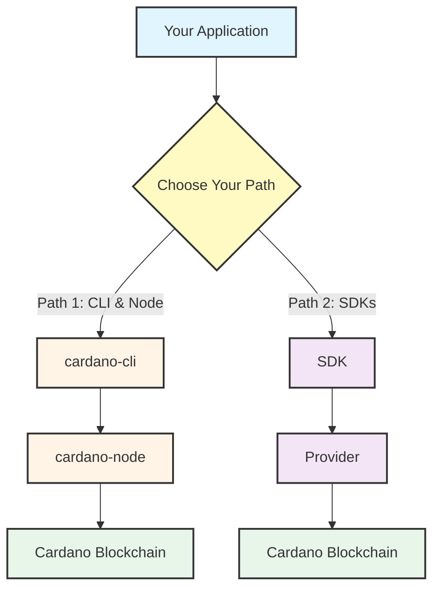

## Two Paths to Building on Cardano

There are **two main approaches** to building on Cardano, each with different trade-offs:

### Path 1: CLI & Node

**Components:** cardano-cli + cardano-node

- Direct, low-level interaction with the blockchain
- Full control over your infrastructure
- Requires running a node
- Involved transaction building with CLI commands

### Path 2: SDKs

**Components:** [SDKs](/docs/get-started/high-level-sdks-overview) + [Providers](/docs/get-started/providers-overview)

- Developer-friendly libraries that abstract blockchain complexity
- Connect to providers (managed services like Blockfrost/Koios or self-hosted like Ogmios)
- Focus on application logic, not low-level operations
- Modern language support (JavaScript, Python, C#, etc.)

:::tip Choosing Your Path
Both paths are valid choices depending on your needs:

**Path 1 (cardano-cli + cardano-node)** gives you:

- Complete control over your infrastructure
- Deep understanding of how Cardano works
- No dependency on third-party services
- Required for stake pool operations

**Path 2 (SDKs + Providers)** gives you:

- Faster time to market
- Lower operational overhead
- Modern developer experience
- Focus on application logic

Many developers start with Path 2 for rapid development and later explore Path 1 to understand the underlying mechanisms.
:::
