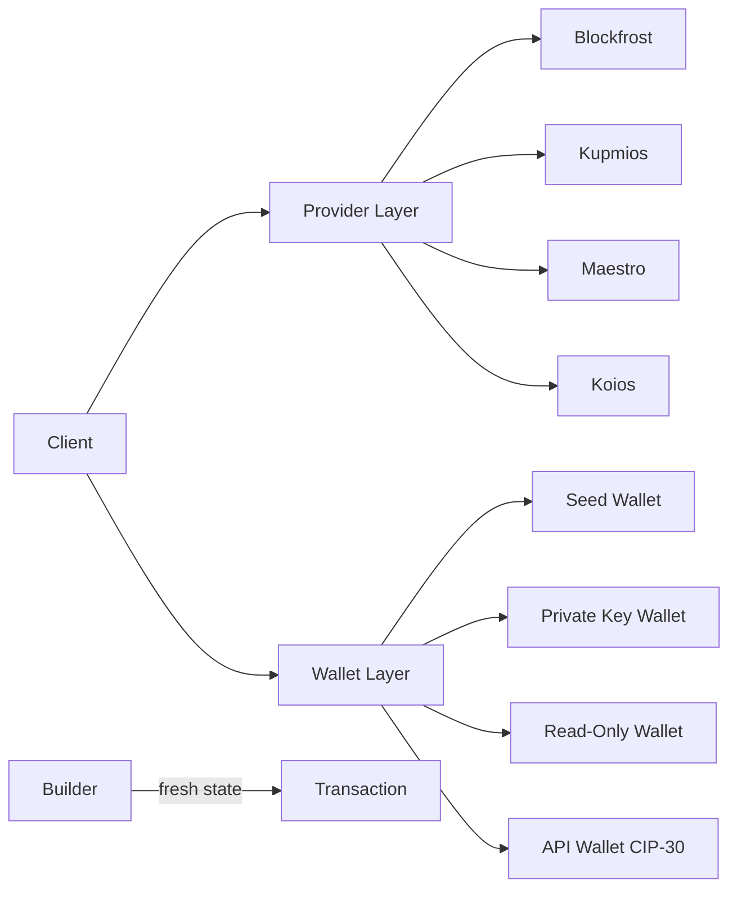
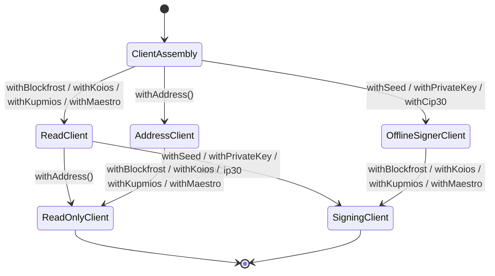

import DocCardList from '@theme/DocCardList';

## Abstract

Evolution SDK implements a capability-based architecture where transaction building, network access, and key management are separated through type constraints and deferred execution. The system prevents invalid states at compile time while enabling composition of complex transaction logic.

<DocCardList />

## Purpose and Scope

This section describes the fundamental architectural principles that drive Evolution SDK's design: deferred execution, separation of concerns, and type-safe capability composition. It covers the conceptual model and decision flows that guide implementation.

## Introduction

### The Problem

Cardano transaction building faces three core challenges:

1. **State Management**: Immediate execution creates shared mutable state, making builders unsafe to reuse
2. **Type Safety**: Runtime capability checking allows invalid operations to compile successfully
3. **Composition**: Tightly coupled components prevent independent testing and flexible provider/wallet swapping

Traditional approaches force developers to choose between safety and flexibility.

### Design Philosophy

Evolution SDK's architecture provides three guarantees:

1. **Deferred Execution** - Store operations as data, execute on demand with fresh state
2. **Separation of Concerns** - Provider (network) ≠ Wallet (keys) ≠ Client (logic)
3. **Type Safety Through Constraints** - Compiler prevents invalid operations

## Visual Overview

## Architectural Principles

### 1. Deferred Execution

Transaction builders in Evolution SDK don't execute immediately. Instead, they store a description of operations to perform. When you call `.build()`, the SDK creates fresh state and executes the program, ensuring each execution is isolated from previous runs.

This design emerged from a common problem: shared mutable state makes builders dangerous to reuse. By deferring execution until explicitly requested, the same builder can safely generate multiple transactions without interference.

The benefit extends beyond safety. Programs-as-values can be inspected before running, tested without blockchain access, and composed together like building blocks. The transaction logic becomes pure data until you decide to execute it.

See [Deferred Execution](./deferred-execution.md) for execution model and state management.

### 2. Separation of Concerns

The SDK separates three responsibilities that transaction systems often conflate:

**Provider layer** handles blockchain access—querying UTxOs, fetching protocol parameters, evaluating scripts, and submitting transactions. It abstracts the underlying service (Blockfrost, Kupmios, Maestro, Koios) behind a common interface.

**Wallet layer** manages keys and signing. Whether using a seed phrase (HD wallet), single private key, hardware wallet, or browser extension (CIP-30), the wallet interface remains consistent. Read-only wallets provide addresses without signing capability.

**Client layer** coordinates the provider and wallet, building transactions using their capabilities. The client enforces constraints through types—you cannot sign without a signing wallet or query without a provider.

See [Provider Layer](./provider-layer.md) and [Wallet Layer](./wallet-layer.md) for interface contracts and selection criteria.

### 3. Type Safety Through Constraints

The type system prevents impossible states at compile time. A client without a provider cannot call `newTx()`. A client without a signing wallet cannot call `signTx()`. A read-only wallet produces unsigned transactions. These aren't runtime checks—they're enforced by TypeScript's type checker.

When you add a provider, the client gains read and submission operations. When you add an address, the client gains wallet identity. When you add a signer, signing operations become available. The type system documents what a client can do and prevents you from calling operations it cannot support.

## Integration Points

The architecture maintains strict boundaries between layers. The client never directly manages network or keys—it delegates to provider and wallet. This delegation enables swapping providers or wallets without touching transaction logic.

**[1] ClientAssembly**: Chain-scoped entry point. No read, identity, or signing capability yet.

**[2] ReadClient**: Provider-backed read and submission capability, but no wallet identity or signing.

**[3] AddressClient**: Wallet identity only. Exposes address and reward address, but no provider queries or signing.

**[4] OfflineSignerClient**: Signing capability without provider-backed reads or transaction building.

**[5] ReadOnlyClient**: Provider-backed read capability plus wallet identity. Can build unsigned transactions.

**[6] SigningClient**: Full client. Can read, build, sign, and submit.

## Architecture Pages

- [Transaction Flow](./transaction-flow.md) - Build → sign → submit phase transitions
- [Coin Selection](./coin-selection.md) - UTxO selection algorithms
- [Redeemer Indexing](./redeemer-indexing.md) - Deferred redeemer construction for Plutus script index optimization
- [Script Evaluation](./script-evaluation.md) - Plutus validator execution and ExUnits calculation
- [Unfrack Optimization](./unfrack-optimization.md) - UTxO structure optimization
- [Deferred Execution](./deferred-execution.md) - Immutable builder pattern, program-as-value semantics
- [Devnet](./devnet.md) - Local Cardano network orchestration
- [Provider Layer](./provider-layer.md) - Blockchain access abstraction
- [Wallet Layer](./wallet-layer.md) - Capability-based type system

## Related Topics

- [Getting Started](../introduction/getting-started.md) - Practical usage examples
- [Client Basics](../clients/overview.md) - Client API and capabilities
- [Transactions](../transactions/overview.md) - Transaction building guide
