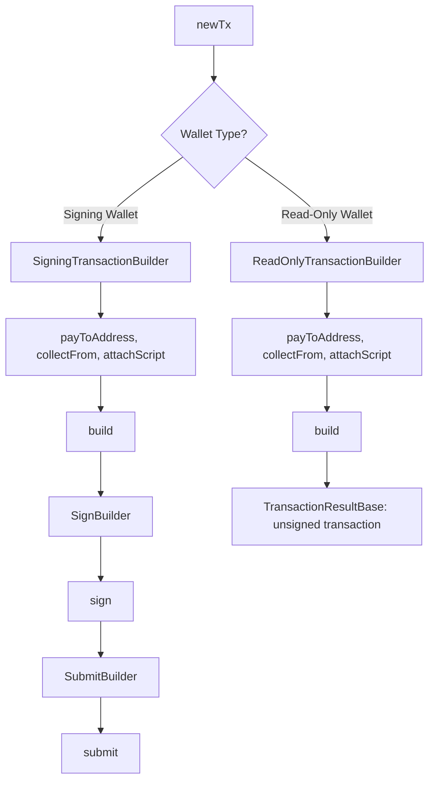

## Abstract

Cardano transactions follow a sequential flow: construct valid transaction (build), add witness signatures (sign), and broadcast to network (submit). The architecture enforces this ordering through types—attempting operations out of sequence produces compile-time errors. The critical design decision is **fresh state per execution**: each `build()` call creates independent state from stored program descriptions, enabling safe builder reuse without state contamination.

## Design Philosophy

Traditional mutable builders face a dilemma: execute operations immediately (preventing inspection before commitment) or accumulate mutable state (creating unsafe reuse patterns). Immediate execution couples program description with execution timing. Mutable state creates cross-contamination when builders are reused.

The architecture resolves this by storing **program descriptions** without executing them. When `build()` is called, the builder creates fresh state and runs all programs sequentially. The same builder can be called multiple times—each execution starts from an empty slate with no contamination from previous runs.

## Builder Flow by Wallet Type

**SigningTransactionBuilder**: Wallet can sign (seed phrase, private key, or CIP-30)
- Builder methods append programs to immutable array
- `build()` creates fresh state, executes programs → returns `SignBuilder`
- `sign()` adds witnesses → returns `SubmitBuilder`
- `submit()` broadcasts transaction → returns transaction hash

**ReadOnlyTransactionBuilder**: Wallet cannot sign (read-only or no wallet)
- Builder methods append programs to immutable array
- `build()` creates fresh state, executes programs → returns `TransactionResultBase` (unsigned)
- Type system prevents `sign()` and `submit()` methods from existing

## Fresh State Execution Model

Each `build()` call creates completely independent state. The builder stores program descriptions permanently, but execution state lives only for one build cycle.

This model provides three critical guarantees:
1. **Reusability**: Same builder works for multiple transactions without state contamination
2. **Predictability**: Each execution starts from known empty state, no accumulated side effects
3. **Concurrency**: Multiple `build()` calls can run concurrently (on different instances) without interference

## Build Phase State Machine

The `build()` execution runs through a multi-phase state machine where each phase handles one aspect of transaction construction and returns the next phase to execute.

### Selection Phase

Orchestrates coin selection to cover transaction requirements, handling both initial selection and reselection when additional inputs are needed.

**Key Phase Behaviors:**

- **Sufficiency Check**: Skips coin selection if explicit inputs (from `collectFrom()`) already cover requirements
- **Normal Selection**: Invokes coin selection algorithm for asset delta when initial inputs insufficient
- **Reselection Mode**: When change creation sets shortfall, selects specifically for that shortfall amount
- **Script Routing**: Routes to collateral phase first when redeemers exist (scripts need collateral before change)
- **Attempt Tracking**: Increments attempt counter after each pass, reset at phase start

### Change Creation Phase

Creates change outputs from leftover assets using cascading retry strategies. Returns to **selection** when leftover is negative or below minUTxO, routes to **fallback** when MAX_ATTEMPTS exhausted, proceeds to **feeCalculation** when valid change created.

### Fee Calculation Phase

Calculates transaction fee iteratively based on current transaction structure. Always proceeds to **balance**. Includes change outputs in fee calculation and stores both calculatedFee and leftoverAfterFee for Balance phase.

### Balance Phase

Verifies that inputs equal outputs plus change plus fees. Routes to **evaluation** when balanced with unevaluated redeemers, **complete** when balanced and evaluated, **changeCreation** on shortfall.

### Evaluation Phase

Executes script validators to compute execution units (ExUnits) for redeemers. This phase determines the computational cost of running Plutus scripts, which affects transaction fees.

**Key Phase Behaviors:**

- **Conditional Execution**: Skips entirely if no redeemers present (ADA-only transactions)
- **Loop Prevention**: Checks if all redeemers already evaluated to prevent infinite re-evaluation
- **Evaluator Resolution**: Uses provider-based evaluation (default) or custom UPLC evaluator (e.g., Aiken)
- **ExUnits Update**: Writes computed memory and CPU steps back to redeemer entries
- **Fee Impact**: Updated ExUnits change transaction size, triggering fee recalculation

### Collateral Phase

Selects collateral UTxOs for script transactions (runs before change creation). Always proceeds to **changeCreation**. Skips if no redeemers present. Selects up to 3 pure-ADA UTxOs, creates collateral return output if excess exists.

### Fallback Phase

Handles insufficient change scenarios after MAX_ATTEMPTS exhausted. Always proceeds to **feeCalculation**. DrainTo defers actual merge to Balance phase. Burn strategy treats leftover as implicit network fee.

## Integration Points

**Provider Layer**: During the `build()` phase, the builder queries the provider for:
- Protocol parameters (fees, transaction size limits)
- Available UTxOs at wallet addresses
- Script evaluation (when Plutus scripts are attached)

**Wallet Layer**: The wallet type determines builder capabilities:
- **Signing wallets** (seed, private key, CIP-30) → `SigningTransactionBuilder` → full build/sign/submit flow
- **Read-only wallets** → `ReadOnlyTransactionBuilder` → build only, returns unsigned transaction
- Type system enforces these boundaries at compile time

## Related Topics

- [Deferred Execution](./deferred-execution) - How program descriptions enable composition
- [Provider Layer](./provider-layer) - Blockchain data queries during build phase
- [Wallet Layer](./wallet-layer) - Signing capabilities and type constraints
