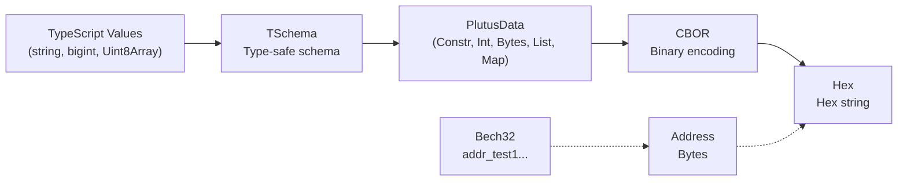

import DocCardList from '@theme/DocCardList';

# Encoding

Evolution SDK handles multiple encoding formats used across the Cardano ecosystem — hex for raw bytes, Bech32 for addresses, CBOR for on-chain data, and JSON for interchange. The encoding modules provide type-safe conversion between these formats.

<DocCardList />

## How They Connect

**Typical flow:** Define a schema with TSchema → encode values to PlutusData → serialize to CBOR → get hex for transactions. Addresses use a separate Bech32 path.

## Encoding Formats

| Format | Use Case | Example |
|--------|----------|---------|
| **Hex** | Raw bytes, hashes, policy IDs | `"a1b2c3d4..."` |
| **Bech32** | Addresses | `"addr_test1vr..."` |
| **CBOR** | On-chain data, transactions | Binary format |
| **PlutusData** | Smart contract datums/redeemers | Structured data |
| **TSchema** | Type-safe Plutus schema definitions | Schema + codec |
| **JSON** | API interchange, debugging | `{ "int": 42 }` |

## Next Steps

- [CBOR](./cbor) — Low-level CBOR encoding and decoding
- [Bech32](./bech32) — Address encoding format
- [Hex](./hex) — Hexadecimal encoding for bytes and hashes
- [JSON](./json) — JSON data interchange
- [PlutusData](./data) — On-chain data structures
- [TSchema](./tschema) — Type-safe schema definitions
- [Plutus Types](./plutus) — Pre-built schemas for Cardano types
- [UPLC](./uplc) — Untyped Plutus Lambda Calculus programs
