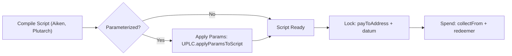

import DocCardList from '@theme/DocCardList';

# Smart Contracts

Evolution SDK provides full support for Cardano smart contracts — Plutus V1, V2, and V3. Lock funds to script addresses with datums, spend from scripts with redeemers, mint tokens with minting policies, and reference on-chain scripts to reduce transaction size.

The transaction builder handles script evaluation, redeemer indexing, and collateral selection automatically. You focus on your contract logic.

<DocCardList />

## Smart Contract Flow



## How It Works

Smart contract interaction in Cardano involves three concepts:

| Concept      | Purpose                                     | When Used                                       |
| ------------ | ------------------------------------------- | ----------------------------------------------- |
| **Datum**    | Data attached to a UTxO at a script address | When locking funds to a script                  |
| **Redeemer** | Data provided to unlock a script UTxO       | When spending from a script                     |
| **Script**   | The validator logic (Plutus or Native)      | Attached to transactions or referenced on-chain |

## Typical Workflow

**Locking** (sending funds to a script):

```typescript
import { Address, Assets, Data, InlineDatum, preprod, Client } from "@evolution-sdk/evolution"

const client = Client.make(preprod)
  .withBlockfrost({
    baseUrl: "https://cardano-preprod.blockfrost.io/api/v0",
    projectId: process.env.BLOCKFROST_API_KEY!
  })
  .withSeed({ mnemonic: process.env.WALLET_MNEMONIC!, accountIndex: 0 })

// Lock 10 ADA to a script address with an inline datum
const tx = await client
  .newTx()
  .payToAddress({
    address: Address.fromBech32("addr_test1wrm9x2dgvdau8vckj4duc89m638t8djmluqw5pdrFollw8qnmqsyu"),
    assets: Assets.fromLovelace(10_000_000n),
    datum: new InlineDatum.InlineDatum({ data: Data.constr(0n, []) })
  })
  .build()

const signed = await tx.sign()
const hash = await signed.submit()
```

**Spending** (unlocking funds from a script):

```typescript
import { Address, Assets, Data, preprod, type UTxO, Client } from "@evolution-sdk/evolution"

const client = Client.make(preprod)
  .withBlockfrost({
    baseUrl: "https://cardano-preprod.blockfrost.io/api/v0",
    projectId: process.env.BLOCKFROST_API_KEY!
  })
  .withSeed({ mnemonic: process.env.WALLET_MNEMONIC!, accountIndex: 0 })

declare const scriptUtxos: UTxO.UTxO[] // from client.getUtxos(scriptAddress)
declare const validatorScript: any // compiled Plutus script (from Aiken build or Blueprint codegen)

// Spend from script with a redeemer
const tx = await client
  .newTx()
  .collectFrom({
    inputs: scriptUtxos,
    redeemer: Data.constr(0n, []) // "Claim" action
  })
  .attachScript({ script: validatorScript })
  .build()

const signed = await tx.sign()
const hash = await signed.submit()
```

## Supported Script Types

| Type             | Description                      | Use Case                       |
| ---------------- | -------------------------------- | ------------------------------ |
| **PlutusV1**     | First-generation Plutus scripts  | Legacy contracts               |
| **PlutusV2**     | Reference scripts, inline datums | Most current contracts         |
| **PlutusV3**     | Conway-era features, governance  | Latest contracts               |
| **NativeScript** | Time-locks, multi-sig            | Simple policies without Plutus |

## What the Builder Handles

:::info
**You focus on your contract logic — the builder handles the rest.** When you build a transaction with scripts, Evolution SDK automatically evaluates scripts (computes execution units), indexes redeemers (after coin selection reorders inputs), selects collateral, calculates fees (including script execution costs), and attaches cost models.
:::

## Next Steps

- [Datums](./datums.md) — Attach data to script outputs
- [Locking to Script](./locking.md) — Send funds to a script address
- [Spending from Script](./spending.md) — Unlock funds with redeemers
- [Minting Tokens](./minting.md) — Mint and burn native tokens with minting policies
- [Native Scripts](./native-scripts.md) — Time-locks, multi-sig, and simple minting without Plutus
- [Redeemers](./redeemers.md) — Static, self, and batch redeemer modes
- [Reference Scripts](./reference-scripts.md) — Reduce transaction size with on-chain scripts
- [Parameterized Scripts](./apply-params.md) — Apply parameters to reusable validators
- [Blueprint Codegen](./blueprint-codegen.md) — Generate type-safe schemas from CIP-57 blueprints
- [Tutorial: Token Vesting](./vesting.md)
- [Tutorial: Mint an NFT](./mint-nft.md)
- [Tutorial: Multi-Sig Treasury](./multi-sig.md)
