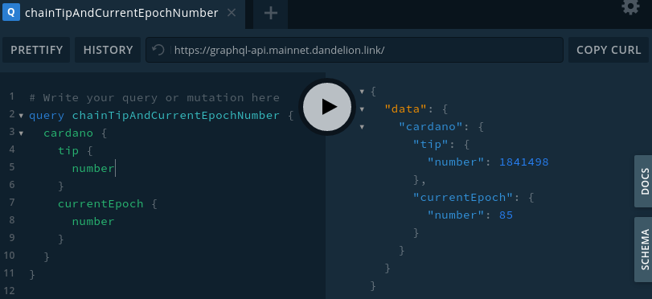
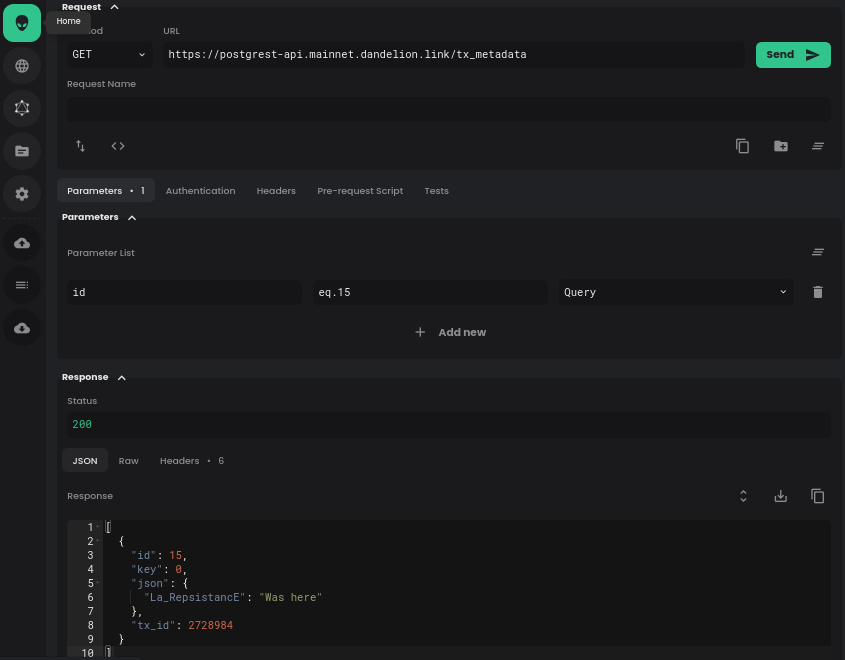

---
id: dandelion-apis
title: Get Started with Dandelion APIs
sidebar_label: Dandelion APIs
description: Get Started with Dandelion APIs
image: ./img/og-developer-portal.png
--- 

Dandelion currently offer 2 different paths to get started: 

- **For developers**: [A hosted instance][gimbalabs-dandelion] of almost every available Cardano API offered as a free community service by [Gimbalabs] to start building instantly.
- **For SPOs/DevOps/sysadmins**: [An OpenSource project][kustomize-dandelion] to deploy the community service using Kubernetes.
[gimbalabs]: https://gimbalabs.com/
[gimbalabs-dandelion]: https://gimbalabs.com/dandelion/
[kustomize-dandelion]: https://gitlab.com/gimbalabs/dandelion/kustomize-dandelion

# For developers

Start prototyping your project instantly by choosing the API that better suits your need.

They are all offered in the vanilla flavour of the opensource projects developed by IOG, Emurgo and other developers from the community, so you won't need to change anything in case you decide to host them by yourself.

These are the links to github repositories and a brief description for all of them:

- [hasura/graphql-api][gh-hasura-graphql]: use this GraphQL API to gather composed info from the blockchain and to send signed transactions to the blockchain
- [cardano-rest/explorer-api][gh-cardano-rest]: use this REST API to gather basic info from the blockchain. *DEPRECATED*
- [cardano-rest/submit-api][gh-cardano-rest]: use this REST API to send signed transactions to the blockchain *DEPRECATED*
- [KtorZ/ogmios-api][gh-ogmios]: use this JSON-WSP (websocket) API to gather live blockchain info directly from a cardano-node instance
- [cardano-db-sync][gh-cardano-db-sync]/[postgrest-api][gh-postgrest]: use this REST API to perform SQL queries to gather info directly from cardano-db-sync's database 
- [rosetta-api][gh-cardano-rosetta]: use this API to integrate your application with multiple blockchains in a simpler, faster, and more reliable way
[gh-hasura-graphql]: https://github.com/input-output-hk/cardano-graphql
[gh-cardano-rest]: https://github.com/input-output-hk/cardano-rest
[gh-ogmios]: https://github.com/cardanosolutions/ogmios
[gh-cardano-db-sync]: https://github.com/input-output-hk/cardano-db-sync
[gh-cardano-rosetta]: https://github.com/input-output-hk/cardano-rosetta
[gh-postgrest]: https://github.com/PostgREST/postgrest

import Tabs from '@theme/Tabs';
import TabItem from '@theme/TabItem';

## Cardano GraphQL



Useful links:

- [Link][gimbalabs-graphql-api] to Gimbalabs's endpoints information
- [Link][graphql-official-doc] to project's official documentation
- [Link][graphql-example-queries] to the official collection of example queries. You can play with them directly from the [GraphQL playground][graphql-playground-testnet]
[gimbalabs-graphql-api]: https://gimbalabs.com/dandelion/endpoints/graphql-api
[graphql-example-queries]: https://github.com/input-output-hk/cardano-graphql/tree/master/packages/api-cardano-db-hasura/src/example_queries
[graphql-official-doc]: https://input-output-hk.github.io/cardano-graphql/
[graphql-playground-testnet]:  https://graphql-api.testnet.dandelion.link

Usage examples:

<Tabs
defaultValue="curl"
values={[
{label: 'curl', value: 'curl'},
]}>
  <TabItem value="curl">

```sh
# testnet
curl -H 'Content-Type: application/json' \
     -H 'Accept: application/json' \
     --data-binary \
'{"query":"query cardanoDbSyncProgress {\n cardanoDbMeta {\n initialized\n syncPercentage\n }\n}\n"}' \
    https://graphql-api.testnet.dandelion.link
```
  </TabItem>
</Tabs>

Output example:

```json
{"data":{"cardanoDbMeta":{"initialized":true,"syncPercentage":100}}}
```

## Cardano Explorer


Useful links:

- [Link][gimbalabs-explorer-api] to Gimbalabs's endpoints information
- [Link][explorer-official-doc] to project's official documentation
[gimbalabs-explorer-api]: https://gimbalabs.com/dandelion/endpoints/explorer-api
[explorer-official-doc]: https://input-output-hk.github.io/cardano-rest/explorer-api

Usage examples:

<Tabs
defaultValue="curl"
values={[
{label: 'curl', value: 'curl'},
]}>
  <TabItem value="curl">

```sh
# testnet
curl -s https://explorer-api.testnet.dandelion.link/api/txs/last
# mainnet
curl -s https://explorer-api.mainnet.dandelion.link/api/txs/last
```
  </TabItem>
</Tabs>

Output example (REDACTED):

```json
{
  "Right": [
    {
      "cteId": "12703a0f201c9596d4fc256924f98e38d33dc23c4be1c7c3bc9bbc373ee3dbdf",
      "cteTimeIssued": 1621292369,
      "cteAmount": {
        "getCoin": "541898740"
      }
    },
    {
      "cteId": "f7f0be9988551b5179b143444f67215a06ef9794f3ed9e6f58a1b067db37f0a1",
      "cteTimeIssued": 1621292297,
      "cteAmount": {
        "getCoin": "1019242"
      }
    },
...
  ]
}
```

## Cardano Submit 


Useful links:

- [Link][gimbalabs-submit-api] to Gimbalabs's endpoints information 
- [Link][submit-official-doc] to project's official documentation
[gimbalabs-submit-api]: https://gimbalabs.com/dandelion/endpoints/submit-api
[submit-official-doc]: https://input-output-hk.github.io/cardano-rest/submit-api

Usage examples assuming you have a valid `application/cbor` file containing a signed transaction (in e.g., from `cardano-cli` or any other library) located at `/tmp/cbor-tx`:

<Tabs
defaultValue="curl"
values={[
{label: 'curl', value: 'curl'},
]}>
  <TabItem value="curl">

```sh
curl -X POST \
    --header "Content-Type: application/cbor" \
    --data-binary @/tmp/cbor-tx \
    https://submit-api.testnet.dandelion.link/api/submit/tx
```
  </TabItem>
</Tabs>

Output example (a transaction id):

```json
92bcd06b25dfbd89b578d536b4d3b7dd269b7c2aa206ed518012cffe0444d67f
```

## Cardano Rosetta


Useful links:

- [Link][gimbalabs-rosetta-api] to Gimbalabs's endpoints information and official documentation
- [Link][rosetta-official-doc] to project's official documentation
[gimbalabs-rosetta-api]: https://gimbalabs.com/dandelion/endpoints/rosetta-api
[rosetta-official-doc]: https://github.com/input-output-hk/cardano-rosetta#documentation

Usage examples:

<Tabs
defaultValue="curl"
values={[
{label: 'curl', value: 'curl'},
]}>
  <TabItem value="curl">

```sh
curl -s -X POST \
     -H 'Content-Type: application/json' \
     --data '{"network_identifier":{"blockchain":"cardano","network":"testnet"},"block_identifier":{"index":100}}' \
     https://rosetta-api.testnet.dandelion.link/block
```
  </TabItem>
</Tabs>

Output example:

```json
{
  "block": {
    "block_identifier": {
      "index": 100,
      "hash": "4c81fe7ddb7ab93a1973d674f1920bb1be980efdb819ea0a92d25706e72809fc"
    },
    "parent_block_identifier": {
      "index": 99,
      "hash": "e8b65f34c3b562a996b6bf6a9109e279536ae7efbc714ae0526bd222e7288eb4"
    },
    "timestamp": 1564022216000,
    "transactions": [],
    "metadata": {
      "transactionsCount": 0,
      "createdBy": "ByronGenesis-0df4205606dcb8ad",
      "size": 668,
      "epochNo": 0,
      "slotNo": 1130
    }
  }
}
```

## Ogmios


Useful links:

- [Link][gimbalabs-ogmios-api] to Gimbalabs's endpoints information and official documentation
- [Link][ogmios-official-doc] to project's official documentation
[gimbalabs-ogmios-api]: https://gimbalabs.com/dandelion/endpoints/ogmios-api
[ogmios-official-doc]: https://github.com/cardanosolutions/ogmios

Usage examples:

<Tabs
defaultValue="websocat"
values={[
{label: 'github.com/vi/websocat', value: 'websocat'},
]}>
  <TabItem value="websocat">

```sh
echo '{ "type": "jsonwsp/request", "version": "1.0", "servicename": "ogmios", "methodname": "RequestNext", "args": {} }' \
  | websocat --text -1 - wss://ogmios-api.testnet.dandelion.link
```
  </TabItem>
</Tabs>

Output example:

```json
{
  "type": "jsonwsp/response",
  "version": "1.0",
  "servicename": "ogmios",
  "methodname": "RequestNext",
  "result": {
    "RollBackward": {
      "point": "origin",
      "tip": {
        "slot": 26925169,
        "hash": "000a47936fed9bd76cfb52abcd9ab3172ba9118cff9b56767087544f295daba3",
        "blockNo": 2591103
      }
    }
  },
  "reflection": null
}
```

## PostgREST



Useful links:

- [Link][gimbalabs-postgrest-api] to Gimbalabs's endpoints information and official documentation
- [Link][cardano-db-sync-official-doc] to `cardano-db-sync` official documentation
[gimbalabs-postgrest-api]: https://gimbalabs.com/dandelion/endpoints/postgrest-api
[cardano-db-sync-official-doc]: https://github.com/input-output-hk/cardano-db-sync/blob/master/doc/interesting-queries.md

Usage examples:

<Tabs
defaultValue="curl"
values={[
{label: 'curl', value: 'curl'},
]}>
  <TabItem value="curl">

```sh
# query available metadatums
curl -s "https://postgrest-api.mainnet.dandelion.link/rpc/get_metadatum"
# query metadatum 20201210
curl -d metadatum=20201210 -s "https://postgrest-api.mainnet.dandelion.link/rpc/get_metadata" | jq .
# query metadatum 42 for epoch 234-235 and limit results to 1
curl -s -d metadatum=42 -d epochs="{234,235}" "https://postgrest-api.mainnet.dandelion.link/rpc/get_metadata?limit=1"
# query metadata entry number 15
curl -s "https://postgrest-api.mainnet.dandelion.link/tx_metadata?id=eq.15"
# query pool metadata whose URL contains "repsistance" 
curl -s "https://postgrest-api.mainnet.dandelion.link/pool_meta_data?url=like.*repsistance*"
# query metadata entries for SPOCRA proposalId "80064c28-1b03-4f1c-abf0-ca8c5a98d5b9"
curl -s "https://postgrest-api.mainnet.dandelion.link/tx_metadata?json->>ProposalId=eq.80064c28-1b03-4f1c-abf0-ca8c5a98d5b9"
# query metadata entries for the whole SPOCRA network
curl -s "https://postgrest-api.mainnet.dandelion.link/tx_metadata?json->>NetworkId=eq.SPOCRA"
```
  </TabItem>
</Tabs>

## Deploy your own Dandelion

If you already have Docker installed, you are almost done for using Dandelion in your local development environment. Please refer to [the official documentation][local-dandelion-deploy] to do so and do not hesitate to ask for support in our dedicated [Discord channel][discord-dandelion], we know operating systems, networks and cloud providers might differ a lot and give random problems!
[discord-dandelion]: https://discord.gg/qDc3f9R7Ab
[local-dandelion-deploy]: https://gitlab.com/gimbalabs/dandelion/kustomize-dandelion#local-deployment
