# Cardano Developer Pathway

## From zero to core contributor or dApp builder

The **diagram below** is one visual overview of typical journeys on Cardano: where you start, learning and practice, tracks (contracts, frontend, infra), integration, testing, testnets, and deeper specialisations. It is **illustrative only**—we have **not** tried to list every tool, course, or link; many things are left out so the chart stays usable. **Click** a node to open a related page where we attached one; **hover** may show a short tooltip from the diagram renderer. Large diagrams are easier to read if you **scroll** the diagram area or use your browser’s zoom.

---

## Full pathway diagram

```mermaid
flowchart TD
  subgraph phase1 [Phase 1 · Orientation and entry]
    start([Where are you starting])
    beginner[Complete beginner no code yet]
    web2[Web2 developer JS Python Rust Java and more]
    designer[Designer UI-UX Figma CSS motion]
    evmEntry[Solidity or EVM background Hardhat Foundry etc]
    start --> beginner
    start --> web2
    start --> designer
    start --> evmEntry
    beginner --> fund
    web2 --> fund
    designer --> fund
    evmEntry -->|Recommended same core as everyone| fund
    fund["Cardano fundamentals eUTxO native tokens Ouroboros Voltaire CIPs"]
    fund --> learnHere["Learn here Academy developers.cardano.org Gimbalabs cardano-course"]
  end

  subgraph phase2 [Phase 2 · Cross-cutting knowledge]
    stack2026["Default stack 2026 Aiken plus MeshJS plus Blockfrost swap Lucid Blaze Koios when needed"]
    noFullNode["No synced full node for many dApps Blockfrost Koios Maestro"]
    cborNote["CBOR in txs datums redeemers addresses low-level debugging"]
    cipPick["Essential CIPs CIP-30 wallet CIP-25 27 31 CIP-33 CIP-68 CIP-1694"]
  end

  learnHere --> stack2026
  learnHere --> noFullNode
  fund --> cborNote
  fund --> cipPick

  subgraph phase3 [Phase 3 · Intermediate projects]
    rampVm[Vending machine or single-purpose contract]
    rampNft[NFT minter CIP-25 CIP-67 CIP-68]
    rampDex[Simple DEX or swap UTxO concurrency lesson]
    rampFull[Full stack validator SDK UI APIs]
    rampVm --> rampNft --> rampDex --> rampFull
  end

  learnHere --> rampVm

  evmEntry -->|Or fast path after basics| evmMap["EVM to Cardano accounts vs UTxO no msg.sender ExUnits vs gas Aiken ecosystem"]
  evmMap --> readySpec

  rampFull --> readySpec
  cipPick --> readySpec
  stack2026 --> readySpec

  readySpec[Ready to specialise primary track]

  readySpec --> pickTrack{Choose primary track}

  pickTrack --> trackSc[Smart contracts on-chain logic]
  pickTrack --> trackFe[Frontend dApp JS React Next]
  pickTrack --> trackInfra[Infrastructure node indexers APIs SPO]

  trackSc --> langPick{On-chain language}

  langPick --> aikenLang[Aiken Rust-like ecosystem default]
  langPick --> plutusLang[Plutus Haskell core]
  langPick --> otherLang[OpShin Helios Scalus Plu-ts]

  aikenLang --> aikenLearn[Aiken docs stdlib tests Discord]
  plutusLang --> plutusLearn[Plutus Pioneer IOG Haskell path]
  otherLang --> localDevnet

  aikenLearn --> localDevnet
  plutusLearn --> localDevnet

  localDevnet["Local devnet Yaci cardano-testnet Ogmios Kupo fast feedback before testnet waits"]
  localDevnet --> scBuild["Validators datum redeemer minting policies"]

  trackFe --> sdkPick{Off-chain SDK}

  sdkPick --> meshSdk[MeshJS]
  sdkPick --> lucidSdk[Lucid evolution]
  sdkPick --> blazeSdk[Blaze typed TS]
  sdkPick --> otherSdk[PyCardano CTL Atlas Evolution SDK]

  meshSdk --> txAnatomy
  lucidSdk --> txAnatomy
  blazeSdk --> txAnatomy
  otherSdk --> txAnatomy

  txAnatomy["Tx anatomy minUTxO collateral ExUnits fees coin selection CIP-33 ref scripts"]

  txAnatomy --> walletCip["Wallet APIs CIP-30 CIP-95 CIP-62"]

  walletCip --> walletOps["Connect flows errors mobile hardware light vs full node"]

  walletOps --> feBuild["dApp UI tx building chain state UX"]

  trackInfra --> nodeCli[Cardano node and cardano-cli]
  nodeCli --> indexerLayer[DB-Sync Kupo Scrolls Oura Dolos]
  indexerLayer --> apiLayer[Ogmios Blockfrost Koios Maestro]
  apiLayer --> spoPath[Stake pool operations DevOps monitoring]

  noFullNode -.-> apiLayer

  designer -->|UX-heavy path skips core SDK track| uxLearn[Web3 UX wallet flows pending txs fees]
  uxLearn --> walletCip

  scBuild --> integrateFull
  feBuild --> integrateFull
  spoPath --> integrateFull

  integrateFull["Full-stack integration validators off-chain UI chain data"]

  integrateFull --> utxoConcurrency["UTxO concurrency batching beacons fan-in fan-out avoid hot UTxO"]

  utxoConcurrency --> testLayer["Tests property integration CI full stack"]

  testLayer --> debugLayer["On-chain debug CLI evaluate traces Aiken tracing ExUnits"]

  debugLayer --> auditGate{External audit needed}

  auditGate -->|DeFi or high value| auditFirm[Tweag Anastasia MLabs Vacuum and peers]
  auditGate -->|Simple dApp| shipTestnet

  auditFirm --> shipTestnet

  shipTestnet["Testnets Preview Preprod Sanchonet faucets SDK network config"]

  shipTestnet --> mainnetShip[Mainnet launch DeFi NFT DAO RWA gaming]

  mainnetShip --> catalyst[Project Catalyst grants]
  mainnetShip --> community[Discord Stack Exchange Forum hubs]

  catalyst --> growPick{Advanced specialisation}
  community --> growPick

  growPick --> corePath[Core protocol Haskell ledger CIPs cardano-node]
  growPick --> defiPath[DeFi founder DEX lending stablecoins]
  growPick --> l2Path[Hydra Mithril zk rollup research]
  growPick --> nftPath[NFT gaming marketplaces RWA]
  growPick --> govPath[GovTool DRep Agora Voltaire CIP-1694]
  growPick --> bridgePath[Cross-chain bridges wrapped assets ecosystem]

  corePath --> outcomes
  defiPath --> outcomes
  l2Path --> outcomes
  nftPath --> outcomes
  govPath --> outcomes
  bridgePath --> outcomes

  outcomes["Outcomes builder contributor salary grants portfolio Catalyst meetups"]

  outcomes -->|Keep shipping| catalyst

  click start "/docs/get-started/developer-pathway/overview/"
  click fund "https://developers.cardano.org/docs/get-started/"
  click learnHere "https://academy.cardanofoundation.org"
  click stack2026 "/docs/get-started/developer-pathway/overview/#pathway-deep-links"
  click noFullNode "https://blockfrost.io"
  click cborNote "/docs/get-started/developer-pathway/overview/#pathway-cbor"
  click cipPick "https://github.com/cardano-foundation/CIPs"
  click rampVm "https://aiken-lang.org/language-tour/validators"
  click rampNft "https://developers.cardano.org/docs/native-tokens/"
  click rampDex "https://developers.cardano.org/docs/smart-contracts/"
  click rampFull "https://developers.cardano.org/docs/get-started/"
  click readySpec "/docs/get-started/developer-pathway/overview/#pathway-deep-links"
  click evmEntry "https://developers.cardano.org/docs/get-started/"
  click evmMap "https://aiken-lang.org"
  click aikenLang "https://aiken-lang.org"
  click plutusLang "https://plutus.readthedocs.io"
  click otherLang "https://developers.cardano.org/docs/smart-contracts/"
  click aikenLearn "https://aiken-lang.org/installation-instructions"
  click plutusLearn "https://iog.io/en/education/programs/plutus-pioneers-program/"
  click localDevnet "/docs/get-started/developer-pathway/overview/#pathway-local-devnet"
  click scBuild "https://aiken-lang.org/language-tour/validators"
  click meshSdk "https://meshjs.dev"
  click lucidSdk "https://lucid-evolution.netlify.app"
  click blazeSdk "https://blaze.butane.dev"
  click otherSdk "https://developers.cardano.org/docs/get-started/"
  click txAnatomy "/docs/get-started/developer-pathway/overview/#pathway-transaction-anatomy"
  click walletCip "/docs/get-started/developer-pathway/overview/#pathway-wallets"
  click walletOps "/docs/get-started/developer-pathway/overview/#pathway-wallets"
  click feBuild "https://developers.cardano.org/docs/get-started/"
  click nodeCli "https://cardano-course.gitbook.io"
  click indexerLayer "https://github.com/IntersectMBO/cardano-db-sync"
  click apiLayer "https://koios.rest"
  click spoPath "https://developers.cardano.org/docs/operate-a-stake-pool/"
  click uxLearn "https://meshjs.dev/guides"
  click integrateFull "/docs/get-started/developer-pathway/overview/#pathway-deep-links"
  click utxoConcurrency "/docs/get-started/developer-pathway/overview/#pathway-concurrency"
  click testLayer "/docs/get-started/developer-pathway/overview/#pathway-testing-debug"
  click debugLayer "/docs/get-started/developer-pathway/overview/#pathway-testing-debug"
  click auditFirm "https://developers.cardano.org/docs/smart-contracts/"
  click shipTestnet "https://docs.cardano.org/cardano-testnets/getting-started/"
  click mainnetShip "https://developers.cardano.org/showcase"
  click catalyst "https://projectcatalyst.io"
  click community "https://cardano.stackexchange.com"
  click corePath "https://github.com/intersectmbo/cardano-node"
  click defiPath "https://developers.cardano.org/docs/smart-contracts/"
  click l2Path "https://hydra.family"
  click nftPath "https://developers.cardano.org/docs/native-tokens/"
  click govPath "https://gov.tools"
  click bridgePath "/docs/get-started/developer-pathway/overview/#pathway-bridges"
  click outcomes "https://developers.cardano.org/showcase"
```

**How to read this map:** Steps run top to bottom, but **real delivery loops** between validators, off-chain builders, and UI—use the diagram for coverage, not as a strict waterfall.

## Explore further

- **[Builder Tools](/tools/)** — Browse tools, APIs, and ecosystem projects.
- **[Client SDKs overview](/docs/get-started/client-sdks/overview)** — TypeScript, Python, Rust, and more.
- **[Infrastructure overview](/docs/get-started/infrastructure/overview)** — Node, CLI, API providers.
- **[Core concepts](/docs/learn/core-concepts/)** — UTxO, transactions, addresses, and fundamentals.

---

## Deep links {#pathway-deep-links}

Pointers that match several nodes in the diagram (default stack, full-stack integration, “ready to specialise”).

- **On-chain:** [Smart contracts](/docs/build/smart-contracts/overview), [Native tokens](/docs/build/native-tokens/overview).
- **Off-chain:** [Client SDKs overview](/docs/get-started/client-sdks/overview), [Mesh (TypeScript)](/docs/get-started/client-sdks/typescript/mesh/overview), [Evolution SDK](/docs/get-started/client-sdks/typescript/evolution-sdk/get-started).
- **Chain data without a local node:** [API providers overview](/docs/get-started/infrastructure/api-providers/overview), [Blockfrost](/docs/get-started/infrastructure/api-providers/blockfrost/overview), [Koios](/docs/get-started/infrastructure/api-providers/koios), [Ogmios](/docs/get-started/infrastructure/api-providers/ogmios).
- **Integration:** [Integrate overview](/docs/build/integrate/overview).

---

## CBOR and low-level debugging {#pathway-cbor}

Transactions and scripts on Cardano lean heavily on **CBOR**-encoded structures (outputs, datums, redeemers, addresses).

- [Transactions (core concepts)](/docs/learn/core-concepts/transactions)
- [Cardano Serialization Library overview](/docs/get-started/client-sdks/low-level/cardano-serialization-lib/overview) — lower-level encoding and building blocks
- [CIPs repository](https://github.com/cardano-foundation/CIPs) — formal specs for many wire formats and standards

---

## Local devnet and fast feedback {#pathway-local-devnet}

Iterate quickly before waiting on public testnets.

- [Development networks overview](/docs/get-started/networks/development-networks/overview)
- [Yaci DevKit](/docs/get-started/networks/development-networks/yaci-devkit)
- [Cardano testnet](/docs/get-started/networks/development-networks/cardano-testnet)
- [Ogmios](/docs/get-started/infrastructure/api-providers/ogmios) — local chain interaction
- [Testnets guide](/docs/get-started/networks/testnets)

---

## Transaction anatomy {#pathway-transaction-anatomy}

- [eUTxO](/docs/learn/core-concepts/eutxo), [Transactions](/docs/learn/core-concepts/transactions), [Addresses](/docs/learn/core-concepts/addresses)
- [Fees](/docs/learn/core-concepts/fees)
- [Integrate overview](/docs/build/integrate/overview) — wallets, payments, dApp patterns
- [CIPs](https://github.com/cardano-foundation/CIPs) — e.g. reference scripts (CIP-33), collateral patterns

---

## Wallets and dApp connection {#pathway-wallets}

- [Integrate overview](/docs/build/integrate/overview)
- [CIP-30 (wallet dApp bridge)](https://github.com/cardano-foundation/CIPs/tree/master/CIP-0030)
- [Mesh wallets integration](/docs/get-started/client-sdks/typescript/mesh/wallets-integration)
- [Evolution SDK wallets](/docs/get-started/client-sdks/typescript/evolution-sdk/wallets)

---

## UTxO concurrency and scaling patterns {#pathway-concurrency}

Cardano uses **eUTxO**: design around contention, batching, and multiple UTxOs rather than a single global account.

- [Smart contracts overview](/docs/build/smart-contracts/overview)
- [Lesson: concurrency and state](/docs/build/smart-contracts/lessons/05-avoid-redundant-validation) — practical patterns

---

## Testing and on-chain debugging {#pathway-testing-debug}

- [Smart contracts overview](/docs/build/smart-contracts/overview) — testing mindset and tooling pointers
- [cardano-cli Plutus scripts](/docs/get-started/infrastructure/cardano-cli/plutus-scripts/) — CLI evaluation paths
- [Aiken](https://aiken-lang.org) — traces and tests in the default on-chain toolchain for many teams

---

## Cross-chain and bridges {#pathway-bridges}

Bridging and wrapped assets vary by project; start from ecosystem docs and security practices.

- [Integrate overview](/docs/build/integrate/overview)
- [Project Catalyst](https://projectcatalyst.io) — ecosystem and funded bridge-related work
- Always pair integration work with **threat modelling** and, for high-value flows, **professional audit** (see nodes in the diagram such as Tweag, Anastasia, MLabs, Vacuumlabs, and peers).
