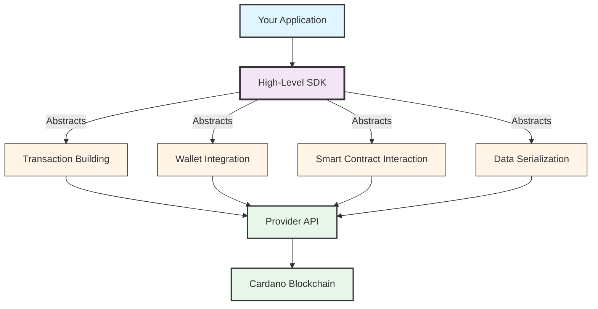

## Choose Your SDK

High-level SDKs provide developer-friendly interfaces for building Cardano applications without dealing with low-level blockchain operations. These SDKs handle transaction building, wallet integration, smart contract interactions, and more.

SDKs abstract away the complexity of blockchain operations: transaction building, CBOR serialization, UTxO selection, fee calculation, address derivation, and protocol parameter management. This lets you build Cardano applications using modern languages like JavaScript, Python, TypeScript, and C# without needing to understand low-level blockchain internals.

---

## Available SDKs

import DocCardList from '@theme/DocCardList';

<DocCardList />
