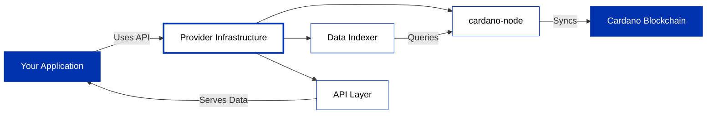

## Choose Your API Provider

API providers give you access to the Cardano blockchain through developer-friendly APIs. They handle node operations, data indexing, and expose REST, WebSocket, or GraphQL endpoints so you can query blockchain data without running your own infrastructure.

Providers run and maintain Cardano infrastructure so you don't have to. They operate cardano-node, index blockchain data into queryable databases, and expose developer-friendly APIs (REST, WebSocket, gRPC). This means you can query blocks, transactions, UTXOs, submit transactions, and access protocol parameters without managing servers, handling upgrades, or ensuring uptime.

---

## Example API Providers

Different providers offer different features and pricing models:

| Provider | Type | Key Features | Networks |
|----------|------|--------------|----------|
| **[Blockfrost](/docs/get-started/infrastructure/api-providers/blockfrost/overview)** | REST API | Simple REST API, fast integration | Mainnet, Preprod, Preview |
| **[Koios](/docs/get-started/infrastructure/api-providers/koios)** | REST/GraphQL API | Community-driven, decentralized infrastructure | Mainnet, Preprod, Preview |
| **[Ogmios](/docs/get-started/infrastructure/api-providers/ogmios)** | WebSocket/JSON-RPC | Low-level protocol access, real-time queries | All networks (self-hosted or via providers) |

---

## Other Infrastructure Options

Beyond API providers, you have other ways to connect to Cardano:

- **[Demeter](/docs/get-started/infrastructure/demeter)**: Full cloud infrastructure platform with managed nodes, DB-Sync, Ogmios, and Kupo
- **[Running Your Own Node](/docs/operate-a-stake-pool/node-operations/cardano-components)**: Complete control over infrastructure

---

## Available Providers

import DocCardList from '@theme/DocCardList';

<DocCardList />
