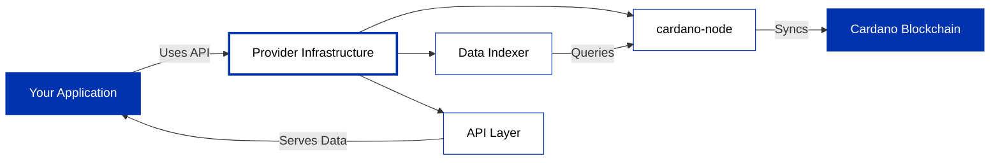

API providers run cardano-node infrastructure and expose blockchain data through developer-friendly APIs, letting you query data and submit transactions without managing servers.

## How API providers work

## Choosing a provider

| Provider | API Type | Key Features | Networks |
|----------|----------|--------------|----------|
| **[Blockfrost](/docs/get-started/infrastructure/api-providers/blockfrost/overview)** | REST | Simple REST API, webhooks, fast integration | Mainnet, Preprod, Preview |
| **[Koios](/docs/get-started/infrastructure/api-providers/koios)** | REST, GraphQL | Community-driven, decentralized, open source | Mainnet, Preprod, Preview |
| **[Ogmios](/docs/get-started/infrastructure/api-providers/ogmios)** | WebSocket, JSON-RPC | Low-level protocol access, real-time queries | All networks (requires node) |

### Blockfrost

Hosted REST API with simple endpoints for querying blockchain data. Use Blockfrost to:

- Integrate quickly with REST endpoints
- Subscribe to blockchain events via webhooks
- Build with extensive SDK support

**Learn more**: [Blockfrost documentation](/docs/get-started/infrastructure/api-providers/blockfrost/overview)

### Koios

Community-run REST and GraphQL API with decentralized infrastructure. Use Koios to:

- Query via REST or GraphQL endpoints
- Access open-source, community-maintained service
- Connect without registration requirements

**Learn more**: [Koios documentation](/docs/get-started/infrastructure/api-providers/koios)

### Ogmios

WebSocket-based JSON-RPC API providing low-level protocol access. Use Ogmios to:

- Query blockchain state in real-time
- Access protocol-level details
- Build custom indexing solutions

**Note**: Ogmios requires cardano-node (self-hosted or via [Demeter](/docs/get-started/infrastructure/demeter))

**Learn more**: [Ogmios documentation](/docs/get-started/infrastructure/api-providers/ogmios)

## Next steps

- **Get started quickly**: [Set up Blockfrost](/docs/get-started/infrastructure/api-providers/blockfrost/get-started) for immediate API access
- **Explore alternatives**: [Try Koios](/docs/get-started/infrastructure/api-providers/koios) for community-driven infrastructure
- **Advanced access**: [Use Ogmios](/docs/get-started/infrastructure/api-providers/ogmios) for protocol-level queries
- **Compare options**: [View all infrastructure approaches](/docs/get-started/infrastructure/overview)
