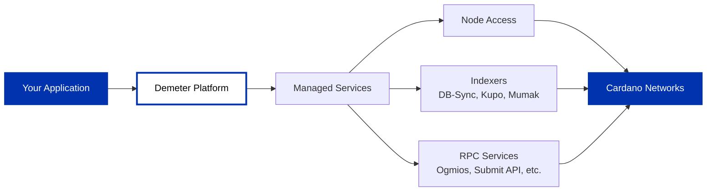

## What is Demeter?

[Demeter](https://demeter.run) is a cloud-based infrastructure platform that provides managed Cardano middleware and services. It handles the operational aspects of running Cardano infrastructure so developers can focus on building applications.

## What Demeter Provides

Demeter offers a range of managed Cardano services across different categories:

**Node Access**: Direct connectivity to Cardano nodes for submitting transactions and querying the blockchain.

**Indexers**: Database services like DB-Sync, Kupo, and Mumak for querying historical ledger data and UTXOs.

**RPC Services**: APIs including Ogmios, Submit API, UTxO RPC, and Blockfrost (RYO) for interacting with the blockchain through various protocols.

Browse the full catalog of available services on [demeter.run](https://demeter.run).

## Network Support

Demeter supports all major Cardano networks including mainnet, preprod, and preview testnets.

## Use Cases

Demeter is useful when you want managed infrastructure instead of running and maintaining your own nodes. This includes:

- Building applications without infrastructure setup
- Prototyping and development with quick access to Cardano services
- Production deployments where you prefer managed infrastructure

If you need complete control over your infrastructure or are running a stake pool, you'll want to [run your own node](/docs/get-started/infrastructure/node/cardano-components) instead.

## Getting Started

Visit [demeter.run](https://demeter.run) to create an account and access the Demeter platform. Their [documentation](https://docs.demeter.run) provides guides for setting up services and integrating with your applications.

---

**Compare with**: [API Providers](/docs/get-started/infrastructure/api-providers/overview) (Blockfrost, Koios, Ogmios) or [Running your own node](/docs/get-started/infrastructure/node/cardano-components)
