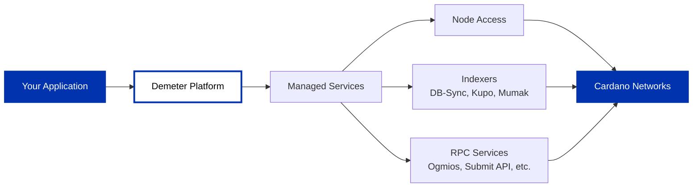

[Demeter](https://demeter.run) provides managed Cardano infrastructure, handling node operations, indexing, and middleware so you can focus on building applications.

## Available services

Demeter offers managed Cardano services across mainnet, preprod, and preview networks:

**Node Access**: Submit transactions and query blockchain through direct node connectivity

**Indexers**: Query historical ledger data and UTXOs via DB-Sync, Kupo, and Mumak

**RPC Services**: Access blockchain through Ogmios, Submit API, UTxO RPC, and Blockfrost (RYO)

Browse the full service catalog at [demeter.run](https://demeter.run).

## When to use Demeter

Use Demeter when you:

- Want managed infrastructure without DevOps overhead
- Need multiple Cardano services (nodes, indexers, RPC)
- Prefer pay-as-you-go over self-hosting
- Build applications or prototypes requiring full service access

For complete infrastructure control or stake pool operations, [run your own node](/docs/get-started/infrastructure/node/cardano-components) instead.

## Getting started

Visit [demeter.run](https://demeter.run) to create an account. See their [documentation](https://docs.demeter.run) for service setup and integration guides.

**Compare with**: [API Providers](/docs/get-started/infrastructure/api-providers/overview) or [Running your own node](/docs/get-started/infrastructure/node/cardano-components)
