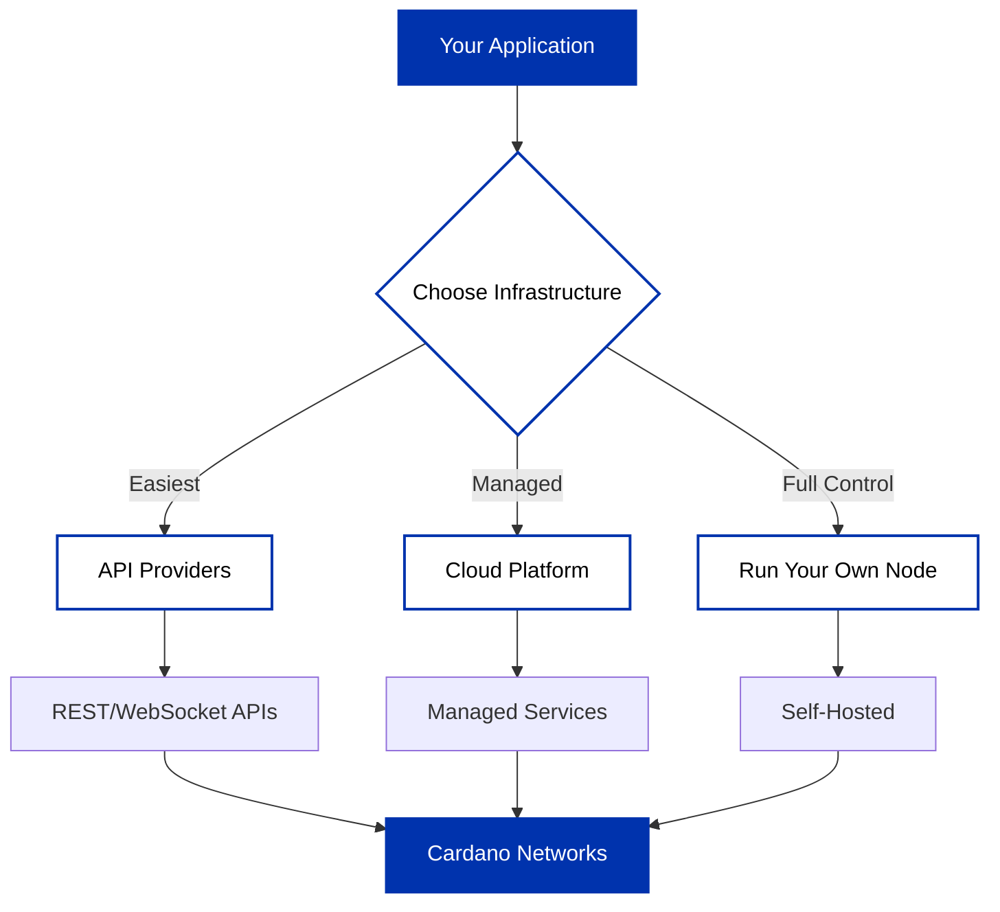

## Connecting to Cardano

Once you've chosen your [network](/docs/get-started/networks/overview), you need infrastructure to connect to it. To build your application, whether you're using [Client SDKs](/docs/get-started/client-sdks/overview), building with cardano-cli directly, you'll need one of these infrastructure approaches as your backend.

Your SDK or application connects to Cardano through your chosen infrastructure - either via API providers like Blockfrost, through middleware like Ogmios (self-hosted or via Demeter), or directly to your own cardano-node. The infrastructure you choose determines how your code queries the blockchain and submits transactions.

---

## Infrastructure Options

### [API Providers](/docs/get-started/infrastructure/api-providers/overview)

Connect to Cardano through REST or WebSocket APIs without managing infrastructure. Most [Client SDKs](/docs/get-started/client-sdks/overview) give access to these providers to query the blockchain and submit transactions.

**Examples**: [Blockfrost](/docs/get-started/infrastructure/api-providers/blockfrost/overview), [Koios](/docs/get-started/infrastructure/api-providers/koios)

**What you get**: Simple API integration, no infrastructure setup, quick to get started

**Considerations**: Third-party service dependency, API rate limits may apply, usage-based pricing

**Note**: [Ogmios](/docs/get-started/infrastructure/api-providers/ogmios) is also commonly used with SDKs, but it's middleware that requires cardano-node (either self-hosted or via Demeter).

---

### [Demeter](/docs/get-started/infrastructure/demeter)

Cloud-based platform providing managed Cardano middleware and services.

**Provides**: Managed nodes, indexers (DB-Sync, Kupo), RPC services (Ogmios, Submit API)

**What you get**: Full suite of managed Cardano services, no infrastructure maintenance, flexible service selection

**Considerations**: Pay-as-you-go pricing model, platform-managed infrastructure

---

### [Running Cardano Node](/docs/get-started/infrastructure/node/cardano-components)

Run and maintain your own Cardano node infrastructure.

**Components**: [cardano-node](/docs/get-started/infrastructure/node/cardano-components), [cardano-cli](/docs/get-started/infrastructure/cardano-cli/basic-operations/get-started)

**What you get**: Complete infrastructure control, no external dependencies, direct blockchain access

**Considerations**: Infrastructure management required, server and maintenance costs, DevOps resources needed

---

## Getting Started

Each approach has its own trade-offs. You can:

- Start with [API Providers](/docs/get-started/infrastructure/api-providers/overview) for quick integration
- Use [Demeter](/docs/get-started/infrastructure/demeter) for a managed services platform
- [Run your own node](/docs/get-started/infrastructure/node/cardano-components) for full control

Many teams use different approaches at different stages or combine them - such as using providers during development and running their own infrastructure in production.
