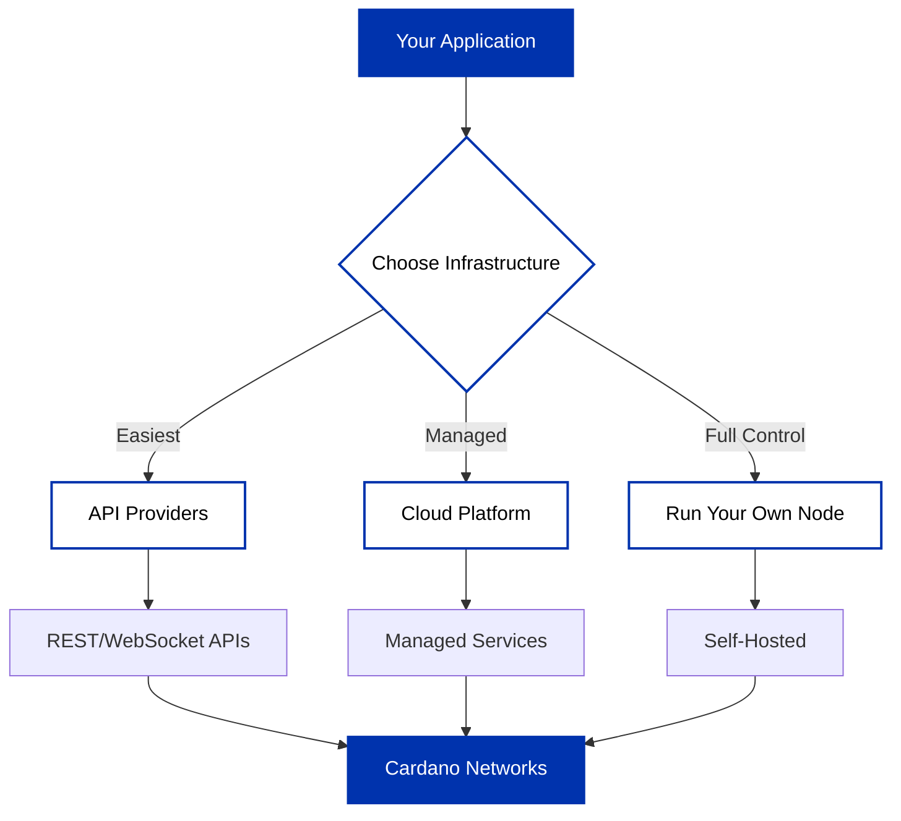

After choosing your [network](/docs/get-started/networks/overview), select infrastructure to connect your application to Cardano.

## Choosing infrastructure

| Approach | Setup | Maintenance | Control | Use Case |
|----------|-------|-------------|---------|----------|
| **[API Providers](#api-providers)** | Minutes | None | Limited | Quick integration, prototyping, most applications |
| **[Demeter](#demeter)** | Minutes | Managed | Flexible | Full service suite, managed infrastructure |
| **[Own Node](#running-cardano-node)** | Hours/Days | Self-managed | Complete | Production at scale, stake pools, maximum control |

### API Providers

Connect through REST or WebSocket APIs without managing infrastructure. Providers run nodes and indexers, exposing developer-friendly endpoints.

Use API providers to:
- Integrate quickly with simple REST APIs
- Query blockchain data and submit transactions
- Build with existing SDKs (most support Blockfrost, Koios)
- Avoid infrastructure setup and maintenance

**Trade-offs**: Third-party dependency, rate limits, usage-based pricing

**Learn more**: [API Providers overview](/docs/get-started/infrastructure/api-providers/overview) - Blockfrost, Koios, Ogmios

### Demeter

Cloud platform providing managed Cardano services - nodes, indexers (DB-Sync, Kupo), and RPC services (Ogmios, Submit API).

Use Demeter to:
- Access full service suite without setup
- Select only services you need
- Scale services on demand
- Focus on building, not DevOps

**Trade-offs**: Platform dependency, pay-as-you-go pricing

**Learn more**: [Demeter platform](/docs/get-started/infrastructure/demeter)

### Running Cardano Node

Run and maintain your own cardano-node infrastructure with direct blockchain access.

Use your own node to:
- Eliminate external dependencies
- Access blockchain data directly
- Run stake pool operations
- Control all infrastructure aspects

**Trade-offs**: Server costs, DevOps resources, maintenance overhead

**Learn more**: [Cardano node setup](/docs/get-started/infrastructure/node/cardano-components) and [cardano-cli](/docs/get-started/infrastructure/cardano-cli/basic-operations/get-started)

## Next steps

- **Start quickly**: [Choose an API provider](/docs/get-started/infrastructure/api-providers/overview) for immediate integration
- **Managed services**: [Explore Demeter](/docs/get-started/infrastructure/demeter) for full service platform
- **Self-host**: [Install cardano-node](/docs/get-started/infrastructure/node/installing-cardano-node) for complete control

Many teams combine approaches - API providers for development, own nodes for production, or Demeter for managed infrastructure throughout.
