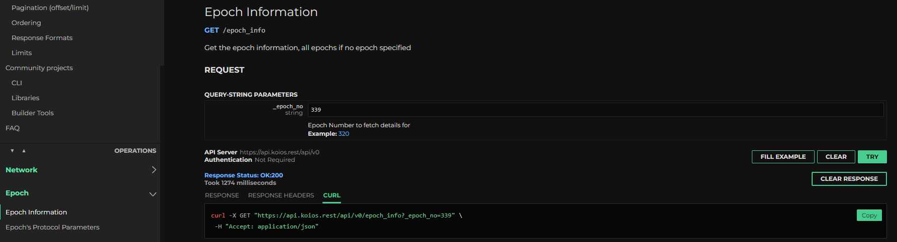

Koios provides an open-source & elastic API layer that allows you to query Cardano blockchain (across Mainnet, testnets and guildnet network).
The key flexibility from a consumer of Koios API is being able to use Koios as a light webservice or being able to run a Koios instance and optionally `extend` the query layer with automatic failover and high availability support across the globe. When running an instance, one is free to add additional endpoints to their individual service if they have a use case that may not need to be added upstream.

Let's start with basics from consumer point of view, and then we can dive to a brief summary about running a Koios Instance as a provider (independently OR adding to existing members of Koios cluster).

## Usage

### API Documentation

You can access API documentation [here](https://api.koios.rest). Koios leverages [PostgREST](https://postgrest.org/) to provide data, which means you can easily filter your data vertically as well as horizontally, and leverage in-built ordering/custom paging benefits as per the guide [here](https://api.koios.rest/#overview--api-usage). There isn't any centralised registry to be able to access the endpoints for most of the usage.

Each endpoint in the document provides a sample curl command that can be used to test using an example, which can be executed directly from the browser for testing as well.

 
### Limits

If you're using Koios service remotely, there are certain measures to protect against spamming or potentially unknowingly causing a Denial-of-Service against instance providers. Be sure to be mindful of the limits mentioned [here](https://api.koios.rest/#overview--limits).

## Feature Requests/Discussions

If you notice an issue or have a feature request (existing or new endpoint), we invite you to open an issue on [Koios Artifacts](https://github.com/cardano-community/koios-artifacts) repository first, and then feel free to discuss the topic in [Koios discussions](https://t.me/+zE4Lce_QUepiY2U1) group.

## Participating as instance provider

There will always be an audience who might want to run everything locally instead of relying on any external connection. Typically, these would be heavy users of the API (explorers/wallet providers/marketplaces), who'd like to override default API limits, have customisation requirements, remove latency hops OR enthusiasts who'd like to contribute back and add to the strength of the API layer.

For this audience, we've tried to leverage the existing widely adopted `guild-operators` suite to build simpler scripts that'd allow you to create a gRest instance. This independent gRest instance will give you 100% of features and compatibility with the API documentation hosted on api.koios.rest (assuming it's built from the latest `koios` tags).

### Infrastructure Sizing

Most of the infrastructure sizing at the moment is dependent on sizing of `cardano-node`, `cardano-db-sync` and `postgres`, and their consumption is different depending on the network you connect to. You can find the official `cardano-db-sync` documentation for system requirements [here](https://github.com/IntersectMBO/cardano-db-sync#system-requirements). But as a basic recommendation, if you're running a typical dbsync+node+postgres instance, we would recommend you to go for 64GB RAM for Mainnet, 16GB for Testnet and 8GB for Guildnet (this is true as of May 2022, we intend to update this page if/when this is no longer sufficient).

:::note

While we understand that a lot of modern cloud architects would like to split the services and distribute hardware physically, please note that `cardano-db-sync` and `postgres` should *NOT* be split (unless you really understand and heavily tune your infrastructure and setup accordingly), and doing so often results in a terrible experience. You're free to split PostgREST and HAProxy into microservices, but you'd need to adapt scripts accordingly. You'd only want to do that once you're fully familiar with the deployment. It is also why we have for now paused the work for the docker branch.

:::

### Set Up instance

Typical steps involved for setting up your gRest instance would be (assuming you've set up your infrastructure already):

1. Set up your OS for dependencies and create folder structures using [prereqs script](https://cardano-community.github.io/guild-operators/basics/#pre-requisites).

2. Install PostgreSQL server, followed by a tuning exercise that fits your infrastructure. See sample guide [here](https://cardano-community.github.io/guild-operators/Appendix/postgres/)

3. Set up your Cardano Node and wait for node to sync to current epoch. See sample instructions [here](https://cardano-community.github.io/guild-operators/Build/node-cli/). You can optionally also install `cardano-submit-api` on the same server to be able to submit transactions using consistent paths from API documentation.

4. Once your node is in sync, set up your dbsync instance (easier to use snapshots instead of synching from scratch) as per instructions [here](https://cardano-community.github.io/guild-operators/Build/dbsync/). Ensure that you're running dbsync as a systemd service (not as a script on terminal).

5. You should now be able to run the `setup-grest.sh` script as per details [here](https://cardano-community.github.io/guild-operators/Build/grest/#setup). Thus, if you'd like to deploy gRest against Mainnet version, you may elect to run `./setup-grest.sh -f -i prmcd -q -b <branch/tag>` which will set up all the components, endpoints and deploy them as service on your system.

6. [Optional] You can also install [ogmios](https://ogmios.dev) instance to have it enabled on your instance. This is currently not enabled by default, as it would require more advanced session management over WSS, that is more suited for a server-client architecture than a RESTful interface to access directly. There may be middleware leveraging this service in future, but it will not be scoped for v1 of Koios API.

### Important Config Files/Ports

By default, following are the config, service and port mappings for various services using above instructions.

|Component          | Config                                  | Port  | Default Service Name |
|-------------------|-----------------------------------------|-------|----------------------|
|PostgreSQL         | /etc/postgresql/14/main/postgresql.conf | 5432  | postgresql           |
|Cardano-Node       | /opt/cardano/cnode/files/config.json    | 6000  | cnode                |
|Cardano-Submit-API | /opt/cardano/cnode/files/config.json    | 8090  | cnode-submit-api     |
|Cardano-DB-Sync    | /opt/cardano/cnode/files/dbsync.json    | N.A.  | cnode-dbsync         |
|PostgREST          | /opt/cardano/cnode/priv/grest.conf      | 8050  | cnode-postgrest      |
|HAProxy            | /opt/cardano/cnode/files/haproxy.cfg    | 8053  | cnode-haproxy        |
|Prometheus Exporter| /opt/cardano/cnode/scripts/getmetrics.sh| 8059  | cnode-grest_exporter |
|Health-Check script| /opt/cardano/cnode/scripts/grest-poll.sh| N.A.  | N.A.                 |

Note that your entrypoint to query endpoints should always be the HAProxy port (you can enable SSL for this service as mentioned in docs [here](https://cardano-community.github.io/guild-operators/Build/grest/#tls) ).

Make sure to adjust your firewall rules for HAProxy port to be able to connect to your instance outside of local machine, you do not need to expose any other ports to access endpoint itself.

### Participate in Koios Cluster

Every gRest instance is capable to participate into Koios Cluster, by simply opening connectivity to some of your services from the monitoring instances. To participate as a Koios instance to the cluster, you'd want to follow the steps below:

1. Submit a PR on [koios-artifacts](https://github.com/cardano-community/koios-artifacts/tree/main/topology) repository specifying the connectivity information to your topology. If you'd like to hide your IP (even if protected via your Firewall), you can instead approach us via the discussions group instead.

2. Open ports for Prometheus Exporter (health monitoring and analysis), HAProxy and Cardano-Submit-API against the monitoring instances.

3. Commit to best-effort to follow updates for version releases. The release are usually bumped on a Saturday 8am UTC, and will be notified in advance with the changelogs.

## Any other Query/Follow-ups

There are bi-weekly open meetings on every 2nd/4th Thursday of the month. Feel free to join the [Koios discussions](https://t.me/+zE4Lce_QUepiY2U1) and follow pinned messages for the same.

:::note

For some interfaces to Koios, see [Builder Tools > Koios](/tools?tags=koios).

:::
