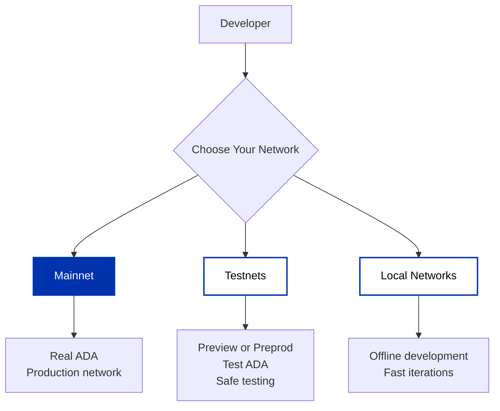

Cardano provides multiple networks for different stages of development and deployment. Choose the right network based on your current needs.

## Choosing a network

| Network | Purpose | Currency | Best For |
|---------|---------|----------|----------|
| **Mainnet** | Production blockchain | Real ADA | Live applications, production stake pools |
| **Testnets** | Safe testing environment | Test ADA (no value) | Integration testing, pre-production validation |
| **Local** | Local development | - | Fast iterations, offline development, CI/CD, custom scenarios |

### Mainnet

Mainnet is the production Cardano blockchain where real-value transactions occur. Use Mainnet to:

- Deploy production applications
- Operate stake pools with real ADA
- Execute real-value transactions

**Block Explorer**: [explorer.cardano.org](https://explorer.cardano.org)

:::important
Only deploy to mainnet after thorough testing on testnets. Transactions use real ADA and cannot be reversed.
:::

### Testnets

Testnets mirror mainnet functionality using test ADA (tAda) with no real-world value. Use testnets to:

- Test integrations safely before mainnet deployment
- Validate applications against upcoming protocol changes
- Experiment with features without financial risk

**Available testnets**:

- **Preview**: Test upcoming features 4+ weeks before mainnet
- **Preprod**: Pre-production validation mirroring mainnet closely
- **Guild**: Rapid testing with 1-hour epochs
- **SanchoNet**: Governance features testing ([sancho.network](https://sancho.network))

For detailed testnet information, wallet setup, and test ADA faucet access, see the [Testnets guide](/docs/get-started/networks/testnets).

### Local development networks

Local networks run on your machine for rapid development without internet connectivity or test ADA. Use local networks to:

- Iterate quickly without waiting for block confirmations
- Test offline without network dependencies
- Create custom scenarios and edge cases
- Automate testing in CI/CD pipelines

**Available tools**:

- **[Yaci DevKit](/docs/get-started/networks/development-networks/yaci-devkit)**: Quick setup with Provider API compatibility and Docker support
- **[cardano-testnet](/docs/get-started/networks/development-networks/cardano-testnet)**: Custom local clusters with configurable parameters

For detailed setup instructions and comparison, see the [Development Networks guide](/docs/get-started/networks/development-networks/overview).

## Next steps

- **Connect to a network**: [Choose your infrastructure](/docs/get-started/infrastructure/overview) - Compare API providers, cloud platforms, and running your own node
- **Start testing**: [Get started with testnets](/docs/get-started/networks/testnets) - Set up wallets and get test ADA
- **Develop locally**: [Set up local networks](/docs/get-started/networks/development-networks/overview) - Fast iteration without network dependency
