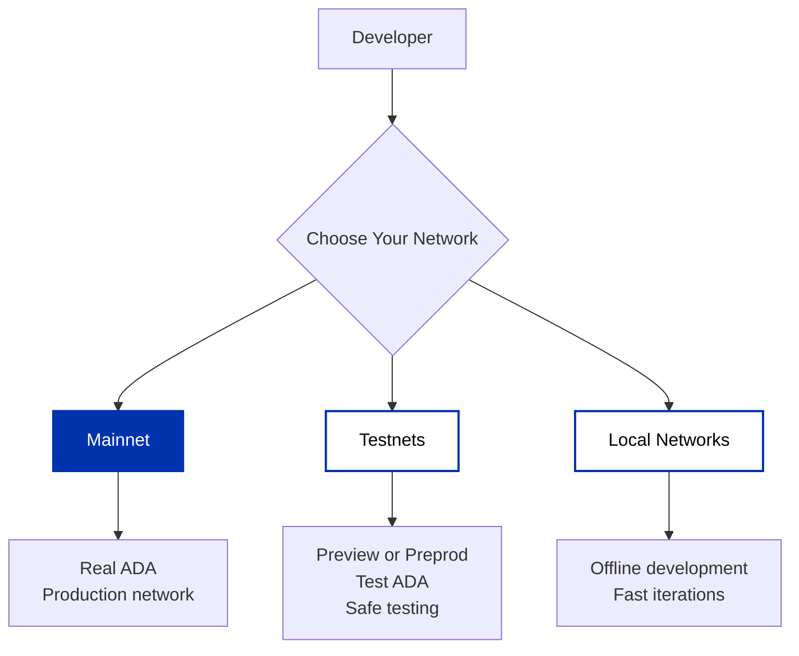

## Understanding Cardano Networks

Cardano has multiple networks designed for different purposes. This guide helps you choose the right network for your needs and provides quick reference information for each.

---

## Mainnet

**Mainnet** is the primary production blockchain where real-value transactions occur. This is the live Cardano network that launched in 2017 during the Byron era.

### When to use Mainnet

- Deploying production applications
- Making real ADA transactions
- Running a stake pool in production
- After thorough testing on testnets

### Key Details

- **Currency**: ADA (real value)
- **Status**: Production network
- **Block Explorer**: [explorer.cardano.org](https://explorer.cardano.org)

:::important
Only deploy to mainnet after thorough testing. Transactions on mainnet use real ADA and cannot be reversed.
:::

---

## Testnets

Testnets are separate networks that use test ADA (tAda) instead of real ADA. They're essential for testing and development without financial risk.

### Preview Testnet

The Preview Testnet is a testing environment used to showcase new features and functionality to the Cardano community before they are deployed on the Mainnet. It allows developers and users to test and provide feedback on new features and changes before they are released to the wider community.

- Leads Mainnet hard forks by at least 4 weeks
- **Block Explorer**: [explorer.cardano.org/preview](https://explorer.cardano.org/preview)
- **Configuration Files**: [The Cardano Operations Book > Preview Testnet](https://book.world.dev.cardano.org/environments.html#preview-testnet)

### Pre-Production Testnet

The Pre-Production Testnet is a testing environment used to validate major upgrades and releases before deployment to the Mainnet. It is a staging area where developers can simulate real-world scenarios and ensure that everything is working as expected before going live.

- Hard forks at approximately the same time as Mainnet (within an epoch of each other)
- **Block Explorer**: [explorer.cardano.org/preprod](https://explorer.cardano.org/preprod)
- **Configuration Files**: [The Cardano Operations Book > Pre-Production Testnet](https://book.world.dev.cardano.org/env-preprod.html)

### Other Networks

#### Guild Network

Guild Network is a community-maintained public testnet network that is primarily useful for quick testing for development/integrations, as it runs short 1-hour epochs. The primary use case for this network is often short-term scope-specific testing. The faucet distribution for this network is manual and available with members across timezones based on request in the [support channel](https://t.me/guild_operators_official).

- 1-hour epochs for rapid testing
- **Configuration Files**: [Download from Guild Operators](https://github.com/cardano-community/guild-operators/tree/alpha/files)

#### SanchoNet

Dedicated testnet for testing governance features (CIP-1694). Learn more at [sancho.network](https://sancho.network).

### Getting Test ADA

Test ADA (tAda) has no real value and is distributed for free. You can get test ADA for Preview or Preprod testnets via the [Cardano Testnet Faucet](/docs/get-started/networks/testnets/testnet-faucet).

### Detailed Testnet Information

For comprehensive testnet documentation including wallet setup, faucet access, and block explorers:

→ **[View detailed testnet guide](/docs/get-started/networks/testnets/overview)**

---

## Local Development Networks

Local networks run on your machine for rapid development and testing without requiring internet connectivity or testnet tAda.

### Available Tools

**[Yaci DevKit](/docs/get-started/networks/development-networks/yaci-devkit)**: A development kit for quickly setting up a local Cardano network with Provider API compatibility, Tx building SDKs integration and Docker support.

**[cardano-testnet](/docs/get-started/networks/development-networks/cardano-testnet)**: A tool for launching custom local Cardano clusters with configurable parameters like epochs, slots, and genesis configurations.

### When to Use Local Networks

- Fast iterations without waiting for block confirmations
- Offline development without internet required
- Testing specific edge cases with custom scenarios
- Automated testing in CI/CD pipelines

---

## Quick Reference

| Network | Purpose | Currency | Block Explorer |
|---------|---------|----------|----------------|
| **Mainnet** | Production | Real ADA | [explorer.cardano.org](https://explorer.cardano.org) |
| **Preview** | Feature testing | Test ADA | [explorer.cardano.org/preview](https://explorer.cardano.org/preview) |
| **Preprod** | Pre-production | Test ADA | [explorer.cardano.org/preprod](https://explorer.cardano.org/preprod) |
| **Local** | Development | Free | N/A (local only) |

---

## Next Steps

Now that you understand the available networks, choose how to connect to them:

→ **[Choose Your Infrastructure](/docs/get-started/infrastructure/overview)** - Compare API providers, cloud platforms, and running your own node

Or explore specific network options:

- **Start with testnets**: Learn about [Preview and Preprod testnets](/docs/get-started/networks/testnets/overview) and get [test ADA](/docs/get-started/networks/testnets/testnet-faucet)
- **Develop locally**: Set up [Yaci DevKit](/docs/get-started/networks/development-networks/yaci-devkit) or [cardano-testnet](/docs/get-started/networks/development-networks/cardano-testnet) for local testing
