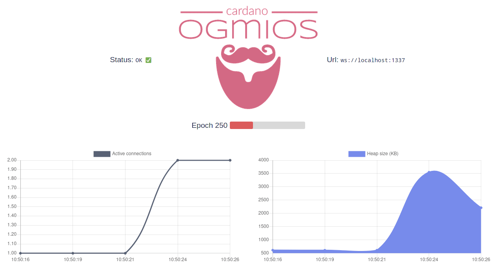

**Ogmios** is a lightweight bridge interface for [cardano-node](https://github.com/input-output-hk/cardano-node/). It offers a WebSockets API that enables local clients to speak [Ouroboros' mini-protocols](https://hydra.iohk.io/build/1070091/download/1/network.pdf#chapter.3) via JSON/RPC.

Ogmios doesn’t do much more than what the node itself does. It’s pretty much as low-level as things can get with the Cardano network. For many applications, this is too low in the abstraction layer and they would be better off using higher-level services like [cardano-graphql](https://github.com/input-output-hk/cardano-graphql), [Rosetta](https://www.rosetta-api.org), or [Blockfrost](https://blockfrost.io).

## Installation

The easiest way to get started with Ogmios is to use [docker](https://www.docker.com). Since Ogmios requires the presence of a Cardano node, it makes sense to use docker-compose to orchestrate both services. A compose file is available on the Ogmios repository, get it via:

```sh
git clone --depth 1 https://github.com/CardanoSolutions/ogmios.git
cd ogmios
```


Then, start the components stack using:
```sh
docker-compose up
```

If you prefer to build everything from source or without docker, please head to [the Ogmios website](https://ogmios.dev/getting-started).
 

## Dashboard

You should now be able to access the dashboard on [http://localhost:1337](http://localhost:1337) with a real-time visualization of some of the server runtime metrics. 



## Query metrics

The dashboard is powered by JSON responses served by [http://localhost:1337/health](http://localhost:1337/health).

import Tabs from '@theme/Tabs';
import TabItem from '@theme/TabItem';

<Tabs
defaultValue="curl"
values={[
{label: 'curl', value: 'curl'},
{label: 'wget', value: 'wget'},
]}>
<TabItem value="curl">

```sh
curl -H 'Accept: application/json' http://localhost:1337/health
```

  </TabItem>
  <TabItem value="wget">

```sh
wget --header='Accept: application/json' -qO- http://localhost:1337/health
```

  </TabItem>
</Tabs>

JSON response:

```json
{
    "metrics": {
        "totalUnrouted": 1,
        "totalMessages": 30029,
        "runtimeStats": {
            "gcCpuTime": 1233009354,
            "cpuTime": 81064672549,
            "maxHeapSize": 41630,
            "currentHeapSize": 1014
        },
        "totalConnections": 10,
        "sessionDurations": {
            "max": 57385,
            "mean": 7057,
            "min": 0
        },
        "activeConnections": 0
    },
    "startTime": "2021-03-15T16:16:41.470782977Z",
    "lastTipUpdate": "2021-03-15T16:28:36.853115034Z",
    "lastKnownTip": {
        "hash": "c29428f386c701c1d1ba1fd259d4be78921ee9ee6c174eac898245ceb55e8061",
        "blockNo": 5034297,
        "slot": 15520688
    },
    "networkSynchronization": 0.99,
    "currentEra": "Mary"
}
```

## Ogmios documentation

To dive further into Ogmios and how to interact with the Ouroboros mini-protocols, visit [ogmios.dev](https://ogmios.dev/mini-protocols).
