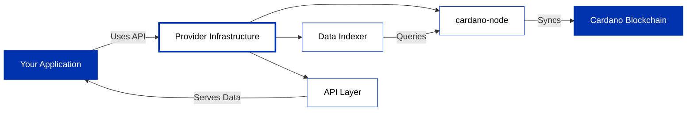

## Choose Your Provider

Providers give you API access to the Cardano blockchain without requiring you to run and maintain your own infrastructure. They handle node operations, data indexing, and provide developer-friendly APIs.

Providers run and maintain Cardano infrastructure so you don't have to. They operate cardano-node, index blockchain data into queryable databases, and expose developer-friendly APIs (REST, WebSocket, gRPC). This means you can query blocks, transactions, UTXOs, submit transactions, and access protocol parameters without managing servers, handling upgrades, or ensuring uptime.

---

## Available Providers

import DocCardList from '@theme/DocCardList';

<DocCardList />
