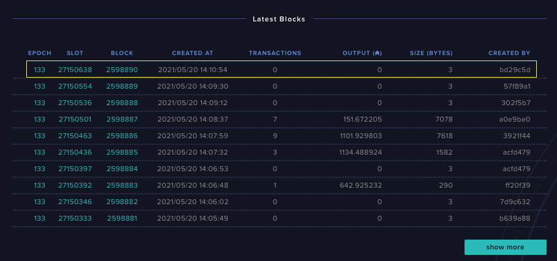

---
id: running-cardano
title: How to run cardano-node
sidebar_label: Running cardano-node
description: This guide will explain and show you how to run the cardano-node and components on your system.
image: ./img/og-developer-portal.png
--- 
### Overview 

This guide will show you how to run `cardano-node` and `cardano-cli` on your system and some simple examples of how you can interact with the **Cardano** blockchain.

:::note
This guide assumes you installed `cardano-node` and `cardano-cli` into your system. If not, you can refer to [Installing cardano-node](/docs/get-started/installing-cardano-node) guide for instructions on how to do that.
:::

:::important
This guide does not cover the topic of running a block-producing `cardano-node` or running a **Cardano Stake Pool**. For more information regarding that topic, please visit the [Stake Pool Operation](/docs/operate-a-stake-pool/) section.
:::

### Configuration Files

The `cardano-node` application requires at least four configuration files to run as of writing this article.

- **Main Config**: It contains general node settings such as **logging** and **versioning**. It also points to the **Byron Genesis** and the **Shelly Genesis** file.
- **Byron Genesis**: It contains the initial protocol parameters and instructs the `cardano-node` on how to bootstrap the **Byron Era** of the **Cardano** blockchain.
- **Shelly Genesis**: It contains the initial protocol parameters and instructs the `cardano-node` on how to bootstrap the **Shelly Era** of the **Cardano** blockchain.
- **Alonzo Genesis**: It contains the initial protocol parameters and instructs the `cardano-node` on how to bootstrap the **Alonzo Era** of the **Cardano** blockchain.
- **Topology**: It contains the list of network peers (**`IP Address` and `Port` of other nodes running the blockchain network**) that your node will connect to.

:::important
Currently, the `cardano-node` topology is manually set by the community of network operators in the **Cardano** blockchain. But an automated p2p (peer-to-peer) system is in the works. For more information visit, [Boosting network decentralization with P2P](https://iohk.io/en/blog/posts/2021/04/06/boosting-network-decentralization-with-p2p/).

For more information about **Cardano** blockchain eras and upgrades, please visit the [Cardano Roadmap](https://roadmap.cardano.org/en).
:::

You can download the current **Cardano** blockchain network configuration files here: 


#### Mainnet / Production

**NetworkMagic**: `764824073`

```
curl -O -J https://hydra.iohk.io/build/7370192/download/1/mainnet-config.json
curl -O -J https://hydra.iohk.io/build/7370192/download/1/mainnet-byron-genesis.json
curl -O -J https://hydra.iohk.io/build/7370192/download/1/mainnet-shelley-genesis.json
curl -O -J https://hydra.iohk.io/build/7370192/download/1/mainnet-alonzo-genesis.json
curl -O -J https://hydra.iohk.io/build/7370192/download/1/mainnet-topology.json
```

#### Testnet / Sandbox

**NetworkMagic**: `1097911063`

```
curl -O -J https://hydra.iohk.io/build/7654130/download/1/testnet-topology.json
curl -O -J https://hydra.iohk.io/build/7654130/download/1/testnet-shelley-genesis.json
curl -O -J https://hydra.iohk.io/build/7654130/download/1/testnet-config.json
curl -O -J https://hydra.iohk.io/build/7654130/download/1/testnet-byron-genesis.json
curl -O -J https://hydra.iohk.io/build/7654130/download/1/testnet-alonzo-genesis.json
```

:::note

Each network has a `config` file, `genesis` file(s), `topology` file, and unique identifier called the **Network Magic**.

This section will be updated when new **Cardano** networks come online with their respective configuration files and **Network Magic**.
:::

You might be asking what the difference is between `mainnet` and `testnet` and why there are two networks? To put it simply, **Cardano** is an open-source blockchain, and anyone is free to spin up a network based on **Cardano's** software components. The `mainnet` network was the first one established during the start of the **Byron** era in 2017.  And everyone participating in the network agreed that is where all the real value of **Cardano** lives.

 Testing the network's features and capabilities can be expensive and will consume real value. So [Input-Output Global](https://iohk.io) has spun up a sandbox or testnet version of the network. Instead of using real `ada` tokens for transactions, you use the `tAda` or **Test ADA**. Alternatively, you can spin up your own custom **Cardano** network, but that is outside the scope of this guide.

### Running the node

To run `cardano-node` you enter something like this into the terminal: 

```bash
 cardano-node run \
   --topology path/to/mainnet-topology.json \
   --database-path path/to/db \
   --socket-path path/to/db/node.socket \
   --host-addr x.x.x.x \
   --port 3001 \
   --config path/to/mainnet-config.json
```

To get the complete list of available options, use `cardano-node run --help`

```
Usage: cardano-node run [--topology FILEPATH] [--database-path FILEPATH] 
                        [--socket-path FILEPATH] 
                        [--byron-delegation-certificate FILEPATH] 
                        [--byron-signing-key FILEPATH] 
                        [--shelley-kes-key FILEPATH] 
                        [--shelley-vrf-key FILEPATH] 
                        [--shelley-operational-certificate FILEPATH] 
                        [--bulk-credentials-file FILEPATH] [--host-addr IPV4] 
                        [--host-ipv6-addr IPV6] [--port PORT] 
                        [--config NODE-CONFIGURATION] [--validate-db]
  Run the node.

Available options:
  --topology FILEPATH      The path to a file describing the topology.
  --database-path FILEPATH Directory where the state is stored.
  --socket-path FILEPATH   Path to a cardano-node socket
  --byron-delegation-certificate FILEPATH
                           Path to the delegation certificate.
  --byron-signing-key FILEPATH
                           Path to the Byron signing key.
  --shelley-kes-key FILEPATH
                           Path to the KES signing key.
  --shelley-vrf-key FILEPATH
                           Path to the VRF signing key.
  --shelley-operational-certificate FILEPATH
                           Path to the delegation certificate.
  --bulk-credentials-file FILEPATH
                           Path to the bulk pool credentials file.
  --host-addr IPV4         An optional ipv4 address
  --host-ipv6-addr IPV6    An optional ipv6 address
  --port PORT              The port number
  --config NODE-CONFIGURATION
                           Configuration file for the cardano-node
  --validate-db            Validate all on-disk database files
  --shutdown-ipc FD        Shut down the process when this inherited FD reaches
                           EOF
  --shutdown-on-slot-synced SLOT
                           Shut down the process after ChainDB is synced up to
                           the specified slot
  -h,--help                Show this help text
```
### cardano-node parameters

:::note
In this section, we will use the path `$HOME/cardano` to store all the `cardano-node` related files as an example, and please replace it with the directory you have chosen to store the files.
:::
We will focus on six key command-line parameters for running a node: 

**`--topology`**: This requires the path of the `topology.json` file that you have downloaded as instructed [above](/docs/get-started/running-cardano#configuration-files).

> For example, If you have downloaded the `topology.json` file to the path `$HOME/cardano/topology.json`, then the argument would be something like this:
```
--topology $HOME/cardano/topology.json
```

**`--database-path`**: This expects the path to a directory where we will store the actual blockchain data like **blocks**, **transactions**, **metadata**, and other data type that people stored in the **Cardano** blockchain. We explore how we can query those kinds of data in the cardano-db-sync section. ***@TODO: link to the cardano-db-sync section.***

> For example, if we decide that all files required by `cardano-node` will be in the path `$HOME/cardano/`. Then we could create a database directory like this, `mkdir -p $HOME/cardano/db`.
> The directory structure would then be something like this:
```
$HOME/cardano/
├── db
├── testnet-alonzo-genesis.json
├── testnet-byron-genesis.json
├── testnet-config.json
├── testnet-shelley-genesis.json
└── testnet-topology.json
1 directory, 4 files
```
> As you may have noticed, we are planning to run a `testnet` node in this example and have downloaded the configuration files into the `$HOME/cardano/` directory. We also see that we have created the `db` directory inside `$HOME/cardano/` successfully. The argument would look something like this: 
```
--database-path $HOME/cardano/db
```
> Please download and move the configuration files to your Cardano directory as shown above to continue following this guide.

**`--socket-path`**: This expects the path to the `unix socket` or `named pipe` path that the `cardano-node` will use for [IPC (Inter-Process-Communication)](https://en.wikipedia.org/wiki/Inter-process_communication).

> The `cardano-node` uses **IPC (Inter-Process-Communication)** for communicating with other **Cardano** components like `cardano-cli`, `cardano-wallet`, and `cardano-db-sync`. In **Linux** and **MacOS** it uses something called [unix sockets](https://en.wikipedia.org/wiki/Unix_domain_socket) and [Named Pipes](https://docs.microsoft.com/en-us/windows/win32/ipc/named-pipes) in **Windows**.
> 
> Here is an example `--socket-path` argument for **Linux**:
```
--socket-path $HOME/cardano/db/node.socket
```
> As you can see, the argument points to a file since **unix sockets** are represented as files (like everything else in **Linux**). In this case, we put the socket file in the `db` directory that we have just created before.
> 
> In **Windows**, the `--socket-path` argument would look something like this:
```
--socket-path "\\\\.\\pipe\\cardano-node-testnet"
```
> As you may notice, it's like a network `URI` or a network `Path` than a file. It is a crucial difference that you will have to be aware of depending on your operating system. You can replace the string `cardano-node-testnet` in the argument with whatever you like. This example path is used in the [Daedalus Testnet Wallet](https://daedaluswallet.io) for **Windows**.
>

**`--host-addr`**: This expects the `IP Address` of the machine that `cardano-node` will be running. Other nodes will use this address in their `topology.json` file to connect to your node if you are planning to run it as a `relay` node.
> Here is an example `--host-addr` argument:
```
--host-addr 192.168.0.1
```
> In this case, we expect nodes in your [LAN (Local Area Network)](https://en.wikipedia.org/wiki/Local_area_network) to connect via `192.168.0.1`, assuming that the `IP Address` of the machine `cardano-node` is running on; replace it with your real `IP Address`. If you don't expect or need external nodes to connect to your node, you can use the loopback address `127.0.0.1`. If you have multiple network interfaces and unsure what to use, you can simply use `0.0.0.0` to accept connections from any network interface.

**`--port`**: In conjunction with the `IP Address`, we will also set the `port` that your `cardano-node` will use for listening to any incoming connection.
> Here is an example `--port` argument:
```
--port 1337
```
> You can choose whatever `port` number you like, but it is recommended to use `port` numbers `1024` and above. See [Registered Port](https://www.sciencedirect.com/topics/computer-science/registered-port) for more information.

**`--config`**: This expects the path to the main configuration file that we have downloaded previously.
> Here is an example `--config` argument:
```
--config $HOME/cardano/testnet-config.json
```
> Please make sure that the `alonzo-genesis.json`, `byron-genesis.json` and `shelley-genesis.json` are in the same directory as the `config.json`.

Here is a realistic example for running `cardano-node`:

```bash
cardano-node run \
--config $HOME/cardano/testnet-config.json \
--database-path $HOME/cardano/db/ \
--socket-path $HOME/cardano/db/node.socket \
--host-addr 127.0.0.1 \
--port 1337 \
--topology $HOME/cardano/testnet-topology.json
```

If you have everything set correctly, you should see something like this:

```
Listening on http://127.0.0.1:12798
[cardano.node.networkMagic:Notice:5] [2021-05-20 12:17:10.02 UTC] NetworkMagic 1097911063
[cardano.node.basicInfo.protocol:Notice:5] [2021-05-20 12:17:10.02 UTC] Byron; Shelley
[cardano.node.basicInfo.version:Notice:5] [2021-05-20 12:17:10.02 UTC] 1.XX.X
[cardano.node.basicInfo.commit:Notice:5] [2021-05-20 12:17:10.02 UTC] 9a7331cce5e8bc0ea9c6bfa1c28773f4c5a7000f
[cardano.node.basicInfo.nodeStartTime:Notice:5] [2021-05-20 12:17:10.02 UTC] 2021-05-20 12:17:10.024924 UTC
[cardano.node.basicInfo.systemStartTime:Notice:5] [2021-05-20 12:17:10.02 UTC] 2019-07-24 20:20:16 UTC
[cardano.node.basicInfo.slotLengthByron:Notice:5] [2021-05-20 12:17:10.02 UTC] 20s
[cardano.node.basicInfo.epochLengthByron:Notice:5] [2021-05-20 12:17:10.02 UTC] 21600
[cardano.node.basicInfo.slotLengthShelley:Notice:5] [2021-05-20 12:17:10.02 UTC] 1s
[cardano.node.basicInfo.epochLengthShelley:Notice:5] [2021-05-20 12:17:10.02 UTC] 432000
[cardano.node.basicInfo.slotsPerKESPeriodShelley:Notice:5] [2021-05-20 12:17:10.02 UTC] 129600
[cardano.node.basicInfo.slotLengthAllegra:Notice:5] [2021-05-20 12:17:10.02 UTC] 1s
[cardano.node.basicInfo.epochLengthAllegra:Notice:5] [2021-05-20 12:17:10.02 UTC] 432000
[cardano.node.basicInfo.slotsPerKESPeriodAllegra:Notice:5] [2021-05-20 12:17:10.02 UTC] 129600
[cardano.node.basicInfo.slotLengthMary:Notice:5] [2021-05-20 12:17:10.02 UTC] 1s
[cardano.node.basicInfo.epochLengthMary:Notice:5] [2021-05-20 12:17:10.02 UTC] 432000
[cardano.node.basicInfo.slotsPerKESPeriodMary:Notice:5] [2021-05-20 12:17:10.02 UTC] 129600
[cardano.node.addresses:Notice:5] [2021-05-20 12:17:10.05 UTC] [SocketInfo 0.0.0.0:9999,SocketInfo [::]:9999]
[cardano.node.diffusion-mode:Notice:5] [2021-05-20 12:17:10.05 UTC] InitiatorAndResponderDiffusionMode
[cardano.node.dns-producers:Notice:5] [2021-05-20 12:17:10.05 UTC] [DnsSubscriptionTarget {dstDomain = "relays-new.cardano-testnet.iohkdev.io", dstPort = 3001, dstValency = 2}]
[cardano.node.ip-producers:Notice:5] [2021-05-20 12:17:10.05 UTC] IPSubscriptionTarget {ispIps = [], ispValency = 0}
[cardano.node.ChainDB:Info:5] [2021-05-20 12:17:10.06 UTC] Opened imm db with immutable tip at genesis (origin) and chunk 0
[cardano.node.ChainDB:Info:5] [2021-05-20 12:17:10.06 UTC] Opened vol db
[cardano.node.ChainDB:Info:5] [2021-05-20 12:17:10.06 UTC] Replaying ledger from genesis
[cardano.node.ChainDB:Info:5] [2021-05-20 12:17:10.07 UTC] Opened lgr db
[cardano.node.ChainDB:Info:5] [2021-05-20 12:17:10.07 UTC] Opened db with immutable tip at genesis (origin) and tip genesis (origin)
[cardano.node.ChainDB:Notice:33] [2021-05-20 12:17:10.08 UTC] Chain extended, new tip: 1e64e74bd7ac76d6806480a28017deb0aedd356fb61844ec95c429ae2f30c7c3 at slot 0
```

Syncing the blockchain from zero can take a while. Please be patient. If you want to stop syncing, you can do so by pressing `CTRL` + `C` while in the terminal. Rerunning the `cardano-node run` command with the correct parameters will resume syncing the blockchain.

### Querying the Cardano Blockchain

Now that we have `cardano-node` running and syncing, we can test it out by querying the blockchain tip data; which is the current point your local node is synced. To do this, we use the `cardano-cli` command-line application.

But before we can do that, `cardano-cli` and other **Cardano** software components need to know where the node socket file is located. We saved it to the path `$HOME/cardano/db/node.socket` in the previous example. The components read the shell environment variable `CARDANO_NODE_SOCKET_PATH` to find this.

So we will set that in `$HOME/.bashrc` or `$HOME/.zshrc`, depending on which shell application that you use. In Windows, you can follow this guide: [How to Set Environment Variable in Windows](https://phoenixnap.com/kb/windows-set-environment-variable).

Add this line to the bottom of your shell profile (**MacOS** and **Linux**):
```
export CARDANO_NODE_SOCKET_PATH="$HOME/cardano/db/node.socket"
```

Once saved, reload your shell/terminal for changes to take effect.

Finally, we can now test querying the blockchain tip of our `cardano-node`:

- First, run `cardano-node` in a separate terminal for it to start syncing (if not already).
- Open another terminal and run the following command `cardano-cli query tip --testnet-magic 1097911063`.
> You should see something like this:
> ```json
{
    "blockNo": 2598870,
    "headerHash": "e5be38153db4dc639134969e6449f37e105e0c5228f828f76a885968b4423aaf",
    "slotNo": 27149964
}

:::note
We include `--testnet-magic <NetworkMagic>` in the parameter for `cardano-cli query tip` because we are using a `testnet` node. If you intend to query `mainnet` instead, please use the `--mainnet` parameter  and make sure your node is connected to the `mainnet` network.
:::

What you see here is the local tip data of your node. This case, means that you are synced up to `blockNo: 2598870` and `slotNo: 27149964`.

To know whether you are fully synced or not, you can check the **Cardano Blockchain Explorer** of the relevant network:

#### Mainnet Explorer
[https://explorer.cardano.org](https://explorer.cardano.org)

#### Testnet Explorer
[https://explorer.cardano-testnet.iohkdev.io](https://explorer.cardano-testnet.iohkdev.io)

Scroll down to the **Latest Blocks** section, and you can find the latest network tip.



:::important
Before making any transactions, make sure you are fully synced to the blockchain network.
:::

Congratulations, you are now ready to explore the world of **Cardano**! 🎉🎉🎉
