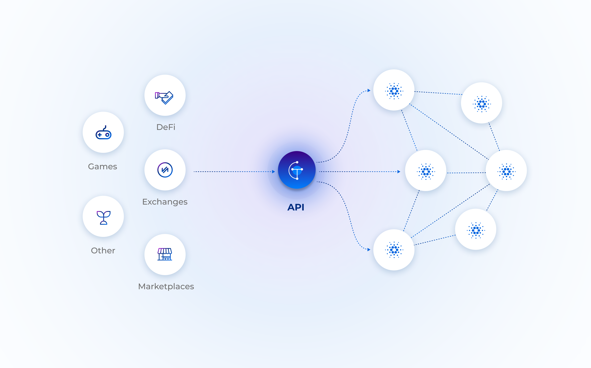
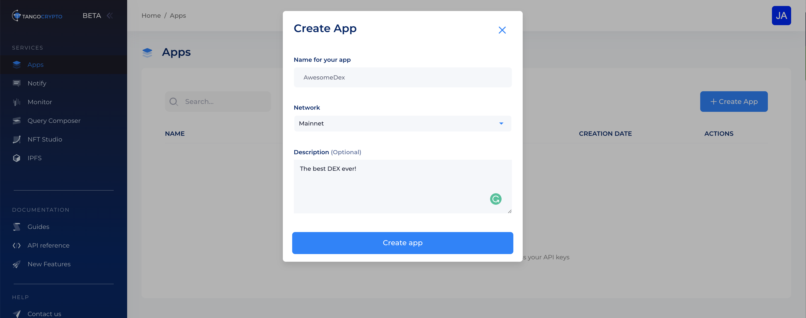
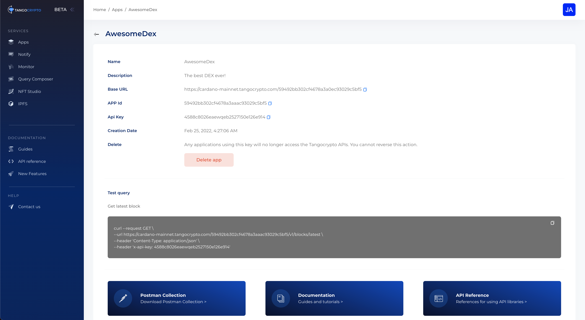
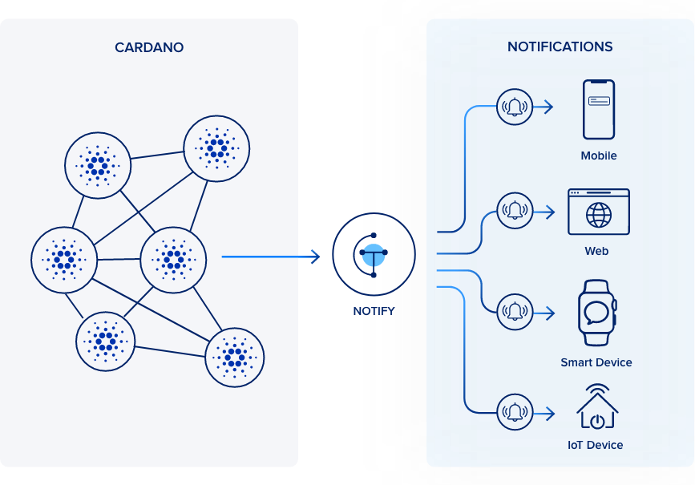
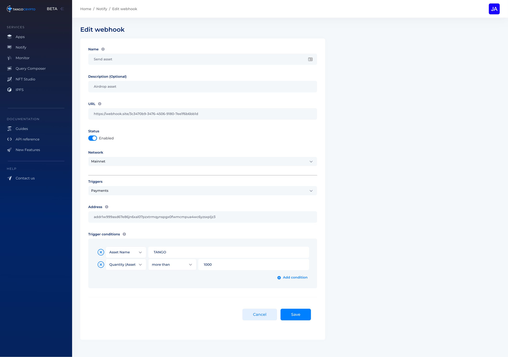

# What is Tangocrypto?

We provide a suite of high availability APIs and developer tools for fast and reliable access to the Cardano network that requires only 1 minute to integrate. As a developer starting on Cardano you will face the following problems:
- There's no way to access the information on a blockchain without using a node or an API provider.
- You will have to start creating the infrastructure instead of focusing on your products and business. 
- In-house infrastructure doesn’t scale automatically when user demand increases.
- There is a high learning curve, a broader error surface and increase in cost when building integrations with several API services from multiple providers.

We provide an unified platform where you'll be able to: 
- Ship products faster and validate business ideas.
- Use one platform to fetch, submit and listen on-chain information, mint tokens, store files and process payments.  
- Grow their user base by relying on an elastic infrastructure capable of handling spikes in consumption without downtime. 
- Reduce cost on engineering and infrastructure operations. 

Our solution provides the following components:
- REST API
- Notify (Webhooks)

💻 You can create a **free** account now at https://dashboard.tangocrypto.com/register and start coding your next product. 

## REST API
The HTTP REST API goal is to make development faster and easier. There is no need for syncing with the blockchain and maintaining complicated setups. No more complex and multiple requests to the blockchain from different entry points, the developers can get all the data they need for transactions, token information and debug, in fewer requests.



We provide the most accessible and reliable Cardano infrastructure, freeing companies and developers from the responsibility to maintain complex infrastructures and focus instead on building their business logic and provide value to their customers. 

- **Enterprise-grade infrastructure**: Harness the processing power of our globally distributed cloud-hosted node network. Our API alleviates the friction of maintaining your own compute and storage resources, lowering the barrier to entry for developers and enterprises.
- **Built for developers**: Easy to read documentation and resources to help developers get started quickly.
- **Gain app insights**: Our dashboard provides direct insights about API usage. Drill down into specific request methods and get response times, most used endpoints, usage by time of the day, IP address, countries and more. These insights are a great way to optimize applications based on user behaviour.
- **Standard Interface**: Supports Mainnet and Testnet via client-compatible REST API over HTTPS.
- **Always Online**: Running on the latest network upgrades with a minimum 99.9% uptime guarantee.

### Network and App ID

You can choose the mainnet or the testnet for your queries. The API requires a valid `app_id` to be included with your request traffic. This identifier should be appended to the request URL.

| Network          |   Endpoint      
| ---------------- | :-----------: 
| Cardano mainnet  | https://cardano-mainnet.tangocrypto.com/{app_id}/v1 
|Cardano testnet   |   https://cardano-testnet.tangocrypto.com/{app_id}/v1 


### API Key header
When you sign up on https://www.tangocrypto.com and create an App an `x-api-key` is created. You must include the HTTP header `x-api-key` in every request in order to authenticate the API calls.


:::tip FULL API REFERENCE

Check our API full reference documentation here https://www.tangocrypto.com/api-reference/

:::

### Steps to get started with Tangocrypto

#### 1. 🔑 Create an App

To use Tangocrypto's products, you need an API key to authenticate your requests.

You can create API keys from the dashboard, just click on +Create App, name it and hit create:




Once your app is created just copy you app-id and `x-api-key` and start making requests.



#### 2. 🏗️ SMake a Request and start building
With the app-id and the `x-api-key` you can make requests. For example, let's make a request to get the latest block number:

```shell
curl --location \
--request GET 'https://cardano-testnet.tangocrypto.com/<app-id>/v1/blocks/latest' \
--header 'x-api-key: <your-api-key>'
```

You should get something like this:
```json
{
    "id": "3064146",
    "hash": "f8eadfc91c3219b3d00d4a902174e0978e449f0e8a6f6b0584e06bbbedc0d050",
    "epoch_no": 158,
    "slot_no": 38197024,
    "epoch_slot_no": 310624,
    "block_no": 2940877,
    "previous_block": 2940876,
    "slot_leader": "pool1rcsezjrma577f06yp40lsz76uvwh7gne35afx3zrq2ktx50f8t8",
    "size": 365,
    "time": "2021-09-25T10:37:20.000Z",
    "tx_count": 1,
    "out_sum": 435928446,
    "fees": 171441,
    "op_cert": "333e175db9a2f89de5d9396c10b4dd136c3fffebd7f22d2eb0a3e8ef3884199c",
    "vrf_key": "vrf_vk1ltjt3ucuvah43gpeqpw4n6say9u6s0kju8c8q76xctmvgsqawgrq7kj48j",
    "confirmations": 1
}
```

#### API Pagination

Some API endpoints paginate their responses to make the result set easier to handle. For example, if you request a list of objects that are potentially too large to run efficiently, the endpoint returns the first batch of results along with a cursor to access the next set of results. 

The query results are divided into "pages" of 1 MB in size (or less) data. An application can process the first page of results, then the second page, etc. You include the cursor in subsequent requests to the endpoint as a URL query parameter of your request. 

To determine whether there are more results and to retrieve them one page at a time, applications should do the following:
1. Make a request with the desired `size` and check the result, if the cursor is not empty, construct a new request with the same parameters as the previous one. However, this time, take the cursor value from the last query and use it as the cursor parameter in the new request.
2. If the `cursor` is empty in the result it means there are no more items to be retrieved.

#### Example
Let's make the following query with size=50
```
https://cardano-mainnet.tangocrypto.com/<app-id>/v1/nft/collections?size=50
```

In the response, we see the cursor with a non-empty value (showing only one record for simplicity) 

```json
{
    "data": [
        {
            "id": "3d010a77c0e24489923c2a9eda731dde",
            "name": "THE Collection",
            "url": "https://www.thecollection.io",
            "description": "thecollection description",
            "payout_address": "addr_test1qp9mj7vnenx4v99hw7ztfq03n7dmmujpgtlyfjhhel9w67nk72usllcew208n60ym94xcptfrgytuy5apwp565x28jgsg0ztq3",
            "token_count": 5000,
            "token_for_sale_count": 1000,
            "token_sold_count": 2000,
            "revenue": 123456,
            "service_fee": 123456,
            "nft_fee": 123456,
            "tx_fee": 123456,
            "income": 123456,
            "total_fees": 123456,
            "policy": {
                "lock": true,
                "lock_time": "2027-01-24T04:18:59.758Z",
                "policy_id": "90570cb29887860e1cf1af88a106f421d6f22333514dd4ab16e8ff12",
                "script": {
                    "type": "all",
                    "scripts": [
                        {
                            "type": "sig",
                            "keyHash": "ac1746df0ba039de81274d472a477fced610f57cebc5c7841074f54c"
                        },
                        {
                            "type": "before",
                            "slot": 46854826
                        }
                    ]
                }
            },
            "metadata": {
                "label": "721",
                "asset_name": "<asset_name>",
                "name": "<name>",
                "image": "<image_link>",
                "media_type": "<mime_type>",
                "description": "<description>",
                "attributes": {
                    "face": "<face>",
                    "twitter": "https://twitter.com/thecollection_io",
                    "copyright": "Tent 2021",
                    "color": "<color>",
                    "artist": "LOLO",
                    "collection": "The Collection",
                    "body": "<body>",
                    "eyes": "<eyes>",
                    "accessory": "<accessory>"
                },
                "version": "1.0"
            },
            "created_at": "2021-11-30T21:04:09.897Z",
            "updated_at": "2021-11-30T21:04:09.897Z"
        }
    ],
    "cursor": "a97f98a8c533ee55fc2c6897c9b50506dc8d65b921092e469f62f9d0e2d0dc92902605dba96d30b2e027557d3d6ea8cb3c1597d93e36f9c70771f19485f176607d834f6bc4fd664e0f68d4c28eff52cc298dee1dc17975c043d05903c31dae41ff84c779f1f8d2bcc00447e25d066a4e"
}
```

To retrieve the next batch of items we use the same query but now inserting the obtained cursor from the previous step as a the query parameter:

```
https://cardano-mainnet.tangocrypto.com/<app-id>/v1/nft/collections?size=50&cursor=a97f98a8c533ee55fc2c6897c9b50506dc8d65b921092e469f62f9d0e2d0dc92902605dba96d30b2e027557d3d6ea8cb3c1597d93e36f9c70771f19485f176607d834f6bc4fd664e0f68d4c28eff52cc298dee1dc17975c043d05903c31dae41ff84c779f1f8d2bcc00447e25d066a4e
```

This process can be repeated until the cursor is empty because there are no more items to retrieve. 


## NOTIFY (WEBHOOKS)
With Notify you'll will be able to integrate production-ready notifications with our webhooks and SDKs integrations. Get access to all of the blockchain events your users might care about, like successful transactions, payments, minted blocks by a pool, new delegations and whatnot.



- **Payments and transactions**: Allows sending notifications to users to know when their deposits, purchases, in-game actions or other on-chain activity has officially occurred.
- **Address Activity Webhooks**: Let your users know when transaction activity occurs on their address. No more refreshing the page or having to use the dust to identify a payment.
- **Smart Retries**: Sometimes receiving endpoints fails or hangs more often than you think. That’s why we provide automatic retries to ensure deliverability.
- **Monitoring and debug**: We log every triggered webhook so you can monitor their deliverability to different endpoints, disable failing ones and notify your customers.
- **Development experience**: Offer your users a great developer experience, including the ability to test and inspect their webhooks.


### What are Webhooks?
A webhook (also called a web callback or HTTP push API) is a way for an app to provide other applications with real-time information. A webhook delivers data to other applications as it happens, meaning you get data immediately. Unlike typical APIs where you would need to poll for data very frequently in order to get it real-time. This makes webhooks much more efficient for both provider and consumer. Webhooks work by registering a URL to send notifications once certain events occur.

You can think that Webhooks are like a phone number that Tangocrypto calls to notify you of activity in Cardano. The activity could be a payment to an address or reaching a particular epoch. The webhook endpoint is the person answering that call who takes actions based upon the specific information it receives.

A webhook endpoint is just more code on your server, which could be written in Node.js, Go, Java, Ruby, or whatever. The webhook endpoint has an associated URL (e.g. https://myserver.com/callback). The Tangocrypto notifications are Event objects. This Event object contains all the relevant information about what just happened, including the type of event and the data associated with that event. The webhook endpoint uses the event details to take any required actions, such as indicating that an NFT should be sent to a wallet. 

:::note
Webhooks vs. WebSockets:
The difference between webhooks and WebSockets is that webhooks can only facilitate one-way communication between two services, while WebSockets can facilitate two-way communication between a user and a service, recognizing events and displaying them to the user as they occur.
:::

### Event standard structure

The Event structure always begins with the following parameters:
```json
{
    "id": "2921e3df-c671-4d20-b51b-d176d5c1e43g", //** Unique uuid per event .**
    "api_version": "1.0", //**Represents the current Tangocrypto API version, which is v1.**
    "webhook_id": "d012a60eccb54c2ba97484f98137be56", // identifies the webhook
    "idempotency_key": "3b3359d0ccdb1d3d3ca8dbaa79cb5395b33c5bc52d782f3ea22904abef45d1j4", //**Specifies a unique ID used by Tangocrypto to recognize consecutive requests with the same data so that not to perform the same operation twice.**
    "object": "event",
    "create_date": 1633954086377,
    "type": "payment", // event type
    ...
}
```
`id`
Unique identifier per Event. 

`api_version`
The event scheme you receive depends on the version of the Tangocrypto API. Currently, we use v1. When you set a subscription for an event while using v1 of the API, the callback will be returned according to v1 specifics.
Each time we update our API to the next version you will have to reset your Event subscriptions so that they correspond to the newest version currently in use. To do that you'll need to remove the event subscription and set it up again. Otherwise, the callback response will be received in the format of the older API version it was set up in.

`webhook_id`
The webhook_id indicates a reference to the webhook and It's is a unique code. Each time you set up an event subscription, the corresponding Event always has a parameter `webhook_id`.

`idempotency_key`
Idempotency represents a process in computing and REST that a server uses to recognise subsequent retries of the same request where the returned result always remains the same. It is a security mechanism for retrying requests without the risk of performing the same operation more than once.

Such risks usually can occur when an API call is for some reason disrupted during processing (e.g. network connection error) and a response is not returned. In such cases, the API call would be retried. By including an idempotency_id in the initial request there is a guarantee that the specific action won’t be done more than once.
The `idempotency_id` is generated only by Tangocrypto webhooks. It is added to the Event and is unique per triggered webhook. 

### Types of Webhooks
Tangocrypto offers 5 different types of webhooks:
- Payments
- Block
- Transaction
- Epoch
- Delegation

Callback requests sent from Tangocrypto are always POST and it contains a JSON payload;

### 1. Payment
The Payment Webhook allows you to track payments to an address. This provides your app with real-time state changes when an address sends or receives tokens. 

Payload example
```json
{
    "id": "3c23ff25-481c-4e3e-859b-f515135a49b0",
    "data": {
        "transaction": {
            "id": "3776000",
            "fee": "168317",
            "hash": "e29b4f5e2650560ac61dfa3ccf311e020782d8ccdf295dbbf1cfe2e65583d417",
            "size": 289,
            "block": {
                "id": "3372157",
                "fees": "2104143",
                "hash": "7fac4956202395c06028b442faba4f3fda68490e2eb7373bd9d0b7b212ff9e1f",
                "pool": {
                    "url": "https://my-ip.at/atada.testnet-metadata-2.json",
                    "hash": "b4fba3c5a430634f2e5e7007b33be02562efbcd036c0cf3dbb9d9dbdf418ef27",
                    "name": "ATADA TestnetPool Austria",
                    "ticker": "ATADA",
                    "pool_id": "pool18yslg3q320jex6gsmetukxvzm7a20qd90wsll9anlkrfua38flr",
                    "homepage": "https://stakepool.at",
                    "description": "Testnet-Environment Pool ..."
                },
                "size": 6561,
                "time": "Thu Feb 24 2022 12:52:38 GMT+0000 (Coordinated Universal Time)",
                "op_cert": "f9096c23c3a3d8afd8d05467fed2bc75405cdbc27ba2106b55a585e414d26573",
                "out_sum": "9793211682245",
                "slot_no": 51337942,
                "vrf_key": "vrf_vk1sleujze3zraykllkafvrxggcmpts3hp6zxrpazdkdzp9g07kkehsnmy8ka",
                "block_no": 3345852,
                "epoch_no": 189,
                "tx_count": "11",
                "next_block": null,
                "slot_leader": "pool18yslg3q320jex6gsmetukxvzm7a20qd90wsll9anlkrfua38flr",
                "confirmations": 1,
                "epoch_slot_no": 59542,
                "previous_block": 3345851
            },
            "deposit": "0",
            "out_sum": "948312856",
            "block_id": "3372157",
            "block_index": 2,
            "script_size": 0,
            "invalid_before": null,
            "valid_contract": true,
            "invalid_hereafter": "51359405"
        },
        "from": [{
            "address": "addr_test1qqvelqlqk94qm9syd40mpqkvdvk0z8ka8mt7e2sfcrq07rmazcna98r9s350vpnyghfsuqk2y29yq88tdcvwm8j0p5dqsg32es",
            "hash": "d6ef469d198fbf62a5b9860ba9295b9c9fddb80078e975ba032653f66b070b51",
            "index": 1,
            "value": "948481173",
            "smart_contract": false,
            "assets": []
        }],
        "to": [{
                "address": "addr_test1qz5xdujk7unjmyrvqazy7l4w9dzxxfgt48ppv9tsjwywrzckyjqzaxt9rkqxc62m7tcdfylykzzjktqzlwssxfl3mlyqafvh99",
                "hash": "e29b4f5e2650560ac61dfa3ccf311e020782d8ccdf295dbbf1cfe2e65583d417",
                "index": 0,
                "value": "2564320",
                "smart_contract": false,
                "assets": []
            },
            {
                "address": "addr_test1qqvelqlqk94qm9syd40mpqkvdvk0z8ka8mt7e2sfcrq07rmazcna98r9s350vpnyghfsuqk2y29yq88tdcvwm8j0p5dqsg32es",
                "hash": "e29b4f5e2650560ac61dfa3ccf311e020782d8ccdf295dbbf1cfe2e65583d417",
                "index": 1,
                "value": "945748536",
                "smart_contract": false,
                "assets": []
            }
        ]
    },
    "type": "payment",
    "object": "event",
    "webhook_id": "532ce2beb2aa42738e1cc9c5f708168c",
    "api_version": "1.0",
    "create_date": 1645707159923,
    "idempotency_key": "755a42b339274829aefd153285084132532ce2beb2aa42738e1cc9c5f708168c",
    "network": "testnet"
}

```

### 2. Block
This event is triggered every time a new block is created. 

Payload example 
```json
{
  "id": "7b7c0d8a-8885-46d6-8e05-0d0802d95473",
  "data": {
    "id": "6864165",
    "fees": "17182282",
    "hash": "641aa7bcd185e036d6a379d4908639d436a540158d1db6debd0e2c3b2fa7c8cd",
    "pool": {
      "url": "https://ccwallet.io/ccw.metadata.210713.json",
      "hash": "924ec324a9d2d172cd3fe44fbbb526e5c6bea677fb7276f07387c847dfe9026d",
      "name": "TITANstaking #2",
      "ticker": "TITAN",
      "pool_id": "pool19pyfv4xnln8x4l7auw0n0skk3hd97shun707hrw5d4s553ys74x",
      "homepage": "https://www.titanstaking.io",
      "description": "For a TITAN strong Cardano network. Based in Germany. 💪 Join us! Telegram: https://t.me/titanstakingio - Twitter: https://twitter.com/titanstaking"
    },
    "size": 58970,
    "time": "Fri Feb 04 2022 11:45:09 GMT+0000 (Coordinated Universal Time)",
    "op_cert": "400345da097b2eb0194b4a76f87b6853b07e8b96b5de30b671b0e83c54530cd3",
    "out_sum": "10738455237",
    "slot_no": 52408818,
    "vrf_key": "vrf_vk19kgvazgrvr9gstsk2qn0vz0hc9x8yn3lqdymzgztm92qk6r4q9asksen0h",
    "block_no": 6840368,
    "epoch_no": 318,
    "tx_count": "37",
    "next_block": null,
    "slot_leader": "pool19pyfv4xnln8x4l7auw0n0skk3hd97shun707hrw5d4s553ys74x",
    "confirmations": 1,
    "epoch_slot_no": 396018,
    "previous_block": 6840367
  },
  "type": "block",
  "object": "event",
  "webhook_id": "98c7051ff06b4651949466655ef974fe",
  "api_version": "1.0",
  "create_date": 1643975112334,
  "idempotency_key": "53a957187a4a4dd888b6839ea2d4452298c7051ff06b4651949466655ef974fe",
  "network": "mainnet"
}
```

### 3. Transaction
This event is triggered every time a new transaction is added to the blockchain. 
Payload example

```json
{
  "id": "123c4446-7a4f-4e8b-8baf-3c1437101859",
  "data": {
    "id": "3344667",
    "fee": "305781",
    "hash": "057585b42409a71c34d664e945acb92f30f09f966c5d18f098881c2dbf909d6f",
    "size": 2825,
    "block": {
      "id": "3275904",
      "fees": "1582516",
      "hash": "00fd351c00be3f1775361de12576d51ee582157e330d1ebe596498295a46d02e",
      "pool": {
        "url": null,
        "hash": null,
        "raw_id": "7679567d0559ed3df7cb54a848b9568b04d1976b9926d54ae9efdd3f",
        "pool_id": "pool1weu4vlg9t8knma7t2j5y3w2k3vzdr9mtnynd2jhfalwn76nwh48"
      },
      "size": 6980,
      "time": "Wed Jan 19 2022 23:11:35 GMT+0000 (Coordinated Universal Time)",
      "op_cert": "60ffa1e3c1ab6d03a5447d2f40ab023dbce45b13f0e372d63a964d31c7ee6079",
      "out_sum": "18474206426",
      "slot_no": 48264679,
      "vrf_key": "vrf_vk1mzhz5k03lahvx0gdlqtplkyasgzn8w2cpf8y8a8f76nzskptzzhqdqyyq3",
      "block_no": 3251329,
      "epoch_no": 182,
      "tx_count": "8",
      "next_block": null,
      "slot_leader": "pool1weu4vlg9t8knma7t2j5y3w2k3vzdr9mtnynd2jhfalwn76nwh48",
      "confirmations": 1,
      "epoch_slot_no": 10279,
      "previous_block": 3251328
    },
    "deposit": "0",
    "out_sum": "1591350310",
    "block_id": "3275904",
    "block_index": 1,
    "script_size": 2014,
    "invalid_before": "48264456",
    "valid_contract": true,
    "invalid_hereafter": "48278855"
  },
  "type": "transaction",
  "object": "event",
  "webhook_id": "5ef8985b5ee74b4388f324293df17173",
  "api_version": "1.0",
  "create_date": 1642633895460,
  "idempotency_key": "5wIH/+H/cOj3K+gv3zOek89bEbIXDgxz5ef8985b5ee74b4388f324293df17173"
}
```

### 4. Epoch
Get notified when an epoch starts.
Payload example
```json
{
    "no": 178,
    "start_time": "2022-01-04T20:20:24.000Z"
}
```

### 5. Delegation
This allows you to track delegations in the specified pool by its ticker or pool ID. 
Payload Example 
```json
{
  "id": "d0cf3218-761f-4ca1-900b-7750fb66fb59",
  "data": {
    "id": 97463,
    "pool": {
      "url": "https://apex.nextvm.net/test/testpoolMetadata.json",
      "hash": "f5ac677b58443ed2c9c9d53aa56652e71a132679e67ed9068f0227867172faf4",
      "name": "ApexTestPool",
      "raw_id": "5f5ed4eb2ba354ab2ad7c8859f3dacf93564637a105e80c8d8a7dc3c",
      "ticker": "APEXT",
      "pool_id": "pool1ta0df6et5d22k2khezze70dvly6kgcm6zp0gpjxc5lwrce0seyq",
      "homepage": "https://cardano-apexpool.github.io/test/",
      "description": "Apex Cardano Test Pool"
    },
    "tx_id": 3340342,
    "addr_id": 402710,
    "slot_no": 48240615,
    "redeemer_id": null,
    "pool_hash_id": 1030,
    "active_epoch_no": 183
  },
  "type": "delegation",
  "object": "event",
  "webhook_id": "7c827ccd2d524eb5aadf1e5a391077aa",
  "api_version": "1.0",
  "create_date": 1642609833343,
  "idempotency_key": "p90C0LTvk1XX1Ha8+JDPzzFfybhxJYYt7c827ccd2d524eb5aadf1e5a391077aa"
}
```

### Trigger Rules
 You can create rules or trigger conditions for every webhook. You can create rules through the Tangocrypto Dashboard or the API.  Every rule is composed of a `field`, a `value` and an `operator`. All the conditions have to be met for the webhook to be triggered. Rules are optional; depending on the number of rules and their parameters, the webhook will be triggered or not.

**Example**
Trigger the webhook when the address receives more than 5 RBERRY tokens:

```bash
curl --location --request POST 'https://cardano-testnet.tangocrypto.com/<app-id>/v1/webhooks' \
--header 'content-type: application/json' \
--header 'x-api-key: <x-api-key>' \
--data-raw '{
    "type": "payment",
    "name": "Payment webhook",
    "network": "testnet",
    "description": "Notify on payment with more than 5 RBERRY",
    "callback_url": "https://webhook.site/74e4201b-d651-4971-8b74-ebd6b10fd967",
    "address": "addr_test1qqqv50804vhe30n25awp6f8mhy9z3rrysva2mj4c9geaqyjr5gtdwq4yajng57kje93tt3fkc5k8cvvem7vl8yql2mcsxcstnx",
    "rules": [
        {
            "field": "asset_name",
            "operator": "=",
            "value": "RBERRY"
        },
        {
            "field": "quantity",
            "operator": ">",
            "value": "5"
        }
    ]
}'
```

Rules can be created also from the dashboard:



#### MORE INFO
https://docs.tangocrypto.com/notify/notify/using-webhooks

